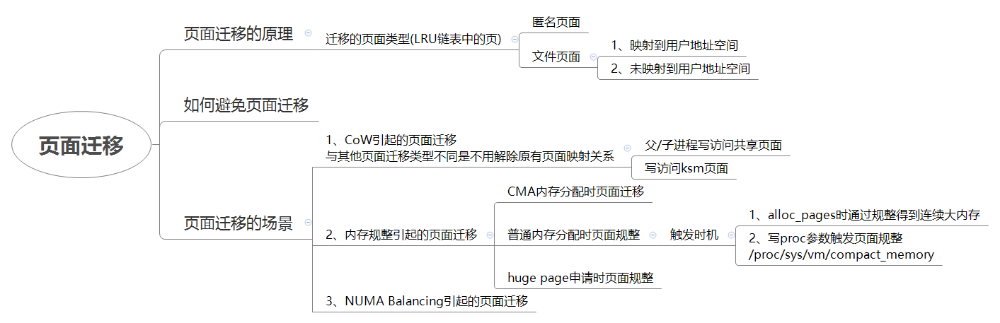

# 内存管理之页面迁移

页面迁移类型

```
/*
* MIGRATE_ASYNC means never block
* MIGRATE_SYNC_LIGHT in the current implementation means to allow blocking
*      on most operations but not ->writepage as the potential stall time
*      is too significant
* MIGRATE_SYNC will block when migrating pages
*/
enum migrate_mode {
        MIGRATE_ASYNC,  //不会阻塞
        MIGRATE_SYNC_LIGHT, // 可以阻塞，但是不能writepages阻塞太长时间。页面规整后台线程kcompactd使用该模式
        MIGRATE_SYNC, //同步阻塞迁移
};
```

页面迁移的理由

```
enum migrate_reason {
        MR_COMPACTION,      //页面规整，在compact_zone函数中设置
        MR_MEMORY_FAILURE,  //内存故障模块页面迁移
        MR_MEMORY_HOTPLUG,  //内存热插拔页面迁移
        MR_SYSCALL,             /* also applies to cpusets */ cpusets触发的页面迁移
        MR_MEMPOLICY_MBIND, //do_mbind函数中设置， sets the NUMA memory policy for a memory range
        MR_NUMA_MISPLACED,  //迁移到正确的numa node节点。handle_pte_fault-》migrate_misplaced_page
        MR_CMA,             //cma内存分配引起的页面迁移
        MR_TYPES
};
```

页面迁移代码结构

```
migrate_pages-------------------------------------页面迁移核心函数
    unmap_and_move
        get_new_page------------------------------分配新页面
        __unmap_and_move--------------------------迁移页面到新页面
            move_to_new_page
                page_mapping----------------------找到页面对应的地址空间
                migrate_page----------------------将旧页面的相关信息迁移到新页面
                    migrate_page_copy
                remove_migration_ptes-------------利用方向映射找到映射旧页面的每个PTE
                    remove_migration_pte----------处理其中一个虚拟地址
```



相关commit：

commit bda807d4445414e8e77da704f116bb0880fe0c76 mm: migrate: support non\-lru movable page migration
