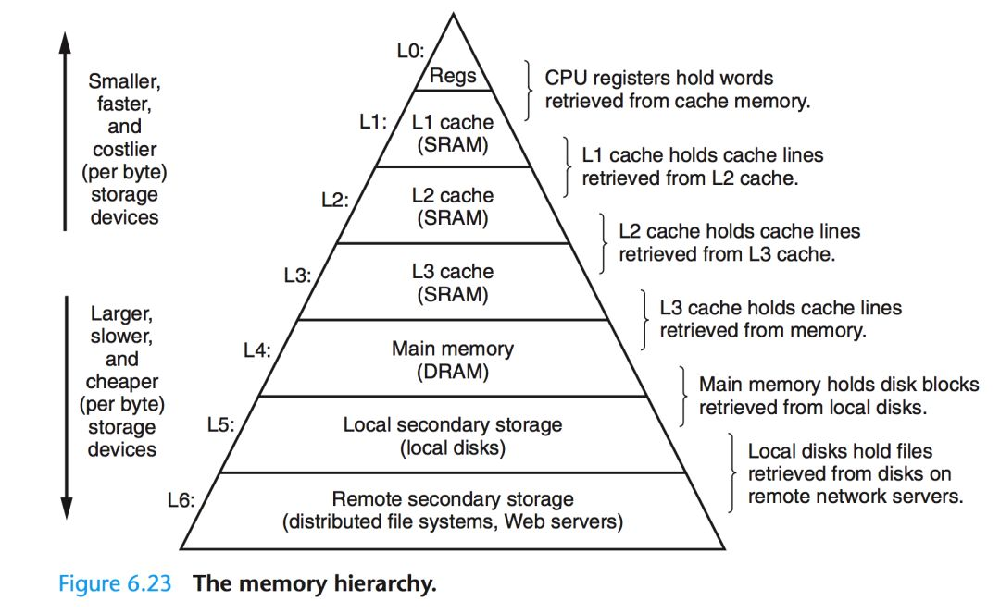
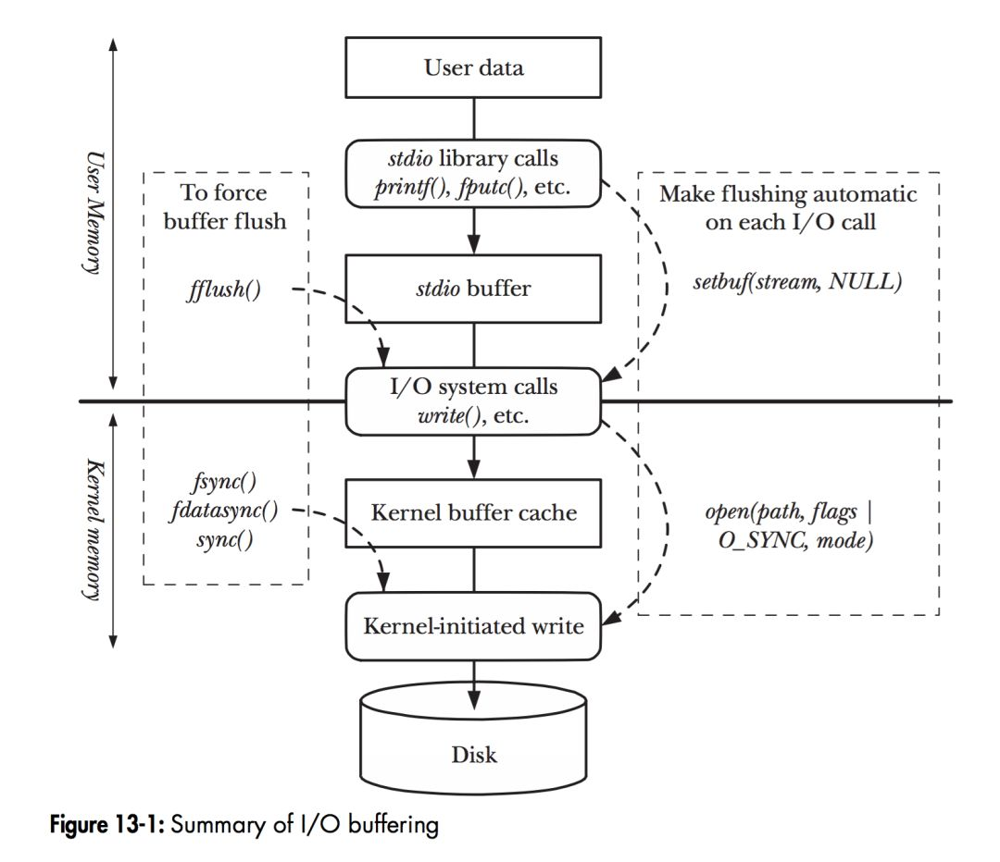
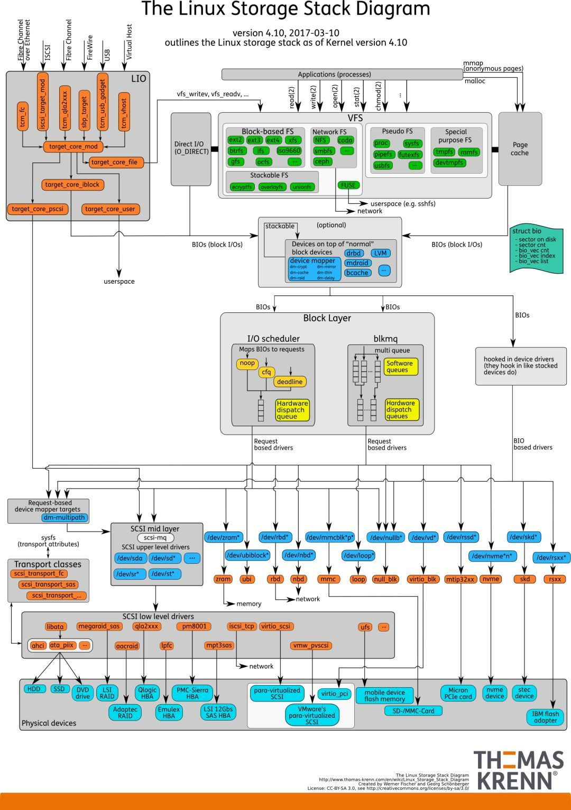
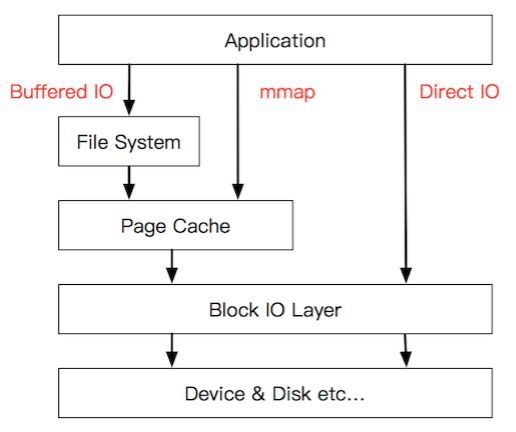

# 存储管理之整体框架

一、

**二、Linux存储框架**

**2.1 存储的金字塔结构**

受限于存储介质的存取速率和成本，现代计算机的存储结构呈现为金字塔型\[1\]。越往塔顶，存取效率越高、但成本也越高，所以容量也就越小。得益于程序访问的局部性原理\[2\]，这种节省成本的做法也能取得不俗的运行效率。从存储器的层次结构以及计算机对数据的处理方式来看，上层一般作为下层的Cache层来使用（广义上的Cache）。比如寄存器缓存CPU Cache的数据，CPU Cache L1~L3层视具体实现彼此缓存或直接缓存内存的数据，而内存往往缓存来自本地磁盘的数据。

**2.2 无处不在的缓存**

多层次的缓存结构则意味着内核需要能提供用户控制缓存的方法。

**2.3 详细的存储栈**

**2.4 简略的存储栈**

参考资料：

1、[https://cloud.tencent.com/developer/article/1518008](https://cloud.tencent.com/developer/article/1518008)

2、[https://cloud.tencent.com/developer/article/1517855](https://cloud.tencent.com/developer/article/1517855)

3、[https://cloud.tencent.com/developer/article/1517886](https://cloud.tencent.com/developer/article/1517886)
