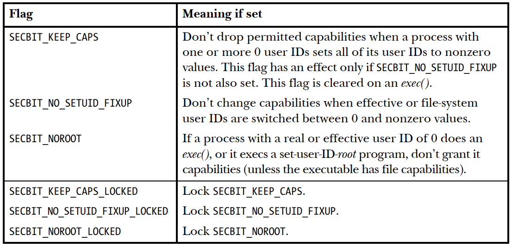

# 安全管理之securebits机制

**一、背景**

root用户由于其特殊性，在当前内核中，相对于普通用户针对root用户的几个特殊处理：

1、如果一个进程存在uid/euid/suid中有0，并通过系统调用将全部id变成非0，则会清除其permitted & effective capability。（实现降权）

2、如果一个进程的euid/fsuid从0变成非0，其effective capabilities会被清除。（具体机制可以看后面内核代码实现）（实现降权）

3、如果一个进程的euid为0或者可执行文件具备set\-user\-id\-root，那么其 inheritable & permitted capability需要被设置为全1。以此实现提权。

在一个具备完整 capability\-based的系统环境中，理论上当然是不需要为root用户做这些特殊处理。但是以前老的程序都是通过set\-user\-id\-root机制来提权，而没有使用file capabilities机制，因此为了兼容以前老的程序而不得不对root进行特殊处理。从2.6.26内核开始，如果使能了file capabilities功能，内核提供了securebits机制，用于控制以上3中对root用户的特殊处理开关。



内核中每个cred中都包含有一个securebits用于保存以上6个bit位，通常同一进程中的线程复用cred，因此基本相当于每个进程拥有一个独立的securebit状态。

```
struct cred { 
        kuid_t          uid;            /* real UID of the task */
        kgid_t          gid;            /* real GID of the task */
        kuid_t          suid;           /* saved UID of the task */
        kgid_t          sgid;           /* saved GID of the task */
        kuid_t          euid;           /* effective UID of the task */
        kgid_t          egid;           /* effective GID of the task */
        kuid_t          fsuid;          /* UID for VFS ops */
        kgid_t          fsgid;          /* GID for VFS ops */
        unsigned        securebits;     /* SUID-less security management */
        kernel_cap_t    cap_inheritable; /* caps our children can inherit */
        kernel_cap_t    cap_permitted;  /* caps we're permitted */
        kernel_cap_t    cap_effective;  /* caps we can actually use */
        kernel_cap_t    cap_bset;       /* capability bounding set */
        kernel_cap_t    cap_ambient;    /* Ambient capability set */
};

#define SECURE_NOROOT                   0
#define SECURE_NOROOT_LOCKED            1  /* make bit-0 immutable */
#define SECURE_NO_SETUID_FIXUP          2
#define SECURE_NO_SETUID_FIXUP_LOCKED   3  /* make bit-2 immutable */
#define SECURE_KEEP_CAPS                4
#define SECURE_KEEP_CAPS_LOCKED         5  /* make bit-4 immutable */
```

内核中内建有判断这些bit位状态宏，详情可以看include/uapi/linux/securebits.h文件。如：

```
#define issecure_mask(X)        (1 << (X))
#define SECBIT_NOROOT           (issecure_mask(SECURE_NOROOT))
#define SECBIT_NOROOT_LOCKED    (issecure_mask(SECURE_NOROOT_LOCKED))
```

**二、功能分析**

**2.1、为何需要****SECBIT\_NOROOT**

如果在不设置SECBIT\_NOROOT的状态下，已经drop掉部分权限的root用户，还能通过执行set\-user\-id\-root的可执行文件达到提权的目的，这样就不能达到对root用户的权限限制，如容器技术可以通过设置SECBIT\_NOROOT位来限制容器中root权限进程提权（容器好像是通过drop bonding\_set来限制root以这种方式提权？？？）。

如果进程拥有 CAP\_SETPCAP权限，其可以通过prctl\(\)系统调用，将进程改为完全的capability\-based机制，该设置状态还能传递给子基础。如果这么设置了，那么进程就只能通过file capabilities.机制来实现提权，而原有的set\-uesr\-id\-root机制就无法在capability层面进行提权。

```
if (prctl(PR_SET_SECUREBITS，SECBIT_NO_SETUID_FIXUP | SECBIT_NO_SETUID_FIXUP_LOCKED | SECBIT_NOROOT | SECBIT_NOROOT_LOCKED) == -1)
    errExit("prctl");
```

**2.2、为何需要PR\_SET\_KEEPCAPS**

如果在不设置 PR\_SET\_KEEPCAPS和SECURE\_NOROOT的状态下，一个拥有set\-user\-ID\-root的可执行文件运行后，该进程可以将一部分不需要的权限drop掉来降权，但是实际上这个drop并不起作用，该进程依然可以通过执行一个set\-user\-ID\-root的文件来达到提权，最根本的办法还是将id改为非0的方式降权，但是这种方式又会使得进程完全清除掉 permitted and effective，这又与起初的目标不一致。因此通过设置PR\_SET\_KEEPCAPS状态位，达到将id从0改为非0降权的作用。

**三、代码分析**

**3.1 SECURE\_NOROOT 代码功能实现**

函数cap\_bprm\_set\_creds\(\)是进程执行exec\(\)运行可执行文件时，设置cred中capability的函数，在执行issecure\(SECURE\_NOROOT\)判断之前，get\_file\_caps已经根据进程的capability和可执行文件的capability计算过进程新的cred\-\>cap\_permitted。

如果当前进程的SECURE\_NOROOT状态位未设置，则以前者get\_file\_caps计算出的cred\-\>cap\_permitted为准，起到如果一个执行exec\(\)的进程的uid/euid为0或者执行了set\-user\-id\(文件属于root\)的可执行文件，exec\(\)后权限P'\(permitted\)计算为：

```
P'(permitted) = (P(inheritable) & F(inheritable)) | (F(permitted) & cap_bset)
```

如果当前进程的SECURE\_NOROOT被用户态通过prctrl\(\)设置了，或者从父进程继承了。那么exec\(\)后进程权限P'\(permitted\)计算如下。由于cap\_bset是一个边界集，通常情况下未经过设置的普通进程的cap\_bset也是满的，这样就能实现一个普通进程通过执行set\-user\-id\-root的可执行文件在capability提权为满，而如果设置了该状态位后，就算euid变成root，但是其capability还是受限的。

```
P'(permitted) = P(inheritable) | P(cap_bset)
```

具体实现代码如下：

```
int cap_bprm_set_creds(struct linux_binprm *bprm)
{
        ...
        effective = false;
        ret = get_file_caps(bprm, &effective, &has_cap);
        ...
        if (!issecure(SECURE_NOROOT)) {
                /*
                 * If the legacy file capability is set, then don't set privs
                 * for a setuid root binary run by a non-root user.  Do set it
                 * for a root user just to cause least surprise to an admin.
                 */
                if (has_cap && !uid_eq(new->uid, root_uid) && uid_eq(new->euid, root_uid)) {
                        warn_setuid_and_fcaps_mixed(bprm->filename);
                        goto skip;
                }
                /*
                 * To support inheritance of root-permissions and suid-root
                 * executables under compatibility mode, we override the
                 * capability sets for the file.
                 *
                 * If only the real uid is 0, we do not set the effective bit.
                 */
                //此时new->euid已经根据set-user-id转算过，如果此时uid/euid变成root则进行如下提权
                if (uid_eq(new->euid, root_uid) || uid_eq(new->uid, root_uid)) {
                        /* pP' = (cap_bset & ~0) | (pI & ~0) */
                        new->cap_permitted = cap_combine(old->cap_bset,
                                                         old->cap_inheritable);
                }
                if (uid_eq(new->euid, root_uid))
                        effective = true;
        }
        ...
}
```

**3.2 SECURE\_KEEP\_CAPS 代码功能实现**

当进程系统调用setuid/setreuid/setresuid/setfsuid修改其id时，内核会在cap\_emulate\_setxuid\(\)函数中检查，如果SECURE\_KEEP\_CAPS位未设置进程原先的uid/euid/suid中有任意一个id为0变成全部不为0，则会将进程cred\-\>cap\_permitted/cred\-\>cap\_effective清空。如果设置了该位，就能使得进程由root变成非root时还能保留root拥有的部分capability。

函数调用路径：setuid/setreuid/setresuid/setfsuid\-\>security\_task\_fix\_setuid\(\)\-\>cap\_task\_fix\_setuid\(\)\-\>cap\_task\_fix\_setuid

```
int cap_task_fix_setuid(struct cred *new, const struct cred *old, int flags)
{
        switch (flags) {
        case LSM_SETID_RE:
        case LSM_SETID_ID:
        case LSM_SETID_RES:
                /* juggle the capabilities to follow [RES]UID changes unless
                 * otherwise suppressed */
                if (!issecure(SECURE_NO_SETUID_FIXUP)) //如果SECURE_NO_SETUID_FIXUP设置了SECURE_KEEP_CAPS位是不起作用的
                        cap_emulate_setxuid(new, old);
                break;
        ...
        return 0;
}

static inline void cap_emulate_setxuid(struct cred *new, const struct cred *old)
{
        kuid_t root_uid = make_kuid(old->user_ns, 0);
        
        if ((uid_eq(old->uid, root_uid) ||
             uid_eq(old->euid, root_uid) ||
             uid_eq(old->suid, root_uid)) &&
            (!uid_eq(new->uid, root_uid) &&
             !uid_eq(new->euid, root_uid) &&
             !uid_eq(new->suid, root_uid))) {
                if (!issecure(SECURE_KEEP_CAPS)) {
                        cap_clear(new->cap_permitted);
                        cap_clear(new->cap_effective);
                }

                /*
                 * Pre-ambient programs expect setresuid to nonroot followed
                 * by exec to drop capabilities.  We should make sure that
                 * this remains the case.
                 */
                cap_clear(new->cap_ambient);
        }
        if (uid_eq(old->euid, root_uid) && !uid_eq(new->euid, root_uid))
                cap_clear(new->cap_effective);
        if (!uid_eq(old->euid, root_uid) && uid_eq(new->euid, root_uid))
                new->cap_effective = new->cap_permitted;
}
```

**3.3 SECURE\_NO\_SETUID\_FIXUP代码功能实现**

如果SECURE\_NO\_SETUID\_FIXUP位未设置，则当fsuid发生变化时，不去改变进程的cap\_effective权限。已知fsuid变化的场景有setuid/setreuid/setresuid/setfsuid/faccessat系统调用。如果设置了该位，当fsuid变化时，则不去修改进程的cap\_effective。

```
int cap_task_fix_setuid(struct cred *new, const struct cred *old, int flags)
{
        switch (flags) {
        case LSM_SETID_FS: //fsuid发生变化，变化发生在调用当前函数外面
                /* juggle the capabilties to follow FSUID changes, unless
                 * otherwise suppressed
                 *
                 * FIXME - is fsuser used for all CAP_FS_MASK capabilities?
                 *          if not, we might be a bit too harsh here.
                 */
                if (!issecure(SECURE_NO_SETUID_FIXUP)) {
                        kuid_t root_uid = make_kuid(old->user_ns, 0);
                        if (uid_eq(old->fsuid, root_uid) && !uid_eq(new->fsuid, root_uid))
                                new->cap_effective =
                                        cap_drop_fs_set(new->cap_effective);

                        if (!uid_eq(old->fsuid, root_uid) && uid_eq(new->fsuid, root_uid))
                                new->cap_effective =
                                        cap_raise_fs_set(new->cap_effective,
                                                         new->cap_permitted);
                }
                break;

        default:
                return -EINVAL;
        }

        return 0;
}

SYSCALL_DEFINE3(faccessat, int, dfd, const char __user *, filename, int, mode)
{
        ...
        override_cred = prepare_creds();
        if (!override_cred)
                return -ENOMEM;

        override_cred->fsuid = override_cred->uid;  //fsuid发生变化
        override_cred->fsgid = override_cred->gid;

        if (!issecure(SECURE_NO_SETUID_FIXUP)) {
                /* Clear the capabilities if we switch to a non-root user */
                kuid_t root_uid = make_kuid(override_cred->user_ns, 0);
                if (!uid_eq(override_cred->uid, root_uid))
                        cap_clear(override_cred->cap_effective);
                else
                        override_cred->cap_effective =
                                override_cred->cap_permitted;
        }
        ...
}
```

**四、securebits的设置与继承**

**4.1 securebits的设置**

进程的securebits可以通过prctl系统调用修改获取，修改时遵循：

\[1\] no changing of bits that are locked 如果相应的bit位被锁住，则不能修改此位

\[2\] no unlocking of locks 如果locked设置了，则不能再去修改为unlock，lock是一次性的

\[3\] no setting of unsupported bits 不能设置不支持的剩余bit位

\[4\] doing anything requires privilege \(go read about the "sendmail capabilities bug"\) 设置进程作为cred主体在其user ns中具备CAP\_SETPCAP权限才能修改

```
int cap_task_prctl(int option, unsigned long arg2, unsigned long arg3,
                   unsigned long arg4, unsigned long arg5)
{
        /*
         * The next four prctl's remain to assist with transitioning a
         * system from legacy UID=0 based privilege (when filesystem
         * capabilities are not in use) to a system using filesystem
         * capabilities only - as the POSIX.1e draft intended.
         *
         * Note:
         *
         *  PR_SET_SECUREBITS =
         *      issecure_mask(SECURE_KEEP_CAPS_LOCKED)
         *    | issecure_mask(SECURE_NOROOT)
         *    | issecure_mask(SECURE_NOROOT_LOCKED)
         *    | issecure_mask(SECURE_NO_SETUID_FIXUP)
         *    | issecure_mask(SECURE_NO_SETUID_FIXUP_LOCKED)
         *
         * will ensure that the current process and all of its
         * children will be locked into a pure
         * capability-based-privilege environment.
         */
        case PR_SET_SECUREBITS:
                if ((((old->securebits & SECURE_ALL_LOCKS) >> 1)
                     & (old->securebits ^ arg2))                        /*[1]*/
                    || ((old->securebits & SECURE_ALL_LOCKS & ~arg2))   /*[2]*/
                    || (arg2 & ~(SECURE_ALL_LOCKS | SECURE_ALL_BITS))   /*[3]*/
                    || (cap_capable(current_cred(),
                                    current_cred()->user_ns, CAP_SETPCAP,
                                    SECURITY_CAP_AUDIT) != 0)           /*[4]*/
                        /*
                         * [1] no changing of bits that are locked
                         * [2] no unlocking of locks
                         * [3] no setting of unsupported bits
                         * [4] doing anything requires privilege (go read about
                         *     the "sendmail capabilities bug")
                         */
                    )
                        /* cannot change a locked bit */
                        return -EPERM;

                new = prepare_creds();
                if (!new)
                        return -ENOMEM;
                new->securebits = arg2;
                return commit_creds(new);

        case PR_GET_SECUREBITS:
                return old->securebits;

        case PR_GET_KEEPCAPS:
                return !!issecure(SECURE_KEEP_CAPS);

        case PR_SET_KEEPCAPS:
                if (arg2 > 1) /* Note, we rely on arg2 being unsigned here */
                        return -EINVAL;
                if (issecure(SECURE_KEEP_CAPS_LOCKED))
                        return -EPERM;

                new = prepare_creds();
                if (!new)
                        return -ENOMEM;
                if (arg2)
                        new->securebits |= issecure_mask(SECURE_KEEP_CAPS);
                else
                        new->securebits &= ~issecure_mask(SECURE_KEEP_CAPS);
                return commit_creds(new);
}
```

**4.2 securebits的继承**

**4.2.1 保留父user ns时fork子进程**

当新的进程fork创建时，通常情况下内核中cred\-\>securebits没有专门去修改，因此新进程的创建securebits不会发生变化而是会得到继承。

4.2.2 创建新user ns时fork子进程

在这种情况下，内核会调用set\_cred\_user\_ns将securebits设置成默认值。

```
static void set_cred_user_ns(struct cred *cred, struct user_namespace *user_ns)
{
        /* Start with the same capabilities as init but useless for doing
         * anything as the capabilities are bound to the new user namespace.
         */
        cred->securebits = SECUREBITS_DEFAULT;
        cred->cap_inheritable = CAP_EMPTY_SET;
        cred->cap_permitted = CAP_FULL_SET;
        cred->cap_effective = CAP_FULL_SET;
        cred->cap_ambient = CAP_EMPTY_SET;
        cred->cap_bset = CAP_FULL_SET;

        /* tgcred will be cleared in our caller bc CLONE_THREAD won't be set */
        cred->user_ns = user_ns;
}

#define SECUREBITS_DEFAULT 0x00000000
```

**4.2.3 进程exec执行可执行文件**

当进程exec\(\)执行可执行文件时，在权限计算函数cap\_bprm\_set\_creds\(\)中会去清除SECURE\_KEEP\_CAPS位。

```
int cap_bprm_set_creds(struct linux_binprm *bprm)
{
        ...
    new->securebits &= ~issecure_mask(SECURE_KEEP_CAPS); 
        ...
}
```

**五、参考资料**

1、《The Linux Programming Interface》—— 39.8 Creating Capabilities\-Only Environments
