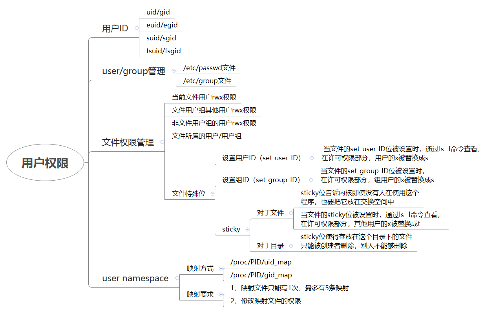
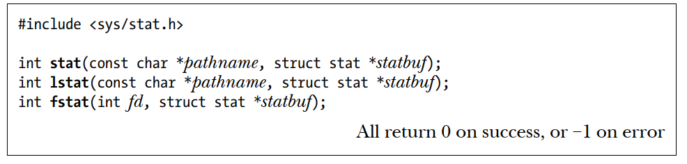
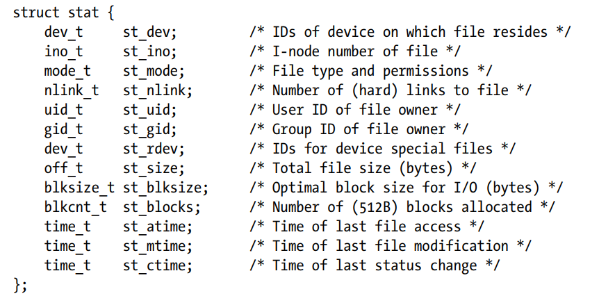

# 安全管理之用户及权限

****

**一、UID/GID管理**

\(1\)、介绍

        当linux系统中的一个进程运行起来的时候，总是要访问系统的资源，访问文件或者向其他的进程发送信号。系统是否允许其进行这些操作？系统是根据什么来判断该进程的权限？这些问题是和进程信任状（process credentials）相关。

process credentials包括一系列的ID，如下：

1、real user ID 和 real group ID

2、effective user ID 和 effective group ID

3、saved set\-user\-ID 和 saved set\-group\-ID

4、file\-system user ID 和 file\-system group ID

5、supplementary group IDs

\(2\)、什么是real user ID 和 real group ID

        real user ID 和 real group ID标识了该进程属于哪一个用户（哪一个组）。用户登陆后，其对应的shell进程的real user ID 和 real group ID会被设定为登录用户。这是login进程调用setuid函数设定的。在fork进程的时候，子进程的credentials是继承自其父进程。

\(3\)、什么是effective user ID 和 effective group ID

       真正去检查一个进程是否有权限进行某些动作（例如访问IPC对象、通过系统调用请求内核服务等）的是effective user ID 和 effective group ID。一般而言，effective user ID（effective group ID）是和real user ID（real group ID）一样的，但是如果可执行文件设定了Set\-User\-ID（Set\-Group\-ID），那么在进程创建的时候，其effective user ID 和 effective group ID则分别等于该可执行文件的user ID。

\(4\)、什么是saved set\-user\-ID 和 saved set\-group\-ID

        这里的suid（sgid）表示了saved set\-user\-ID（saved set\-group\-ID），为何要save effective ID？其实这是和一个准则相关的：一个进程应该以尽可能小的权限运行。当不需要euid/egid权限运行的时候，可以将euid/egid保存到suid/sgid，然后将euid/egid设置成uid/gid，以较小的权限运行。

**二、用户/组映射**

1、/etc/passwd文件记录用户及其相关信息

其每一行构成如下：

```
用户名:口令:用户标识号:组标识号:注释性描述:主目录:登录Shell
```

现在许多Linux 系统（如SVR4）都使用了shadow技术，把真正的加密后的用户口令字存放到/etc/shadow文件中，而在/etc/passwd文件的口令字段中只存放一个特殊的字符，例如“x”或者“\*”。

2、/etc/group文件记录用户组信息

每个用户都属于某个用户组；一个组中可以有多个用户，一个用户也可以属于不同的组。

当一个用户同时是多个组中的成员时，在/etc/passwd文件中记录的是用户所属的主组，也就是登录时所属的默认组，而其他组称为附加组

```
组名:口令:组标识号:组内用户列表
```

- "组名"是用户组的名称，由字母或数字构成。与/etc/passwd中的登录名一样，组名不应重复。
- "口令"字段存放的是用户组加密后的口令字。一般Linux 系统的用户组都没有口令，即这个字段一般为空，或者是\*。
- "组标识号"与用户标识号类似，也是一个整数，被系统内部用来标识组。
- "组内用户列表"是属于这个组的所有用户的列表/b\]，不同用户之间用逗号\(,\)分隔。这个用户组可能是用户的主组，也可能是附加组

3、 /etc/shadow文件记录着由pwconv命令根据/etc/passwd中的数据加密后的数据

它的文件格式与/etc/passwd类似，由若干个字段组成，字段之间用":"隔开。这些字段是：

```
登录名:加密口令:最后一次修改时间:最小时间间隔:最大时间间隔:警告时间:不活动时间:失效时间:标志
```

三、文件权限管理

1、获取文件的状态属性，函数调用无权限要求，接口和数据结构：





2、 stata\-\>st\_mode\[bit0\-bit11\] 定义了文件权限

stata\-\>st\_mode\[bit9\-bit11\] =》 the set\-user\-ID, set\-group\-ID, and sticky bits

stata\-\>st\_mode\[bit6\-bit8\] =》Owner \(also known as user\): The permissions granted to the owner of the file.

stata\-\>st\_mode\[bit3\-bit5\] =》 Group: The permissions granted to users who are members of the file’s group.

stata\-\>st\_mode\[bit0\-bit2\] =》 Other: The permissions granted to everyone else.

sticky bit: 仅限于对目录有效，该bit位用于受限的删除操作；当bit位设置时，对于非root的删除进程，如果要删除/重命名/unlink目录下的文件，需要对目录具备写权限，并且是被删除文件或目录的owner。

the set\-user\-ID, set\-group\-ID：A set\-user\-ID program allows a process to gain privileges it would not normally have,by setting the process’s effective user ID to the same value as the user ID \(owner\) ofthe executable file. A set\-group\-ID program performs the analogous task for the process’s effective group ID.

四、user namespace

用户创建一个先的user namespace时，nobody，UID和GID都为65534，65534对应的用户名和组名分别是nobody、nogroup。

详细看[https://lwn.net/Articles/532593/](https://lwn.net/Articles/532593/)

参考资料：

[https://www.wowotech.net/process\_management/19.html](https://www.wowotech.net/process_management/19.html)

[https://lwn.net/Articles/532593/](https://lwn.net/Articles/532593/)
