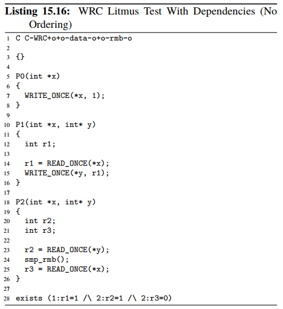
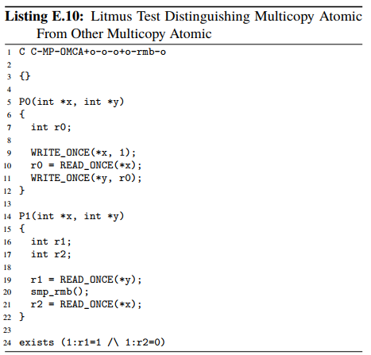
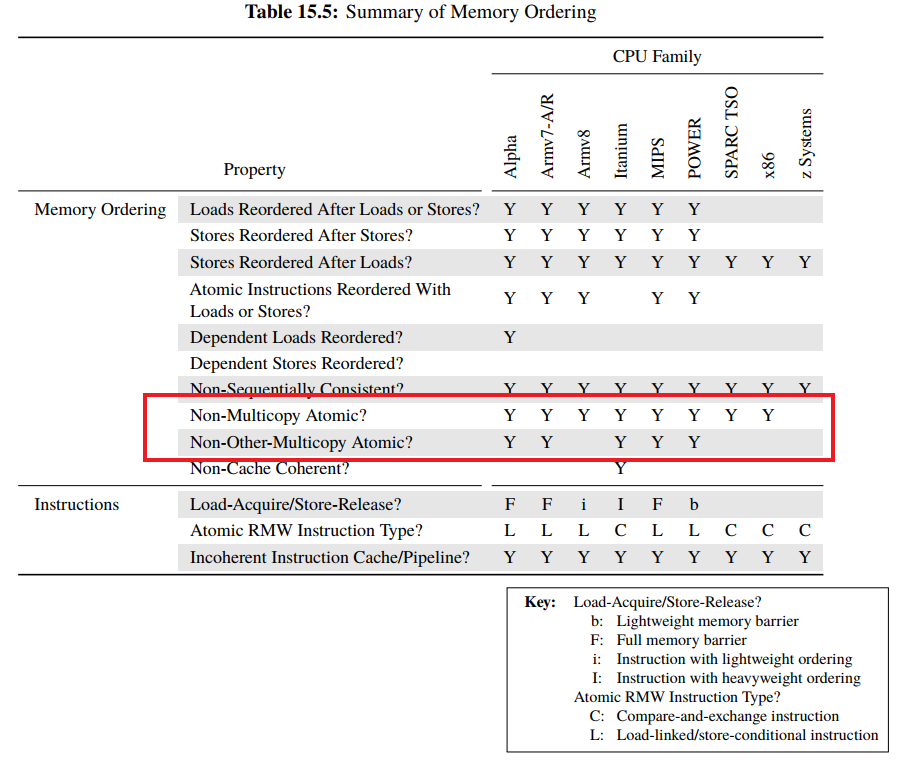

# 并发同步之Multic/Signle-Copy Atomic

**一、为什么要理解Multic/Signle\-Copy Atomic**

**1.1 Multice\-Copy Atomic的影响**

 支持（full）Multice\-Copy Atomic的系统，同一地址的数据在不同CPU核上的可见时间点相同，因此可以避免由于变量到达不同核（在不同核的可见顺序）而产生的意料之外的乱序问题，反之在non\-Multice\-Copy Atomic的系统中使用内存屏障来保证顺序。

如下，non\-Multice\-Copy Atomic的系统中存在x到达P1比到达P2早，因此28行的结果可能触发：



**1.2 Signle\-Copy Atomic的影响**

暂时没找到应用及问题场景

**二、什么是Multic/Signle\-Copy Atomic**

**2.1 Signle\-Copy Atomic**

```
A read or write operation is single-copy atomic only if it meets the following conditions:
1. For a single-copy atomic store, if the store overlaps another single-copy atomic store, then all of the writes from one of the stores are inserted into the Coherence order of each overlapping byte before any of the writes of the other store are inserted into the Coherence orders of the overlapping bytes.
2. If a single-copy atomic load overlaps a single-copy atomic store and for any of the overlapping bytes the load returns the data written by the write inserted into the Coherence order of that byte by the single-copy atomic store then the load must return data from a point in the Coherence order no earlier than the writes inserted into the Coherence order by the single-copy atomic store of all of the overlapping bytes.
```

Single\-Copy Atomicity描述的是单核或者单线程的memory访问的粒度（Graduality），也就是读memory或者写memory一次完成的粒度。

（1）对overlap的解释。基本上一个指令overlap另外一个指令其实就是说这两条指令被同时执行的意思。而“overlapping byte”则指内存操作有重叠的部分。例如加载0x000地址的4\-Byte到寄存器和加载0x02地址2\-Byte有2个字节的重叠。

（2）“all of the writes from one of the stores ”这里all of the writes是指本次store操作中所涉及的每一个bit，这些bits是一个不可分隔的整体，插入到Coherence order操作序列中。理解了上面的几个英文单词之后，我们来看看整段的英文表述。整段表述分成两个部分，第一部分描述store overlap store，第二部分描述的是load overlap store。对于store overlap store而言，每一个store操作的bits都是不可分割的整体，而这个store连同其操作的所有bits做为一个原子的、不可被打断的操作，插入到Coherence order操作序列中。当然，插入时机也很重要，不能随便插入，不能在其他store中的中间过程中插入。如果操作的bits有交叠，例如有8个bit在A B两个store操作中都有涉及，那么这8个比特要么是A store的结果，要么是B store的结果，不能是一个综合A B store操作的结果。

理解了store overlap store之后，load overlap store就很容易了。它主要是从其他观察者的角度看：如果load和store操作的memory区域有交叠，那么那些交叠区域的返回值（对load操作而言）要么是全部bit被store写入，要么没有任何写入，不会是一个中间结果。

**2.2 Multic\-Copy Atomic**

```
In a multiprocessing system, writes to a memory location are multi-copy atomic if the following conditions are both true:
1、All writes to the same location are serialized, meaning they are observed in the same order by all observers, although some observers might not observe all of the writes.
2、A read of a location does not return the value of a write until all observers observe that write.
```

多核系统下的解释为：

（1）系统中对同一个地址的memory的store操作是串行化的，也就是说，对于所有的observer而言，它们观察到的写入操作顺序就是相同的一个序列。这个串行化要求比较狠，高于coherent的要求，也就是说，如果系统中的write操作不是coherent的，那么也就是不是Multi\-copy atomicity的。

（2）对一个地址进行的load操作会被block，直到该地址的值对所有的observer都是可见的。

显然，根据定义，Multi\-copy atomicity要求比较严格，对cpu performance伤害很大。

**2.3 Othrer\-MutilCopy Atomic**

```
Unlike multicopy-atomic platforms, within other-multicopy-atomic platforms, the CPU doing the store is permitted to observe its store
early, which allows its later loads to obtain the newly stored value directly from the store buffer, which improves performance.
```

other\-multicopy\-atomic的不同点在于，进行store操作的CPU可以比其他CPU和先从sore buffer观察到其自身写入的值；而在\(full\) multicopy\-atomic平台内，进行store操作的CPU再去load同一值时，会被阻塞直到改地址的值对所有的observers都是可见。用实际的案例来说明如下，只有other\-multicopy\-atomic平台下存在以下可能：



**三、总结**

**3.1 不同平台支持multicopy\-atomic的情况**



**四、参考资料**

1、[http://www.wowotech.net/?post=295](http://www.wowotech.net/?post=295)

2、[https://zhuanlan.zhihu.com/p/463611508](https://zhuanlan.zhihu.com/p/463611508)

3、[https://zhuanlan.zhihu.com/p/463722119](https://zhuanlan.zhihu.com/p/463722119)

4、perfbook2 15.2.7 Mutilcopy\-Atomicity节
