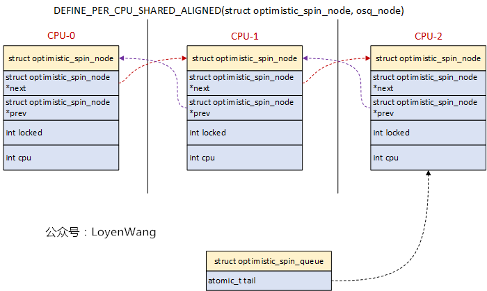
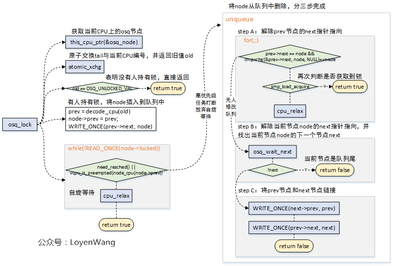
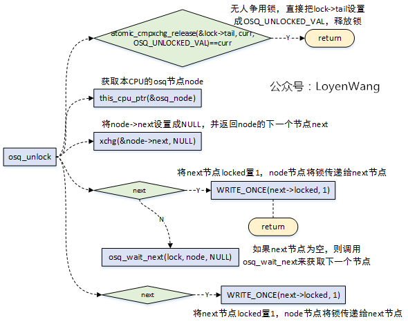
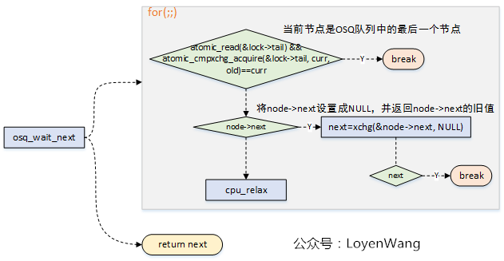
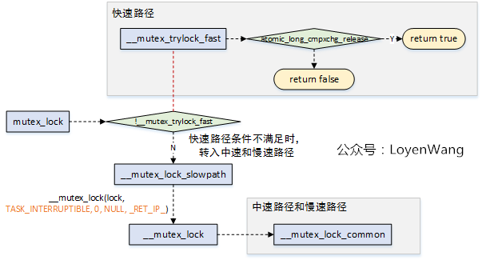
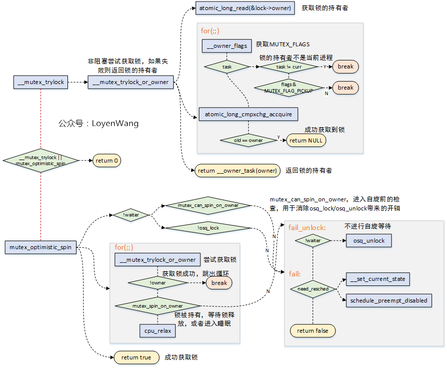
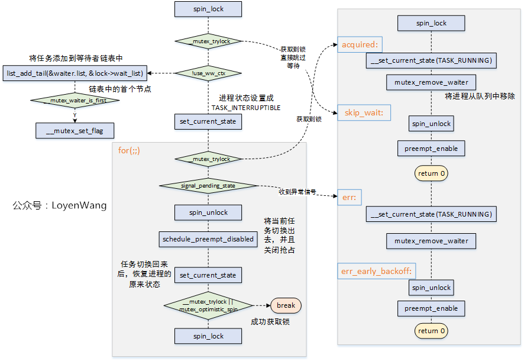
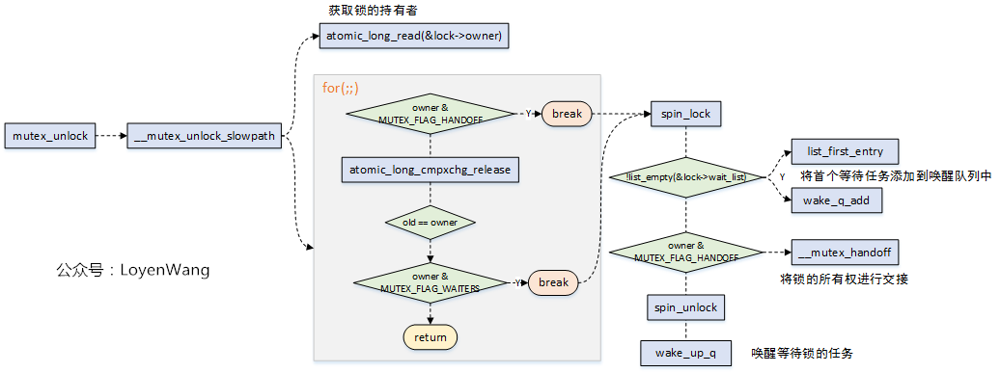

# 并发同步之Mutex

# **1. 概述**

- Mutex
- 互斥锁是一种休眠锁，锁争用时可能存在进程的睡眠与唤醒，context的切换带来的代价较高，适用于加锁时间较长的场景；
- 互斥锁每次只允许一个进程进入临界区，有点类似于二值信号量；
- 互斥锁在锁争用时，在锁被持有时，选择自旋等待，而不立即进行休眠，可以极大的提高性能，这种机制（
- 互斥锁的缺点是互斥锁对象的结构较大，会占用更多的CPU缓存和内存空间；
- 与信号量相比，互斥锁的性能与扩展性都更好，因此，在内核中总是会优先考虑互斥锁；
- 互斥锁按为了提高性能，提供了三条路径处理：快速路径，中速路径，慢速路径；

备注：

（1）一个占有互斥锁的进程极大的可能会在很短的时间内释放掉它，所以不同于 semaphore的实现，mutex在第一次没获得锁的情形下，在内核选项CONFIG\_MUTEX\_SPIN\_ON\_OWNER支持的情况下，如果发现拥有该锁的进程正在别的处理器上运行且锁上没有其他等待者\(也即只有当前进程在 等待该锁\)，那么当前进程试图自旋，这样有极大的概率是可以免去两次进程切换的开销，而重新获得之前竞争但未能成功的互斥锁 ，以获得性能优化。理论上，为了获得锁而进行的spin，其时间长短不应该超过两次进程切换的时间开销，否则此处优化将没有意义，该自旋处理及判断在mutex\_optimistic\_spin函数中实现。Mutex自旋优化的引入，会引起cache\-line bouncing，进而引入optimistic spinning机制来做进一步的性能优化。

（2）自旋锁Cache问题需要考虑，锁争用会导致大量的Cache颠簸，如果多个CPU之间重复获取自旋锁，则会有多个其他CPU不断查询其值，锁所在Cache line状态为Shared而不是Exclusive，对该Cache line的数据进行修改将其他CPU导致Cache未命中，如果锁不是独占一个Cache line还会影响同一Cache line中的其他数据，因此锁争用会大大降低系统性能。锁释放时修改值，导致其他获取锁的cpu 锁所在cache line无效，消耗性能。（个人理解：如果此时有多个cpu在等待该锁，那么会导致瞬间的总线访问争用，增加真正应该获取到锁的CPU主存访问耗时，进而导致性能消耗）

# **2. optimistic spinning（**** 支持选项****CONFIG\_MUTEX\_SPIN\_ON\_OWNER时****） �**�

## **2.1 MCS锁**

- 上文中提到过
- MCS锁机制
- **MCS锁机制**
- **MCS锁机制**
- osq\(optimistci spinning queue\)

## **2.2 osq流程分析**

optimistic spinning，乐观自旋，到底有多乐观呢？当发现锁被持有时，optimistic spinning相信持有者很快就能把锁释放，因此它选择自旋等待，而不是睡眠等待，这样也就能减少进程切换带来的开销了。

看一下数据结构吧：

osq\_lock如下：

- osq加锁有几种情况：
    1. 无人持有锁，那是最理想的状态，直接返回；
    2. 有人持有锁，将当前的Node加入到OSQ队列中，在没有高优先级任务抢占时，自旋等待前驱节点释放锁；
    3. 自旋等待过程中，如果遇到高优先级任务抢占，那么需要做的事情就是将之前加入到OSQ队列中的当前节点，从OSQ队列中移除，移除的过程又分为三个步骤，分别是处理prev前驱节点的next指针指向、当前节点Node的next指针指向、以及将prev节点与next后继节点连接；
- 加锁过程中使用了原子操作，来确保正确性；

osq\_unlock如下：

- 解锁时也分为几种情况：
    1. 无人争用该锁，那直接可以释放锁；
    2. 获取当前节点指向的下一个节点，如果下一个节点不为NULL，则将下一个节点解锁；
    3. 当前节点的下一个节点为NULL，则调用
- 从解锁的情况可以看出，这个过程相当于锁的传递，从上一个节点传递给下一个节点；

在加锁和解锁的过程中，由于可能存在操作来更改osq队列，因此都调用了osq\_wait\_next来获取下一个确定的节点：

# **3. mutex**

## **3.1 数据结构**

终于来到了主题了，先看一下数据结构：

struct mutex { atomic\_long\_t owner; //原子计数，用于指向锁持有者的task struct结构 spinlock\_t wait\_lock; //自旋锁，用于wait\_list链表的保护操作\#ifdef CONFIG\_MUTEX\_SPIN\_ON\_OWNER struct optimistic\_spin\_queue osq; /\* Spinner MCS lock \*/ //osq锁\#endif struct list\_head wait\_list; //链表，用于管理所有在该互斥锁上睡眠的进程\#ifdef CONFIG\_DEBUG\_MUTEXES void \*magic;\#endif\#ifdef CONFIG\_DEBUG\_LOCK\_ALLOC struct lockdep\_map dep\_map;\#endif};

在使用mutex时，有以下几点需要注意的：

- 一次只能有一个进程能持有互斥锁；
- 只有锁的持有者能进行解锁操作；
- 禁止多次解锁操作；
- 禁止递归加锁操作；
- mutex结构只能通过API进行初始化；
- mutex结构禁止通过
- 已经被持有的mutex锁禁止被再次初始化；
- mutex不允许在硬件或软件上下文（

## **3.2 加锁流程分析**

从mutex\_lock加锁来看一下大概的流程：

- mutex\_lock

### **3.2.1 fast\-path**

- 快速路径是在
- lock\-\>owner

### **3.2.2 mid\-path**

- 中速路径和慢速路径的处理都是在
- \_\_mutex\_lock\_common

中速路径的核心代码如下：

- 当发现mutex锁的持有者正在运行（另一个CPU）时，可以不进行睡眠调度，而可以选择自选等待，当锁持有者正在运行时，它很有可能很快会释放锁，这个就是乐观自旋的原因；
- 自旋等待的条件是持有锁者正在临界区运行，自旋等待才有价值；
- \_\_mutex\_trylock\_or\_owner
    1. MUTEX\_FLAG\_WAITERS
    2. MUTEX\_FLAG\_HANDOFF
    3. MUTEX\_FLAG\_PICKUP
- mutex\_optimistic\_spin
    1. mutex\_can\_spin\_on\_owner
    2. osq\_lock
    3. for\(;;\)
    4. mutex\_spin\_on\_owner

### **3.2.3 slow\-path**

慢速路径的主要代码流程如下：

- 从

## **3.3 释放锁流程分析**

****

- 释放锁的流程相对来说比较简单，也分为快速路径与慢速路径，快速路径只有在调试的时候打开；
- 慢速路径释放锁，针对三种不同的
