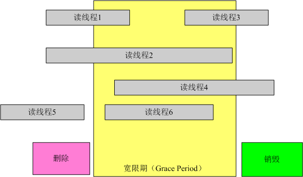
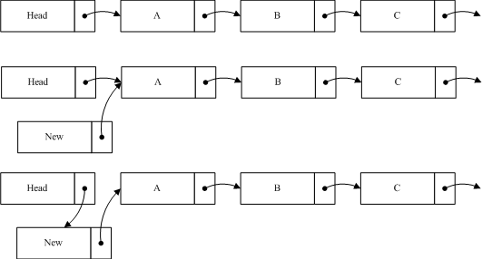
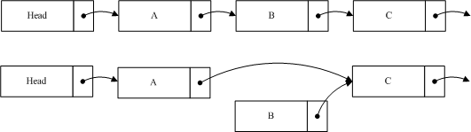

# 并发同步之RCU原理分析

**RCU原理：**

**一、简介**

        RCU（Read\-Copy Update）是数据同步的一种方式，在当前的[Linux](http://lib.csdn.net/base/linux "Linux知识库")内核中发挥着重要的作用。RCU主要针对的数据对象是链表，目的是提高遍历读取数据的效率，为了达到目的使用RCU机制读取数据的时候不对链表进行耗时的加锁操作（rcu的本质是利用指针赋值操作单指令原子性的原理，通过指针赋值完成新的数据挂接，再利用synchronize\_rcu/call\_rcu接口完成同步或异步的将老的数据释放掉）。这样在同一时间可以有多个线程同时读取该链表，并且允许一个线程对链表进行修改（修改的时候，需要加锁）。RCU适用于需要频繁的读取数据，而相应修改数据并不多的情景，例如在文件系统中，经常需要查找定位目录，而对目录的修改相对来说并不多，这就是RCU发挥作用的最佳场景。

       Linux内核源码当中,关于RCU的文档比较齐全，你可以在 /Documentation/RCU/ 目录下找到这些文件。Paul E. McKenney 是内核中RCU源码的主要实现者，他也写了很多RCU方面的文章。他把这些文章和一些关于RCU的论文的链接整理到了一起。[http://www2.rdrop.com/users/paulmck/RCU/](http://www2.rdrop.com/users/paulmck/RCU/)

     **  在RCU的实现过程中，我们主要解决以下问题：**

       1，在读取过程中，另外一个线程删除了一个节点。删除线程可以把这个节点从链表中移除，但它不能直接销毁这个节点，必须等到所有的读取线程读取完成以后，才进行销毁操作。RCU中把这个过程称为宽限期（Grace period）。

       2，在读取过程中，另外一个线程插入了一个新节点，而读线程读到了这个节点，那么需要保证读到的这个节点是完整的。这里涉及到了发布\-订阅机制（Publish\-Subscribe Mechanism）。

       3， 保证读取链表的完整性。新增或者删除一个节点，不至于导致遍历一个链表从中间断开。但是RCU并不保证一定能读到新增的节点或者不读到要被删除的节点。

###  二、宽限期

        通过例子，方便理解这个内容。以下例子修改于Paul的文章。

```
1 struct foo {
2            int a;
3            char b;
4            long c;
5  };
6
7 DEFINE_SPINLOCK(foo_mutex);
8
9 struct foo *gbl_foo;
10
11 void foo_read (void)
12 {
13      foo *fp = gbl_foo;
14      if ( fp != NULL )
15             dosomething(fp->a, fp->b , fp->c );
16 }
17
18 void foo_update( foo* new_fp )
19 {
20      spin_lock(&foo_mutex);
21      foo *old_fp = gbl_foo;
22      gbl_foo = new_fp;
23      spin_unlock(&foo_mutex);
24      kfee(old_fp);
25 }
```

如上的程序，是针对于全局变量gbl\_foo的操作。假设以下场景。有两个线程同时运行 foo\_ read和foo\_update的时候，当foo\_ read执行完赋值操作后，线程发生切换；此时另一个线程开始执行foo\_update并执行完成。当foo\_ read运行的进程切换回来后，运行dosomething 的时候，fp已经被删除，这将对系统造成危害。为了防止此类事件的发生，RCU里增加了一个新的概念叫宽限期（Grace period）。如下图所示：



图中每行代表一个线程，最下面的一行是删除线程，当它执行完删除操作后，线程进入了宽限期。宽限期的意义是，在一个删除动作发生后，它必须等待所有在宽限期开始前已经开始的读线程结束，才可以进行销毁操作。这样做的原因是这些线程有可能读到了要删除的元素。图中的宽限期必须等待1和2结束；而读线程5在宽限期开始前已经结束，不需要考虑；而3,4,6也不需要考虑，因为在宽限期结束后开始后的线程不可能读到已删除的元素。为此RCU机制提供了相应的API来实现这个功能。

```
1 void foo
_read(void)
2 {
3     rcu_read_lock();
4     foo *fp = gbl_foo;
5     if ( fp != NULL )
6             dosomething(fp->a,fp->b,fp->c);
7     rcu_read_unlock();
8 }
9
10 void foo_update( foo* new_fp )
11 {
12     spin_lock(&foo_mutex);
13     foo *old_fp = gbl_foo;
14     gbl_foo = new_fp;
15     spin_unlock(&foo_mutex);
16     synchronize_rcu();
17     kfee(old_fp);
18 }
```

    其中foo\_read中增加了rcu\_read\_lock和rcu\_read\_unlock，这两个函数用来标记一个RCU读过程的开始和结束。其实作用就是帮助检测宽限期是否结束。foo\_update增加了一个函数synchronize\_rcu\(\)，调用该函数意味着一个宽限期的开始，而直到宽限期结束，该函数才会返回。我们再对比着图看一看，线程1和2，在synchronize\_rcu之前可能得到了旧的gbl\_foo，也就是foo\_update中的old\_fp，如果不等它们运行结束，就调用kfee\(old\_fp\)，极有可能造成系统崩溃。而3,4,6在synchronize\_rcu之后运行，此时它们已经不可能得到old\_fp，此次的kfee将不对它们产生影响。

     宽限期是RCU实现中最复杂的部分,原因是在提高读数据性能的同时，删除数据的性能也不能太差。

**三、订阅——发布机制�**�

      当前使用的编译器大多会对代码做一定程度的优化，CPU也会对执行指令做一些优化调整,目的是提高代码的执行效率，但这样的优化，有时候会带来不期望的结果。如例：

```
1 void foo_update( foo* new_fp )
2 {
3     spin_lock(&foo_mutex);
4     foo *old_fp = gbl_foo;
5     
6     new_fp->a = 1;
7     new_fp->b = ‘b’;
8     new_fp->c = 100;
9     
10     gbl_foo = new_fp;
11     spin_unlock(&foo_mutex);
12     synchronize_rcu();
13     kfee(old_fp);
14 }
```

这段代码中，我们期望的是6，7，8行的代码在第10行代码之前执行。但优化后的代码并不对执行顺序做出保证。在这种情形下，一个读线程很可能读到 new\_fp，但new\_fp的成员赋值还没执行完成。当读线程执行dosomething\(fp\-\>a, fp\-\>b , fp\-\>c \) 的 时候，就有不确定的参数传入到dosomething，极有可能造成不期望的结果，甚至程序崩溃。可以通过优化屏障来解决该问题，RCU机制对优化屏障做了包装，提供了专用的API来解决该问题。这时候，第十行不再是直接的指针赋值，应该改为;  

       rcu\_assign\_pointer\(gbl\_foo,new\_fp\);

       rcu\_assign\_pointer的实现比较简单，如下：

      \<include/linux/rcupdate.h\>

```
1 #define rcu_assign_pointer(p, v) \
2          __rcu_assign_pointer((p), (v), __rcu)
3
4 #define __rcu_assign_pointer(p, v, space) \
5          do { \
6                  smp_wmb(); \
7                  (p) = (typeof(*v) __force space *)(v); \
8          } while (0)
```

我们可以看到它的实现只是在赋值之前加了优化屏障 smp\_wmb来确保代码的执行顺序。另外就是宏中用到的\_\_rcu，只是作为编译过程的检测条件来使用的。

 在DEC Alpha CPU机器上还有一种更强悍的优化（ 在一般的处理器架构上是一点问题都没有的。但在 alpha 上，编译器的 value\-speculation 优化选项据说可能会“猜测” fp 的值，然后重排指令），如下所示：

```
1 void foo_read(void)
2 {        
3     rcu_read_lock();
4     foo *fp = gbl_foo;
5     if ( fp != NULL )
6         dosomething(fp->a, fp->b ,fp->c);
7     rcu_read_unlock();
8 }
```

第六行的 fp\-\>a,fp\-\>b,fp\-\>c会在第3行还没执行的时候就预先判断运行，当他和foo\_update同时运行的时候，可能导致传入dosomething的一部分属于旧的gbl\_foo，而另外的属于新的。这样导致运行结果的错误（搞不懂为何会出现这种错误，需要研究alpha架构）。为了避免该类问题，RCU还是提供了宏来解决该问题：

\<include/linux/rcupdate.h\>

```
#define rcu_dereference(p) rcu_dereference_check(p, 0)

#define rcu_dereference_check(p, c) \
         __rcu_dereference_check((p), rcu_read_lock_held() || (c), __rcu)

#define __rcu_dereference_check(p, c, space) \
         ({ \
                 typeof(*p) *_________p1 = (typeof(*p)*__force )ACCESS_ONCE(p); \
                 rcu_lockdep_assert(c, "suspicious rcu_dereference_check()" \
                                       " usage"); \
                 rcu_dereference_sparse(p, space); \
                 smp_read_barrier_depends(); \  //只有alpha架构上需要这个内存栅栏
                 ((typeof(*p) __force __kernel *)(_________p1)); \
         })

static inline int rcu_read_lock_held(void)
{
         if (!debug_lockdep_rcu_enabled())
                 return 1;
         if (rcu_is_cpu_idle())
                 return 0;
         if (!rcu_lockdep_current_cpu_online())
                 return 0;
         return lock_is_held(&rcu_lock_map);
}
```

 这段代码中加入了调试信息，去除调试信息，可以是以下的形式（其实这也是旧版本中的代码）：

```
1 #define rcu_dereference(p)     ({ \
2                     typeof(p) _________p1 = p; \
3                     smp_read_barrier_depends(); \
4                     (_________p1); \
5                     })
```

在赋值后加入优化屏障smp\_read\_barrier\_depends\(\)。

 我们之前的第四行代码改为 foo \*fp = rcu\_dereference\(gbl\_foo\);，就可以防止上述问题。

###  四、数据读取的完整性

        还是通过例子来说明这个问题：



 如图我们在原list中加入一个节点new到A之前，所要做的第一步是将new的指针指向A节点，第二步才是将Head的指针指向new。这样做的目的是当插入操作完成第一步的时候，对于链表的读取并不产生影响，而执行完第二步的时候，读线程如果读到new节点，也可以继续遍历链表。如果把这个过程反过来，第一步head指向new，而这时一个线程读到new，由于new的指针指向的是Null，这样将导致读线程无法读取到A，B等后续节点。从以上过程中，可以看出RCU并不保证读线程读取到new节点。如果该节点对程序产生影响，那么就需要外部调用做相应的调整。如在文件系统中，通过RCU定位后，如果查找不到相应节点，就会进行其它形式的查找，相关内容等分析到文件系统的时候再进行叙述。

      我们再看一下删除一个节点的例子：



  如图我们希望删除B，这时候要做的就是将A的指针指向C，保持B的指针，然后删除程序将进入宽限期检测。由于B的内容并没有变更，读到B的线程仍然可以继续读取B的后续节点。B不能立即销毁，它必须等待宽限期结束后，才能进行相应销毁操作。由于A的节点已经指向了C，当宽限期开始之后所有的后续读操作通过A找到的是C，而B已经隐藏了，后续的读线程都不会读到它。这样就确保宽限期过后，删除B并不对系统造成影响。

例如：\_\_list\_add\_rcu源码，其核心步骤是将prev指向new，单指令原子性完成链表的单向顺序\-\>next挂接。通过rcu\_assign\_pointer，保证该函数前面的内存写完成，备挂数据new准备完成。

```
static inline void __list_add_rcu(struct list_head *new,
                struct list_head *prev, struct list_head *next)
{
        new->next = next;
        new->prev = prev;
        rcu_assign_pointer(list_next_rcu(prev), new); //将新的数据new挂接入链表
        next->prev = new; //新的链表逆序挂接，由于这行和上一行并不是原子性的，所以读临界区访问的链表可能存在逆序->prev断开,需注意使用场景。
}
```

**五、rcu理解注释**

在non\-preemptible RCU implementations \(TREE\_RCU and TINY\_RCU\)，在读临界区不能调用阻塞线程运行的接口，在支持内核抢占的内核中需要关闭抢占。 synchronize\_rcu\(\) is guaranteed to block until after all the other CPUs exit their critical sections.如果读临界区长时间阻塞，将导致阻塞更新进程synchronize\_rcu调用阻塞。所以在大多数场景下\_\_rcu\_read\_lock/unlock的实现只是开关内核抢占。

```
static inline void __rcu_read_lock(void)
{
        if (IS_ENABLED(CONFIG_PREEMPT_COUNT))
                preempt_disable();
}

static inline void __rcu_read_unlock(void)
{
        if (IS_ENABLED(CONFIG_PREEMPT_COUNT))
                preempt_enable();
}
```
