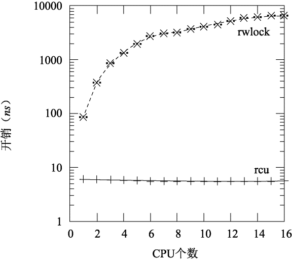

# 并��步之RCU用法分�

**一�背景**

内核开�者使用了����的�步�语���内核的并行性：细粒度�（fine\-grained locks），无�化数�结�（lock\-free data structures），CPU本地数�结�（per\-CPU data structures），以�读拷�更新机制\(RCU\)。RCU机制在2002年开始在linux kernel中使用，在2013年已�超过6500个API在内核中被使用。RCU的�功得以�在并�读�写情况下的高性能，主�包括两个语义：读者在RCU读关键区间（RCU read\-side critical sections）中访问数�结�；写者使用RCU�步语�等待已在读关键区间的读者完�。

**二�RCU的好处**

RCU的存在满足了内核的三点需求，使得其在内核中应用广泛。

**2.1 在有写者的情况下支�并行读**

内核中有许多的数�结�被设计�支�大�的读写�作，特别是VFS以�网络�系统。

举个例�，VFS中使用dentry�缓存最近访问的文件元数�，因为应用程�会访问大�的文件，内核需��常访问或者替�dentry，所以�想情况下线程在读�缓存数�的�时�希望�写冲�。RCU�满足了这�场景的需�。

**2.2 很�的计算�存储代价**

�空间代价是很��的，因为内核会�时访问��上万的对象，比如，在一些�务器中缓存了800万个dentry，就算在dentry的结�中加入�少的字节也会带�很大的存储代价。**�空间体�在内嵌的结�rcu\_head空间�用�**。

```
struct callback_head {
        struct callback_head *next;
        void (*func)(struct callback_head *head);
} __attribute__((aligned(sizeof(void *))));
#define rcu_head callback_head
```

�计算代价也很��，因为内核频�访问的数�结�往往是很短的代�路径，比如SELinux访问数�结�AVC，�有很短的代�路径进行访问，如�通过���护，由�拿�放�带�的cache miss�能会有几百个cycle，而这就已�是访问AVC数�结�的一�时间了，所以�执行代价在一些场景中�常��。**�计算体�在rcu读端耗时微�其微。**

**2.3 读�作确定的�行时间**

在NMI处�函数中访问共享数�的时候，线程�能在执行关键区域被中断。如�使用spinlock有�能带�死�。而如�使用无�化的数�结�，那么在冲�的时候就需�多次�试直到�功，而这点�使得�行的时间���确定性的。

�到相关的一些�步�语设计：读写�，本地�，全局�，事务性内存，都无法满足上诉讨论的特性。就算仅使用一个32�的字段存储�数�，在很多场景下也是����的。并且这些�还会带�代价很大的���作以�内存�障。

**三�RCU的设计**

RCU�语包�两个方�：RCU临界区以�RCU�步。

线程通过调用rcu\_read\_lock进入临界区，离开则是使用rcu\_read\_unlock。当需�进行RCU�步的时候，则使用synchronize\_rcu，当这个��被调用之�，会等待所有的进入临界区的线程都退出了�会返�。synchronize\_rcu既�会阻止线程新进入临界区，也�会�等待synchronize\_rcu调用之�进入临界区的线程。**RCU�许线程�等待已在临界区的读者完�，但是�会�供多个写者之间的�步�语，多个写者还是需��机制���**。

为了满足读写并���空间�计算代价�以�读�作确定时间，Linux内核通过调度器上下文切�的契机进行RCU的�步处�。在进入临界区的时候�止抢�，那么一次的上下文切�就�味�线程已�出了临界区。synchronize\_rcu则�需�等待所有的CPU��一次上下文切���。


上述代��述了一个RCU的简���。调用rcu\_read\_lock会�止抢�并且是�以嵌套的。rcu\_read\_unlock�许抢�。为了��所有的CPU都��了一次上下文切�，线程在�个CPU上执行synchronize\_rcu。我们注�到执synchronize\_rcu的代价和执行rcu\_read\_lock�rcu\_read\_unlock的线程数目无关，��CPU的个数有关。

在�际��中，synchronize\_rcu会等待所有的CPU都��过一次上下文切�，而�是�在�一个CPU上调度一下线程。

除了使用�步的synchronize\_rcu，线程还�以使用异步的�语call\_rcu，当所有的CPU都��了上下文切�，则会通过一个�调函数�完�特定的需求。

由�RCU的读者和写者并行执行，在设计上还有需�考虑乱�问题，例如编译器指令乱�以�访存乱�。如��能很好的��顺�，读者有�能访问到一个写者�始化之�的值，造�空指针访问之类的问题。RCU通过��rcu\_dereference和rcu\_assign\_pointer���访存顺�。这两个��通过体系结�相关的一些内存�障指令或者编译器指令�强制��访存顺�。

**四�RCU的用法**

**4.1 rcu基本用法**

**4.1.1 数�结�定义**

使用案例：�定在一个四核cpu上有一个100000人管�系统，struct person表示人，其具有���年龄�财富�智商四个特�，cpu0/1/2 �间断找出具有�些特点的人，如年龄最�但财富最多的人。cpu3通过�机数生�修改系统中人员特�。使用rcu进行多核�步的代�写法：

```
struct person {
    struct rcu_head rcu;  //struct rcu_head嵌入对象中，方便�续�收时通过container_of拿到对象
    struct list_head list;
    int num; //��
    int age; //年龄
    int money; //财富
    int iq; //智商
};
```

**4.1.2 多个读端**

cpu0\-cpu2�隔一段时间，��人员链表，cpu对person访问并�是��性的，需���护，使用rcu\_read\_lock\(\)/rcu\_read\_unlock\(\)进行读�护。

```
struct list_head leader; //person链表，链表中�始化好了LIST_TEST_LEN个person
#define LIST_TEST_LEN 100000

void set_task_run_cpu(int cpu)
{
    struct cpumask mask;
    
    cpumask_clear(&mask);
    cpumask_set_cpu(cpu, &mask);
    if (set_cpus_allowed_ptr(current, &mask))
        printk("Set thread cpu:%d sched affinity failed!\n", cpu);
}

int get_data_cpu0(void *data)
{
    struct person *p;
    struct person r;
    int tmp = 0, max = 0;

    set_task_run_cpu(0);
    printk("enter thread cpu0\n");
    while(1) {
        rcu_read_lock();
        list_for_each_entry_rcu(p, &leader, list) {
            tmp = p->money / p->age;
            if (tmp > max) {
                memcpy(&r, p, sizeof(*p));
            }
        }
        rcu_read_unlock();
        printk("Most (money/age) person: %d %d %d %d", r.num, r.money, r.age, r.iq);
        max = 0;
        memset(&r, 0, sizeof(r));
        msleep(1000);
    }
    printk("exit thread cpu0\n");

    return 0;
}

int get_data_cpu1(void *data)
{
    struct person *p;
    struct person r;
    int tmp = 0, max = 0;

    set_task_run_cpu(1);
    printk("enter thread cp1\n");
    while(1) {
        rcu_read_lock();
        list_for_each_entry_rcu(p, &leader, list) {
            tmp = p->money / p->iq;
            if (tmp > max) {
                memcpy(&r, p, sizeof(*p));
            }
        }
        rcu_read_unlock();
        printk("Most (money/iq) person: %d %d %d %d", r.num, r.money, r.age, r.iq);
        max = 0;
        memset(&r, 0, sizeof(r));
        msleep(400);
    }
    printk("exit thread cpu1\n");

    return 0;
}

int get_data_cpu2(void *data)
{
    struct person *p;
    struct person r;
    int tmp = 0, max = 0;

    set_task_run_cpu(2);
    printk("enter thread cpu2\n");
    while(1) {
        rcu_read_lock();
        list_for_each_entry_rcu(p, &leader, list) {
            tmp = p->iq - p->age;
            if (tmp > max) {
                memcpy(&r, p, sizeof(*p));
            }
        }
        rcu_read_unlock();
        printk("Most (iq - age) person: %d %d %d %d", r.num, r.money, r.age, r.iq);
        max = 0;
        memset(&r, 0, sizeof(r));
        msleep(700);
    }
    printk("exit thread cpu2\n");

    return 0;
}
```

**4.1.3 写端**

cpu3 通过�机数修改person的数�，对person结�体的修改也�是��性的，需�通过rcu�好多核�步。

- �步�收

```
//旧的数��步释放写法
int set_person_value_cpu3(void *data)
{
    struct person *p, *new;
    long refresh = 0;

    set_task_run_cpu(3);
    while(1) {
        get_random_bytes(&refresh, sizeof(refresh));
        refresh = refresh % LIST_TEST_LEN;
        list_for_each_entry(p, &leader, list) {
            if (refresh == p->num) {
                new = (struct person*)kzalloc(sizeof(*new), GFP_KERNEL);
                
                new->num = p->num;
                get_random_bytes(&refresh, sizeof(refresh));
                new->money = refresh;
                get_random_bytes(&refresh, sizeof(refresh));
                new->age =   refresh % 100;
                get_random_bytes(&refresh, sizeof(refresh));
                new->iq = refresh % 256;
                
                list_replace_rcu(&p->list, &new->list);
                synchronize_rcu(); //�步完�一次rcu宽�期�，�释放对象
                kfree(p);
                
                break;
            }
        }
        msleep(5);
    }
}
```

-  异步�收

```
//1）自定义�调函数异步释放写法
void free_person(struct rcu_head *head)
{
    struct person *p = NULL;
    p = container_of(head, struct person, rcu);
    kfree(p);
}

int set_person_value_cpu3(void *data)
{
    struct person *p, *new;
    long refresh = 0;

    set_task_run_cpu(3);
    while(1) {
        get_random_bytes(&refresh, sizeof(refresh));
        refresh = refresh % LIST_TEST_LEN;
        list_for_each_entry(p, &leader, list) {
            if (refresh == p->num) {
                new = (struct person*)kzalloc(sizeof(*new), GFP_KERNEL);
                new->num = p->num;
                get_random_bytes(&refresh, sizeof(refresh));
                new->money = refresh;
                get_random_bytes(&refresh, sizeof(refresh));
                new->age =   refresh % 100;
                get_random_bytes(&refresh, sizeof(refresh));
                new->iq = refresh % 256;
                
                list_replace_rcu(&p->list, &new->list);
                call_rcu(&p->rcu, free_person); //写�调函数异步�收
                
                break;
            }
        }
        msleep(5);
    }
}

//2）利用�装好的kfree_rcu函数，直�异步释放
int set_person_value_cpu3(void *data)
{
    struct person *p, *new;
    long refresh = 0;

    set_task_run_cpu(3);
    while(1) {
        get_random_bytes(&refresh, sizeof(refresh));
        refresh = refresh % LIST_TEST_LEN;
        list_for_each_entry(p, &leader, list) {
            if (refresh == p->num) {
                new = (struct person*)kzalloc(sizeof(*new), GFP_KERNEL);
                new->num = p->num;
                get_random_bytes(&refresh, sizeof(refresh));
                new->money = refresh;
                get_random_bytes(&refresh, sizeof(refresh));
                new->age =   refresh % 100;
                get_random_bytes(&refresh, sizeof(refresh));
                new->iq = refresh % 256;
      
                list_replace_rcu(&p->list, &new->list);
                kfree_rcu(p, rcu); //利用�装好的kfree释放��释放slab
                
                break;
            }
        }
        msleep(5);
    }
}
```

**4.1.4 kfree\_rcu机制**

内核中数�结�一般是使用kmalloc分�，使用kfree释放，如�针对�一个kmalloc分�的内存对象，且�需释放该数�结�本身，都��一个rcu�调内存释放函数，代�显得比较冗余。能�利用这类对象的�作相似性，使用相�的�调函数覆盖�需释放内存结�的场景？kfree\_rcu就是满足这�需求的，其����：

1�数�结�对象定义时，需�将struct rcu\_head嵌入其中。

2�调用kfree\_rcu时需�传入对象地�以�struct rcu\_head类��员�，以计算struct rcu\_head类��员在数�结�对象中的�移。

3�调用call\_rcu进行异步�收时，传入的func并�是真的函数地�，而是struct rcu\_head类��员在数�结�对象中的�移

4�在宽�期完�之�，进行�收执行\_\_rcu\_reclaim函数时，判断“func�是�移还是真正的�调函数，如�是�移，则使用kfree释放内存。考虑到使用该机制的内核数�结�通常是��4096字节的，因此判断“func�是�移还是真正的�调函数就是将其值�4096�比较。

```
#define kfree_rcu(ptr, rcu_head)                    \
    __kfree_rcu(&((ptr)->rcu_head), offsetof(typeof(*(ptr)), rcu_head))

#define __is_kfree_rcu_offset(offset) ((offset) < 4096)

#define __kfree_rcu(head, offset) \
    do { \
        BUILD_BUG_ON(!__is_kfree_rcu_offset(offset)); \
        kfree_call_rcu(head, (rcu_callback_t)(unsigned long)(offset)); \
    } while (0)

void kfree_call_rcu(struct rcu_head *head,
            rcu_callback_t func)
{
    __call_rcu(head, func, rcu_state_p, -1, 1);
}

static inline bool __rcu_reclaim(const char *rn, struct rcu_head *head)
{
    unsigned long offset = (unsigned long)head->func;

    rcu_lock_acquire(&rcu_callback_map);
    if (__is_kfree_rcu_offset(offset)) {
        RCU_TRACE(trace_rcu_invoke_kfree_callback(rn, head, offset));
        kfree((void *)head - offset); //通过kfree 释放slab内存
        rcu_lock_release(&rcu_callback_map);
        return true;
    } else {
        RCU_TRACE(trace_rcu_invoke_callback(rn, head));
        head->func(head); //正常调用rcu �调函数
        rcu_lock_release(&rcu_callback_map);
        return false;
    }
}
```

**4.1.5 多个写端**

�如还有个cpu4 �更新链表�么�？需�使用�外的�对链表进行�护，��多个写之间的互斥。

```
int set_person_value_cpu3(void *data)
{
    struct person *p, *new;
    long refresh = 0;

    set_task_run_cpu(3);
    while(1) {
        get_random_bytes(&refresh, sizeof(refresh));
        refresh = refresh % LIST_TEST_LEN;
        spin_lock(&list_lock);//==>用�对多个写链表进行互斥，list_replace_rcu中对链表的修改需�多步，写�入会造�链表异常因此需��外��护
        list_for_each_entry(p, &leader, list) {
            if (refresh == p->num) {
                new = (struct person*)kzalloc(sizeof(*new), GFP_KERNEL);
                ... //set new
                
                list_replace_rcu(&p->list, &new->list);
                spin_unlock(&list_lock);
                kfree_rcu(p, rcu); //利用�装好的kfree释放��释放slab
                break;
            }
        }
        spin_unlock(&list_lock);//==>用�对多个写链表进行互斥
        msleep(5);
    }
}

int set_person_value_cpu4(void *data)
{
    struct person *p, *new;
    long refresh = 0;

    set_task_run_cpu(4);
    while(1) {
        get_random_bytes(&refresh, sizeof(refresh));
        refresh = refresh % LIST_TEST_LEN;
        spin_lock(&list_lock); //==>用�对多个写链表进行互斥
        list_for_each_entry(p, &leader, list) {
            if (refresh == p->num) {
                new = (struct person*)kzalloc(sizeof(*new), GFP_KERNEL);
                ... //set new
                
                list_replace_rcu(&p->list, &new->list);
                spin_unlock(&list_lock);
                kfree_rcu(p, rcu); //利用�装好的kfree释放��释放slab
                break;
            }
        }
        spin_unlock(&list_lock);//==>用�对多个写链表进行互斥
        msleep(5);
    }
}
```

**4.2 读写é”�的替代è€**…

RCU最常�的用途是替�读写�。在20世纪90年代�期，Paul在��通用RCU之�，��了一�轻�级的读写�。��，为这个轻�级读写���所设想的�个用途，最终都使用RCU���了。 RCU和读写�最关键的相似之处，在�两者都有�以并行执行读端临界区。事�上，在�些情况下，完全�以用对应的读写�API�替�RCU的API，�之亦然。 RCU的优点在�：性能��会死�，以�良好的�时延迟。当然RCU也有一点缺点，比如：读者�更新者并�执行，�优先级RCU读者也�以阻�正等待优雅周期结�的高优先级线程，优雅周期的延迟�能达到好几毫秒。

**相�点：**

1�两者都有�以并行执行读端临界区；写端需互斥。

**��点：**

1�rcu读端性能好�以�良好的�时延迟，多核扩展性好。（下图读端临界区长度为0时，多核扩展场景下读端开销，rcu几�就是水平扩展，因为其读端�有开关抢�，所以时间延迟也是确定的）

****

2�rcu读者�更新者并�执行，�优先级RCU读者也�以阻�正等待优雅周期结�的高优先级线程。优先级�转。

3�rcu读端�语基本上是�会死�的，因为它本身就��无�编程的范畴。

4�RCU读端�能读到的�是最新的数�，读写�读端读到的必然是最新数�。（RCU中，在更新者完���开始的读者都“���能看�新值，在更新者开始��完�的读者有�能看�新值，也有�能看�旧值，这�决�具体的时机。）

代�示例：使用RCU作为读写�的一个例�是�步访问PID哈希表：

```
pid_table_entry_t pid_table[];
process_t *pid_lookup(int pid)
{
    process_t *p;
    rcu_read_lock();
    p = pid_table[pid_hash(pid)].process;
    if (p)
    atomic_inc(&p->ref);
    rcu_read_unlock();
    return p;
}
void pid_free(process *p)
{
    if (atomic_inc(&p->ref))
    free(p);
}
void pid_remove(int pid)
{
    process_t **p;
    spin_lock(&pid_table[pid_hash(pid)].lock);
    p = &pid_table[pid_hash(pid)].process;
    rcu_assign_pointer(p, NULL);
    spin_unlock(&pid_table[pid_hash(pid)].lock);
    if (*p)
    call_rcu(pid_free, *p);
}
```

**4.3 ��的引用计数**

rcu当�一个简���的引用计数使用，读端临界区表�对对象的引用。

使用时计数：

```
1  rcu_read_lock();                /*  acquire  reference.  */
2  p  =  rcu_dereference(head);
3  /*  do  something  with  p.  */
4  rcu_read_unlock();            /*  release  reference.  */
```

计数为0时释放：

```
1  spin_lock(&mylock);
2  p  =  head;
3  rcu_assign_pointer(head,  NULL);
4  spin_unlock(&mylock);
5  /*  Wait  for  all  references  to  be  released.  */
6  synchronize_rcu();
7  kfree(p);
```

_�际案例：_下�的伪代�展示了RCU在Linux网络栈中�代引用计数的应用。该例�利用RCU对IP options进行引用计数，表示当�内核网络栈正在拷�IP options到一个packet中。udp\_sendmsg调用rcu\_read\_lock�rcu\_read\_unlock标记临界区的进入�退出。而应用程��以通过系统调用sys\_setsockop\(最终到内核的setsockopt函数\)对IP options进行修改。修改的过程是先将新值拷�，然�调用call\_rcu进行旧值的删除。

```
void udp_sendmsg(sock_t *sock, msg_t *msg)
{
    ip_options_t *opts;
    char packet[];
    copy_msg(packet, msg);
    rcu_read_lock();
    opts = rcu_dereference(sock->opts);
    if (opts != NULL)
    copy_opts(packet, opts);
    rcu_read_unlock();
    queue_packet(packet);
}
void setsockopt(sock_t *sock, int opt, void *arg)
{
    if (opt == IP_OPTIONS) {
        ip_options_t *old = sock->opts;
        ip_options_t *new = arg;
        rcu_assign_pointer(&sock->opts, new);
        if (old != NULL)
        call_rcu(kfree, old);
        return;
    }
    /* Handle other opt values */
}
```

**4.4 批�引用计数机制**

ç•¥~

**4.5 穷人版的�圾�收器**

RCU�GC有几点��：

（1）程�员必须手动指示何时�以�收指定数�结�。（对象需�使用者调用call\_rcu\(\)指示�收）

（2）程�员必须手动标出�以�法�有引用的RCU读端临界区。（高级语言new了对象��以���使用）

**4.6 存在担�**

ç•¥~

**4.7 类�安全的内存**

类�内存安全：是指�一�内存��使用了或者�被释放�，但�然能��在一段周期内这�内存所存数�类��会�生�化，且能当�一个正常的该类�使用。

**4.7.1 信�的�问题**

进程信�处�使用task\_struct\-\>sighand，在多核场景下和exec\(\)存在�争，exec\(\)中�能会修改task\_struct\-\>sighand的指针值，考虑下如何使用��进行互斥？？？

```
struct task_struct {
    struct sighand_struct *sighand;
}

struct sighand_struct {
    atomic_t        count;
    struct k_sigaction  action[_NSIG];
    spinlock_t      siglock;
    wait_queue_head_t   signalfd_wqh;
};
```

**4.7.2 早期2.6内核方案**

早先的send\_sigqueue\(\)信�处�函数，使用tsk\-\>sighand的�在tsk\-\>sighand\-\>siglock中（应该是考虑�粒度的�性能更好），如�想正常��tsk\-\>sighand\-\>siglock的�，外部需�一把大�tasklist\_lock���，因为读�tsk\-\>sighand和��tsk\-\>sighand\-\>siglock�是��的，�能在两者之间被中断或抢�修改��置的内存数�，如�这期间tsk\-\>sighand改�了，那么将出�上�错误，因此此处需�使用tasklist\_lock大�。

```
//写端写tsk->sighand
static inline int de_thread(struct task_struct *tsk)
{
    struct sighand_struct *newsighand, *oldsighand = tsk->sighand;
    
    //创建一个新的sighand
    newsighand = kmem_cache_alloc(sighand_cachep, GFP_KERNEL);
    spin_lock_init(&newsighand->siglock);
    atomic_set(&newsighand->count, 1);
    memcpy(newsighand->action, oldsighand->action,
                 sizeof(newsighand->action));
  
    write_lock_irq(&tasklist_lock);
    spin_lock(&oldsighand->siglock);
    spin_lock(&newsighand->siglock);
  
    current->sighand = newsighand; //写端更新
    recalc_sigpending();
  
    spin_unlock(&newsighand->siglock);
    spin_unlock(&oldsighand->siglock);
    write_unlock_irq(&tasklist_lock);
  
    if (atomic_dec_and_test(&oldsighand->count))
         kmem_cache_free(sighand_cachep, oldsighand);
}

//读端读tsk->sighand
int send_sigqueue(int sig, struct sigqueue *q, struct task_struct *tsk)  
{
    read_lock(&tasklist_lock);
    spin_lock_irqsave(&tsk->sighand->siglock, flags);
    
    //进行具体的信�处�
    
    spin_unlock_irqrestore(&tsk->sighand->siglock, flags);
    read_unlock(&tasklist_lock);
}
```

**4.7.3 rcu优化方案**

引入rcu�，在rcu临界区内通过��读�到的struct sighand\_struct类�的tsk\-\>sighand\-\>siglock的类�安全，�内存中数�类���， 多次�试��正确上�，以优化性能。而这个临界区内类�安全就是�赖rcu以�SLAB\_DESTROY\_BY\_RCU��的。

1）创建slab cache时带入SLAB\_DESTROY\_BY\_RCU标志，该标志的作用是，在内核free�这类slab内存时，�会立�释放�，而是将其通过call\_rcu�调进行延迟释放，如�在rcu读临界区内调用，则真正的释放至少�在退出读临界区�。

```
void __init proc_caches_init(void)
{
    sighand_cachep = kmem_cache_create("sighand_cache",
            sizeof(struct sighand_struct), 0,
            SLAB_HWCACHE_ALIGN|SLAB_PANIC|SLAB_DESTROY_BY_RCU|
            SLAB_NOTRACK|SLAB_ACCOUNT, sighand_ctor);
}
static void free_slab(struct kmem_cache *s, struct page *page)
{
    if (unlikely(s->flags & SLAB_DESTROY_BY_RCU)) {
        struct rcu_head *head;
        head = &page->rcu_head;
        call_rcu(head, rcu_free_slab);  //如�有SLAB_DESTROY_BY_RCU通过rcu�收
    } else   
        __free_slab(s, page);
}   
```

2）在写端更新task\_struct\-\>sighand时，先创建一个新的数�，使用rcu\_assign\_pointer进行�布。

```
//写端 多核场景下exec()时�能会修改task_struct->sighand，�使用的地方产生�争
static int de_thread(struct task_struct *tsk)
{
        newsighand = kmem_cache_alloc(sighand_cachep, GFP_KERNEL);

        atomic_set(&newsighand->count, 1);
        memcpy(newsighand->action, oldsighand->action,
               sizeof(newsighand->action));

        write_lock_irq(&tasklist_lock);
        spin_lock(&oldsighand->siglock);
        rcu_assign_pointer(tsk->sighand, newsighand); //写�布
        spin_unlock(&oldsighand->siglock);
        write_unlock_irq(&tasklist_lock);

        __cleanup_sighand(oldsighand); //kfree(oldsighand); 释放旧数�
}
```

3）读端通过�试上�

```
truct sighand_struct *__lock_task_sighand(struct task_struct *tsk,
                       unsigned long *flags)
{
    struct sighand_struct *sighand;

    for (;;) {
        /*
         * Disable interrupts early to avoid deadlocks.
         * See rcu_read_unlock() comment header for details.
         */
        local_irq_save(*flags);
        rcu_read_lock();
        sighand = rcu_dereference(tsk->sighand);

//==》1）这个空档�能有写端把tsk->sighand修改了，但是旧的old_sighand肯定未释放�
        spin_lock(&sighand->siglock);
        if (likely(sighand == tsk->sighand)) {
            rcu_read_unlock();
            break;
            //==》如�没有写端修改，认为拿��功，则以spin_lock��的状�返�
        }
//==》2）到这�说�有写端修改了tsk->sighand，但是并未释放，此时的sighand已�是没有用的      
        spin_unlock(&sighand->siglock);
        rcu_read_unlock();
        local_irq_restore(*flags);
//==>3)进入下一次for循�，�试��tsk->sighand->siglock
    }

    return sighand;
}
```

**4.7.4 �考commit**

1�\<\[PATCH\] RCU signal handling\> e56d090310d7625ecb43a1eeebd479f04affb48b

2�\<\[PATCH\] convert sighand\_cache to use SLAB\_DESTROY\_BY\_RCU\> aa1757f90bea3f598b6e5d04d922a6a60200f1da

**4.8 等待事务结�**

**4.8.1 NMI中断问题**

试想下案例：���蔽中断处�函数nmi\_profile\(\)读�内存buf并�修改（�作二级指针buf\-\>entry\[x\]修改内存），nmi\_stop\(\)函数�止�者对这�内存的�作。

```
struct  profile_buffer  {
     long  size;
     atomic_t  entry[0];
};

static  struct  profile_buffer  *buf  =  NULL;

//NMI中断调用 =》读端
void  nmi_profile(unsigned  long  pcvalue)
{
    atomic_inc(&buf->entry[pcvalue]);
}

//进程上下文调用 =》写端
void  nmi_stop(void)
{
    struct  profile_buffer p = buf;
    buf = NULL;
    kfree(p);
}
```

**问题难点：**

1�nmi\_profile\(\)中对内存的访问需�使用二级指针，�能让nmi\_stop\(\)简�对buf置空并释放，多核并行情况下�能出�nmi\_profile\(\)内存的访问异常。

2��能使用常规的spin\_lock\_irq\(\)/spin\_unlock\_irq\(\)��护，由�关中断关�了NMI中断，�核场景下nmi\_profile\(\)�入nmi\_stop\(\)会造�死�。

3�使用其他方案如����或�会麻烦些......

**3.8.1 常规方案**

使用�����护需�考虑的会较多，代��能也会显得��，相当���一个简�的读端�会被阻�的读写�。

1�读端需�并行，读端和写端需�互斥

2�在�核上，读端抢�了处�临界区的写端，�能return。也就是读端��写端上�了，需�直�返��能直�自旋。

3�读端如���写端上�了，需�自旋等待

```
//NMI中断调用 =》读端
void  nmi_profile(unsigned  long  pcvalue)
{
    //1�如�写端上�，直�return；2�如�读端上�，直�进入并行
    if (buf == NULL)
        return
    atomic_inc(&buf->entry[pcvalue]);
    //3�读端解�
}

//进程上下文调用 =》写端
void  nmi_stop(void)
{
    struct  profile_buffer p;
    
    //1�如�写端上�，自旋等待 2�如�写端上�，自旋等待
    p = buf;
    buf = NULL;
    //3�写端解�
    if (p)
        kfree(p);
}
```

**4.8.2 rcu解决方案**

rcu�以巧妙并且简�的解决该问题：

```
//读端：在NMI中断中通过二级指针这�����作
void  nmi_profile(unsigned  long  pcvalue)
{
    struct profile_buffer *p = rcu_dereference(buf);

    if  (p  ==  NULL)
         return;
    if  (pcvalue  >=  p->size)
         return;
    atomic_inc(&p->entry[pcvalue]);
}

//写端，先将buf置空，��至少一个rcu临界区�，NMI中断中对buf的引用必然结�。
//此时�以将�先buf指�的资�释放�，NMI本身处�中断临界区，没有必�使用rcu_read_lock/unlock标记
void  nmi_stop(void)
{
    struct  profile_buffer  *p  =  buf;

    if  (p  ==  NULL)
        return;
    rcu_assign_pointer(buf,  NULL);
    synchronize_sched();
    kfree(p);
}
```

**4.8.3 类似案例防止NMI下死�**

```
rcu_list_t nmi_list;
spinlock_t nmi_list_lock;
void handle_nmi()
{
    rcu_read_lock();
    rcu_list_for_each(&nmi_list, handler_t cb)
    cb();
    rcu_read_unlock();
}
void register_nmi_handler(handler_t cb)
{
    spin_lock(&nmi_list_lock);
    rcu_list_add(&nmi_list, cb);
    spin_unlock(&nmi_list_lock);
}
void unregister_nmi_handler(handler_t cb)
{
    spin_lock(&nmi_list_lock);
    rcu_list_remove(cb);
    spin_unlock(&nmi_list_lock);
    synchronize_rcu();
}
```

上�的伪代�展示了NMI系统的工作�程nmi\_list�存了NMI的处�函数，并且使用spinlock进行写�护，但支�无�化的读�作。rcu\_list\_for\_each在���一个元素的时候会调用rcu\_dereference，rcu\_list\_ad和rcu\_list\_remove则会调用rcu\_assign\_pointer。在一个RCU临界区内，NMI系统会执行所有的NMI处�函数。注销处�函数的时候，NMI系统会先清空list，然�调用synchronize\_rcu��它返�时所有的处�函数都已�完�了。

在此场景下，如�想使用读写�，很容易造�死�，CPU在unregister\_nmi\_handler中拿�的情况下，�然会被NMI打断，NMI处�函数中也会�试拿�，造�死�。

在使用rcu以�，读端（调用NMI处�函数）和写端（注册NMI处�函数），都使用spin\_lock\_irq，由�NMI中断���蔽的特�，导致�能会出�死�的情况。使用RCU以�，�存在死�的情况。
