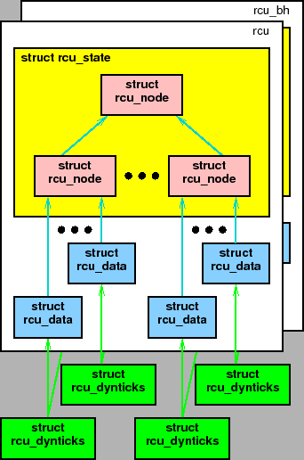
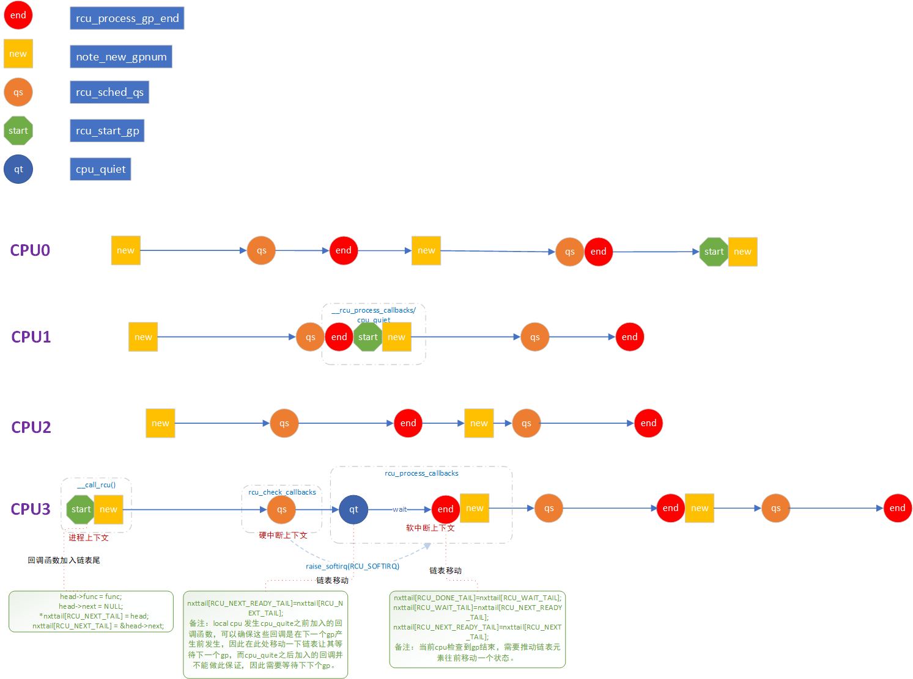
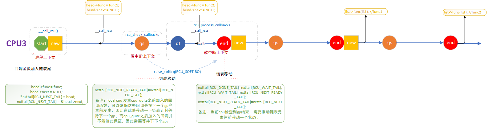
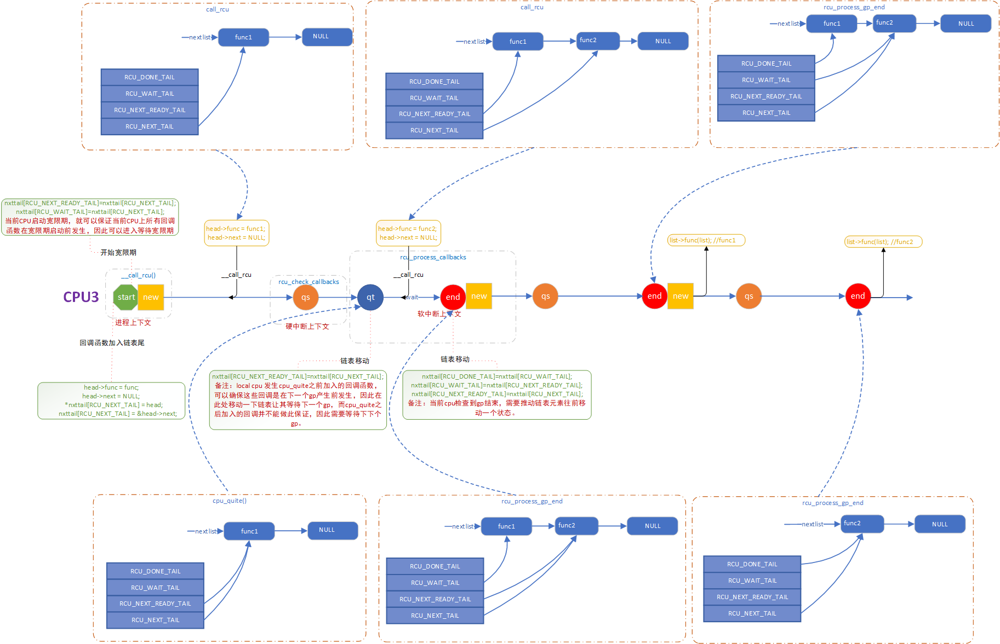
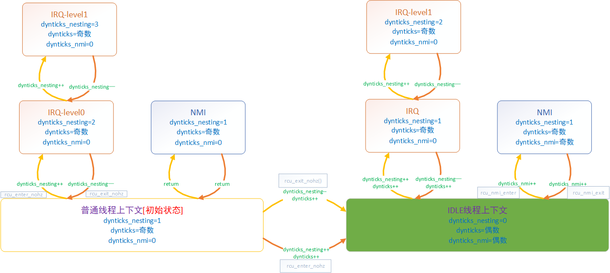

# 并发同步之TREE RCU（1）

基于linux 2.6.32分析

**一、数据结构**

数据结构参考《深入理解RCU之六：分级RCU基础》

主要的数据有：

```
struct rcu_state 管理rcu全局的状态，内核中目前有rcu_sched_state/rcu_bh_state两种类型的rcu实例
struct rcu_data 管理每个cpu的rcu状态数据，是每cpu变量，处于树形结构的底层，多个rcu_data被一个rcu_node管理，构成树形结构的叶子
struct rcu_node 用于rcu宽限期的检测，构建树形结构，和rcu_data共同构建树
struct rcu_dynticks 用于标记当前是否处于dynamic idle/irq/nmi 等的上下文及嵌套，方便判断当前是否因为cpu休眠而处于扩展的宽限期下
```



**二、逻辑流程**

推动宽限期变化的几个入口

1、写端调用call\_rcu\(\)注册回调函数，并推动rcu机制运行

2、定时时钟中断函数rcu\_check\_callbacks\(\)检查每个CPU是否处于静止状态

3、软中断处理函数rcu\_process\_callbacks\(\)宽限期的状态变化

不同cpu之间同步start/qs/end几个状态，note标记宽限期完成的模型图如下：

****

rcu宽限期的运转，会在如下几个点推动回调函数的状态变化：

****

不同阶段调用call\_rcu加入到链表的回调函数，所等待的宽限期与其具体加入的时间有关，如下是回调函数在链表中变化时序图

****

**三、功能分析**

**3.1 rcu\_bh机制**

rcu\_read\_lock\_bh用于读端上下文处于软中断中，对应的读端临界区需要用rcu\_read\_lock\_bh\(\) /rcu\_read\_unlock\_bh\(\)保护。

1、引入rcu\_bh的原因：

当出现softirq独占一个或多个cpu时，原有的rcu\_sched机制需要等待cpu进入过idle或用户态，由于softirq频繁出现独占cpu，宽限期的时间会延长，进而导致此cpu注册的回调函数无法及时调用，内存来不及释放。

2、rch\_bh的基本原理：

在读端临界区使用rcu\_read\_lock\_bh\(\) /rcu\_read\_unlock\_bh\(\)，其会在进入临界区时关闭softirq，待出临界区又打开softirq。因此可以在两个地方检测该cpu是否处于静止状态。

\-\-硬件时钟中断中，通过in\_softirq\(\)判断，如果当前即没有关软中断，也没有处于被打断的软中断上下文，则认为当前cpu处于静止状态

```
in_softirq()   - We have BH disabled, or are processing softirqs 注意关软中断或者当前处于软中断总，此值都会为真
```

\-\-在软中断处理中，当一类的软中断处理完成后，标记认为cpu处于静止状态

3、rch\_bh的使用厂家：

大部分的读端临界区处于软中断中，则可以考虑使用。像网络模块，出现denial\-of\-service攻击时，软中断会比较高，目前也只有网络模块中看到了rcu\_bh的使用。

**3.2 dynamic tick**

dynamic tick机制会导致cpu进入idle，并停止硬件中断，从而使得这些停止了硬件中断的cpu无法报告静止状态，因此当宽限期在一定的时间内无法完成时，需要通过强制静止状态来主动扫描，结束宽限期。这种场景需要通过struct rcu\_dynticks数据结构来管理判断。

```
struct rcu_dynticks {
        int dynticks_nesting;   /* Track nesting level, sort of. */              表示irq的嵌套层数
        int dynticks;           /* Even value for dynticks-idle, else odd. */    偶数表示当前为idle状态
        int dynticks_nmi;       /* Even value for either dynticks-idle or */     偶数表示无nmi嵌套
                                /*  not in nmi handler, else odd.  So this */
                                /*  remains even for nmi from irq handler. */
};

DEFINE_PER_CPU(struct rcu_dynticks, rcu_dynticks) = {
        .dynticks_nesting = 1,
        .dynticks = 1,
};
```

dynticks的状态变化如下图，通过dynticks判断cpu是否是扩展静止状态有两步

1、dyntick\_save\_progress\_counter

强制静止状态通过第一次扫描，判断\(dynticks & 0x1\) == 0\) && \(\(dynticks\_nmi & 0x1\)，如果dynticks，dynticks\_nmi两者都是偶数，则认为当前处于扩展静止状态。满足这种情况的只有图右下角状态。同时还记录下当前这两个值，由于后续第二次扫描看cpu是否经历过idle

```
rdp->dynticks_snap =rdp->dynticks->dynticks;
rdp->dynticks_nmi_snap =rdp->dynticks->dynticks_nmi
```

2、rcu\_implicit\_dynticks\_qs

强制静止状态通过第二次扫描，将dynticks和dynticks\_nmi计数如果发生过变化，认为是进入过idle，即图右下角，也认为是一种扩展静止状态。

```
        if ((curr != snap || (curr & 0x1) == 0) &&
            (curr_nmi != snap_nmi || (curr_nmi & 0x1) == 0)) {
                rdp->dynticks_fqs++;
                return 1;
        }
```



 

**四、总结**

**五、参考资料**

%\!\(EXTRA markdown.ResourceType=, string=, string=\)
