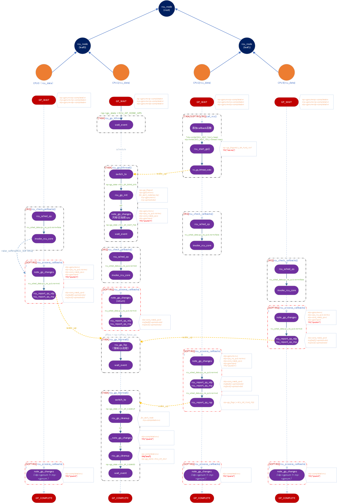

# 并发同步之TREE RCU（2）

基于linux 4.9.37分析

1、硬中断中检查RCU  rcu\_check\_callbacks\(user\_tick\);

2、软中断处理  rcu\_process\_callbacks\(struct softirq\_action \*unused\)

3、写端调用  call\_rcu\(struct rcu\_head \*head, rcu\_callback\_t func\)

二、宽限期变化流程

