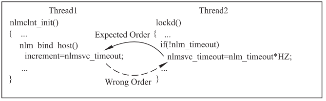
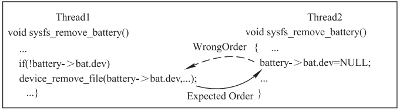

# 并��步之data race

**一�data race（数��争） 介�**

**1.1 什么是data race？Â** 

满足以下3个�件�为data race

\* two or more threads in a single process access the same memory location concurrently 两个或两个以上线程�时访问�一��

\* at least one of the accesses is for writing 至少有一个线程是写访问

\* the threads are not using any exclusive locks to control their accesses to that memory. 对共享��的访问没有�外的��护

**1.2 data race的分类**

Write \-\> Write Data Race

Read \-\> Write Data Race

**1.3 data race的��**

当以上三个�件data race�立时，线程\(线程\)对内存访问的顺�是�确定的，并且根���的访问顺�在�行之�会得出��的结�。 

一些data race�能是良性的，例如，当内存访问用�忙等待时，通过一个线程修改数��通知�一个线程退出忙等。

大部分data race是程�的错误，例如，读�该��时得到的值将�得��知，使得该多线程程�的�行结�将完全��预测，�能直�崩溃。

**二�data race程�错误示例**

示例1：线程1�能在线程2�始化完�nlmsvc\_timeout�就读�该��

示例2：线程1�能在线程2将battery\-\>bat.dev置空�访问，导致空指针

**三�如何防止data race引起的问题**

对�有�能被多个线程�时访问的��使用�他访问�制，具体方法包括使用mutex（互斥�）和monitor（监视器），或者使用atomic��。

**四�race condition概念**

race condition�data race概念是�一样的，解释如下：

Race Around Condition in an operating system is a situation where the result produced by two processes\(or threads\) operated on shared resources depends in an unexpected way on the relative order in which process gains access to the CPU\(s\). ���件的核心是多个线程，没有对共享资�顺�访问，而�能产生破�或其他预料之外的结�。因此需�正确的使用�，���对共享资�的顺�访问，以�����件。

**五��考资料**

1�[https://www.intel.com/content/www/us/en/develop/documentation/inspector\-user\-guide\-linux/top/problem\-type\-reference/data\-race.html](https://www.intel.com/content/www/us/en/develop/documentation/inspector-user-guide-linux/top/problem-type-reference/data-race.html)

2�Chinese J of Electronics \- 2018 \- Shi \- Linux Kernel Data Races in Recent 5 Years.pdf
