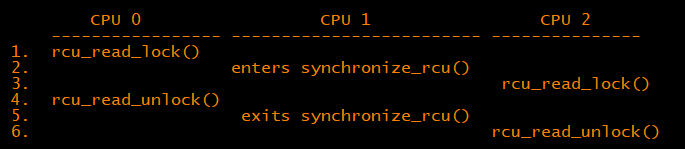
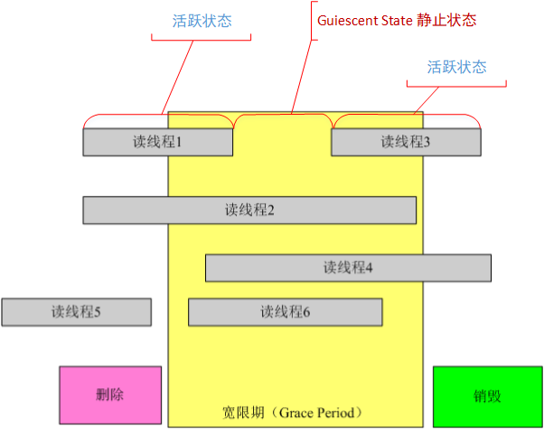

# 并发同步之whatisRCU

基于内核文档理解：Documentation/RCU/whatisRCU.txt

**1.  RCU OVERVIEW**

RCU技术存在的杰基本理论逻辑：

1、rcu将更新动作分为 移动"removal" 回收"reclamation"两个步骤。

2、移动“removal” 动作和读端可以同时运行，读者会看到数据结构的旧版本或新版本，而不是部分更新的数据。

3、更新者推迟回收"reclamation"，直到读者（"until all readers active during the removal phase"）完成退出读临界区。更新端再能通过同步或异步的方式完成数据回收。

```
So the typical RCU update sequence goes something like the following:

a.      Remove pointers to a data structure, so that subsequent
        readers cannot gain a reference to it.

b.      Wait for all previous readers to complete their RCU read-side
        critical sections.

c.      At this point, there cannot be any readers who hold references
        to the data structure, so it now may safely be reclaimed
        (e.g., kfree()d).
```

在现代CPU上对单个对齐的指针进行写操作是原子的，从而可以在不中断读取器的情况下，对链接结构中的数据项进行原子插入，删除和替换。

并发的RCU读取器可以继续访问旧版本，并且可以省去原子操作，内存障碍和通信高速缓存未命中的问题，即使在没有锁争用的情况下，在smp处理器上会有很大的性能提升。

```
In contrast, RCU-based updaters typically take advantage of the fact that writes to single aligned pointers are atomic on modern CPUs, allowing atomic insertion, removal, and replacement of data items in a linked structure without disrupting readers.

Concurrent RCU readers can then continue accessing the old versions, and can dispense with the atomic operations, memory barriers, and communications cache misses that are so expensive on present-day SMP computer systems, even in absence of lock contention.
```

那么何时可以进行步骤C，完成数据的回收？\(RCU readers and updaters need not communicate at all,how the heck can a reclaimer tell when a reader is done\)。

**2.  WHAT IS RCU'S CORE API?**

```

The core RCU API is quite small:

a.      rcu_read_lock()
b.      rcu_read_unlock()
c.      synchronize_rcu() / call_rcu()  
d.      rcu_assign_pointer()
e.      rcu_dereference()
```

ab：rcu\_read\_lock/unlock在只是关闭内核抢占无其他。

c: synchronize\_rcu：Marks the end of updater code and the beginning of reclaimer code. 该函数执行完成后可以开始回收操作



e：rcu\_dereference返回值解引用只在封闭的rcu\_read\_lock\(\) \-》rcu\_read\_unlock\(\)区域是有效的，超出这个区域继续访问时可能存在数据已经被更新者释放掉了。

```
                rcu_read_lock();
                p = rcu_dereference(head.next);
                rcu_read_unlock();
                x = p->address; /* BUG!!! */ 在临界区域之外访问rcu保护的数据，可能出现访问释放掉了的数据

                rcu_read_lock();
                y = p->data;    /* BUG!!! */ 未使用rcu_dereference()，在alpha架构上可能存在读到部分数据
                rcu_read_unlock();
```

在内核中有三种RCU使用场景，这几种场景在updater端使用的接口没有区别，在reader端使用的接口差异如下：

```
a.      rcu_read_lock() / rcu_read_unlock()
        rcu_dereference()

b.      rcu_read_lock_bh() / rcu_read_unlock_bh()
        local_bh_disable() / local_bh_enable()
        rcu_dereference_bh()

c.      rcu_read_lock_sched() / rcu_read_unlock_sched()
        preempt_disable() / preempt_enable()
        local_irq_save() / local_irq_restore()
        hardirq enter / hardirq exit
        NMI enter / NMI exit
        rcu_dereference_sched()

These three flavors are used as follows:

a.      RCU applied to normal data structures. //最常用的是这种

b.      RCU applied to networking data structures that may be subjected
        to remote denial-of-service attacks.

c.      RCU applied to scheduler and interrupt/NMI-handler tasks.
```

**3.  WHAT ARE SOME EXAMPLE USES OF CORE RCU API?**

call\_rcu使用方法：

```
void call_rcu(struct rcu_head * head, void (*func)(struct rcu_head *head));

struct foo {
                int a;
                char b;
                long c;
                struct rcu_head rcu;  //将rcu_head内嵌进foo数据结构
        };
  
    void foo_update_a(int new_a)
        {
                struct foo *new_fp;
                struct foo *old_fp;

                new_fp = kmalloc(sizeof(*new_fp), GFP_KERNEL);
                spin_lock(&foo_mutex);
                old_fp = rcu_dereference_protected(gbl_foo, lockdep_is_held(&foo_mutex));
                *new_fp = *old_fp;
                new_fp->a = new_a;
                rcu_assign_pointer(gbl_foo, new_fp);
                spin_unlock(&foo_mutex);
                call_rcu(&old_fp->rcu, foo_reclaim); //rcu_head作为入参
        }

The foo_reclaim() function might appear as follows:

//回调函数不能使用调度和阻塞相关的接口，回调函数可能在软中断和进程上下文运行
        void foo_reclaim(struct rcu_head *rp)
        {
                struct foo *fp = container_of(rp, struct foo, rcu);  //利用rcu_head找到数据节点

                foo_cleanup(fp->a);

                kfree(fp);
        }
//如果只是释放内存节点，可以使用内核定义好的函数kfree_rcu
kfree_rcu(old_fp, rcu);
```

kfree\_rcu 可以释放小于4096的内存，相当于封装了下call\_rcu接口

```
* encodes the offset of the rcu_head structure within the base structure.
* Because the functions are not allowed in the low-order 4096 bytes of
* kernel virtual memory, offsets up to 4095 bytes can be accommodated.
* If the offset is larger than 4095 bytes, a compile-time error will
* be generated in __kfree_rcu().  If this error is triggered, you can
* either fall back to use of call_rcu() or rearrange the structure to
* position the rcu_head structure into the first 4096 bytes.
#define kfree_rcu(ptr, rcu_head)                                        \
        __kfree_rcu(&((ptr)->rcu_head), offsetof(typeof(*(ptr)), rcu_head))

#define __kfree_rcu(head, offset) \
        do { \
                BUILD_BUG_ON(!__is_kfree_rcu_offset(offset)); \
                kfree_call_rcu(head, (rcu_callback_t)(unsigned long)(offset)); \ //将offset强制转换成函数指针传入，由于函数本身不能位于虚拟地址0-4096这个空间，具体的call_rcu函数可以判断这个指针大小从而调用kfree释放
        } while (0)

void kfree_call_rcu(struct rcu_head *head,
                    rcu_callback_t func)
{
        __call_rcu(head, func, rcu_state_p, -1, 1);
}
```

**四、经典RCU和tree RCU**

1、Grace Period 宽限期：更新端完成发布开始至开始时处于读临界区的读端都离开临界区

2、Quiescent State静止状态：读端离开读临界区为静止状态，读处于临界区为活跃状态


