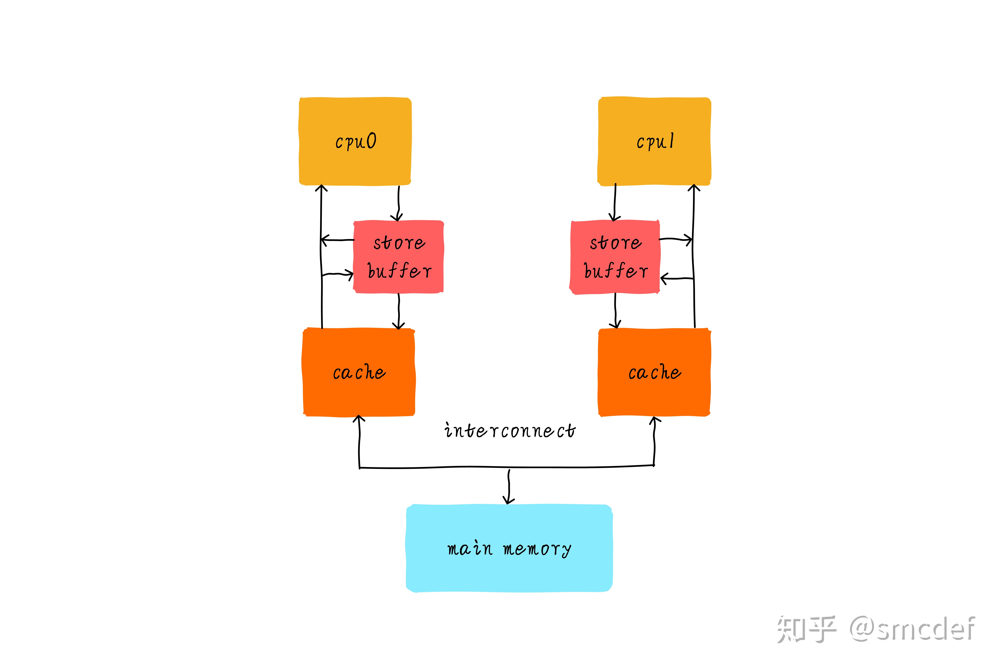
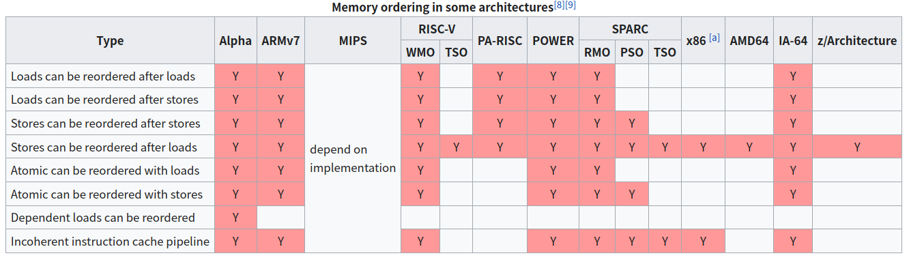
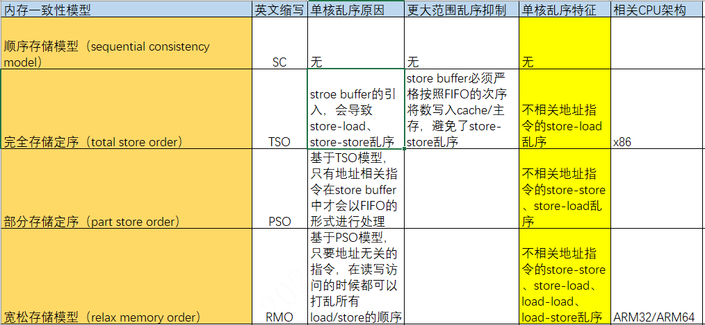
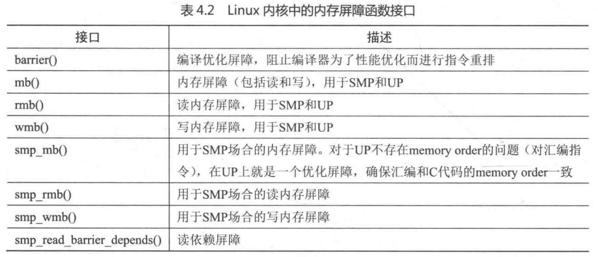

# 并发同步之内存一致性问题

**一、什么是内存一致性问题**

内存一致性的问题缘由是由于CPU硬件设计优化，导致的多个Store/Load内存操作指令间存在的乱序情况，而这种乱序在多核场景下才能看到的特殊表现。

因此我们通常所说的内存一致性关注的是**多个CPU**看到**多个地址**数据读写（Store/Load指令）的次序。

**不同CPU：**对于单个CPU0来讲，如不同地址的Store\-Load的乱序，从其本身CPU0视角来看，并不会有可见的问题及表现；但是结合CPU1来看，如果两者都存在乱序，则可能组合出非常规组合，如果如2.2节示例，出现奇特的结果。

**不同地址：**对于单个CU0来讲，相同地址的指令间存在硬件关联性，硬件可以保证同一地址的操作不乱序，所以只存在不同地址的乱序？。

内存一致性和cache一致性是独立的两个层面东西，cache一致性有MOESI协议保证。

**二、内存一致性分类**

2.1 顺序存储模型 SC

**2.2 完全存储定序 TSO**

硬件工程师为了追求极致的性能，在CPU和L1 Cache之间又加入一级缓存，我们称之为store buffer。store buffer和L1 Cache还有点区别，store buffer只缓存CPU的写操作。store buffer访问一般只需要1个指令周期，这在一定程度上降低了内存写延迟。不管cache是否命中，CPU都是将数据写入store buffer。store buffer负责后续以FIFO次序写入L1 Cache。store buffer大小一般只有几十个字节。

当存在store buffer的情况下。针对写操作，CPU直接把数据扔给store buffer。而这个缓存操作，可能会使得写后面对其他地址的读操作早于写操作完成，产生乱序。



如下示例代码，thread\_cpu0/1分别在两个CPU上运行，在CPU2上观察check\_after\_assign\(\)，由于store buffer的存在，可能导致对对x/y的store赋值操作晚于其他指令，因此可能出现非常规结果r1 = 0， r2 = 0

```
static int x = 0, y = 0;
static int r1, r2;

static void int thread_cpu0(void)
{
        x = 1;    /* 1) */
        r1 = y;   /* 2) */
}

static void int thread_cpu1(void)
{
        y = 1;    /* 3) */
        r2 = x;   /* 4) */
}

static void check_after_assign(void)
{
        printk("r1 = %d, r2 = %d\n", r1, r2);
}
```

2.3 部分存储定序 PSO

2.4 宽松存储模型 RMO

**三、内存一致性问题总结**

**3.1 为什么需要内存模型呢？**

针对内存一致性问题，我们提出内存模型的概念。实际造成内存乱序的原因与硬件实现息息相关，并且复杂难于理清其来龙去脉，为了方便软件工程师在不理解硬件的情况下，通过内存序模型，还能理解代码执行是怎么回事，并编写正确的并行代码。

**3.2 内存序模型**





**3.3 内存序模型应用场景**

需要满足以下三个条件场景下，才需考虑内存一致性问题

1、**是否有共享数据**？私有数据不存在竞争，所以就不需要考虑内存序问题。

2、共享数据**是否被多个CPU并行访问**？“单核乱序对程序员是透明的，只有其他核才会受到乱序影响”，一个CPU的情况，就不会出现其他观察者。只有在并行访问共享数据下才需考虑内存序。

3、**是否有多个共享数据且需要保证次序访问**？多个数据之间的读写访问，是否需要保证一定的次序？如果需要保证次序，就需要考虑乱序。如果不care访问次序，那就没必要考虑乱序。

**四、如何解决内存一致性问题**



**五、参考资料**

《内存一致性模型》http://www.wowotech.net/memory\_management/456.html

《TSO模型》https://zhuanlan.zhihu.com/p/141655129

《PSO模型》https://zhuanlan.zhihu.com/p/143297327

《RMO模型》https://zhuanlan.zhihu.com/p/155966754
