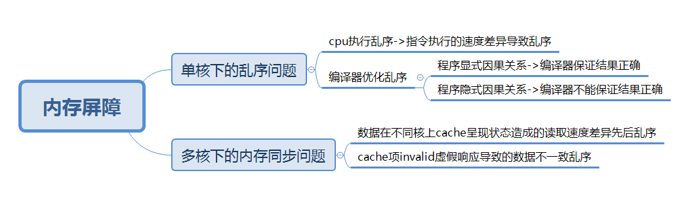
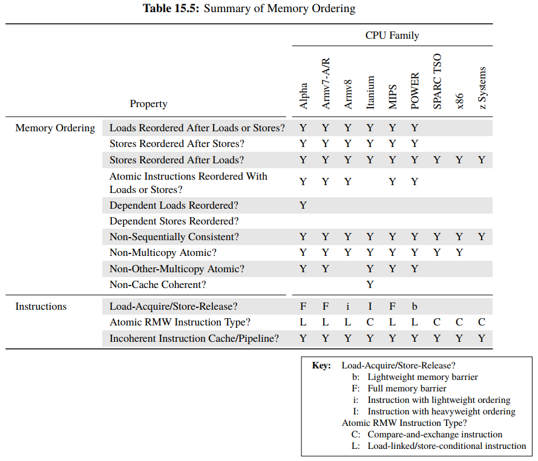
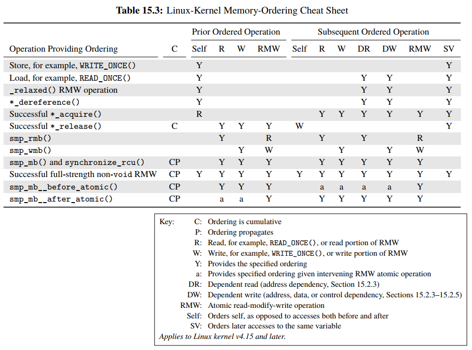
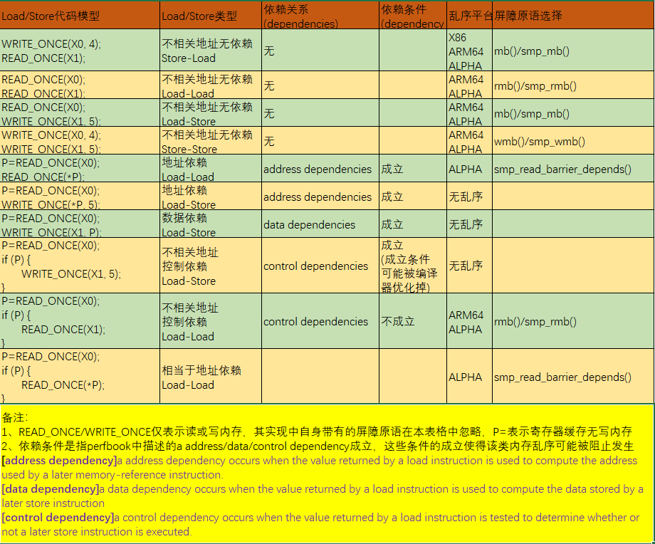
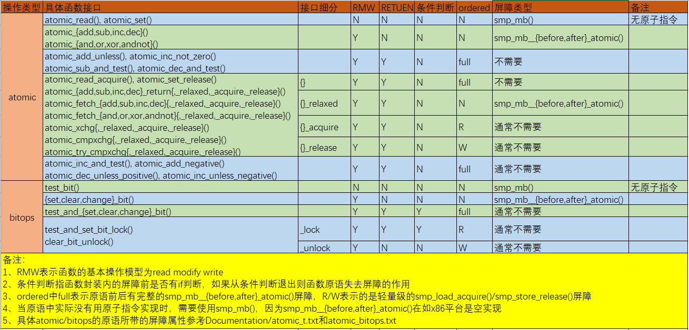

# 并��步之内存�障

基�平�：ARM64

**一��障是什么**

**1.1 为什么需�内存�障**

```
CPUs and other devices in a system can use a variety of tricks to improve performance, including reordering（乱�）, deferral（延迟） and combination（�并） of memory operations; speculative loads（�机加载）; speculative branch prediction（�机分支预测） and various types of caching（��类�的cache行为）.  Memory barriers are used to override or suppress these tricks, allowing the code to sanely control the interaction of multiple CPUs and/or devices. 
                                                ————<memory-barriers.txt>
```

乱�的直��因

�核下指令乱�：

1�编译阶段：程��存在因�关系或者存在��的因�关系，编译器优化指令顺�导致乱�

2�执行阶段：cpu内部指令�是严格串行执行，并行执行�高效�，指令执行的耗时�一致，导致指令执行时乱�

多核下内存�步：

1�速度差异：数�在��核上cache呈�状�造�的读�速度差异先�乱�

2�虚��应：cache项invalid虚��应导致的数��一致乱�



**1.2 内存�障类�**

\(1\) Write \(or store\) memory barriers.

\(2\) Data dependency barriers.

\(3\) Read \(or load\) memory barriers.

\(4\) General memory barriers.

\(5\) implicit varieties\(ACQUIRE operations/RELEASE operations\)

**1.3 乱�类�**

**1.3.1 编译乱�**

ç•¥

**1.3.2 内存乱�**

����下存在的内存乱�——\<perfbook2.pdf\>



通过对上表分类，�以总结出存在memory reordering的几�情况���平�所具备的特�：

**内存乱�类�：**

1�Load/Store Reordered After Load/Store

上表memory ordering中1\-3行，�述�相关地�的内存乱�问题

2�Atomic Instructions Reordered

上表memory ordering中第4行，"indicates whether a given CPU allows loads and stores to be reordered with atomic instructions." atomic内存访问�作和普通的load/store相互间存在乱�问题。

3�Dependent Loads/Store Reordered

上表memory ordering中5\-6行，�述两个访问地�地�间存在data/address/control dependency关系时的内存乱�问题。

4�Non\-Sequentially Consistent

上表memory ordering中第7行。暂时��解

5�Mutilcopy Atomic

上表memory ordering中8\-9行。�述��到达��cpu核的速度差异，导致内存乱�的问题。

6�Cache Coherent

上表memory ordering中第10行，暂时��解

**二�内核中�障的��**

**2.1 barrier\(\)**

**2.1.1 ����**

barrier\(\)本质是GNU C扩展汇编层�的��，以上汇编代�用�抑制编译器的优化而�生�新指令代�。

```
#define barrier() __asm__ __volatile__("": : :"memory")
```

volatile:表示指示编译器对该嵌入汇编代��进行代�优化，修改指令顺�等，\_\_asm\_\_ \_\_volatile\_\_�以用asm和volatile，为了��和C关键字��警告，最好加下划线.

memory：是GCC扩展汇编 clobber list\(破�符列表\)中的一个关键字，该列表目的是告诉编译器这段代�对�些内存产生破�修改，因此memory�义为：

1�告诉编译器该段代�会修改内存，其强制编译器在该段代���存缓存值（寄存器值），在该段代�之��新加载��（�内存中加载而�是�寄存器缓存中加载）

2�告诉编译器在该段代���，需���指令的顺�（是所有指令还是�是内存访问相关的指令？）

```
The next statement creates a special clobber to tell the compiler, that memory contents may have changed. Again, the clobber list will be explained later, when we take a look to code optimization.

It tells the compiler that the assembler instruction may change memory locations. This forces the compiler to store all cached values before and reload them after executing the assembler instructions. And it must retain the sequence, because the contents of all variables is unpredictable after executing an asm statement with a memory clobber.

                                                   ————<ARM GCC inline Assembler.pdf>
```

**2.1.2 使用场景**

1�抑制编译器造�的指令��

```
int a, b;

//以下编译器认为a/b的赋值在�线程视角下没有相关性，�能将对b的赋值早�a，因此�能造�多线程场景下的逻辑错误。
void foo(void)
{
        a = b + 1;
        b = 0;
}
//通过使用barrier�抑制这�编译造�的乱�，利用上一节中扩展汇编中memory的作用2
void foo(void)
{
        a = b + 1;
        barrier();
        b = 0;
}
```

2�抑制内存优化�并内存�作

```
int run = 1;

//如下代�在循�中判断run的值，而run�能在其他线程中被修改
void foo(void)
{
        while (run);
}
//而编译器在�线程视角下，��对run值的读�，�少内存访问是�以优化性能的，但是这�优化并�是工程师想�的
void foo(void)
{
        register int reg = run;
        if (reg) while (1);
}
//通过使用barrier，使得编译认为�次循�内存都�生�化，因此需�在�个循�中�新�内存中读�run值，这是利用了上一节扩展汇编memory的作用1
void foo(void)
{        
        while (run)
                barrier();
}
```

**2.2** **mb\(\)**

**2.2.1 ����**

�论在�核还是多核场景下，mb的��相�，基�dsb指令��

```
#define mb()            dsb(sy)
#define rmb()           dsb(ld)
#define wmb()           dsb(st)

#define dsb(opt)        asm volatile("dsb " #opt : : : "memory")
```

DSB指令作用（指令具体的影�作用范围需�决�option）：

1�确�dsb指令��的Load/Store指令内存访问�作�乱�

2�确�dsb指令�其他更多的指令被阻隔，知�dsb指令�的�步完�

3�确�dsb指令�的cache, TLB and branch predictor maintenance operations完��阻隔

```
This enforces the same ordering as the Data Memory Barrier, but has the additional effect of blocking execution of any further instructions, not just loads or stores, or both, until synchronization is complete. This can be used to prevent execution of a SEV instruction, for instance, that would signal to other cores that an event occurred. It waits until all cache, TLB and branch predictor maintenance operations issued by this processor have completed for the specified shareability domain.
                                                ————<ARM_v8_architecture_Programmer Guide v1.0.pdf>
```

**2.2.2 使用场景**

1�mb\(\)�障�显比smp\_mb\(\)覆盖的范围更广更全�，因此能使用smp\_mb\(\)的地方必然�以使用mb\(\)，但是也会因此造�对CPU性能的过度抑制。

2�内存�作的观察者涉�CPU和硬件设备（例如网络设备，DMA），需使用\[w,r\]mb\(\)，因为这�场景下�使是�核也需���内存一致性。

**2.3 smp\_mb\(\)**

**2.3.1 �核��**

在�核�SMP场景下，�障��退化为barrier\(\)

```
#define smp_mb()        barrier()
#define smp_rmb()       barrier()
#define smp_wmb()       barrier()
```

**2.3.2 多核��**

在多核SMP场景下，�障基�dmb指令��

```
#define smp_mb()        __smp_mb()
#define smp_rmb()       __smp_rmb()
#define smp_wmb()       __smp_wmb()

#define __smp_mb()      dmb(ish)
#define __smp_rmb()     dmb(ishld)
#define __smp_wmb()     dmb(ishst)

#define dmb(opt)        asm volatile("dmb " #opt : : : "memory")
```

**2.3.2 DMB指令**

1�确�dmb指令��的Load/store指令内存访问�作�乱�

2�确�dmb指令�的cache maintenance operations完��阻隔，cache指的是CPU核�内存间的cache

```
This prevents re-ordering of data accesses instructions across the barrier instruction. All data accesses, that is, loads or stores, but not instruction fetches, performed by this processor before the DMB, are visible to all other masters within the specified shareability domain before any of the data accesses after the DMB.

It also ensures that any explicit preceding data or unified cache maintenance operations have completed before any subsequent data accesses are executed.
                                                ————<ARM_v8_architecture_Programmer Guide v1.0.pdf>
```

**2.3.4 使用场景**

1��smp\_mb的���看，�表�其�有在smp多核下�有效。

2�解决多核间共享��因CPU内存乱�，造�的逻辑异常问题，这�场景下内存访问的观察者�为CPU核。利用了如上dmb指令的第一点作用。

_ARM__v8中isb/dmb/dsb指令差异_

_1�确�isb之�的指令�新预�_

_2�在硬件层�看�，执行isb之�，instruction pipeline is flushed_

_3�在如下场景下需�使用：memory management，cache control，context switching，code is moved about in memory_

**2.4 smp\_read\_barrier\_depends**

**2.4.1 ����**

�核�SMP场景

```
#define smp_read_barrier_depends()      do { } while (0)
```

多核SMP场景

```
#define smp_read_barrier_depends()      __smp_read_barrier_depends()
#define __smp_read_barrier_depends()    read_barrier_depends()

//�alpha��，本质为空��
#define read_barrier_depends() do { } while (0)
//�有alpha��定义了
#define read_barrier_depends() __asm__ __volatile__("mb": : :"memory")
```

smp\_read\_barrier\_depends\(\)被称为data dependency barrier。

smp\_read\_barrier\_depends\(\) �在linux内核中的�义是：smp\_read\_barrier\_depends�语���障�的读内存�作在�障�的读内存�作_（该读内存�作的地�或数��赖���读�作的返�值）_�完�。这是一�轻�rmb\(\)�障的�语，rmb\(\)�障对��读是�存在�赖关系并�关心，�使�者读��赖�者读的结�也能��顺�。

```
Flush all pending reads that subsequents reads depend on。
All reads preceding this primitive are guaranteed to access memory (but not necessarily other CPUs' caches) before any reads following this primitive that depend on the data return by any of the preceding reads.  This primitive is much lighter weight than rmb() on most CPUs, and is never heavier weight than is rmb().
                                    ————<arch/alpha/include/asm/barrier.h>
```

在Linux 4.14\-rc7加入的补�\<Add implicit smp\_read\_barrier\_depends\(\) to READ\_ONCE\(\)\>76ebbe78f7390aee075a7f3768af197ded1bdfbb将smp\_read\_barrier\_depends集�到READ\_ONCE\(\)�内，相应的�先使用smp\_read\_barrier\_depends\(\)的代�都使用READ\_ONCE\(\)替代，�规范这些�障�语的使用。

```
#define __READ_ONCE(x, check)                                           \
({                                                                      \
        union { typeof(x) __val; char __c[1]; } __u;                    \
        if (check)                                                      \
                __read_once_size(&(x), __u.__c, sizeof(x));             \
        else                                                            \
                __read_once_size_nocheck(&(x), __u.__c, sizeof(x));     \
        smp_read_barrier_depends(); /* Enforce dependency ordering from x */ \
        __u.__val;                                                      \
})
#define READ_ONCE(x) __READ_ONCE(x, 1)
```

**2.4.2 alpha��代���**

```
#define read_barrier_depends() __asm__ __volatile__("mb": : :"memory")
#define mb()    __asm__ __volatile__("mb": : :"memory")
#define rmb()   __asm__ __volatile__("mb": : :"memory")
#define wmb()   __asm__ __volatile__("wmb": : :"memory")
```

smp\_read\_barrier\_depends\(\)在Linux内核中的定义本应该�用�address dependences场景下使用的轻�级�障，其�能��rmb\(\)�作，在alpha中其��是等��rmb\(\)的。虽然两者��相�，但是在�相关地�load\-load乱�中还是�使用rmb\(\)，��形�上的造�混乱。

alpha��中mb指令的作用说�：

```
mb:Guarantee that all subsequent loads or stores will not access memory until after all previous loads and stores have accessed memory, as
observed by other processors.       ————<alpha_arch_ref.pdf>
```

**2.4.3** **smp\_read\_barrier\_depends****使用场景**

smp\_read\_barrier\_depends\(\)虽然被称为data dependency barrier。根�《perfbook 15.2.3节》其适用�的具体场景是地��赖关系\(Address Dependencies\)中的Load\-Load�赖。address dependency�件�立�以��除alpha外的其他所有CPU��的Load\-Load & Load\-Store�乱�，以�address dependency�能��alpha��的Load\-Store�乱�。以下是两�Address Dependenciies关系模�：

```
Load-Load                    Load-Store

//step1:��指针              //step1:��指针
Q = READ_ONCE(P);            Q = READ_ONCE(P);
//step2:读指针指�内存        //step2:写指针指�内存
D = *Q;                      WRITE_ONCE(*Q, 2)
```

在地��赖Load\-Load 模�情况下，如下示例代�会出�D==2并且Q==&B异常情况，alpha平�无法��CPU1的感知乱�，仿佛CPU1上存在Load\-Load乱�。因此需�在CPU1上的两个load之间�加读�赖�障，关�造�乱�的�因，memory\-barriers.txt中也有解释: �因为CPU��使用了machines with split caches。

```
        CPU 1                 CPU 2
        ===============       ===============
        { A == 1, B == 2, C == 3, P == &A, Q == &C }
        B = 4;
        <write barrier>
        WRITE_ONCE(P, &B);
                              Q = READ_ONCE(P);
                              D = *Q;

Note that this extremely counterintuitive situation arises most easily on machines with split caches, so that, for example, one cache bank processes even-numbered cache lines and the other bank processes odd-numbered cache lines.  The pointer P might be stored in an odd-numbered cache line, and the variable B might be stored in an even-numbered cache line.  Then, if the even-numbered bank of the reading CPU's cache is extremely busy while the odd-numbered bank is idle, one can see the new value of the pointer P (&B), but the old value of the variable B (2)
                                                    ————<memory-barriers.txt>
```

**2.4.3 关�地��赖Load\-Store�考**

在alpha平�上存在地��赖Load\-Load乱�问题，那么为何�存在Load\-Store乱�？解释如下：

```
A data-dependency barrier is not required to order dependent writes because the CPUs that the Linux kernel supports don't do writes until they are certain (1) that the write will actually happen, (2) of the location of the write, and (3) of the value to be written. �有确定的写入地�和写入值�会执行写�作。
                                                ————<memory-barriers.txt>
```

**2.5 ACQUIRE/RELEASE��内存�障**

��内存�障本质上�装了��的\[r,w\]mb\(\)等，其�能�是完整的memory barrier，具体�决�其��。

**2.5.1 ACQUIRE operations**

1�smp\_load\_acquire\(\)/smp\_cond\_acquire\(\)通用��

```
#define smp_load_acquire(p) __smp_load_acquire(p)
#define __smp_load_acquire(p)                                           \
({                                                                      \
        typeof(*p) ___p1 = READ_ONCE(*p);                               \
        compiletime_assert_atomic_type(*p);                             \
        __smp_mb();                                                     \
        ___p1;                                                          \
})
```

2�内核中的��lock\(\)�作

**2.5.2 RELEASE operations**

1�smp\_store\_release\(\)通用��

```
#define smp_store_release(p, v) __smp_store_release(p, v)
#define __smp_store_release(p, v)                                       \
do {                                                                    \
        compiletime_assert_atomic_type(*p);                             \
        __smp_mb();                                                     \
        WRITE_ONCE(*p, v);                                              \
} while (0)
```

2�内核中的��unlock\(\)�作

**2.5.3 smp\_load\_acquire\(\)/smp\_store\_release\(\)说�**

在Load\-Store乱�情况下使用smp\_mb\(\)是一个比较�的�作，在很多��下有更轻�级方法。因此引入smp\_load\_acquire\(\)/smp\_store\_release\(\)�����平�差异化优化。

smp\_load\_acquire\(\)：���语�的Load��语�的Load/Store�乱�

smp\_store\_release\(\)：���语�的Load/Store��语�的Store�乱�

```
A number of situations currently require the heavyweight smp_mb(), even though there is no need to order prior stores against later  loads.  Many architectures have much cheaper ways to handle these situations, but the Linux kernel currently has no portable way to make use of them.
The new smp_load_acquire() primitive orders the specified load against any subsequent reads or writes, while the new smp_store_release()  primitive orders the specifed store against any prior reads or writes.
```

具体�考：\<arch: Introduce smp\_load\_acquire\(\), smp\_store\_release\(\)\> 47933ad41a86a4a9b50bed7c9b9bd2ba242aac63

**2.5.4 ARM64中ldar/stlr说�**

```
An LDAR instruction guarantees that any memory access instructions after the LDAR, are only visible after the load-acquire. A store-release guarantees that all earlier memory accesses are visible before the store-release becomes visible and that the store is visible to all parts of the system capable of storing cached data at the same time.
```

**2.6 smp\_mb\_\_before/after\_atomic**

**2.6.1 ����**

�核�SMP场景

```
#define smp_mb__before_atomic() barrier()
#define smp_mb__after_atomic()  barrier()
```

多核SMP场景

```
#define smp_mb__before_atomic() __smp_mb__before_atomic()
#define smp_mb__after_atomic()  __smp_mb__after_atomic()

//内核默认��，如ARM64平�存在这类乱�
#define __smp_mb__before_atomic()       __smp_mb()
#define __smp_mb__after_atomic()        __smp_mb()

//x86�存在这类乱�，所以是空��
/* Atomic operations are already serializing on x86 */
#define __smp_mb__before_atomic()       do { } while (0)
#define __smp_mb__after_atomic()        do { } while (0)
```

**2.6.2 应用场景**

smp\_mb\_\_before/after\_atomic用�抑制atomic指令�load/store内存指令间存在的乱�问题，有些CPU���存在这�乱�问题，因此引入该�障�语，���有在乱�平���入�障指令。commit:febdbfe8a91ce0d11939d4940b592eb0dba8d663

**2.7Â** **smp\_mb\_\_after\_spinlock**

**2.7.1 ����**

```
//默认��
#define smp_mb__after_spinlock()        do { } while (0)

//arm64/powerpc/riscv
#define smp_mb__after_spinlock()        smp_mb()
```

**2.7.2 应用场景**

spin\_lock/unlock\(\)在代���上是带有acquire/release�语，如上一节该�语在��的��平�上���一，有些��平�使用的是�完整的轻�级的�障指令，在�些情况下，这些�完整的�障�语并�能完全���乱�。具体情况�考3.4节��平�特�表格。

案例1：spin\_lock\(S\)并�能����的WRITE\_ONCE\(X, 1\)�乱�到���，因此需��加一个完整�障

案例2：类似�\<perfbook2\>中的Listing 15.16，在non\-multilecopy\-atomic的情况下，由�spin\_lock\(S\)�acquire并�具备Cumulativity/Propagation，因此需��加一个完整的�障��CPU1读X时，CPU2也能��到X最新值。    

```
*   1) Given the snippet:
*
*        { X = 0;  Y = 0; }
*
*        CPU0                          CPU1
*
*        WRITE_ONCE(X, 1);             WRITE_ONCE(Y, 1);
*        spin_lock(S);                 smp_mb();
*        smp_mb__after_spinlock();     r1 = READ_ONCE(X);
*        r0 = READ_ONCE(Y);
*        spin_unlock(S);

*   2) Given the snippet:
*
*  { X = 0;  Y = 0; }
*
*  CPU0                CPU1                            CPU2
*
*  spin_lock(S);       spin_lock(S);                   r1 = READ_ONCE(Y);
*  WRITE_ONCE(X, 1);   smp_mb__after_spinlock();       smp_rmb();
*  spin_unlock(S);     r0 = READ_ONCE(X);              r2 = READ_ONCE(X);
*                      WRITE_ONCE(Y, 1);
*                      spin_unlock(S);
```

**2.8 内核�障��特�总结**



**三�内存�障总结**

3.1 编译器优化

**3.2 CPU内存乱�（�相关地��地��赖关系）**




**3.3 CPU****内存乱�\(atomic指令�load/store间乱�\)**

****

**3.4 内存乱�\(��平�acquire�语��差异而引入的smp\_mb\_\_after\_spinlock一览表\)**


**3.5 ����的内存乱�特�补充表格**


**四��考资料：**

Documentation/memory\-barriers.txt

[https://yq.aliyun.com/articles/337916](https://yq.aliyun.com/articles/337916)

[https://cloud.tencent.com/developer/article/1006236](https://cloud.tencent.com/developer/article/1006236)

[http://www.wowotech.net/kernel\_synchronization/Why\-Memory\-Barriers.html/comment\-page\-2\#comments](http://www.wowotech.net/kernel_synchronization/Why-Memory-Barriers.html/comment-page-2#comments)
