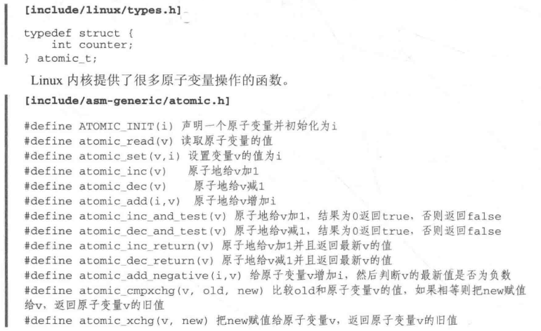
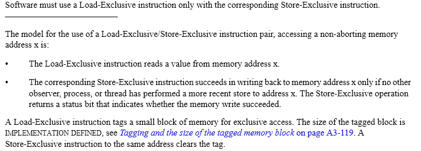
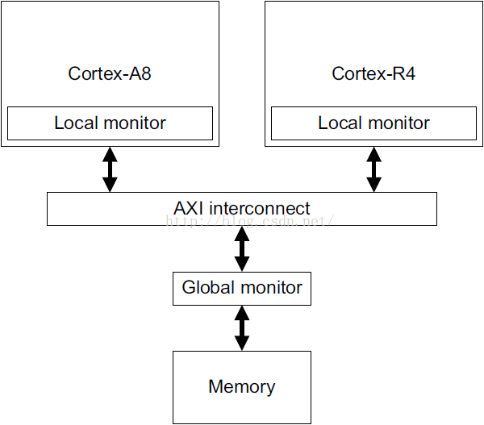
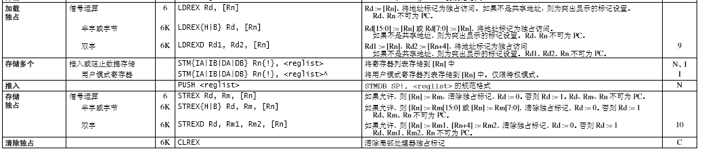
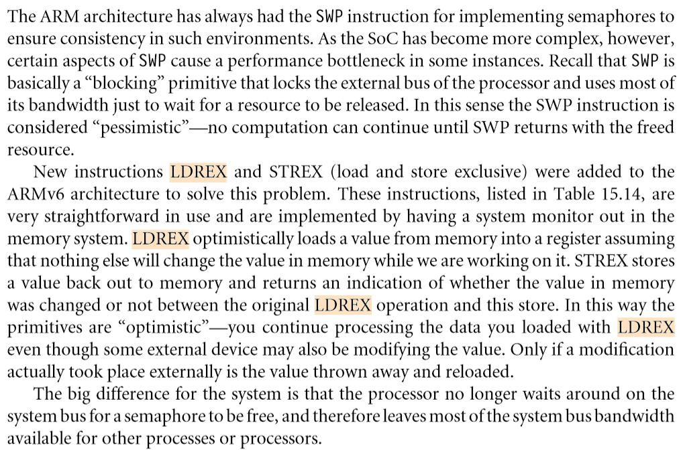
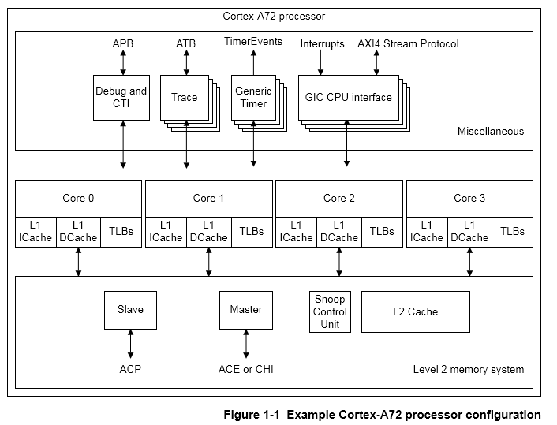

# 并发同步之原子变量

atomic API



```
174 typedef struct {
175 ▼       int counter;
176 } atomic_t;

41 #define ATOMIC_OP(op, c_op, asm_op)▼    ▼       ▼       ▼       ▼       \
42 static inline void atomic_##op(int i, atomic_t *v)▼     ▼       ▼       \
43 {▼      ▼       ▼       ▼       ▼       ▼       ▼       ▼       ▼       \
44 ▼       unsigned long tmp;▼     ▼       ▼       ▼       ▼       ▼       \
45 ▼       int result;▼    ▼       ▼       ▼       ▼       ▼       ▼       \
46 ▼       ▼       ▼       ▼       ▼       ▼       ▼       ▼       ▼       \
47 ▼       prefetchw(&v->counter);▼▼       ▼       ▼       ▼       ▼       \
48 ▼       __asm__ __volatile__("@ atomic_" #op "\n"▼      ▼       ▼       \
49 "1:▼    ldrex▼  %0, [%3]\n"▼    ▼       ▼       ▼       ▼       ▼       \  //加载独占指令，标记独占
50 "▼      " #asm_op "▼    %0, %0, %4\n"▼  ▼       ▼       ▼       ▼       \  //asm_op => and、 or、 xor等
51 "▼      strex▼  %1, %0, [%3]\n"▼▼       ▼       ▼       ▼       ▼       \  //存储独占指令，如果允许，则 [Rn] := Rm，
                                                                                //清除独占标记，Rd := 0。否则 Rd := 1。Rd、Rm、Rn 不可为 PC
52 "▼      teq▼    %1, #0\n"▼      ▼       ▼       ▼       ▼       ▼       \
53 "▼      bne▼    1b"▼    ▼       ▼       ▼       ▼       ▼       ▼       \
54 ▼       : "=&r" (result), "=&r" (tmp), "+Qo" (v->counter)▼      ▼       \
55 ▼       : "r" (&v->counter), "Ir" (i)▼  ▼       ▼       ▼       ▼       \
56 ▼       : "cc");▼       ▼       ▼       ▼       ▼       ▼       ▼       \
57 }▼      ▼       ▼       ▼       ▼       ▼       ▼       ▼       ▼       \

230 #define ATOMIC_OPS(op, c_op, asm_op)▼   ▼       ▼       ▼       ▼       \
231 ▼       ATOMIC_OP(op, c_op, asm_op)▼    ▼       ▼       ▼       ▼       \
232 ▼       ATOMIC_OP_RETURN(op, c_op, asm_op)▼     ▼       ▼       ▼       \
233 ▼       ATOMIC_FETCH_OP(op, c_op, asm_op)
234
235 ATOMIC_OPS(add, +=, add)
236 ATOMIC_OPS(sub, -=, sub)
237
238 #define atomic_andnot atomic_andnot
239
240 #undef ATOMIC_OPS
241 #define ATOMIC_OPS(op, c_op, asm_op)▼   ▼       ▼       ▼       ▼       \
242 ▼       ATOMIC_OP(op, c_op, asm_op)▼    ▼       ▼       ▼       ▼       \
243 ▼       ATOMIC_FETCH_OP(op, c_op, asm_op)
244
245 ATOMIC_OPS(and, &=, and)
246 ATOMIC_OPS(andnot, &= ~, bic)
247 ATOMIC_OPS(or,  |=, orr)
248 ATOMIC_OPS(xor, ^=, eor)
```





ARM架构下实现原子独占同步的指令LDREX, STREX，此处的EX表示 Exclusive，独占的意思。



在更加复杂的系统中，LDREX STREX指令比SWP指令实现原子同步，性能上更好。因为SWP指令会锁住处理器的外部总线并且占据所有的总线带宽，仅仅是为了等待共享资源的释放，如果在SMP系统上， 对外部总线的锁住，会较大影响其他核对内存的访问，LDREX STREX可以较好的解决这个问题。



LDREX

LDREX 可从内存加载数据。

    \* 如果物理地址有共享 TLB 属性，则 LDREX 会将该物理地址标记为由当前处理器独占访问，并且会清除该处理器对其他任何物理地址的任何独占访问标记。

    \* 否则，会标记：执行处理器已经标记了一个物理地址，但访问尚未完毕。

    总结：共享 TLB 属性\-\-》应该是指cpu共享内存？？

STREX

STREX 可在一定条件下向内存存储数据。 条件具体如下：

    \* 如果物理地址没有共享 TLB 属性，且执行处理器有一个已标记但尚未访问完毕的物理地址，那么将会进行存储，清除该标记，并在 Rd 中返回值 0。

    \* 如果物理地址没有共享 TLB 属性，且执行处理器也没有已标记但尚未访问完毕的物理地址，那么将不会进行存储，而会在 Rd 中返回值 1。

    \* 如果物理地址有共享 TLB 属性，且已被标记为由执行处理器独占访问，那么将进行存储，清除该标记，并在 Rd 中返回值 0。

    \* 如果物理地址有共享 TLB 属性，但没有标记为由执行处理器独占访问，那么不会进行存储，且会在 Rd中返回值 1。

多核处理器，每个核拥有自己的TLB、MMU、以及L1 cache                                                                                                                                                                                                                                                                                               


