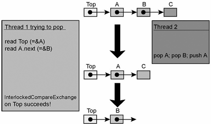

# 并��步之无�编程

**一� 无�编程介�**

**1.1 无�编程 / lock\-free / �阻��步**

无�编程，��使用�的情况下��多线程之间的���步，也就是在没有线程被阻�的情况下����的�步，所以也��阻��步（Non\-blocking Synchronization）。���阻��步的方案称为“无�编程算法�（ Non\-blocking algorithm）。

lock\-free是目�最常�的无�编程的��级别（一共三�级别，最新perfbook中有列出七个级别）。

**1.2 无é”�编程分级Â** 

��步阻�的���以分�三个级别：wait\-free/lock\-free/obstruction\-free。

**wait\-free**

是最�想的模�，整个�作���个线程在有�步骤下完�。��系统级��（system\-wide throughput）以�无线程饥饿。截止2011年，没有多少具体的��。�使��了，也需��赖�具体CPU。

**lock\-free**

�许个别线程饥饿，但��系统级��。确�至少有一个线程能够继续执行。wait\-free的算法必定也是lock\-free的。

**obstruction\-free**

在任何时间点，一个线程被隔离为一个事务进行执行（其他线程suspended），并且在有�步骤内完�。在执行过程中，一旦��数�被修改（采用时间戳�版本�），则�滚。也���观�，��观并��制\(OOC\)。事务的过程是：1读�，并写时间戳；2准备写入，版本校验；3校验通过则写入，校验�通过，则�滚。lock\-free必定是obstruction\-free的。

**1.3 为何需�non\-block sync**

使用lock��线程�步有很多缺点：

\* 产生�争时，线程被阻�等待，无法�到线程�时�应。

\* dead lock。

\* live lock。

\* 优先级翻转。

\* 使用�当，造�性能下�。

如�在�使用 lock 的情况下，�����步，那就会��很多问题。虽然目��看，无�编程并�能替代 lock。

**三�内核无�编程的几���**

**3.1 �指针无�**

**3.1.1 �指针无���模�**

```
    thread 1                              thread 2
    --------------------------------      ------------------------
    a.x = 1;
    //写�障抑制�相关地�的store-store乱�
    smp_wmb(); 
    //WRITE_ONCE抑制store tearing
    WRITE_ONCE(message, &a);              datum = READ_ONCE(message); //READ_ONCE抑制load tearing
                                          smp_rmb();  //存在相关地��赖load-load，使用读�赖�障��
                                          if (datum != NULL)
                                            printk("%x\n", datum->x);
```

�模���看，�rcu无�机制�常类似，其特�如下：

1�由�写端数�更新时，�需更新全局指针message，因此多个写端�以�入而�需��外的��护，但是��rcu有�装好的机制写端�以释放旧的数�

2�类似rcu读端�以并�，但是�有的数��能是旧的数�

3�写端�具备对旧数��收处�能力

**3.1.2 �指针无�使用场景**

1）ring buffer 方案

ring buffer 中�一项往往都指�其他的数�，一般�说还会有一些 head/tail 的信�都是指� ring buffer 中�个�置的索引。给 ring buffer 填数�的一方（producer）会使用 store\-release �作，这样就能� consumer（读� ring buffer 中的数�的一方）确��步。

2）RCU的��

在 compiler 看�，我们熟悉的 rcu\_dereference\(\) 和 rcu\_assign\_pointer\(\) API 跟 load\-acquire 和 store\-release �作是一个效�。得益�除了 Alpha 以外的其他处�器中都具有的一些特性，rcu\_dereference\(\) 就�以被直�编译�普通的 load �作，此时 rcu\_assign\_pointer\(\) �然跟 rcu\_dereference\(\)�作是确��步的，就好�它还是一个 load\-acquire �作一样。

关�rcu�无�的关系：

\* Read\-copy\-update with a single writer and any number of readers. \(The readers are wait\-free; the writer is usually lock\-free, until it needs to reclaim memory\).

\* Read\-copy\-update with multiple writers and any number of readers. \(The readers are wait\-free; multiple writers generally serialize with a lock and are not obstruction\-free\).

3）将指针写入数组时

在下�的 KVM 代�中（简写过的），写端通过修改�指令修改kvm\-\>online\_vcpus进行更新�作，考虑到其更新时是需�多步�作，因此该场景无�状�下�能有�个写，�以有多个读并�。

```
    kvm_vm_ioctl_create_vcpu()                     kvm_get_vcpu()
    -----------------------------------------      -----------------------------------------------
    kvm->vcpus[kvm->online_vcpus] = vcpu;          if (idx < smp_load_acquire(&kvm->online_vcpus))
    smp_store_release(&kvm->online_vcpus,            return kvm->vcpus[idx];
                      kvm->online_vcpus + 1);      return NULL;
```

**3.2 seqcount无�**

**3.2.1 seqcount无���模�**

```
    thread 1 (buggy writer)             thread 2 (buggy reader)
    --------------------------------    ------------------------
    WRITE_ONCE(sc, sc + 1);             do {
    smp_store_release(&data.x, 123);        old = smp_load_acquire(&sc) & ~1;
    WRITE_ONCE(data.y, 456);                copy.y = READ_ONCE(data.y);
    smp_store_release(&sc, sc + 1);         copy.x = smp_load_acquire(&data.x);
                                        } while(READ_ONCE(sc) != old);
```

seqcount无�本质上是通过seqcount的奇�性�表�当�缓存中的数�是�完整，而读端通过多次循��试�判断seqcount的奇��确认当�数�是�完整。seqcount本身的更新读�是�指令�作，且需�使用WRITE\_ONCE/READ\_ONCE�抑制store/load tearing问题。这类无���具备如下特�：

1�在无�外��护的情况下，写端�能并�，并��能造�数�混乱，读端�以并�

2�读端需�使用多次�试�判断当�数�是�完整，因此读端耗时长，且�会阻�写端

3�该�����生产者多消费者模�

**3.2.2 seqcount无�使用场景**

Linux内核中seqlock�基�此����。

**3.3 Sleep/wake\-up synchronization无�**

**3.3.1 Sleep/wake\-up synchronization��模�**

```
thread 1                               thread 2
-------------------                    --------------------------
WRITE_ONCE(dont_sleep, 1);             if (!READ_ONCE(dont_sleep)) {
smp_mb();                                WRITE_ONCE(wake_me, 1);
if (READ_ONCE(wake_me))                  smp_mb();
    wake(thread2);                       if (!READ_ONCE(dont_sleep))
                                           sleep();
                                       }
```

1�"two thread and two flags" 模�（��个线程�一个 flag 写入�并��一个 flag 读�）

2�如上通过�加对两个flag的判断：�以����如上thread1先�行，那么thread2必然�会�进入休眠；

3�如上代�thread2中，如�READ\_ONCE\(dont\_sleep\)和在sleep\(\)间被打断，则�能出�thread1先执行wake，thread2�sleep。那么�����的�述正确，那么需��定thread1的wake�会丢失。

存在问题的模�：

```
thread 1                               thread 2
-------------------                    --------------------------
if (READ_ONCE(wake_me)) {                WRITE_ONCE(wake_me, 1);
    WRITE_ONCE(wake_me, 0);              sleep();
    wake(thread2);
}
```

以上简�的唤醒模�存在问题：

1�如�thread2在WRITE\_ONCE\(\)和sleep\(\)之间被thread1打断，则存在missd wakeup（错过唤醒问题）

2�如�thread1在if处�和WRITE\_ONCE\(\)之间被打断，则wake\_me会由1��0，导致

**3.3.2  Sleep/wake\-up synchronization 使用场景**

内核中很多这�场景使用，例如：

1）workqueue 使用这个方��决定是�有更多的工作需� worker ��。这�情况下，thread 1 的角色就被�� insert\_work\(\)，而 thread 2 则�� wq\_worker\_sleeping\(\)。

2）在 futex\(\)系统调用中，thread 1 的 write 是在 user space �生的，而 memory barrier 和 read �作则是 futex\(FUTEX\_WAKE\)内部��的。thread 2 的�作就完全是 futex\(FUTEX\_WAIT\)的一部分（因为 wake\_me 是 kernel memory 中的一个 flag\)；FUTEX\_WAIT 会使用 futex 的预期值作为系统调用的�数，并用它�决定是� sleep。关�这里具体是如何生效的，�以�� kernel/futex.c 文件开头的长长的注释。

**3.4 CAS\(swap and store\)无���**

**3.4.1 CAS无���模�**

多消费者多

```
//消费者
struct llist_node *llist_del_first(struct llist_head *head)
{
        struct llist_node *entry, *old_entry, *next;
        entry = smp_load_acquire(&head->first);
        for (;;) {
                if (entry == NULL)
                        return NULL;
                old_entry = entry;
                next = READ_ONCE(entry->next);
                entry = cmpxchg(&head->first, old_entry, next);
                if (entry == old_entry)
                        break;
        }
        return entry;
}

//生产者
static inline bool llist_add(struct llist_node *new, struct llist_head *head)
{
        return llist_add_batch(new, new, head);
}
bool llist_add_batch(struct llist_node *new_first, struct llist_node *new_last, struct llist_head *head)
{
        struct llist_node *first;

        do {
                new_last->next = first = ACCESS_ONCE(head->first);
        } while (cmpxchg(&head->first, first, new_first) != first);

        return !first;
}
```

1�llist\_del\_first\(\)为 llist ��了 LIFO （last in first out）的语义。如�需� FIFO 顺�，�以使用 llist\_reverse\_order\(\)���。

2�如上模�当存在多消费者并�会造�ABA问题，上��链表中如�出�ABA问题，其过程如下：



（1）消费者线程thread 1�试pop出元素，需先拿到A.next作为pop�作的一部分，此时链表状��上图最上

（2）消费者线程thread 2抢�thread 1，完�pop A；pop B；push A三个动作（�概�特殊情况）�线程退出 ，此时链表状��上图中间

（3）消费者线程thread 1��步骤\(1\)继续�行。此时其�有的A.next等�&B，由�当�链表head\-\>first�然是&A，其并未��链表A.next已�生�化为&C，所以其将head\-\>first错误设定为&B，链表状��上图最下

（4）最终结�导致链表head\-\>first错误造�异常

```
ABA问题：
* 在多线程场景下CAS会出�ABA问题，关�ABA问题这里简�科普下，例如有2个线程�时对�一个值(�始值为A)进行CAS�作，这三个线程如下
    * 1.线程1，期望值为A，欲更新的值为B
    * 2.线程2，期望值为A，欲更新的值为B
* 线程1抢先�得CPU时间片，而线程2因为其他�因阻�了，线程1�值�期望的A值比较，��相等然�将值更新为B，然�这个时候出�了线程3，期望值为B，欲更新的值为A，线程3�值�期望的值B比较，��相等则将值更新为A，此时线程2�阻�中��，并且�得了CPU时间片，这时候线程2�值�期望的值A比较，��相等则将值更新为B，虽然线程2也完�了�作，但是线程2并�知�值已��过了A->B->A的�化过程。
* 解决方法： 在����加上版本�，�次��更新的时候��的版本�都+1，�A->B->A就��了1A->2B->3A。
```

**3.4.2 CAS无�使用场景**

**四�内核无�编程性能�讨**

关�无��有�的结论：对� CAS ��的硬件级的互斥，其�次�作性能比相��件下的应用层的较为高效，但当多个线程并�时，硬件级的互斥引入的代价�应用层的�争用�样令人惋惜，多线程下的无�编程无优势。因此如�纯粹希望通过使用 CAS 无�算法�相关数�结�而带�程�性能的大���是��能的，硬件级���作使应用层�作�慢，而且无法�度优化。相�通过对有�多线程程�的良好设计，�以使程�性能没有任何下�，�以��高度的并�性。

�考资料

1�\<Lockless algorithms for mere mortals\>

�文： [https://lwn.net/Articles/827180/](https://lwn.net/Articles/827180/)

译文：[https://blog.csdn.net/Linux\_Everything/article/details/107852904?spm=1001.2101.3001.6650.7&utm\_medium=distribute.pc\_relevant.none\-task\-blog\-2%7Edefault%7EBlogCommendFromBaidu%7Edefault\-7\-107852904\-blog\-114609710.pc\_relevant\_antiscanv4&depth\_1\-utm\_source=distribute.pc\_relevant.none\-task\-blog\-2%7Edefault%7EBlogCommendFromBaidu%7Edefault\-7\-107852904\-blog\-114609710.pc\_relevant\_antiscanv4&utm\_relevant\_index=14](https://blog.csdn.net/Linux_Everything/article/details/107852904?spm=1001.2101.3001.6650.7&utm_medium=distribute.pc_relevant.none-task-blog-2%7Edefault%7EBlogCommendFromBaidu%7Edefault-7-107852904-blog-114609710.pc_relevant_antiscanv4&depth_1-utm_source=distribute.pc_relevant.none-task-blog-2%7Edefault%7EBlogCommendFromBaidu%7Edefault-7-107852904-blog-114609710.pc_relevant_antiscanv4&utm_relevant_index=14)

2�\<An introduction to lockless algorithms\>  

�文：[https://lwn.net/Articles/844224/](https://lwn.net/Articles/844224/)

译文：[https://mp.weixin.qq.com/s?\_\_biz=Mzg2MjE0NDE5OA%3D%3D&chksm=ce0d14e5f97a9df3953a654e9b1f62ca4ddffc6223938f6699e0aae204b07a4c7594fa6876e1&idx=1&mid=2247485260&scene=21&sn=53a2f393565a1fa7284916166ee06c8c\#wechat\_redirect](https://mp.weixin.qq.com/s?__biz=Mzg2MjE0NDE5OA%3D%3D&chksm=ce0d14e5f97a9df3953a654e9b1f62ca4ddffc6223938f6699e0aae204b07a4c7594fa6876e1&idx=1&mid=2247485260&scene=21&sn=53a2f393565a1fa7284916166ee06c8c#wechat_redirect)

3�\<Lockless patterns: relaxed access and partial memory barriers\>

�文：[https://lwn.net/Articles/846700/](https://lwn.net/Articles/846700/)

译文：[https://mp.weixin.qq.com/s?\_\_biz=Mzg2MjE0NDE5OA%3D%3D&chksm=ce0d14caf97a9ddc0f45816ce165d44b5e7a92f458c3fa7a2df781ccc9aae8ceb290e151673f&idx=1&mid=2247485283&scene=21&sn=c73f689906feb30f3f42c7b3a1e4b67c\#wechat\_redirect](https://mp.weixin.qq.com/s?__biz=Mzg2MjE0NDE5OA%3D%3D&chksm=ce0d14caf97a9ddc0f45816ce165d44b5e7a92f458c3fa7a2df781ccc9aae8ceb290e151673f&idx=1&mid=2247485283&scene=21&sn=c73f689906feb30f3f42c7b3a1e4b67c#wechat_redirect)

4�\<Lockless patterns: full memory barriers\>

�文：[https://lwn.net/Articles/847481/](https://lwn.net/Articles/847481/)

译文：[https://mp.weixin.qq.com/s?\_\_biz=Mzg2MjE0NDE5OA%3D%3D&chksm=ce0d142df97a9d3b38c65d66e757c606f0f8f17f9f6a0b037c68b6ddea7202e56587e0e08ebb&idx=1&mid=2247485316&scene=21&sn=82d4852102e3e63f63a16e8a7952289d\#wechat\_redirect](https://mp.weixin.qq.com/s?__biz=Mzg2MjE0NDE5OA%3D%3D&chksm=ce0d142df97a9d3b38c65d66e757c606f0f8f17f9f6a0b037c68b6ddea7202e56587e0e08ebb&idx=1&mid=2247485316&scene=21&sn=82d4852102e3e63f63a16e8a7952289d#wechat_redirect)

5�\<Lockless patterns: an introduction to compare\-and\-swap\>

�文：[https://lwn.net/Articles/847973/](https://lwn.net/Articles/847973/)

译文：[https://blog.csdn.net/Linux\_Everything/article/details/115315107?utm\_medium=distribute.pc\_relevant.none\-task\-blog\-2~default~baidujs\_title~default\-0\-115315107\-blog\-115018919.pc\_relevant\_antiscanv4&spm=1001.2101.3001.4242.1&utm\_relevant\_index=3](https://blog.csdn.net/Linux_Everything/article/details/115315107?utm_medium=distribute.pc_relevant.none-task-blog-2~default~baidujs_title~default-0-115315107-blog-115018919.pc_relevant_antiscanv4&spm=1001.2101.3001.4242.1&utm_relevant_index=3)

6�\<Lockless patterns: some final topics\>

�文：[https://lwn.net/Articles/850202/](https://lwn.net/Articles/850202/)

译文：[https://blog.csdn.net/Linux\_Everything/article/details/115774610?utm\_medium=distribute.pc\_relevant.none\-task\-blog\-2~default~baidujs\_title~default\-8\-115774610\-blog\-114609710.pc\_relevant\_antiscanv4&spm=1001.2101.3001.4242.5&utm\_relevant\_index=11](https://blog.csdn.net/Linux_Everything/article/details/115774610?utm_medium=distribute.pc_relevant.none-task-blog-2~default~baidujs_title~default-8-115774610-blog-114609710.pc_relevant_antiscanv4&spm=1001.2101.3001.4242.5&utm_relevant_index=11)

7�\<Lockless patterns: more read\-modify\-write operations\>

�文：[https://lwn.net/Articles/849237/](https://lwn.net/Articles/849237/)

8�[https://www.cnblogs.com/gaochundong/p/lock\_free\_programming.html](https://www.cnblogs.com/gaochundong/p/lock_free_programming.html)

9�[https://www.cnblogs.com/caca/p/lock\-free\_CAS\_ABA.html](https://www.cnblogs.com/caca/p/lock-free_CAS_ABA.html)
