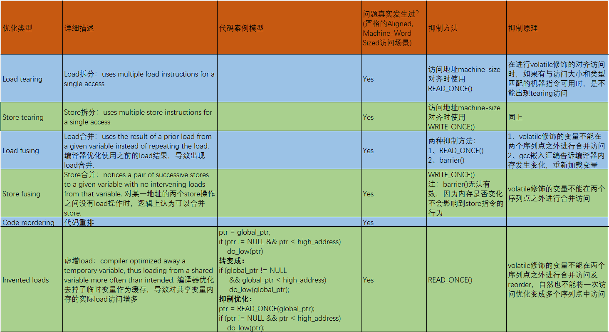
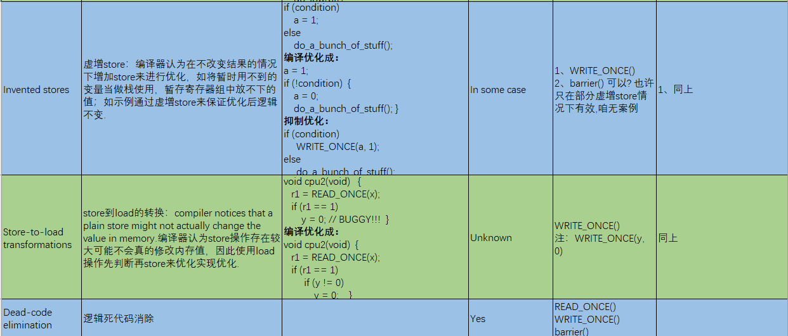
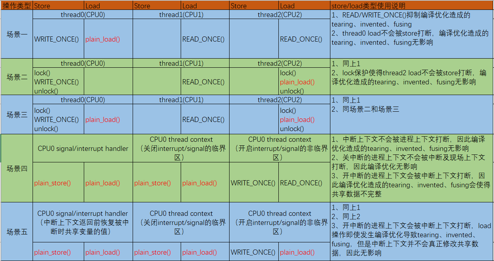

# 并发同步之编译优化

**一、编译优化**

编译器保证在单线程逻辑正确的前提下，尽可能的优化达到性能的提升；这些优化在单线程下逻辑正确，但是在并发场景下可能会存在各种并发问题。

**二、编译优化的类型及总结**

**三、编译优化导致的store/load原语选择**

对于共享变量使用的场景，有的store/load需要使用READ/WRITE\_ONCE\(\)来避免编译优化造成的同步问题，有的情况则可以不考虑编译优化带来的问题可以使用纯粹的（plain）store/load指令，如下是几种共享变量使用场景中针对编译优化问题所选择不同的原语：

**四、参考资料**

1、[https://lwn.net/Articles/793253](https://lwn.net/Articles/793253)

2、《perfbook\-e2》4.3.4 Accessing Shared Variables

3、[https://blog.csdn.net/Linux\_Everything/article/details/97856909?ops\_request\_misc=%257B%2522request%255Fid%2522%253A%2522165683656216781647546634%2522%252C%2522scm%2522%253A%252220140713.130102334.pc%255Fblog.%2522%257D&request\_id=165683656216781647546634&biz\_id=0&utm\_medium=distribute.pc\_search\_result.none\-task\-blog\-2~blog~first\_rank\_ecpm\_v1~rank\_v31\_ecpm\-4\-97856909\-null\-null.185](https://blog.csdn.net/Linux_Everything/article/details/97856909?ops_request_misc=%257B%2522request%255Fid%2522%253A%2522165683656216781647546634%2522%252C%2522scm%2522%253A%252220140713.130102334.pc%255Fblog.%2522%257D&request_id=165683656216781647546634&biz_id=0&utm_medium=distribute.pc_search_result.none-task-blog-2~blog~first_rank_ecpm_v1~rank_v31_ecpm-4-97856909-null-null.185)^v2^control&utm\_term=%E7%BC%96%E8%AF%91&spm=1018.2226.3001.4450
