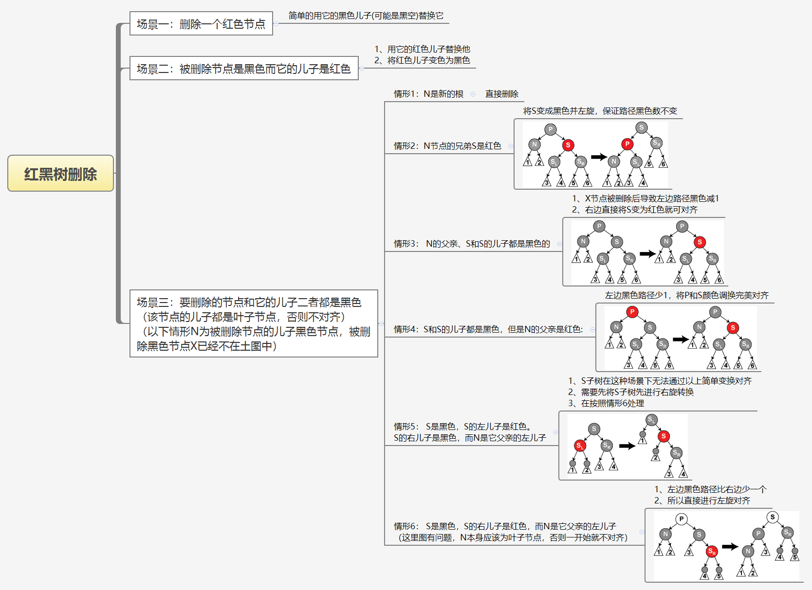

# 数据结构之红黑树

[https://zh.wikipedia.org/zh\-hans/%E7%BA%A2%E9%BB%91%E6%A0%91](https://zh.wikipedia.org/zh-hans/%E7%BA%A2%E9%BB%91%E6%A0%91)

**一、红黑树特征**

1、一种自平衡二叉查找树，是在计算机科学中用到的一种数据结构，典型的用途是实现关联数组，存储有序的数据（vma的地址，cfs的vtime）。

2、 对插入时间、删除时间和查找时间提供了最好可能的最坏情况担保。在实时应用中有价值。

3、恢复红黑树的性质需要颜色变更（实际是非常快速的）和不超过三次树旋转（对于插入操作是两次）。

**二、红黑树总结**

1、红黑树的插入操作是在最底层叶子节点处插入。

2、被插入节点的初始颜色定义为红色，因为如果定义为黑色，则会使得父节点到任意子节点的黑色数量不一致。

3、如果插入节点的父节点如果是黑色，则可以直接插入，因为这样不会违反任何一条规则。

4、如果插入节点的父节点是红色，则会造成存在连续的两个红节点，需要进行旋转和变色来满足要求。

5、红黑树的删除操作是删除任意节点，所以比插入操作复杂。

6、nil叶子"或"空（null）叶子"，它不包含数据而只充当树在此结束的指示。

7、如果需要删除的节点有两个儿子，那么问题可以被转化成删除另一个只有一个儿子的节点的问题（为了表述方便，这里所指的儿子，为非叶子节点的儿子）。对于二叉查找树，在删除带有两个非叶子儿子的节点的时候，我们要么找到它左子树中的最大元素、要么找到它右子树中的最小元素，并把它的值转移到要删除的节点中。左子树的最大元素最多只有左孩子节点，而右子树的最小元素最多只有一个右孩子节点。那么转换之后问题就变成如何删除最多有一个儿子的节点的问题。

8、在第7点的前提下，如果被删除的节点是红色，那么可以直接用其孩子节点替换它。

9、另一种简单情况是在被删除节点是黑色而它的儿子是红色的时候。如果只是去除这个黑色节点，用它的红色儿子顶替上来的话，会破坏性质5，但是如果我们重绘它的儿子为黑色，则曾经通过它的所有路径将通过它的黑色儿子。

**三、红黑树插入归类**


**四、红黑树删除归类**

以下场景前提是，删除任意节点（可能有两个儿子节点）的问题被转换成删除只有一个儿子节点的问题。以下图中被删除节点X只有一个儿子节点N。



**五、内核代码分析**

```
struct rb_node {
        unsigned long  __rb_parent_color;  //同时存放父节点的地址和当前节点的颜色，最低bit表示红黑色
        struct rb_node *rb_right;
        struct rb_node *rb_left;
} __attribute__((aligned(sizeof(long))));

#define RB_RED          0
#define RB_BLACK        1
```

```
static inline void rb_set_parent(struct rb_node *rb, struct rb_node *p)
{
        rb->__rb_parent_color = rb_color(rb) | (unsigned long)p;
}

static inline void rb_set_parent_color(struct rb_node *rb,
                                       struct rb_node *p, int color)
{
        rb->__rb_parent_color = (unsigned long)p | color;
}
```
