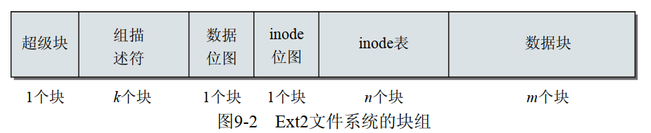
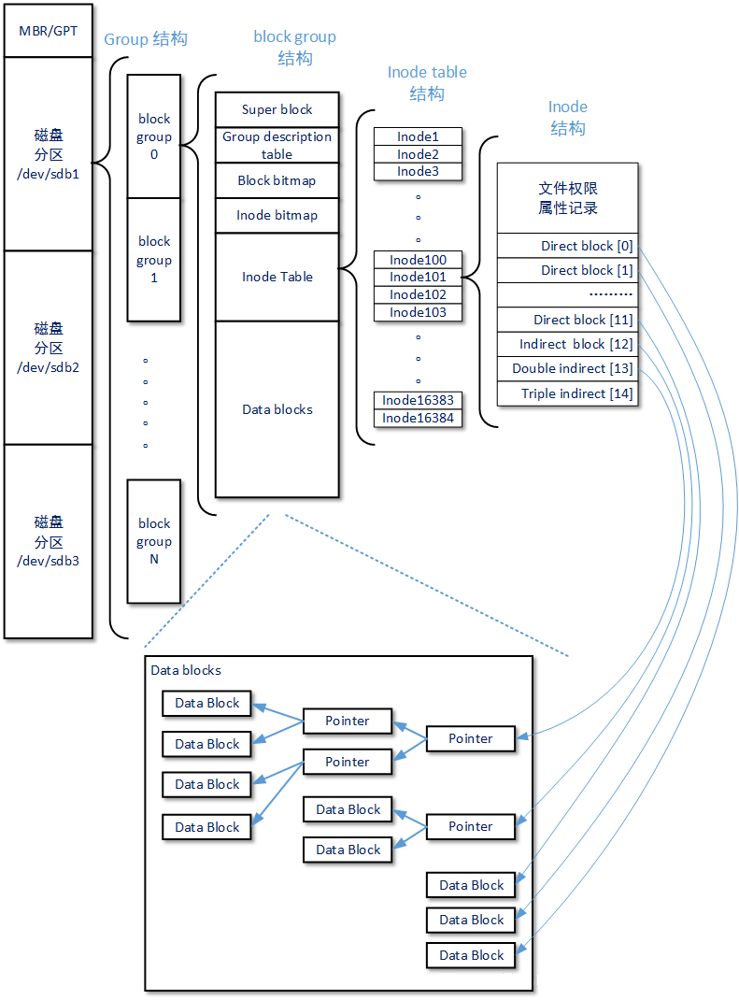
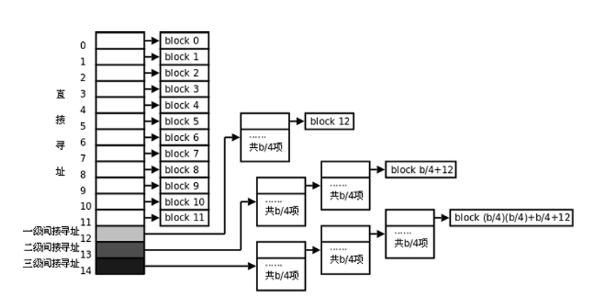

# 文件系统之EXT2(1/N)

**一、ext2 磁盘存储结构框图**

**1.1 整体结构**


**1.2 块组结构**



**1.3 索引结构**



**1.4 大文件间接inode**



|直接块号    |\[0, 11\]                                                                                                                                                              |
|------------|-----------------------------------------------------------------------------------------------------------------------------------------------------------------------|
|一级间接块号|\[12, blocksize/4\+11\]                                                                                                                                                |
|二级间接块号|\[blocksize/4\+12， \(blocksize/4\)\*\(blocksize/4\) \+ blocksize/4 \+ 11\]                                                                                            |
|三级间接块号|\[\(blocksize/4\)\*\(blocksize/4\) \+ blocksize/4 \+ 12,   \(blocksize/4\)\*\(blocksize/4\)\*\(blocksize/4\) \+ \(blocksize/4\)\*\(blocksize/4\) \+ blocksize/4 \+ 11\]|

注：根据块号计算块路径的函数为ext2\_block\_to\_path\(\)

二、数据结构及关系

三、

super\_block和ext2\_super\_block

```
ext2_super_block = super_block->s_fs_info->s_es;
```

inode与ext2\_inode并未都存在内存中，而是相互对应的关系，虽然两者的结构大不相同，但是内容基本一致。在以下函数实现中来将两者联系起来。

```
ext2_read_inode()
ext2_write_inode()
```

参考资料

[https://blog.csdn.net/gongjiwei/article/details/82025142](https://blog.csdn.net/gongjiwei/article/details/82025142)
