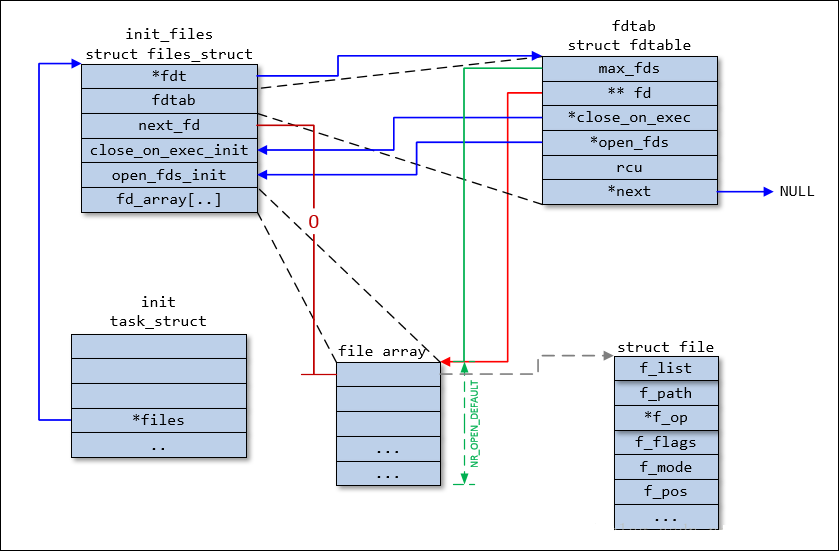
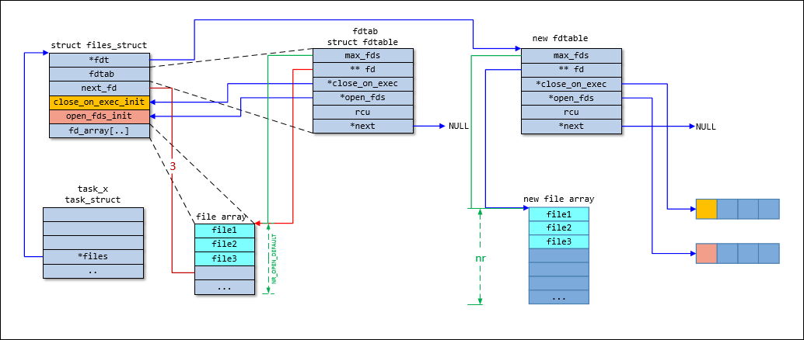
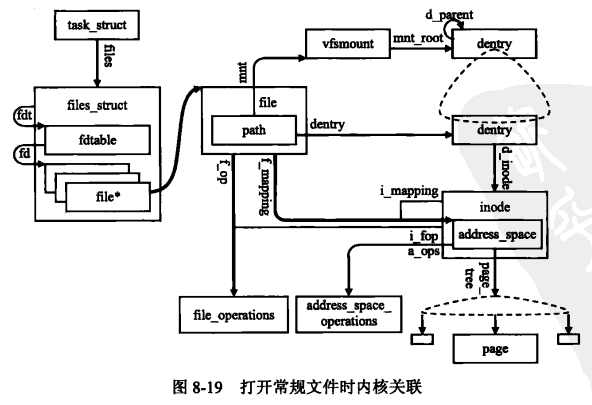
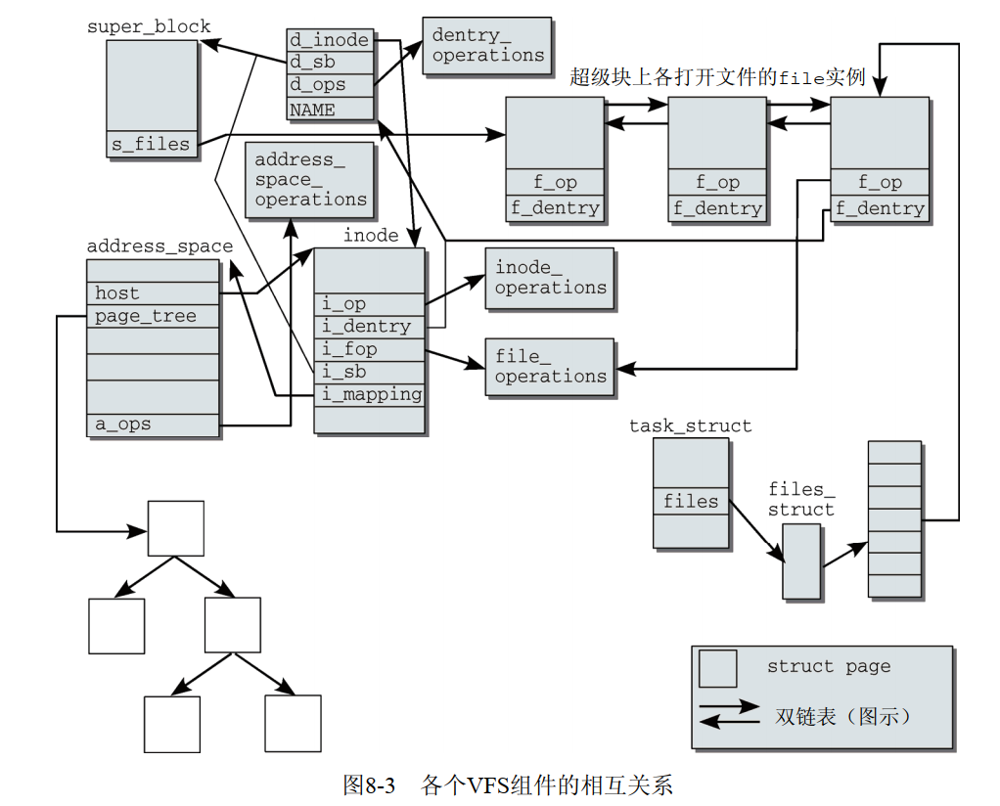

# 文件系统之VFS基础

**二�关键数�结�**

**2.1 vfsmount**

```
struct vfsmount {
    struct dentry *mnt_root;    /* root of the mounted tree */
    struct super_block *mnt_sb; /* pointer to superblock */
    int mnt_flags;
};
```

�个装载的文件系统都对应�一个vfsmount结�的�例，通过vfsmount�建起文件系统中结�化的挂载关系，这�关系类似�dentry�建起�的目录结�关系。

```
struct mount {
    struct hlist_node mnt_hash;
    struct mount *mnt_parent;
    struct dentry *mnt_mountpoint;
    struct vfsmount mnt;
    union {
        struct rcu_head mnt_rcu;
        struct llist_node mnt_llist;
    };
#ifdef CONFIG_SMP
    struct mnt_pcp __percpu *mnt_pcp;
#else
    int mnt_count;
    int mnt_writers;
#endif
    struct list_head mnt_mounts;    /* list of children, anchored here */
    struct list_head mnt_child; /* and going through their mnt_child */
    struct list_head mnt_instance;  /* mount instance on sb->s_mounts */ 
    const char *mnt_devname;    /* Name of device e.g. /dev/dsk/hda1 */
    struct list_head mnt_list;
    struct list_head mnt_expire;    /* link in fs-specific expiry list */
    struct list_head mnt_share; /* circular list of shared mounts */
    struct list_head mnt_slave_list;/* list of slave mounts */
    struct list_head mnt_slave; /* slave list entry */
    struct mount *mnt_master;   /* slave is on master->mnt_slave_list */
    struct mnt_namespace *mnt_ns;   /* containing namespace */
    struct mountpoint *mnt_mp;  /* where is it mounted */
    struct hlist_node mnt_mp_list;  /* list mounts with the same mountpoint */
    struct list_head mnt_umounting; /* list entry for umount propagation */
#ifdef CONFIG_FSNOTIFY
    struct hlist_head mnt_fsnotify_marks;
    __u32 mnt_fsnotify_mask;
#endif
    int mnt_id;         /* mount identifier */
    int mnt_group_id;       /* peer group identifier */
    int mnt_expiry_mark;        /* true if marked for expiry */
    struct hlist_head mnt_pins;
    struct fs_pin mnt_umount;
    struct dentry *mnt_ex_mountpoint;
};
```

**2.2 超级�super\_block**

```
struct super_block {
    struct list_head    s_list;     /* Keep this first */  所有超级�链表
    dev_t           s_dev;      /* search index; _not_ kdev_t */
    unsigned char       s_blocksize_bits;
    unsigned long       s_blocksize;
    loff_t          s_maxbytes; /* Max file size */
    struct file_system_type *s_type; 文件系统类�
    const struct super_operations   *s_op; 超级�方法
    const struct dquot_operations   *dq_op;
    const struct quotactl_ops   *s_qcop;
    const struct export_operations *s_export_op;
    unsigned long       s_flags;
    unsigned long       s_iflags;   /* internal SB_I_* flags */
    unsigned long       s_magic;
    struct dentry       *s_root;  //文件系统根目录的目录对象
    struct rw_semaphore s_umount;
    int         s_count;
    atomic_t        s_active;
    const struct xattr_handler **s_xattr;
    const struct fscrypt_operations *s_cop;
    struct hlist_bl_head    s_anon;     /* anonymous dentries for (nfs) exporting */
    struct list_head    s_mounts;   /* list of mounts; _not_ for fs use */
    struct block_device *s_bdev;
    struct backing_dev_info *s_bdi;
    struct mtd_info     *s_mtd;
    struct hlist_node   s_instances;  //相�的文件系统下超级�之间链表
    unsigned int        s_quota_types;  /* Bitmask of supported quota types */
    struct quota_info   s_dquot;    /* Diskquota specific options */
    struct sb_writers   s_writers;
    char s_id[32];              /* Informational name */
    u8 s_uuid[16];              /* UUID */
    void            *s_fs_info; /* Filesystem private info */
    unsigned int        s_max_links;
    fmode_t         s_mode;
    struct user_namespace *s_user_ns;
    struct list_lru     s_dentry_lru ____cacheline_aligned_in_smp;
    struct list_lru     s_inode_lru ____cacheline_aligned_in_smp;
    struct rcu_head     rcu;
    struct work_struct  destroy_work;
    struct mutex        s_sync_lock;    /* sync serialisation lock */
    int s_stack_depth;
    struct list_head    s_inodes;   /* all inodes */  超级�下所有的inodes
    spinlock_t      s_inode_wblist_lock;
    struct list_head    s_inodes_wb;    /* writeback inodes */ 需��写的inode
};
```

super\_block�存了文件系统它本身和装载点的有关信�

**2.3 索引节点inode**

```
struct inode {
    umode_t         i_mode;
    unsigned short      i_opflags;
    kuid_t          i_uid;  //所有者标识符
    kgid_t          i_gid;   //组标识符
    unsigned int        i_flags;
    const struct inode_operations   *i_op;  //inode�作方法
    struct super_block  *i_sb;  //指�该inode的super_block
    struct address_space    *i_mapping;
    unsigned long       i_ino;
    union {
        const unsigned int i_nlink;
        unsigned int __i_nlink;
    };
    dev_t           i_rdev;
    loff_t          i_size;
    struct timespec     i_atime;
    struct timespec     i_mtime;
    struct timespec     i_ctime;
    spinlock_t      i_lock; /* i_blocks, i_bytes, maybe i_size */
    unsigned short          i_bytes
   unsigned int        i_blkbits;
    blkcnt_t        i_blocks;

    /* Misc */
    unsigned long       i_state;
    struct rw_semaphore i_rwsem;

    unsigned long       dirtied_when;   /* jiffies of first dirtying */
    unsigned long       dirtied_time_when;

    struct hlist_node   i_hash;
    struct list_head    i_io_list;  /* backing dev IO list */
    struct list_head    i_lru;      /* inode LRU list */
    struct list_head    i_sb_list;  超级�链表s_inodes��
    struct list_head    i_wb_list;  /* backing dev writeback list */
    union {
        struct hlist_head   i_dentry;
        struct rcu_head     i_rcu;
    };
    u64         i_version;
    atomic_t        i_count;
    atomic_t        i_dio_count;
    atomic_t        i_writecount;
    const struct file_operations    *i_fop; /* former ->i_op->default_file_ops */
    struct file_lock_context    *i_flctx;
  struct address_space    i_data;
    struct list_head    i_devices;
    union {
        struct pipe_inode_info  *i_pipe;
        struct block_device *i_bdev;
        struct cdev     *i_cdev;
        char            *i_link;
        unsigned        i_dir_seq;
    };
    void            *i_private; /* fs or device private pointer */
};
```

inode的�员�能分为下�两类。

\(1\) �述文件状�的元数�。例如，访问��或上次修改的日期。

\(2\) �存�际文件内容的数�段（或指�数�的指针）。就文本文件�说，用��存文本，就目录而言，用户�存该目录下的目录项信�（所有文件或目录信�）。

查找起始�inode\(根目录 / 的inode\)，对系统�说必须总是已知的（根目录的dentry和inode是已知的）。该目录由一个inode表示，

其数�段并�包�普通数�，而是根目录下的�个目录项。这些项�能代表文件或其他目录。�个项由两个�员组�。

\(1\) 该目录项的数�所在inode的编�。（�目录或文件对应的inode编�）

\(2\) 文件或目录的�称。

1�对�个符�链�都使用了一个独立的inode。相应inode的数�段包�一个字符串，给出了链�目标的路径。

2�对�符�链�，�以区分�始文件和链�。对�硬链�，情况�是这样。在硬链�已�建立�，

无法区分哪个文件是��的，哪个是��建立的。在硬链�建立时，创建的目录项使用了一个�存的inode编�。

**2.4 目录缓存dentry**

```
struct dentry {
    /* RCU lookup touched fields */
    unsigned int d_flags;       /* protected by d_lock */
    seqcount_t d_seq;       /* per dentry seqlock */
    struct hlist_bl_node d_hash;    /* lookup hash list */
    struct dentry *d_parent;    /* parent directory */
    struct qstr d_name;
    struct inode *d_inode;      /* Where the name belongs to - NULL is negative */
    unsigned char d_iname[DNAME_INLINE_LEN];    /* small names */

    /* Ref lookup also touches following */
    struct lockref d_lockref;   /* per-dentry lock and refcount */
    const struct dentry_operations *d_op;
    struct super_block *d_sb;   /* The root of the dentry tree */
    unsigned long d_time;       /* used by d_revalidate */
    void *d_fsdata;         /* fs-specific data */

    union {
        struct list_head d_lru;     /* LRU list */
        wait_queue_head_t *d_wait;  /* in-lookup ones only */
    };
    struct list_head d_child;   /* child of parent list */
    struct list_head d_subdirs; /* our children */
    /*
     * d_alias and d_rcu can share memory
     */
    union {
        struct hlist_node d_alias;  /* inode alias list */
        struct hlist_bl_node d_in_lookup_hash;  /* only for in-lookup ones */
        struct rcu_head d_rcu;
    } d_u;
};
```

dentry的��： dentry结�的主�用途是建立文件�和相关的inode之间的关�

1�由��设备速度较慢，�能需�很长时间�能找到�一个文件�关�的inode。�使设备数�已�在页缓存中，�然�次都会��整个查找�作。

2�Linux使用目录项缓存（简称dentry缓存）�快速访问此�的查找�作的结�。

3�vfs中本�以使用inode�建立目录结�信�（inode目录节点和inode文件节点），但是这�建立�能比较耗时，利用dentry缓存�建立这�结�关系利��高性能。

4�dentry�是一�内存缓存结�信�，在�盘中无相应的数�。

     

2.6 address\_space

**2.7 fs\_struct**

fs\_struct �述进程当�目录根目录（文件系统特定�进程的信�）

```
struct fs_struct {
    int users;
    spinlock_t lock;
    seqcount_t seq;
    int umask;
    int in_exec;
    struct path root, pwd;
};

//vfsmount和dentry两者�以定�文件的路径
struct path {
        struct vfsmount *mnt;
        struct dentry *dentry;
};
```

**2.8 files\_struct** 

files\_struct �述进程打开的文件情况

```
struct files_struct {
  /*
   * read mostly part
   */
    atomic_t count;
    bool resize_in_progress;
    wait_queue_head_t resize_wait;
/*
为什么有两个fdtable呢？这是内核的一�优化策略。fdt为指针，而fdtab为普通��。一般情况下， fdt是指�fdtab的，当需�它的时候，�会真正动�申请内存。因为默认大�的文件表足以应付大多数情况，因此这样就�以��频�的内存申请。这也是内核的常用技巧之一。在创建时，使用普通的��或者数组，然�让指针指�它，作为默认情况使用。�有当进程使用�超过默认值时，�会动�申请内存。
*/
    struct fdtable __rcu *fdt;
    struct fdtable fdtab;
  /*
   * written part on a separate cache line in SMP
   */
    spinlock_t file_lock ____cacheline_aligned_in_smp;
    unsigned int next_fd;
    unsigned long close_on_exec_init[1];
    unsigned long open_fds_init[1];
    unsigned long full_fds_bits_init[1];
    struct file __rcu * fd_array[NR_OPEN_DEFAULT];
};

struct fdtable {
    unsigned int max_fds;
    struct file __rcu **fd;      /* current fd array */
    unsigned long *close_on_exec;
    unsigned long *open_fds;
    unsigned long *full_fds_bits;
    struct rcu_head rcu;
};
```

**2.8.1 files\_struct�始状�**

�始情况下，进程的files\_struct�始状��以�考init\_files的定义，�清其用法：files\_struct的�员fdt在这里�始化为其内嵌的struct fdtable���例\(�员fdtab\)地�，内嵌的struct fdtable�例��的fd，close\_on\_exec，open\_fds�指��主的相应��。

```
struct files_struct init_files = {
        .count          = ATOMIC_INIT(1),
        .fdt            = &init_files.fdtab,
        .fdtab          = {
                .max_fds        = NR_OPEN_DEFAULT,
                .fd             = &init_files.fd_array[0],
                .close_on_exec  = init_files.close_on_exec_init,
                .open_fds       = init_files.open_fds_init,
                .full_fds_bits  = init_files.full_fds_bits_init,
        },
        .file_lock      = __SPIN_LOCK_UNLOCKED(init_files.file_lock),
        .resize_wait    = __WAIT_QUEUE_HEAD_INITIALIZER(init_files.resize_wait),
};     
```



**2.8.2 files\_struct扩å**……

进行struct files\_struct扩充时，会分�一个新的struct fdtable。�外还分�了满足扩充�求的fd数组\(�struct file数组），以��fd相对的bitmap�述close\_on\_exec，open\_fds的存储空间。然�将新分�的close\_on\_exec，open\_fds，fd空间指针赋值给new\_fdt\-\>close\_on\_exec，new\_fdt\-\>open\_fds和new\_fdt\-\>fd。注�，这里的close\_on\_exec，open\_fds和上��始化时close\_on\_exec\_init，open\_fds\_init的差别：

```
static int expand_fdtable(struct files_struct *files, unsigned int nr)
        __releases(files->file_lock)
        __acquires(files->file_lock)
{
        struct fdtable *new_fdt, *cur_fdt;

        spin_unlock(&files->file_lock);
        new_fdt = alloc_fdtable(nr);  //先分�目标大�new_fdt

        spin_lock(&files->file_lock);
        cur_fdt = files_fdtable(files);
        BUG_ON(nr < cur_fdt->max_fds);
        copy_fdtable(new_fdt, cur_fdt);  //将旧的fdt�制到新的且更大的fdt中
        rcu_assign_pointer(files->fdt, new_fdt);  //利用rcu�布使得files_struct指�新申请的fdt

        //�收旧的fdt，�有�过扩展申请的就fdt�需�通过rcu释放。files->fdtab �需�释放，一方�因为
        //其数�结�本身存放在files_struct中，�一方�其通过fd_array指�的struct file在扩展�制时被新的fdt指�了继续使用。
        if (cur_fdt != &files->fdtab)
                call_rcu(&cur_fdt->rcu, free_fdtable_rcu);  
        /* coupled with smp_rmb() in __fd_install() */
        smp_wmb();
        return 1;
}
```

扩充替�如下图所示：将旧的



**2.9 打开的文件对象file**

```
struct file {
    union {
        struct llist_node   fu_llist;
        struct rcu_head     fu_rcuhead;
    } f_u;
    struct path     f_path;
    struct inode        *f_inode;   /* cached value */
    const struct file_operations    *f_op;

    /*
     * Protects f_ep_links, f_flags.
     * Must not be taken from IRQ context.
     */
    spinlock_t      f_lock;
    atomic_long_t       f_count;
    unsigned int        f_flags;
    fmode_t         f_mode;
    struct mutex        f_pos_lock;
    loff_t          f_pos;
    struct fown_struct  f_owner;
    const struct cred   *f_cred;
    struct file_ra_state    f_ra; //文件预读�数

    u64         f_version;
#ifdef CONFIG_SECURITY
    void            *f_security;
#endif
    /* needed for tty driver, and maybe others */
    void            *private_data;

#ifdef CONFIG_EPOLL
    /* Used by fs/eventpoll.c to link all the hooks to this file */
    struct list_head    f_ep_links;
    struct list_head    f_tfile_llink;
#endif /* #ifdef CONFIG_EPOLL */
    struct address_space    *f_mapping;
} __attribute__((aligned(4)));  /* lest something weird decides that 2 is OK */
```

三�文件关系结�框�




