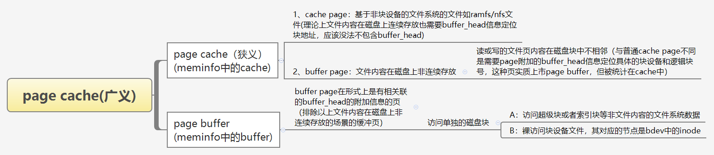
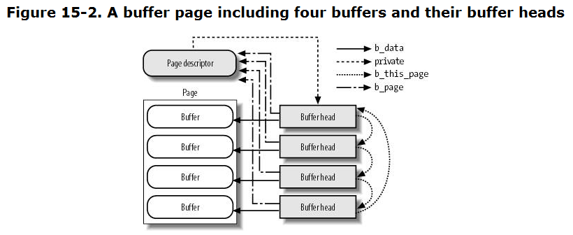
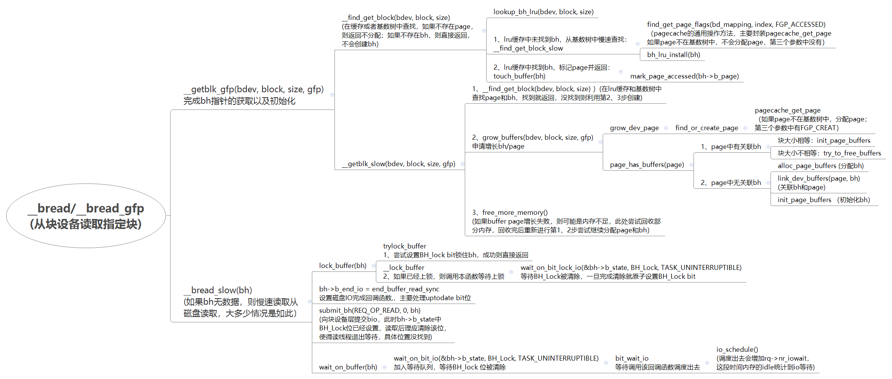

# 文件系统之buffer page

**一、buffer page介绍**

buffers page是广义page cache中的一种



所以本文讨论的buffer page是块设备缓冲区页，即上图的第二种情况。

二、数据结构

```
struct buffer_head {
        unsigned long b_state;          /* buffer state bitmap (see above) */  
        struct buffer_head *b_this_page;/* circular list of page's buffers */ //指向下一个buffer_head的指针
        struct page *b_page;            /* the page this bh is mapped to */  //指向所关联的struct page

        sector_t b_blocknr;             /* start block number */ //存放逻辑块号，定位数据在磁盘中具体的位置
        size_t b_size;                  /* size of mapping */  //应该是逻辑块号大小
        char *b_data;                   /* pointer to data within the page */ 
        //一个page关联多个buffer_head表示,表示该buffer_head描述的buffer在page中的位置

        struct block_device *b_bdev;   //指向对应的块设备
        bh_end_io_t *b_end_io;          /* I/O completion */ //提交到块设备层的IO完成后，进行回调，如end_buffer_read_sync/end_buffer_write_sync
        void *b_private;                /* reserved for b_end_io */
        struct list_head b_assoc_buffers; /* associated with another mapping */
        struct address_space *b_assoc_map;      /* mapping this buffer is
                                                   associated with */
        atomic_t b_count;               /* users using this buffer_head */
};
```



buffer\_head\-\>b\_state存放buffer\_head的状态，由于一个buffer page拆分成多个逻辑块缓存后，用该标志来分别表示每一个buffer\_head。

所以buffer\_head\-\>b\_state其本质还是基于struct page\-\>flags的一个扩展与分化。

```
enum bh_state_bits {
        BH_Uptodate,    /* Contains valid data */
        BH_Dirty,       /* Is dirty */
        BH_Lock,        /* Is locked */
        BH_Req,         /* Has been submitted for I/O */
        BH_Uptodate_Lock,/* Used by the first bh in a page, to serialise
                          * IO completion of other buffers in the page
                          */

        BH_Mapped,      /* Has a disk mapping */
        BH_New,         /* Disk mapping was newly created by get_block */
        BH_Async_Read,  /* Is under end_buffer_async_read I/O */
        BH_Async_Write, /* Is under end_buffer_async_write I/O */
        BH_Delay,       /* Buffer is not yet allocated on disk */
        BH_Boundary,    /* Block is followed by a discontiguity */
        BH_Write_EIO,   /* I/O error on write */
        BH_Unwritten,   /* Buffer is allocated on disk but not written */
        BH_Quiet,       /* Buffer Error Prinks to be quiet */
        BH_Meta,        /* Buffer contains metadata */
        BH_Prio,        /* Buffer should be submitted with REQ_PRIO */
        BH_Defer_Completion, /* Defer AIO completion to workqueue */

        BH_PrivateStart,/* not a state bit, but the first bit available
                         * for private allocation by other entities
                         */
};

//从此处可以看出磁盘逻辑块的大小是有限制的
#define MAX_BUF_PER_PAGE (PAGE_SIZE / 512)  ==> PAGE_SIZE为4096时为8；PAGE_SIZE位64K时为128
```

struct page在64位平台是64字节，32位平台32字节，下面是与page cache相关的元素

```
struct page {
        /* First double word block */ 8字节
        unsigned long flags;            /* Atomic flags, some possibly
                                         * updated asynchronously */
        union {
                struct address_space *mapping;  //如果低bit被清，则该指针指向addre_space或者NULL
                                                //如果低bit被设置，则指向anon_vma对象
        };

        /* Second double word */ 8字节
        union {
                pgoff_t index;          /* Our offset within mapping. */ 该page所对应文件内容在文件中的索引位置
        };
        union {
                unsigned counters;
        };

        /*
         * Third double word block 8字节
         */
        union {
                unsigned long private;          /* Mapping-private opaque data:
                                                 * usually used for buffer_heads
                                                 * if PagePrivate set; used for
                                                 * swp_entry_t if PageSwapCache;
                                                 * indicates order in the buddy
                                                 * system if PG_buddy is set.
                                                 */
            //指向该page所附加的第一个buffer_head，buffer_head->b_this_page再指向下一个，以此形成链表
            }
        //最后剩余8字节
}
```

**三、块设备buffer page**

1、buffer cache读取，针对的是以单个buffer\_head为单位的读取，还有针对以page为单位的buffer cache读取。



备注：读取数据到buffer\_head指向的缓存，读取线程阻塞等待bh\-\>b\_state中的BH\_Lock标志，块设备层完成磁盘读取后，回调设置该标记，唤醒等待线程。

2、块设备页面回写

```
generic_file_fsync
sync_mapping_buffers(struct address_space *mapping)
```

```
/**
* __generic_file_fsync - generic fsync implementation for simple filesystems
*
* @file:       file to synchronize
* @start:      start offset in bytes
* @end:        end offset in bytes (inclusive)
* @datasync:   only synchronize essential metadata if true
*
* This is a generic implementation of the fsync method for simple
* filesystems which track all non-inode metadata in the buffers list
* hanging off the address_space structure.
*/
int __generic_file_fsync(struct file *file, loff_t start, loff_t end,
                                 int datasync)
{
        struct inode *inode = file->f_mapping->host;
        int err;
        int ret;

        err = filemap_write_and_wait_range(inode->i_mapping, start, end);
        if (err)
                return err;

        inode_lock(inode);
        ret = sync_mapping_buffers(inode->i_mapping); //回写non-inode metadata 非inode元数据，
        if (!(inode->i_state & I_DIRTY_ALL))
                goto out;
        if (datasync && !(inode->i_state & I_DIRTY_DATASYNC))
                goto out;

        err = sync_inode_metadata(inode, 1); //回写inode相关的元数据，不涉及其他数据和元数据，参数1表示同步等待
        if (ret == 0)
                ret = err;

out:    
        inode_unlock(inode);
        return ret;
}
```

address\_space数据结构中private\_list用于将包含文件系统元数据（通常是间接块，间接块是磁盘上用于存储文件数据块所在磁盘块号的信息，并非文件真正的数据）的buffer\_head实例彼此连接起来（是单个文件相关的元数据还是真个文件系统的元数据？？）。

 assoc\_mapping是一个指向相关的地址空间的指针（相关地址空间应该是块设备文件对应的address\_space？）。

3、buffer\_head释放

try\_to\_release\_page ：释放page关联buffer\_head缓存

```
如页面收缩时候调用：
shrink_active_list/shrink_page_list                    
         if (page_has_private(page) && trylock_page(page)) {
               if (page_has_private(page))
                      try_to_release_page(page, 0);
                      unlock_page(page);
         }

int try_to_release_page(struct page *page, gfp_t gfp_mask)
{
        struct address_space * const mapping = page->mapping;

        BUG_ON(!PageLocked(page)); //page未上锁，不能进一步处理page关联的bh
        if (PageWriteback(page)) //正在回写的page不能释放bh
                return 0;

        if (mapping && mapping->a_ops->releasepage)
                return mapping->a_ops->releasepage(page, gfp_mask); //通过情况下没有为块设备定义的releasepage方法
        return try_to_free_buffers(page); //尝试释放bh,包括内存释放和其他数据结构引用bh的信息修改
}

int try_to_free_buffers(struct page *page)
{
        struct address_space * const mapping = page->mapping;
        struct buffer_head *buffers_to_free = NULL;
        int ret = 0;

        if (mapping == NULL) {          /* can this still happen? */
                ret = drop_buffers(page, &buffers_to_free);
                goto out;
        }

        spin_lock(&mapping->private_lock);
        ret = drop_buffers(page, &buffers_to_free); //清除引用bh的相关数据，如page关联bh的信息
        if (ret)
                cancel_dirty_page(page);
        spin_unlock(&mapping->private_lock);
out:
        if (buffers_to_free) {
                struct buffer_head *bh = buffers_to_free;

                do {
                        struct buffer_head *next = bh->b_this_page;
                        free_buffer_head(bh); //释放bh内存
                        bh = next;
                } while (bh != buffers_to_free);
        }
        return ret;
}

static int
drop_buffers(struct page *page, struct buffer_head **buffers_to_free)
{
        struct buffer_head *head = page_buffers(page);
        struct buffer_head *bh;

        bh = head;
                .......
        *buffers_to_free = head; //返回page关联指向的首个bh，以便于释放
        __clear_page_buffers(page); //清除page中的的mapping和flag中关于bh的信息
        return 1;
failed:
        return 0;
}
```
