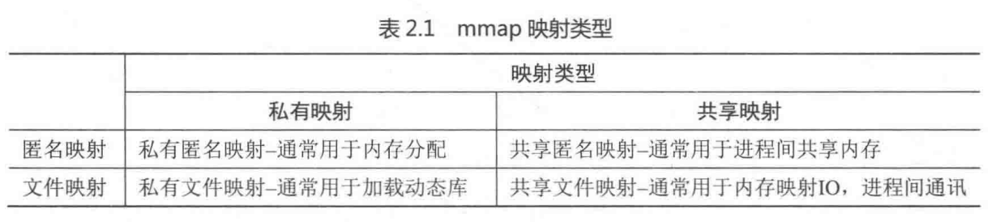
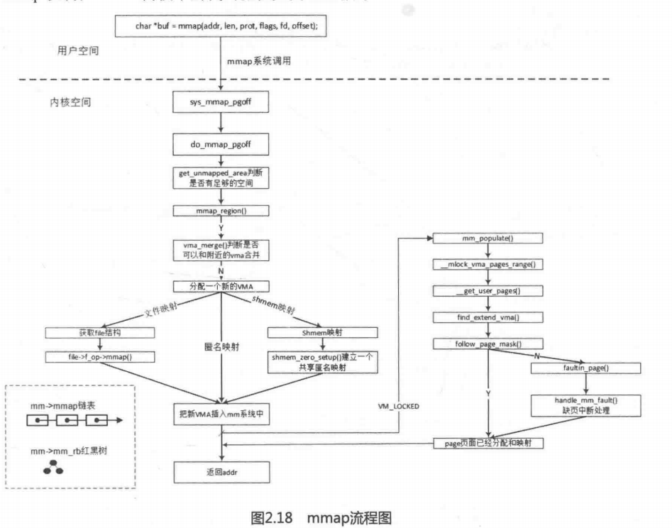
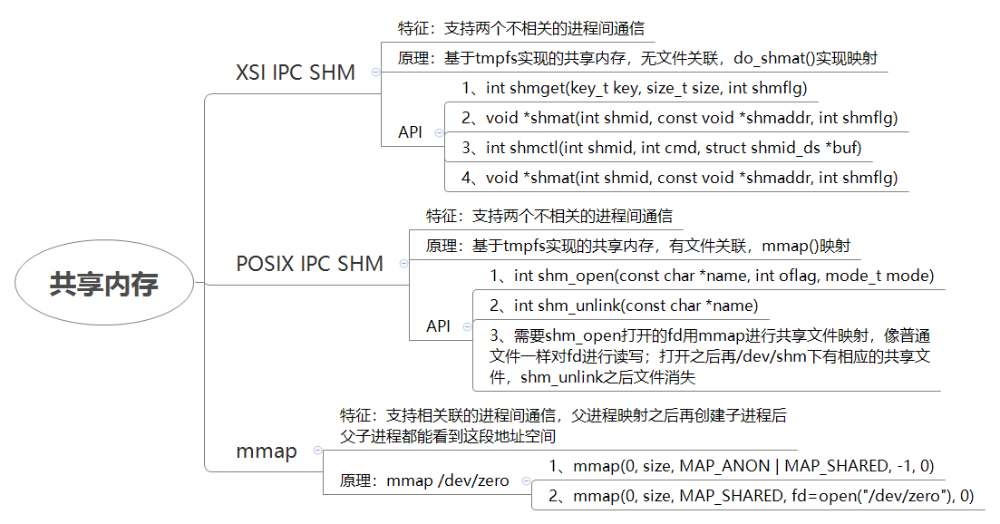

# 文件系统之mmap

```
1、do_mmap系统调用
/*
* The caller must hold down_write(&current->mm->mmap_sem).
*/
unsigned long do_mmap(struct file *file, unsigned long addr,
                        unsigned long len, unsigned long prot,
                        unsigned long flags, vm_flags_t vm_flags,
                        unsigned long pgoff, unsigned long *populate)
{
    addr = mmap_region(file, addr, len, vm_flags, pgoff);
}

2、mmap_region
unsigned long mmap_region(struct file *file, unsigned long addr,
                unsigned long len, vm_flags_t vm_flags, unsigned long pgoff)
{
        vma = kmem_cache_zalloc(vm_area_cachep, GFP_KERNEL);
        if (!vma) {
                error = -ENOMEM;
                goto unacct_error;
        }

        vma->vm_mm = mm;
        vma->vm_start = addr;
        vma->vm_end = addr + len;
        vma->vm_flags = vm_flags;
        vma->vm_page_prot = vm_get_page_prot(vm_flags);
        vma->vm_pgoff = pgoff;
        INIT_LIST_HEAD(&vma->anon_vma_chain);

        if (file) {
                if (vm_flags & VM_DENYWRITE) {
                        error = deny_write_access(file);
                        if (error)
                                goto free_vma;
                }
                if (vm_flags & VM_SHARED) {
                        error = mapping_map_writable(file->f_mapping);
                        if (error)
                                goto allow_write_and_free_vma;
                }

                vma->vm_file = get_file(file);
                error = file->f_op->mmap(file, vma); //调用文件系统的mmap函数进行映射操作
                if (error) 
                        goto unmap_and_free_vma;

                WARN_ON_ONCE(addr != vma->vm_start);

                addr = vma->vm_start;
                vm_flags = vma->vm_flags;
        } else if (vm_flags & VM_SHARED) {
                error = shmem_zero_setup(vma);
                if (error)
                        goto free_vma;
        }

        vma_link(mm, vma, prev, rb_link, rb_parent); //将新创建的vma加入红黑树
}

3、file->f_op->mmap
const struct vm_operations_struct generic_file_vm_ops = {
        .fault          = filemap_fault,
        .map_pages      = filemap_map_pages,
        .page_mkwrite   = filemap_page_mkwrite,
};

/* This is used for a general mmap of a disk file */
//如ramfs使用struct file_operations ramfs_file_operations中的mmpa=generic_file_mmap
int generic_file_mmap(struct file * file, struct vm_area_struct * vma)
{       
        struct address_space *mapping = file->f_mapping;

        if (!mapping->a_ops->readpage)
                return -ENOEXEC;
        file_accessed(file);
        vma->vm_ops = &generic_file_vm_ops;
        return 0;
}
```

mmap的本质核心是：

1、创建或利用现有的vma，其虚拟地址覆盖所要映射的虚拟地址

2、设置vma与所映射的虚拟地址关联起来

vma\-\>vm\_pgoff = pgoff; //vma所对应的文件偏移，即将vma与文件的具体映射位置关联

vma\-\>vm\_file = get\_file\(file\); //vma对应的文件对象

vma\-\>vm\_ops = &generic\_file\_vm\_ops; //vma对应的vm\_operations\_struct，应该在缺页异常处理时使用





**mmap内存统计项**

/dev/meminfo Mapped统计项测试

```
               if ((src = mmap(0, copysz, PROT_READ, MAP_SHARED,
                  fdin, fsz)) == MAP_FAILED)
                        err_sys("mmap error for input");
                if ((dst = mmap(0, copysz, PROT_READ | PROT_WRITE,
                  MAP_SHARED, fdout, fsz)) == MAP_FAILED)
                        err_sys("mmap error for output");

                memcpy(dst, src, copysz);       /* does the file copy */
                munmap(dst, copysz); //释放目的文件，不释放源文件
```

1、后台启动一个进程，不做任何的mmap操作，Mapped统计项中增加了100K左右统计，这是因为有动态库文件第一次mmap映射到进程地址空间

2、将一个普通文件mmap映射至进程地址空间，读该文件，不unmap该文件，那么相比情况1中，Mapped统计增加文件大小的统计

3、将一个块设备文件mmap映射至进程地址空间，读该文件，不unmap该文件；由于读到的块设备文件大小为0，因此Mapped中统计和情况1一致

**共享内存有两种：**


