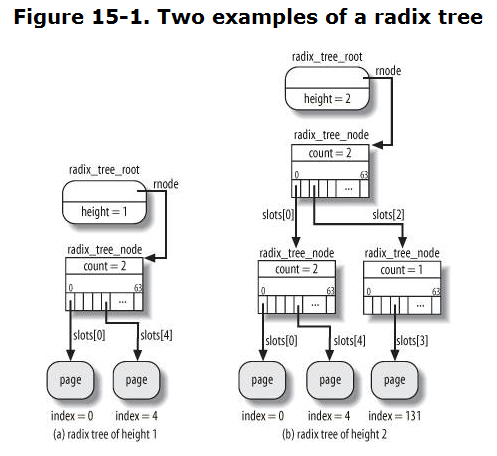
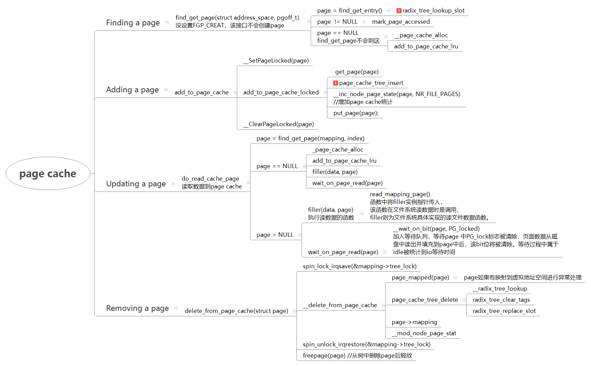

# 文件系统之page cache

**知识背景：**

****

本文讨论的是page cache（广义）的使用方法和结构组成。

**一、数据结构**

```
struct address_space {
        struct inode            *host;          /* owner: inode, block_device */
        struct radix_tree_root  page_tree;      /* radix tree of all pages */
        spinlock_t              tree_lock;      /* and lock protecting it */
        atomic_t                i_mmap_writable;/* count VM_SHARED mappings */
        struct rb_root          i_mmap;         /* tree of private and shared mappings */
        struct rw_semaphore     i_mmap_rwsem;   /* protect tree, count, list */
        /* Protected by tree_lock together with the radix tree */
        unsigned long           nrpages;        /* number of total pages */
        /* number of shadow or DAX exceptional entries */
        unsigned long           nrexceptional;
        pgoff_t                 writeback_index;/* writeback starts here */
        const struct address_space_operations *a_ops;   /* methods */
        unsigned long           flags;          /* error bits */
        spinlock_t              private_lock;   /* for use by the address_space */
        gfp_t                   gfp_mask;       /* implicit gfp mask for allocations */
        struct list_head        private_list;   /* ditto */
        void                    *private_data;  /* ditto */
} __attribute__((aligned(sizeof(long))));
```

```
struct radix_tree_node {
        unsigned char   shift;  /* Bits remaining in each slot */
        unsigned char   offset; /* Slot offset in parent */
        unsigned int    count; //非叶子结点含有一个count域，表示出现在该结点的孩子的数量
        union {
                struct {
                        /* Used when ascending tree */
                        struct radix_tree_node *parent;
                        /* For tree user */
                        void *private_data;
                };
                /* Used when freeing node */
                struct rcu_head rcu_head;
        };                      
        /* For tree user */
        struct list_head private_list;
        void __rcu      *slots[RADIX_TREE_MAP_SIZE]; //4.9是slots[64] 指向中间node或者page
        unsigned long   tags[RADIX_TREE_MAX_TAGS][RADIX_TREE_TAG_LONGS]; //4.9版本是tags[3][2] ，具体slot的标签，每个3个bit，dirty-writeback-xxx
};

/* root tags are stored in gfp_mask, shifted by __GFP_BITS_SHIFT */
struct radix_tree_root {
        gfp_t                   gfp_mask;
        struct radix_tree_node  __rcu *rnode;
};
```

**二、结构图**



重点：

1、最底层的void \*slot\[\]指向page，其他层级的slot\[\]指向下一级节点

2、tags用于标记节点以下的子节点相应的状态，如dirty / writeback 等

3、radix tree本质上一个稀疏数组的效果。file本身相当于一块连续的地址空间，如果用数组来建立地址和page的映射，则非常浪费内存。

    通过稀疏的映射关系，可以非常方便的建立任意地址与page的映射关系。同时通过tag的标记使用，可以有较大的性能提升。

**三、相关接口**

**1、find page：**

查找address\_space 指定offset的page，如果找到会增加page的引用

```
/**             
* find_get_page - find and get a page reference
* @mapping: the address_space to search
* @offset: the page index
*      
* Looks up the page cache slot at @mapping & @offset.  If there is a
* page cache page, it is returned with an increased refcount.
*
* Otherwise, %NULL is returned.
*/
static inline struct page *find_get_page(struct address_space *mapping,
                                        pgoff_t offset)
{
        return pagecache_get_page(mapping, offset, 0, 0);
}
```

**2、add page cache**

add\_to\_page\_cache 添加page至基数树中

```
/*
* Like add_to_page_cache_locked, but used to add newly allocated pages:
* the page is new, so we can just run __SetPageLocked() against it.
*/
static inline int add_to_page_cache(struct page *page,
                struct address_space *mapping, pgoff_t offset, gfp_t gfp_mask)
{
        int error;

        __SetPageLocked(page);
        error = add_to_page_cache_locked(page, mapping, offset, gfp_mask);
        if (unlikely(error))
                __ClearPageLocked(page);
        return error;
}
```

**3、update page**

read\_cache\_page  更新page cache中某个指定位置的page数据。核心是从磁盘中读取文件数据到page cache中，具体的读取方法有文件系统的filler提供。

核心是如果PG\_uptodate flag标志没有设置，这通过filler函数读取数据至page

```
/**
* read_cache_page - read into page cache, fill it if needed
* @mapping:    the page's address_space
* @index:      the page index
* @filler:     function to perform the read
* @data:       first arg to filler(data, page) function, often left as NULL
*
* Read into the page cache. If a page already exists, and PageUptodate() is
* not set, try to fill the page and wait for it to become unlocked.
*
* If the page does not get brought uptodate, return -EIO.
*/
struct page *read_cache_page(struct address_space *mapping, //address_space object
                                pgoff_t index, //offset value index that specifies the requested page
                                int (*filler)(void *, struct page *), //reads the page's data from disk 从磁盘读取数据的函数指针
                                void *data) //data that is passed to the filler function
{
        return do_read_cache_page(mapping, index, filler, data, mapping_gfp_mask(mapping));
}
```

**4、remove page**

   a:查找并从树中删除page，如果该page还有页表映射，则需要异常处理并打印堆栈

   b：释放该page

```
/**
* read_cache_page - read into page cache, fill it if needed
* @mapping:    the page's address_space
* @index:      the page index
* @filler:     function to perform the read
* @data:       first arg to filler(data, page) function, often left as NULL
*
* Read into the page cache. If a page already exists, and PageUptodate() is
* not set, try to fill the page and wait for it to become unlocked.
*
* If the page does not get brought uptodate, return -EIO.
*/
struct page *read_cache_page(struct address_space *mapping,
                                pgoff_t index,
                                int (*filler)(void *, struct page *),
                                void *data)
{
        return do_read_cache_page(mapping, index, filler, data, mapping_gfp_mask(mapping));
}
```


