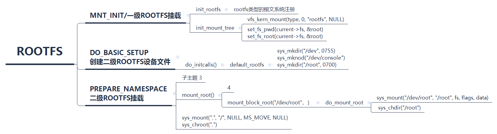

# 文件系统之rootfs初始化

**一、挂载rootfs**

Mounting the root filesystem is a two\-stage procedure, shown in the following list:

1.The kernel mounts the special rootfs filesystem, which simply provides an empty directory that serves as initial mount point.

2.The kernel mounts the real root filesystem over the empty directory.

使用rootfs的目的：

1、使用rootfs这层特殊的文件系统，可以在rootfs的基础上很容易改变根文件系统

2、在某些特殊情况下，系统可能会逐个安装和卸载好几个根文件系统（比如大华做的固件加密initramfs）

3、rootfs只是提供一个空目录，用于初始的安装点

```
asmlinkage __visible void __init start_kernel(void)
{
    vfs_caches_init();
}

void __init vfs_caches_init(void)
{
    names_cachep = kmem_cache_create("names_cache", PATH_MAX, 0,
            SLAB_HWCACHE_ALIGN|SLAB_PANIC, NULL);

    dcache_init();
    inode_init();
    files_init();
    files_maxfiles_init();
    mnt_init();
    bdev_cache_init();
    chrdev_init();
}

void __init mnt_init(void)
{
    unsigned u;
    int err;
    
    mnt_cache = kmem_cache_create("mnt_cache", sizeof(struct mount),
            0, SLAB_HWCACHE_ALIGN | SLAB_PANIC, NULL);
    
    mount_hashtable = alloc_large_system_hash("Mount-cache",
                sizeof(struct hlist_head),
                mhash_entries, 19,
                0,
                &m_hash_shift, &m_hash_mask, 0, 0);
    mountpoint_hashtable = alloc_large_system_hash("Mountpoint-cache",
                sizeof(struct hlist_head),
                mphash_entries, 19,
                0,
                &mp_hash_shift, &mp_hash_mask, 0, 0);
    
    if (!mount_hashtable || !mountpoint_hashtable)
        panic("Failed to allocate mount hash table\n");
    
    for (u = 0; u <= m_hash_mask; u++)
        INIT_HLIST_HEAD(&mount_hashtable[u]);
    for (u = 0; u <= mp_hash_mask; u++)
        INIT_HLIST_HEAD(&mountpoint_hashtable[u]);
    
    kernfs_init();
    
    err = sysfs_init();
    if (err)
        printk(KERN_WARNING "%s: sysfs_init error: %d\n",
            __func__, err);
    fs_kobj = kobject_create_and_add("fs", NULL);
    if (!fs_kobj)
        printk(KERN_WARNING "%s: kobj create error\n", __func__);
    init_rootfs();  //注册rootfs
    init_mount_tree();
}

static void __init init_mount_tree(voisd)
{
    struct vfsmount *mnt;
    struct mnt_namespace *ns;
    struct path root;
    struct file_system_type *type;

    type = get_fs_type("rootfs");
    if (!type)
        panic("Can't find rootfs type");
    mnt = vfs_kern_mount(type, 0, "rootfs", NULL); //挂载根文件系统，主要还是调用rootfs_mount函数放回root的vfsmount
    put_filesystem(type);
    if (IS_ERR(mnt))
        panic("Can't create rootfs");

    ns = create_mnt_ns(mnt); //创建命名空间
    if (IS_ERR(ns))
        panic("Can't allocate initial namespace");

    init_task.nsproxy->mnt_ns = ns; //这个命名空间如何工作的？
    get_mnt_ns(ns);

    root.mnt = mnt;
    root.dentry = mnt->mnt_root;
    mnt->mnt_flags |= MNT_LOCKED;

    set_fs_pwd(current->fs, &root);  //此时current还是init_task
    set_fs_root(current->fs, &root);  //初始化设置init_task的当前目录和根目录为root目录
}

struct vfsmount *
vfs_kern_mount(struct file_system_type *type, int flags, const char *name, void *data)
{
    struct mount *mnt;
    struct dentry *root;

    if (!type)
        return ERR_PTR(-ENODEV);

    mnt = alloc_vfsmnt(name);
    if (!mnt)
        return ERR_PTR(-ENOMEM);

    if (flags & MS_KERNMOUNT)
        mnt->mnt.mnt_flags = MNT_INTERNAL;

    root = mount_fs(type, flags, name, data); //调用rootfs_mount/ramfs_fill_super创建rootfs的super block
                                    //创建生成根目录的dentry和inode,返回root的dentry
    if (IS_ERR(root)) {
        mnt_free_id(mnt);
        free_vfsmnt(mnt);
        return ERR_CAST(root);
    }

    mnt->mnt.mnt_root = root;
    mnt->mnt.mnt_sb = root->d_sb;
    mnt->mnt_mountpoint = mnt->mnt.mnt_root;
    mnt->mnt_parent = mnt;
    lock_mount_hash();
    list_add_tail(&mnt->mnt_instance, &root->d_sb->s_mounts);
    unlock_mount_hash();
    return &mnt->mnt;
}
```

```
static struct file_system_type rootfs_fs_type = {
    .name       = "rootfs",
    .mount      = rootfs_mount,
    .kill_sb    = kill_litter_super,
};

int __init init_rootfs(void)
{
    int err = register_filesystem(&rootfs_fs_type);

    if (err)
        return err;

    if (IS_ENABLED(CONFIG_TMPFS) && !saved_root_name[0] &&
        (!root_fs_names || strstr(root_fs_names, "tmpfs"))) {
        err = shmem_init();
        is_tmpfs = true;
    } else {
        err = init_ramfs_fs();
    }

    if (err)
        unregister_filesystem(&rootfs_fs_type);

    return err;
}
```

基于根文件系统创建/root和 /dev/root

```
static int __init default_rootfs(void)
{
        int err;

        err = sys_mkdir((const char __user __force *) "/dev", 0755);
        if (err < 0)
                goto out;

        err = sys_mknod((const char __user __force *) "/dev/console",
                        S_IFCHR | S_IRUSR | S_IWUSR,
                        new_encode_dev(MKDEV(5, 1)));
        if (err < 0)
                goto out;

        err = sys_mkdir((const char __user __force *) "/root", 0700);
        if (err < 0)
                goto out;

        return 0;

out:
        printk(KERN_WARNING "Failed to create a rootfs\n");
        return err;
}
rootfs_initcall(default_rootfs);
```

二、挂载真正的root文件系统

qemu虚拟机中，在块设备上挂载ext3文件系统的函数执行路径

```
#0  vfs_kern_mount (type=0xc0da4014 <ext3_fs_type>, flags=32769,
    name=0xee1476c0 "/dev/root", data=0x0 <__vectors_start>) at fs/namespace.c:906
#1  0xc0287400 in do_new_mount (path=0xee895dcc, fstype=0xee147680 "ext3", flags=32769,
    mnt_flags=96, name=0xee1476c0 "/dev/root", data=0x0 <__vectors_start>)
    at fs/namespace.c:2318
#2  0xc02882e4 in do_mount (dev_name=0xee1476c0 "/dev/root",
    dir_name=0xc0b125a4 "/root", type_page=0xee147680 "ext3", flags=32769,
    data_page=0x0 <__vectors_start>) at fs/namespace.c:2634
#3  0xc0288bf4 in SYSC_mount (data=0x0 <__vectors_start>, flags=32769,
    type=0xee11b000 "ext3", dir_name=0xc0b125a4 "/root",
    dev_name=0xc0b12724 "/dev/root") at fs/namespace.c:2824
#4  SyS_mount (dev_name=-1062131932, dir_name=-1062132316, type=-300830720,
    flags=32769, data=0) at fs/namespace.c:2802
#5  0xc0d0dc08 in do_mount_root (name=0xc0b12724 "/dev/root", fs=0xee11b000 "ext3",
    flags=32769, data=0x0 <__vectors_start>) at init/do_mounts.c:363
#6  0xc0d0ddc0 in mount_block_root (name=0xc0b12724 "/dev/root", flags=32769)
    at init/do_mounts.c:393
#7  0xc0d0e110 in mount_root () at init/do_mounts.c:534
#8  0xc0d0e39c in prepare_namespace () at init/do_mounts.c:592
#9  0xc0d0d7c4 in kernel_init_freeable () at init/main.c:1016
#10 0xc0aff19c in kernel_init (unused=0x0 <__vectors_start>) at init/main.c:928
#11 0xc0014e00 in ret_from_fork () at arch/arm/kernel/entry-common.S:92
Backtrace stopped: previous frame identical to this frame (corrupt stack?)
```

```
void __init prepare_namespace(void)
{
    int is_floppy;

    if (root_delay) {
        printk(KERN_INFO "Waiting %d sec before mounting root device...\n",
               root_delay);
        ssleep(root_delay);
    }

    wait_for_device_probe();

    md_run_setup();

    if (saved_root_name[0]) {
        root_device_name = saved_root_name;
        if (!strncmp(root_device_name, "mtd", 3) ||
            !strncmp(root_device_name, "ubi", 3)) {
            mount_block_root(root_device_name, root_mountflags);
            goto out;
        }
        ROOT_DEV = name_to_dev_t(root_device_name);
        if (strncmp(root_device_name, "/dev/", 5) == 0)
            root_device_name += 5;
    }

    if (initrd_load())
        goto out;
    /* wait for any asynchronous scanning to complete */
    if ((ROOT_DEV == 0) && root_wait) {
        printk(KERN_INFO "Waiting for root device %s...\n",
            saved_root_name);
        while (driver_probe_done() != 0 ||
            (ROOT_DEV = name_to_dev_t(saved_root_name)) == 0)
            msleep(100);
        async_synchronize_full();
    }

    is_floppy = MAJOR(ROOT_DEV) == FLOPPY_MAJOR;

    if (is_floppy && rd_doload && rd_load_disk(0))
        ROOT_DEV = Root_RAM0;

    mount_root();  //挂载真正的根文件系统
out:
    devtmpfs_mount("dev");
    sys_mount(".", "/", NULL, MS_MOVE, NULL);  //将当前目录移动挂载至"/"目录  ，这个目录是基于/dev/root的真正根文件系统
    sys_chroot("."); //切换进程根目录为当前目录
}
```

mount\_root\-\>do\_mount\_root  挂载真正的根文件系统：do\_mount\_root\("/dev/root"， "ext3"）

```
static int __init do_mount_root(char *name, char *fs, int flags, void *data)
{
        struct super_block *s;
        int err = sys_mount(name, "/root", fs, flags, data);  //通用的挂载函数挂载真正的根文件系统
        if (err)
                return err;

        sys_chdir("/root");  //切换至root目录
        s = current->fs->pwd.dentry->d_sb;
        ROOT_DEV = s->s_dev;
        printk(KERN_INFO
               "VFS: Mounted root (%s filesystem)%s on device %u:%u.\n",
               s->s_type->name,
               s->s_flags & MS_RDONLY ?  " readonly" : "",
               MAJOR(ROOT_DEV), MINOR(ROOT_DEV));
        return 0;
}
```

[rootfs.xmind](./file/rootfs.xmind)

rootfs创建切换逻辑（以块设备为二级根文件系统）


