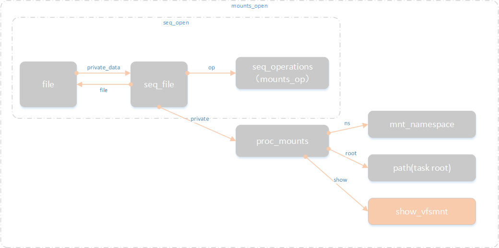
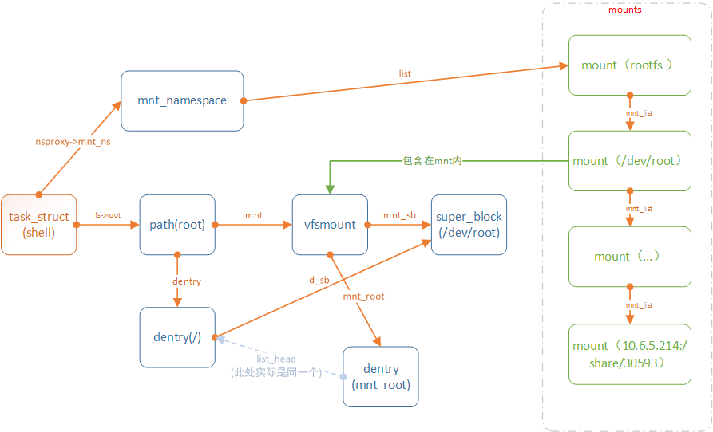

# 文件系统之seq_file

**一、为何要使用seq\_file实现proc文件?**

proc文件系统下读取大于1个page的文件时，存在问题。为了解决此问题，引入seq\_file，在普通的文件read中加入了内核缓冲的功能，从而实现顺序多次遍历，读取大数据量的简单接口。

**二、seq\_file数据结构**

```
struct seq_file {
        char *buf;        //seq_file内核态缓存地址
        size_t size;      //内核态缓存大小，默认为1个页面大小，随着需求会动态以2的级数倍扩张，4k,8k,16k...
        size_t from;  
        size_t count;     //内核态缓存有效数据大小
        size_t pad_until;
        loff_t index;     //遍历器的索引，通常从0开始，next一遍+1
        loff_t read_pos;  //已读数据位置,针对file的偏移量
        u64 version;
        struct mutex lock;
        const struct seq_operations *op;
        int poll_event;
        const struct file *file;
        void *private;
};

struct seq_operations {
        void * (*start) (struct seq_file *m, loff_t *pos);
        void (*stop) (struct seq_file *m, void *v);
        void * (*next) (struct seq_file *m, void *v, loff_t *pos);
        int (*show) (struct seq_file *m, void *v);
};
```

```
const struct file_operations proc_mounts_operations = {
        .open           = mounts_open,  //通常open使用seq_open，如果需要拓展的话基于seq_open封装
        .read           = seq_read,
        .llseek         = seq_lseek,
        .release        = mounts_release,
        .poll           = mounts_poll,
};
```

**三、/proc/mounts 代码分析**

1、mounts\_open主要基于seq\_open创建了/proc/mounts 文件打开时的数据结构

```
int seq_open(struct file *file, const struct seq_operations *op)
{
        struct seq_file *p;
        WARN_ON(file->private_data);
        p = kzalloc(sizeof(*p), GFP_KERNEL);
        if (!p)
                return -ENOMEM;
        
        file->private_data = p;
        mutex_init(&p->lock);
        p->op = op;
        p->file = file;
        file->f_version = 0;
        file->f_mode &= ~FMODE_PWRITE;
        return 0;
}
```





2、seq\_read

```
static void *m_start(struct seq_file *m, loff_t *pos)
{
        struct proc_mounts *p = m->private;
        
        down_read(&namespace_sem);
        if (p->cached_event == p->ns->event) {
                void *v = p->cached_mount;
                if (*pos == p->cached_index)
                        return v;
                if (*pos == p->cached_index + 1) {
                        v = seq_list_next(v, &p->ns->list, &p->cached_index);
                        return p->cached_mount = v;
                }
        }
        
        p->cached_event = p->ns->event;
        p->cached_mount = seq_list_start(&p->ns->list, *pos);
        p->cached_index = *pos;
        return p->cached_mount;
}

static void *m_next(struct seq_file *m, void *v, loff_t *pos)
{
        struct proc_mounts *p = m->private;

        p->cached_mount = seq_list_next(v, &p->ns->list, pos);
        p->cached_index = *pos;
        return p->cached_mount; //跟着链表，返回迭代器下一个数据指针
}

struct list_head *seq_list_next(void *v, struct list_head *head, loff_t *ppos)
{               
        struct list_head *lh;
        
        lh = ((struct list_head *)v)->next;
        ++*ppos;  //迭代器在next中将*ppos 加1
        return lh == head ? NULL : lh;
}

static void m_stop(struct seq_file *m, void *v)
{
        up_read(&namespace_sem);
}

static int m_show(struct seq_file *m, void *v)
{
        struct proc_mounts *p = m->private;
        struct mount *r = list_entry(v, struct mount, mnt_list);
        return p->show(m, &r->mnt);
}

const struct seq_operations mounts_op = {
        .start  = m_start,//开始迭代器
        .next   = m_next, //返回值指向迭代器下一个元素，pos位置加1；否则迭代器结束，返回值NULL；
        .stop   = m_stop, //迭代器停止，通常用于数据释放
        .show   = m_show, //迭代器将当前pos元素输出到seq_file的内核态缓冲区，并将当前数据累加至seq_file->count 
};
```

~ \# cat /proc/mounts：open\>read\-\>read\-\>close\-\>将读入的数据写到shell标准输出。

```
(gdb) bt
#0  mounts_open_common (inode=0xee609ba0, file=0xee07fa80, show=0xc02c1390 <show_vfsmnt>)
    at fs/proc_namespace.c:234
#1  0xc02c20e4 in mounts_open (inode=0xee609ba0, file=0xee07fa80) at fs/proc_namespace.c:301
#2  0xc0240c04 in do_dentry_open (f=0xee07fa80, open=0xc02c20c0 <mounts_open>,
    cred=0xee923f80) at fs/open.c:730
#3  0xc0241120 in vfs_open (path=0xedc5be80, filp=0xee07fa80, cred=0xee923f80)
    at fs/open.c:867
#4  0xc025d610 in do_last (nd=0xedc5be80, path=0xedc5bda4, file=0xee07fa80, op=0xedc5bf14,
    opened=0xedc5bda0, name=0xee0cb000) at fs/namei.c:3097
#5  0xc025e31c in path_openat (dfd=-100, pathname=0xee0cb000, nd=0xedc5be80, op=0xedc5bf14,
    flags=65) at fs/namei.c:3254
#6  0xc025e4ac in do_filp_open (dfd=-100, pathname=0xee0cb000, op=0xedc5bf14)
    at fs/namei.c:3282
#7  0xc0241a98 in do_sys_open (dfd=-100, filename=0xbef5bf4e "/proc/mounts", flags=131072,
    mode=0) at fs/open.c:1013
#8  0xc0241c10 in SYSC_open (mode=0, flags=131072, filename=0xbef5bf4e "/proc/mounts")
    at fs/open.c:1031
#9  SyS_open (filename=-1091190962, flags=131072, mode=0) at fs/open.c:1026
#10 0xc0014d60 in ?? ()

(gdb) bt
#0  seq_read (file=0xee07fa80, buf=0xee16d000 "", size=4096, ppos=0xedc5bb28)
    at fs/seq_file.c:160
#1  0xc0244258 in do_loop_readv_writev (filp=0xee07fa80, iov=0xee0bfd80, nr_segs=15,
    ppos=0xedc5bb28, fn=0xc028a260 <seq_read>) at fs/read_write.c:766
#2  0xc024473c in do_readv_writev (type=0, file=0xee07fa80, uvector=0xedc5bb90, nr_segs=16,
    pos=0xedc5bb28) at fs/read_write.c:900
#3  0xc0244a04 in vfs_readv (file=0xee07fa80, vec=0xedc5bb90, vlen=16, pos=0xedc5bb28)
    at fs/read_write.c:925
#4  0xc029f270 in kernel_readv (file=0xee07fa80, vec=0xedc5bb90, vlen=16, offset=0)
    at fs/splice.c:579
#5  0xc029f634 in default_file_splice_read (in=0xee07fa80, ppos=0xedc5bdb8,
    pipe=0xee0bfe00, len=16711680, flags=0) at fs/splice.c:655
#6  0xc02a07a8 in do_splice_to (in=0xee07fa80, ppos=0xedc5bdb8, pipe=0xee0bfe00,
    len=16777216, flags=0) at fs/splice.c:1139
#7  0xc02a0910 in splice_direct_to_actor (in=0xee07fa80, sd=0xedc5be10,
    actor=0xc02a0af8 <direct_splice_actor>) at fs/splice.c:1210
#8  0xc02a0c54 in do_splice_direct (in=0xee07fa80, ppos=0xedc5be88, out=0xeeb7ec00,
    opos=0xedc5be80, len=16777216, flags=0) at fs/splice.c:1312
#9  0xc0245380 in do_sendfile (out_fd=1, in_fd=3, ppos=0x0 <__vectors_start>,
    count=16777216, max=2147483647) at fs/read_write.c:1324
#10 0xc02459c0 in SYSC_sendfile64 (count=16777216, offset=0x0 <__vectors_start>, in_fd=3,
    out_fd=1) at fs/read_write.c:1385
#11 SyS_sendfile64 (out_fd=1, in_fd=3, offset=0, count=16777216) at fs/read_write.c:1371
#12 0xc0014d60 in ?? ()
```

```
ssize_t seq_read(struct file *file, char __user *buf, size_t size, loff_t *ppos)
{
        struct seq_file *m = file->private_data;
        size_t copied = 0;
        loff_t pos;
        size_t n;
        void *p;
        int err = 0;

        mutex_lock(&m->lock);

        m->version = file->f_version;

        /* Don't assume *ppos is where we left it */
        if (unlikely(*ppos != m->read_pos)) {
                while ((err = traverse(m, *ppos)) == -EAGAIN)
                        ;
                if (err) {
                        /* With prejudice... */
                        m->read_pos = 0;
                        m->version = 0;
                        m->index = 0;
                        m->count = 0;
                        goto Done;
                } else {
                        m->read_pos = *ppos;
                }
        }

        /* grab buffer if we didn't have one */
        if (!m->buf) {
                //seq_file文件第一次打开时，分配seq_file缓存
                m->buf = seq_buf_alloc(m->size = PAGE_SIZE);
                if (!m->buf)
                        goto Enomem;
        }
        /* if not empty - flush it first */
        if (m->count) {
                n = min(m->count, size);
                err = copy_to_user(buf, m->buf + m->from, n);
                if (err)
                        goto Efault;
                m->count -= n;
                m->from += n;
                size -= n;
                buf += n;
                copied += n;
                if (!m->count) {
                        m->from = 0;
                        m->index++;
                }
                if (!size)
                        goto Done;
        }
        /* we need at least one record in buffer */
        pos = m->index;
        p = m->op->start(m, &pos); //start开始迭代器 第二次read会运行至此处strt迭代
        while (1) {
                err = PTR_ERR(p);
                if (!p || IS_ERR(p))
                        break; //在第二次打开mounts文件时，start返回p=1，从此处跳转至done，直接结束迭代
                err = m->op->show(m, p);
                if (err < 0)
                        break;
                if (unlikely(err))
                        m->count = 0;
                if (unlikely(!m->count)) {
                        p = m->op->next(m, p, &pos);
                        m->index = pos;
                        continue;
                }
                if (m->count < m->size)
                        goto Fill;  //pos==1时，读入缓存数据不足一个page，从此处跳转到fill
                m->op->stop(m, p);
                kvfree(m->buf);
                m->count = 0;
                m->buf = seq_buf_alloc(m->size <<= 1);
                if (!m->buf)
                        goto Enomem;
                m->version = 0;
                pos = m->index;
                p = m->op->start(m, &pos);
        }
        m->op->stop(m, p); //第二次read，从此处stop迭代
        m->count = 0;
        goto Done;
Fill:
        /* they want more? let's try to get some more */
        while (m->count < size) {
                size_t offs = m->count;
                loff_t next = pos;
                p = m->op->next(m, p, &next);
                if (!p || IS_ERR(p)) {
                        err = PTR_ERR(p);
                        break; //经过几次迭代，当前挂载的文件系统遍历完成，从此处
                }
                err = m->op->show(m, p); //将当前迭代元素p数据输出到seq_file内核态缓存
                if (seq_has_overflowed(m) || err) {
                        m->count = offs;
                        if (likely(err <= 0))
                                break;
                }
                pos = next;
        }
        m->op->stop(m, p); //停止迭代
        n = min(m->count, size);
        err = copy_to_user(buf, m->buf, n); //将seq_file缓存中的数据拷贝到用户态
        if (err)
                goto Efault;
        copied += n;
        m->count -= n;
        if (m->count)
                m->from = n;
        else
                pos++;
        m->index = pos;
Done:
        if (!copied)
                copied = err;
        else {
                *ppos += copied;
                m->read_pos += copied;
        }
        file->f_version = m->version;
        mutex_unlock(&m->lock);
        return copied;
Enomem:
        err = -ENOMEM;
        goto Done;
Efault:
        err = -EFAULT;
        goto Done;
}
```
