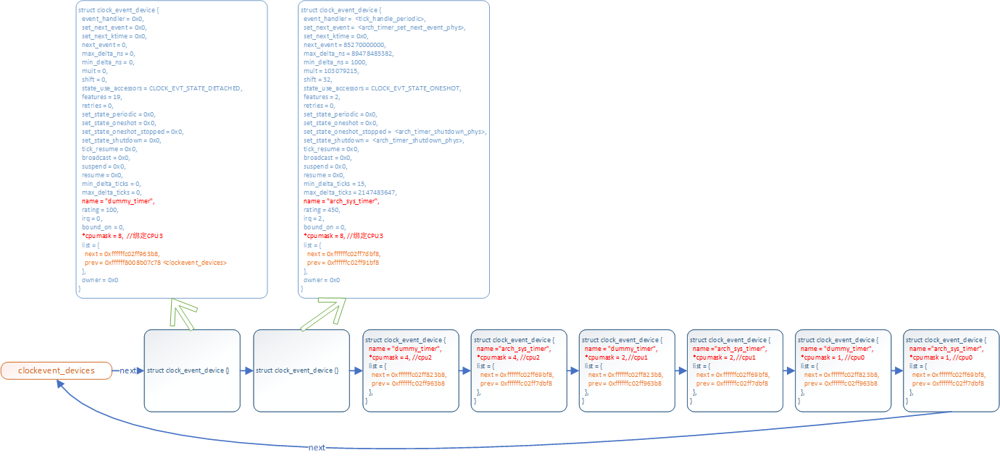

# 时间子系统之clock_event_device

**一、概述**

struct clock\_event\_device被来抽象一个可以产生clock event的timer硬件设备，其包含的函数指针可用于操作timer具体的硬件。

早期的内核版本中，进程的调度基于一个称之为tick的时钟滴答，通常使用时钟中断来定时地产生tick信号，每次tick定时中断都会进行进程的统计和调度，并对tick进行计数，记录在一个jiffies变量中，定时器的设计也是基于jiffies。这时候的内核代码中，几乎所有关于时钟的操作都是在machine级的代码中实现，很多公共的代码要在每个平台上重复实现。随着通用时钟框架的引入，内核需要支持高精度的定时器，通用时间框架为定时器硬件定义了一个标准的接口：clock\_event\_device，硬件级的代码只要按这个标准接口实现相应的硬件控制功能。

与clocksource有何区别？

clocksource和clock\_event\_device都是基于硬件counter虚拟出的设备，两者在软件层级上属于同一层级，无相互耦合关系，均为上层时间子系统提供通用的软件抽象。其主主要区别在于：

\-\-\-\-clocksource不能被编程，没有产生事件的能力，它主要被用于timekeeper来实现对真实时间进行精确的统计，_即获取计数器的cycles，再加以计算统计_。

\-\-\-\-clock\_event\_device则是可编程的，它可以工作在周期触发或单次触发模式（one shot），系统可以对它进行编程，以确定下一次事件触发的时间，clock\_event\_device主要用于实现普通定时器和高精度定时器，同时也用于产生tick事件，供给进程调度子系统使用。

**二、数据结构**

```
struct clock_event_device {
        void                    (*event_handler)(struct clock_event_device *);
        int                     (*set_next_event)(unsigned long evt, struct clock_event_device *);
        int                     (*set_next_ktime)(ktime_t expires, struct clock_event_device *);
        ktime_t                 next_event;
        u64                     max_delta_ns;
        u64                     min_delta_ns;
        u32                     mult;
        u32                     shift;
        enum clock_event_state  state_use_accessors;
        unsigned int            features;
        unsigned long           retries;

        int                     (*set_state_periodic)(struct clock_event_device *);
        int                     (*set_state_oneshot)(struct clock_event_device *);
        int                     (*set_state_oneshot_stopped)(struct clock_event_device *);
        int                     (*set_state_shutdown)(struct clock_event_device *);
        int                     (*tick_resume)(struct clock_event_device *);

        void                    (*broadcast)(const struct cpumask *mask);
        void                    (*suspend)(struct clock_event_device *);
        void                    (*resume)(struct clock_event_device *);
        unsigned long           min_delta_ticks;
        unsigned long           max_delta_ticks;

        const char              *name;
        int                     rating;  //时钟精度评分，类似于clocksource中的rating
        int                     irq;
        int                     bound_on;
        const struct cpumask    *cpumask;
        struct list_head        list;
        struct module           *owner;
} ____cacheline_aligned;
```

**event\_handler**

产生clock event的时候调用的handler，一般而言，底层的clock event chip driver会注册中断处理函数，在硬件timer中断到来的时候调用该timer中断handler，而在这个中断handler中再调用event\_handler。

**set\_next\_event/set\_next\_ktime**

产生clock event之后，如果是oneshot模式，在处理函数中要设定下一次的触发event产生的时间点，需要调用set\_next\_event/set\_next\_ktime设定，前者传入的单位是cycles，后者的单位是ktime。通常都是用前者，如果clock\_event\_device带有 CLOCK\_EVT\_FEAT\_KTIME硬件特征则使用后者。

**state\_use\_accessors**

描述时钟设备当前的状态值

```
enum clock_event_state {
        CLOCK_EVT_STATE_DETACHED,  //不可使用状态
        CLOCK_EVT_STATE_SHUTDOWN,   //断电状态，可以由PERIODIC or ONESHOT状态转变为该状态
        CLOCK_EVT_STATE_PERIODIC,  //能周期性的产生event的模式
        CLOCK_EVT_STATE_ONESHOT,   //编程一次只能产生一次event的模式
        CLOCK_EVT_STATE_ONESHOT_STOPPED, //当时钟设备处于ONESHOT模式下，产生event后未编程时处于该状态
};
```

**features**

features成员是描述底层硬件的具备功能特征

```
# define CLOCK_EVT_FEAT_PERIODIC        0x000001 //具备产生周期性event的能力
# define CLOCK_EVT_FEAT_ONESHOT         0x000002 //具备产生oneshot类型event的能力
# define CLOCK_EVT_FEAT_KTIME           0x000004 //底层使用ktime为单位，使用set_next_ktime设置下次触发时间

/*
* x86(64) specific (mis)features:
*
* - Clockevent source stops in C3 State and needs broadcast support.
* - Local APIC timer is used as a dummy device.
*/
# define CLOCK_EVT_FEAT_C3STOP          0x000008
# define CLOCK_EVT_FEAT_DUMMY           0x000010

/*
* Core shall set the interrupt affinity dynamically in broadcast mode
*/
# define CLOCK_EVT_FEAT_DYNIRQ          0x000020
# define CLOCK_EVT_FEAT_PERCPU          0x000040

/*
* Clockevent device is based on a hrtimer for broadcast
*/
# define CLOCK_EVT_FEAT_HRTIMER         0x000080
```

如果device的属性为CLOCK\_EVT\_FEAT\_PERIODIC，只能产生周期性的clock event，那么系统无法支持高精度timer和dynamic tick的情况。

如果device的属性为CLOCK\_EVT\_FEAT\_ONESHOT，那么即便是硬件不支持周期性的clock event，其实上层的软件可以通过不断设定next event的方法来模拟周期性的clock event。

**list**

内核使用两个全局链表管理不同类型不同绑定在CPU核上的clock\_event\_device

clockevent\_devices中都是当前active的device

clockevents\_released中都是由于种种原因，无法进入active list，从而挂入了该队列

```
static LIST_HEAD(clockevent_devices);
static LIST_HEAD(clockevents_released);
```

**set\_state\_shutdown**

调用硬件如设置寄存器关闭timer

**三、**

**四、ARM64实例**

** 4.1 初始化实例**

```
static void __arch_timer_setup(unsigned type,
                               struct clock_event_device *clk)
{
    clk->features = CLOCK_EVT_FEAT_ONESHOT;  //编译时确定该timer运行在oneshot模式
    clk->name = "arch_sys_timer";
    clk->rating = 450;
    clk->cpumask = cpumask_of(smp_processor_id());
    clk->irq = arch_timer_ppi[arch_timer_uses_ppi];
    clk->set_state_shutdown = arch_timer_shutdown_phys;
    clk->set_state_oneshot_stopped = arch_timer_shutdown_phys;
    clk->set_next_event = arch_timer_set_next_event_phys;
    clockevents_config_and_register(clk, arch_timer_rate, 0xf, 0x7fffffff);
}
```

**4.2 配置**

```
void clockevents_config_and_register(struct clock_event_device *dev,
                                     u32 freq, unsigned long min_delta,
                                     unsigned long max_delta)
{
        dev->min_delta_ticks = min_delta;
        dev->max_delta_ticks = max_delta;
        clockevents_config(dev, freq);
        clockevents_register_device(dev);
}

static void clockevents_config(struct clock_event_device *dev, u32 freq)
{
        u64 sec;

        if (!(dev->features & CLOCK_EVT_FEAT_ONESHOT))
                return;
        /*
         * Calculate the maximum number of seconds we can sleep. Limit
         * to 10 minutes for hardware which can program more than
         * 32bit ticks so we still get reasonable conversion values.
         */
        sec = dev->max_delta_ticks;
        do_div(sec, freq);
        if (!sec)
                sec = 1;
        else if (sec > 600 && dev->max_delta_ticks > UINT_MAX)
                sec = 600;

        clockevents_calc_mult_shift(dev, freq, sec);
        dev->min_delta_ns = cev_delta2ns(dev->min_delta_ticks, dev, false);
        dev->max_delta_ns = cev_delta2ns(dev->max_delta_ticks, dev, true);
}
```

**4.3 注册**

**4.3.1 注册中断**

```
arm_arch_timer.c

arch_timer_of_init
arch_timer_init()
static int __init arch_timer_register(void)
{
    request_percpu_irq(ppi, arch_timer_handler_phys, "arch_timer", arch_timer_evt);
}
```

**4.3.2 注册clock\_event\_device**

```
void clockevents_register_device(struct clock_event_device *dev)
{
        unsigned long flags;

        /* Initialize state to DETACHED */
        clockevent_set_state(dev, CLOCK_EVT_STATE_DETACHED);

        //检查cpumask，通常情况下一个clock_event_device 绑定到一个CPU核中
        if (dev->cpumask == cpu_all_mask) {
                WARN(1, "%s cpumask == cpu_all_mask, using cpu_possible_mask instead\n",
                     dev->name);
                dev->cpumask = cpu_possible_mask;
        }

        raw_spin_lock_irqsave(&clockevents_lock, flags);

        list_add(&dev->list, &clockevent_devices);  //加入全局链表clockevent_devices中
        tick_check_new_device(dev);
        clockevents_notify_released();

        raw_spin_unlock_irqrestore(&clockevents_lock, flags);
}
```

所有的clock\_event\_device实例都挂入全局链表clockevent\_devices中。通过vmcore看下ARM64中的实例链接实例：

从类型上分：有arch\_sys\_timer和dummy\_timer（虚拟时钟）两种

从CPU上分：以上两种timer在4核CPU上，每个核绑定一个clock\_event\_device，总共8个clock\_event\_device



**4.4 event\_handler实例**

ARM64实例中event\_handler函数为tick\_handle\_periodic

```
void tick_handle_periodic(struct clock_event_device *dev)
{
        int cpu = smp_processor_id();
        ktime_t next = dev->next_event;  //oneshot模式产生下个event的时间间隔

        tick_periodic(cpu);

        if (!clockevent_state_oneshot(dev))
                return;
        for (;;) {
                /*
                 * Setup the next period for devices, which do not have
                 * periodic mode:
                 */
                next = ktime_add(next, tick_period);  //计算出下个event的时间点
                
                //对clock_event_device进行编程，设定产生下一个event的时间
                //使用clock_event_device中的元素set_next_ktime或者set_next_event函数，调用硬件进行设置
                if (!clockevents_program_event(dev, next, false))
                        return;

                if (timekeeping_valid_for_hres())
                        tick_periodic(cpu);
        }
}       
```

event\_handler调用时机

```
//clock_event_device注册时会先注册该event的PPI中断，每个CPU核对应一个硬件中断源，待timer中断产生时调用如下中断处理函数
static irqreturn_t arch_timer_handler_phys(int irq, void *dev_id)
{
        struct clock_event_device *evt = dev_id;
        return timer_handler(ARCH_TIMER_PHYS_ACCESS, evt);
}

static __always_inline irqreturn_t timer_handler(const int access,
                                        struct clock_event_device *evt)
{
        unsigned long ctrl;

        ctrl = arch_timer_reg_read(access, ARCH_TIMER_REG_CTRL, evt);
        if (ctrl & ARCH_TIMER_CTRL_IT_STAT) {
                ctrl |= ARCH_TIMER_CTRL_IT_MASK;
                arch_timer_reg_write(access, ARCH_TIMER_REG_CTRL, ctrl, evt);
                evt->event_handler(evt); //调用具体的event回调函数如果是oneshot模式触发下一次event产生
                return IRQ_HANDLED;
        }

        return IRQ_NONE;        
}
```

**五、tick\_device**

tick\_device是对clock\_event\_device的一个简单的封装基本使用， 然后给系统定期地产生tick事件，模拟出系统的滴答时钟。

**5.1 数据结构**

```
enum tick_device_mode {
        TICKDEV_MODE_PERIODIC,
        TICKDEV_MODE_ONESHOT,
};

struct tick_device {
        struct clock_event_device *evtdev;
        enum tick_device_mode mode;
};
```

**5.2 数据实例**

tick\-common.c文件中定义每CPU 的tick\_cpu\_device，用于指向本地CPU核使用的tickdevice。

```
DECLARE_PER_CPU(struct tick_device, tick_cpu_device);
```

arm64实例值：

```
struct tick_device {
        struct clock_event_device *evtdev;  //指向该tick_device所属CPU核对应的arch_sys_timer
        enum tick_device_mode mode;         //等于TICKDEV_MODE_PERIODIC
};
```


**5.3 周期性时钟**

该CPU实例为HI3531DV200，内核配置是关闭高精度定时器，因此实例中clock\_event\_device的event\_handler == tick\_handle\_periodic，在onshot模式下，通过该函数可以模拟出一个周期性的时钟，作为CPU滴答时钟，一个中断作为一个CPU tick。

```
static void tick_periodic(int cpu)
{
        if (tick_do_timer_cpu == cpu) { //tick_do_timer_cpu表示所指定的进行do_timer的CPU，不能每个CPU都进入
                write_seqlock(&jiffies_lock);

                /* Keep track of the next tick event */
                tick_next_period = ktime_add(tick_next_period, tick_period);

                do_timer(1);  //jiffies计数加一
                write_sequnlock(&jiffies_lock);
                update_wall_time(); //更新timekeeper模块的时间
        }

        update_process_times(user_mode(get_irq_regs()));  //系统时钟滴答处理函数
        profile_tick(CPU_PROFILING);
}

void do_timer(unsigned long ticks)
{
        jiffies_64 += ticks;
        calc_global_load(ticks);
}

void update_process_times(int user_tick)
{       
        struct task_struct *p = current;
        
        /* Note: this timer irq context must be accounted for as well. */
        account_process_tick(p, user_tick);
        run_local_timers();
        rcu_check_callbacks(user_tick);
#ifdef CONFIG_IRQ_WORK
        if (in_irq())
                irq_work_tick();
#endif  
        scheduler_tick();
        run_posix_cpu_timers(p);
}
```
