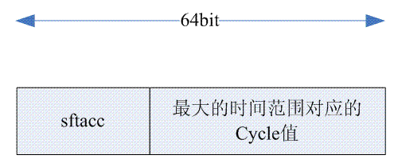

# 时间�系统之clock source

内核版本：4.9

CPU平�：ARM64/HI3531DV200

**一�概述**

clock source就是用�抽象一个在指定输入频�的clock下工作的一个counter。

**二�数�结�分�**

```
struct clocksource {
        cycle_t (*read)(struct clocksource *cs);  //读�时钟�的循�计数值
        cycle_t mask;  //mask最是最大的cycle数目，除以频�就是能表示的最大的时间范围（以秒为��）
        u32 mult;
        u32 shift;
        u64 max_idle_ns;
        u32 maxadj;
#ifdef CONFIG_ARCH_CLOCKSOURCE_DATA
        struct arch_clocksource_data archdata;
#endif
        u64 max_cycles;  //类似�max_idle_ns
        const char *name;
        struct list_head list;    //注册时挂入全局的时钟�链表clocksource_list
        int rating;
        int (*enable)(struct clocksource *cs);  //使能clock source
        void (*disable)(struct clocksource *cs); //失能clock source
        unsigned long flags;
        void (*suspend)(struct clocksource *cs); //挂起clock sour
        void (*resume)(struct clocksource *cs);  //��clock sour

        /* private: */
#ifdef CONFIG_CLOCKSOURCE_WATCHDOG
        /* Watchdog related data, used by the framework */
        struct list_head wd_list;
        cycle_t cs_last;
        cycle_t wd_last;
#endif
        struct module *owner;
};

/*
* Clock source flags bits::
*/
#define CLOCK_SOURCE_IS_CONTINUOUS              0x01
#define CLOCK_SOURCE_MUST_VERIFY                0x02
#define CLOCK_SOURCE_WATCHDOG                   0x10
#define CLOCK_SOURCE_VALID_FOR_HRES             0x20
#define CLOCK_SOURCE_UNSTABLE                   0x40
#define CLOCK_SOURCE_SUSPEND_NONSTOP            0x80
#define CLOCK_SOURCE_RESELECT                   0x100
```

**2.1 时间�算**

read读�上�的是计数器的cycles，但是�际内核中使用纳秒等固定���能统一，�定A个cycles，计数器的频�为F，A个计数循�对应的时间为T，则将A转��T\(d��纳秒\)公�为：

```
T(转��的纳秒数目) = (A / F)  x  NSEC_PER_SEC
```

由�内核中�适��浮点�算�除法�算，以上公��好直�处�，所以利用��计算好的mult和shift�计算T，但是这�计算方法会�失精度，计算函数如下：

```
/* clocksource_cyc2ns - converts clocksource cycles to nanoseconds
* @cycles:     cycles
* @mult:       cycle to nanosecond multiplier
* @shift:      cycle to nanosecond divisor (power of two)
*/
static inline s64 clocksource_cyc2ns(u64 cycles, u32 mult, u32 shift)
{
        return ((u64) cycles * mult) >> shift;
}
```

**2.2 mask**

mask表示了该计数器的�树，也表示了计数器所能容纳的最大cycles。

函数void \_\_clocksource\_update\_freq\_scale\(struct clocksource \*cs, u32 scale, u32 freq\) 中使用到，mask / freq �等�计数器计数满时代表的时间。           

```
                sec = cs->mask;  //将mask赋值给sec
                do_div(sec, freq);  //mask / freq等�计数器所能表示最大时间，��秒
```

通常mask在代�中定义struct clocksource时显�确定，表�计数器的计数容�，在ARM64�例中mask为0xffffffffffffff。

**2.3 mult和shift计算**

当注册一个clocksource时，内核通过函数clocks\_calc\_mult\_shift\(\)函数为该clocksource计算mult和shift

```
// from：当�计数器counter的输入频�
// to： 在�考虑缩放系数scale的情况下，该入�表示��form个cycles,�以转��的纳秒数
        在注册clocksource的函数__clocksource_update_freq_scale中，该�数为NSEC_PER_SEC / scale
// maxsec： 最大�转�时间范围（��秒），转�范围maxsec影�mult和shift的值，在��计算�溢出的情况下，如�maxsec值�大，则会��转�计算精度
        �际使用中适当��maxsec��高mult和shift的值，通常最大�600秒。
void clocks_calc_mult_shift(u32 *mult, u32 *shift, u32 from, u32 to, u32 maxsec)
{
        u64 tmp;
        u32 sft, sftacc= 32;

        /* Calculate the shift factor which is limiting the conversion range:*/
        // from是计数器的频�，maxsec是最大转�时间秒。maxsec * from就是将秒数转��了最大cycle数
        tmp = ((u64)maxsec * from) >> 32;
        while (tmp) {
                tmp >>=1;
                sftacc--;
        }

        /* Find the conversion shift/mult pair which has the best accuracy and fits the maxsec conversion range*/
        // ��计算公�为：mult = (ns<<shift)/cycles，1秒对应的cycles数为counter的频�，迭代shift�32->1，以此计算出对应的mult
        // �判断当�计算出的mult是�会溢出，�会溢出则此mult为最优值。为何需�将shift�高到�迭代？因为shift越大，则mult也是越大
        for (sft = 32; sft > 0; sft--) {
                tmp = (u64) to << sft;
                tmp += from / 2; //此处特殊处�为通过四�五入达到计算出最优值，详�：b5776c4a6d0afc13697e8452b9ebe1cc4d961b74
                do_div(tmp, from);
                if ((tmp >> sftacc) == 0)
                        break;
        }
        *mult = tmp;
        *shift = sft;
}
```

（a）from是count的输入频�，maxsec是最大的表示的范围。maxsec \* from就是将秒数转��了cycle数目。对�大�32 bit的counter而言，最大的cycle数目有�能需�超过32个bit�表示，因此这里�进行�移32bit的�作。

（b）**sftacc�存了左移多少��会造�最大cycle数（对应最大的时间范围值）的溢出**（将cycles转��纳秒的公�为：\(cycles \* mult\) \>\> shift， 在�第一步乘法的时候�能会出�溢出，因此此处计算出的\(1\<\<sftacc\)是mult的最大值，如�大�这个值mult\*cycles会产生64�溢出\)，对�32 bit以下的counter，统一设定为32个bit，而对�大�32 bit的counter，sftacc需�根�tmp值（这时候tmp�存了最大cycle数的高32 bit值）进行计算。

  

（c）如何��最佳的mult和shift组�？mult这个因�一定是越大越好，mult越大也就是�味�shift越大。当然shift总有一个起始值，设定起始值为32bit，因此sft�32开始�索，看看是�满足最大时间范围的�求。如�满足，那么就找到最佳的mult和shift组�，�则�sft递�，进行下一轮�索。

（d）考虑如何计算mult值。根æ�®å…¬å¼�_（cycles \* mult\) \>\> shift Â_ å�¯ä»¥å¾—到ns数，由此å�¯ä»¥å¾—到计算mult值的公å¼�：

```
mult = (ns<<shift)/cycles
```

如�我们设定ns数是10^9纳秒（也就是1秒）的�，cycles数目就是频�值（所谓频��就是1秒振�的次数嘛）。因此上�的公��以修改为：

```
mult = (NSEC_PER_SEC<<shift)/freq
```

在步骤b中计算得到的sftacc就是multi的最大的bit数目。因此，\(tmp \>\> sftacc\)== 0就是判断找到最优mult的�件。

总结：multå’Œshift的计算，以1S所拥有的nsæ•°å�Šå…¶å¯¹åº”çš„cycles（频ç�‡å€¼ï¼‰æ•°ä»£å…¥å…¬å¼�_ ns =（cycl__es \* mult\) \>\> shiftÂ_  计算，但是由äº�有两个å�˜é‡�，此公å¼�有多个解，由äº�需è¦�找到最大且ä¸�出ç�°64ä½�溢出的multå’Œshift组å�ˆï¼Œé‡‡ç”¨ä¾�次å°�试shiftä»�32到1å�„ç§�情况，找到最先满足è¦�求的一组解。

**2.4 max\_idle\_ns**

传统的Unix都是有一个周期性的tick，如100HZ设定为10ms，但是如�linux kernel也�许你�置�NO\_HZ，这时候系统就�存在周期性的tick了，如�系统一直idle����或者隔很长时间���计数器的计数值时，此时���会出�计算溢出的情况。由�counter value和纳秒的转��制，这个idle的时间�能超过max\_idle\_ns。

计算方法：

ä»�cycles转æ�¢æˆ�ns使用公å¼�：_ns =（cycl__es \* mult\) \>\> shift     Â_ 

如�cycles太大，则会造�计算溢出 max\(ns\)=max\(cycles\)  \*  mult \>\> shift，考虑到余�和溢出问题，具体计算如下

```
static inline void clocksource_update_max_deferment(struct clocksource *cs)
{
        cs->max_idle_ns = clocks_calc_max_nsecs(cs->mult, cs->shift,
                                                cs->maxadj, cs->mask,
                                                &cs->max_cycles);
}

u64 clocks_calc_max_nsecs(u32 mult, u32 shift, u32 maxadj, u64 mask, u64 *max_cyc)
{
        u64 max_nsecs, max_cycles;

        /*
         * Calculate the maximum number of cycles that we can pass to the
         * cyc2ns() function without overflowing a 64-bit result.
         */
        max_cycles = ULLONG_MAX;
        do_div(max_cycles, mult+maxadj);  //在���出�64�溢出的情况下，计算出最大的cycles，因此上�直�用64的最大数�代入计算

        /*
         * The actual maximum number of cycles we can defer the clocksource is
         * determined by the minimum of max_cycles and mask.
         * Note: Here we subtract the maxadj to make sure we don't sleep for
         * too long if there's a large negative adjustment.
         */
        max_cycles = min(max_cycles, mask);  
        max_nsecs = clocksource_cyc2ns(max_cycles, mult - maxadj, shift);

        /* return the max_cycles value as well if requested */
        if (max_cyc)
                *max_cyc = max_cycles;

        /* Return 50% of the actual maximum, so we can detect bad values */
        max_nsecs >>= 1;  //预留50%余�

        return max_nsecs;
}
```

使用场景：

在函数tick\_nohz\_stop\_sched\_tick中会��max\_idle\_ns，用�nohz的。

**2.5 ratting**

时钟�评分，ratting�应时钟�的质�，其值为1\-499之间，值越高则时钟�精度越好。ratting在代�中定义struct clocksource时显�确定，表�定时器的精度。

```
1-99: Unfit for real use Only available for bootup and testing purposes.
100-199: Base level usability. Functional for real use, but not desired.
200-299: Good. A correct and usable clocksource.
300-399: Desired. A reasonably fast and accurate clocksource.
400-499: Perfect. The ideal clocksource. A must-use where available.
```

clocksource挂入全局的clocksource\_list链表时，是以ratting���列，便�系统选择一个精度最高的时钟�。

**三�clock soure�例**

**3.1 vmcore看ARM64 clocksource�例**

\+\-\-\-\-\-\-\-\-\-\-\-\-\-\-\-\-\-\-\-\-\-\-\-\-\-\-\-\-\-\-\-\-\-\-\-\-\-\-\-\-\-\-\-\-\-\-\-\-\-\-\-\-\-\-\-\-\-\-\-\-\-\-\-\-\-\-\-\-\-\-\-\-\-\-\-\-\-\-\-\+

\+\-\-\-\>clocksource\_list \-\-\-\> clocksource\_counter \-\-\-\> clocksource\_jiffies\-\-\-\+

```
struct clocksource {
  read = 0xffffff800866ae50 <arch_counter_read>,
  mask = 0xffffffffffffff,
  mult = 0x29aaaaab,
  shift = 0x18,
  max_idle_ns = 0x66a1710420,
  maxadj = 0x4955555,
  archdata = {
    vdso_direct = 0x1
  },
  max_cycles = 0x588fe9dc0,
  name = 0xffffff800898e0f8 "arch_sys_counter",
  list = {
    next = 0xffffff8008b07b20 <clocksource_jiffies+56>,
    prev = 0xffffff8008b076c0 <clocksource_list>
  },
  rating = 0x190,
  enable = 0x0,
  disable = 0x0,
  flags = 0xa1,
  suspend = 0x0,
  resume = 0x0,
  mark_unstable = 0x0,
  tick_stable = 0x0,
  owner = 0x0
}

struct clocksource {
  read = 0xffffff800810cb50 <jiffies_read>,
  mask = 0xffffffff,
  mult = 0x98968000,
  shift = 0x8,
  max_idle_ns = 0x43e6cfffbc1930,
  maxadj = 0x10c8e000,
  archdata = {
    vdso_direct = 0x0
  },
  max_cycles = 0xffffffff,
  name = 0xffffff8008916c20 "jiffies",
  list = {
    next = 0xffffff8008b076c0 <clocksource_list>,
    prev = 0xffffff8008b35bc8 <clocksource_counter+56>
  },
  rating = 0x1,
  enable = 0x0,
  disable = 0x0,
  flags = 0x0,
  suspend = 0x0,
  resume = 0x0,
  mark_unstable = 0x0,
  tick_stable = 0x0,
  owner = 0x0
}
```

3.2 clocksource dts�述

```
            arm-timer {
                compatible = "arm,armv8-timer";
                interrupts = <1 13 0xf04>,
                             <1 14 0xf04>;
                clock-frequency = <50000000>;
            };

            timer@12000000 {
                compatible = "hisilicon,hisp804";
                reg = <0x12000000 0x20>, /* clocksource */
                      <0x1d840000 0x20>, /* local timer for each cpu */
                      <0x1d840020 0x20>,
                      <0x1d850000 0x20>,
                      <0x1d850020 0x20>;
                interrupts = <0 113 4>, /* irq of local timer0/1 */
                             <0 114 4>, /* irq of local timer2/3 */
                             <0 115 4>, /* irq of local timer4/5 */
                             <0 116 4>; /* irq of local timer6/7 */
                clocks = <&clk_3m>;
                clock-names = "apb_pclk";
            };
```

**3.3 arch\_sys\_counter定义**

```
static struct clocksource clocksource_counter = {
        .name   = "arch_sys_counter",
        .rating = 400,
        .read   = arch_counter_read,
        .mask   = CLOCKSOURCE_MASK(56),
        .flags  = CLOCK_SOURCE_IS_CONTINUOUS,
};
```

**3.4 clocksource 注册**

```
static void __init arch_counter_register(unsigned type)
{
    clocksource_register_hz(&clocksource_counter, arch_timer_rate);
}

static inline int clocksource_register_hz(struct clocksource *cs, u32 hz)
{
        return __clocksource_register_scale(cs, 1, hz);  
}

int __clocksource_register_scale(struct clocksource *cs, u32 scale, u32 freq)
{
        unsigned long flags;

        /* Initialize mult/shift and max_idle_ns */
        __clocksource_update_freq_scale(cs, scale, freq);  //更新计算clocksource中�个元素的值

        /* Add clocksource to the clocksource list */
        mutex_lock(&clocksource_mutex);

        clocksource_watchdog_lock(&flags);
        clocksource_enqueue(cs);           //以ratting逆��列加入clocksource_list全局链表
        clocksource_enqueue_watchdog(cs);  //加入watchdog_list链表头部，以cs->wd_list元素��
        clocksource_watchdog_unlock(&flags);

        clocksource_select();               //选择一个最好的时钟�
        clocksource_select_watchdog(false); //选择一个时钟�作为watch_dog时钟
        __clocksource_suspend_select(cs);
        mutex_unlock(&clocksource_mutex);
        return 0;
}
```

**3.5 时钟�选择**

**3.6 clocksource watchdog Â** 

五�jiffies

�考资料：

[https://blog.csdn.net/DroidPhone/article/details/7975694](https://blog.csdn.net/DroidPhone/article/details/7975694)
