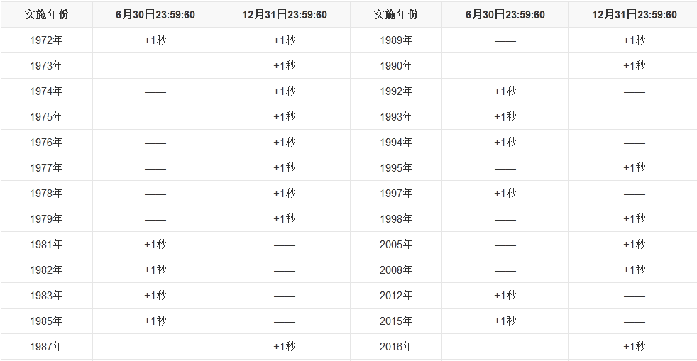
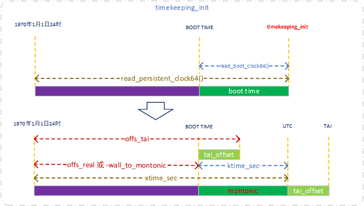
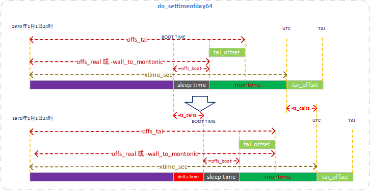
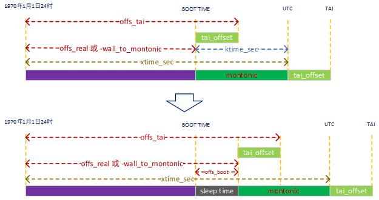
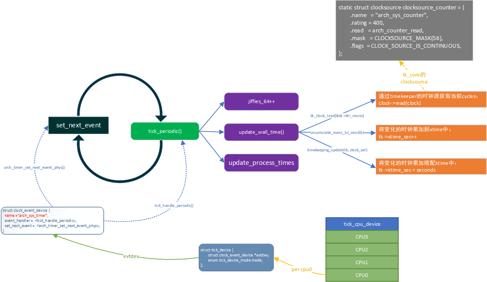
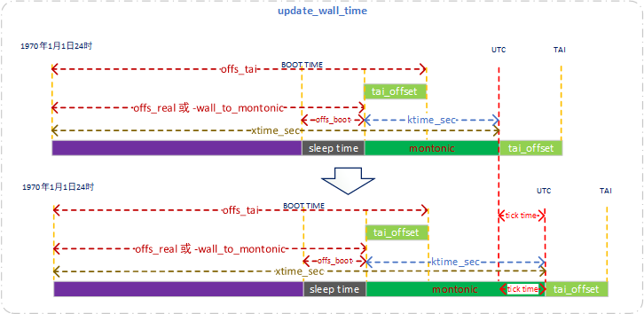
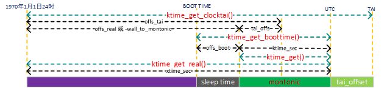

# 时间子系统之timekeeper

**一、概述**

timekeeper模块是一个提供时间服务的基础模块。Linux内核提供各种time line，real time clock，monotonic clock、monotonic raw clock等，timekeeping模块就是负责跟踪、维护这些timeline的，并且向其他模块（timer相关模块、用户空间的时间服务等）提供服务，而timekeeping模块维护timeline的基础是基于clocksource模块和tick模块。通过tick模块的tick事件，可以周期性的更新time line，通过clocksource模块、可以获取tick之间更精准的时间信息。

**二、数据结构**

```
struct timekeeper {
        struct tk_read_base     tkr_mono;
        struct tk_read_base     tkr_raw;
        u64                     xtime_sec;
        unsigned long           ktime_sec;
        struct timespec64       wall_to_monotonic;
        ktime_t                 offs_real;
        ktime_t                 offs_boot;
        ktime_t                 offs_tai;
        s32                     tai_offset;
        unsigned int            clock_was_set_seq;
        u8                      cs_was_changed_seq;
        ktime_t                 next_leap_ktime;
        struct timespec64       raw_time;

        /* The following members are for timekeeping internal use */
        cycle_t                 cycle_interval;
        u64                     xtime_interval;
        s64                     xtime_remainder;
        u64                     raw_interval;
        /* The ntp_tick_length() value currently being used.
         * This cached copy ensures we consistently apply the tick
         * length for an entire tick, as ntp_tick_length may change
         * mid-tick, and we don't want to apply that new value to
         * the tick in progress.
         */
        u64                     ntp_tick;
        /* Difference between accumulated time and NTP time in ntp
         * shifted nano seconds. */
        s64                     ntp_error;
        u32                     ntp_error_shift;
        u32                     ntp_err_mult;
};

struct timespec64 {
        time64_t        tv_sec;                 /* seconds */
        long            tv_nsec;                /* nanoseconds */
};

/**
* struct tk_read_base - base structure for timekeeping readout
* @clock:      Current clocksource used for timekeeping.
* @mask:       Bitmask for two's complement subtraction of non 64bit clocks
* @cycle_last: @clock cycle value at last update
* @mult:       (NTP adjusted) multiplier for scaled math conversion
* @shift:      Shift value for scaled math conversion
* @xtime_nsec: Shifted (fractional) nano seconds offset for readout
* @base:       ktime_t (nanoseconds) base time for readout
*
* This struct has size 56 byte on 64 bit. Together with a seqcount it
* occupies a single 64byte cache line.
*
* The struct is separate from struct timekeeper as it is also used
* for a fast NMI safe accessors.
*/
struct tk_read_base {
        struct clocksource      *clock;
        cycle_t                 mask;
        cycle_t                 cycle_last;
        u32                     mult;
        u32                     shift;
        u64                     xtime_nsec;
        ktime_t                 base;
};

typedef u64 cycle_t;

union ktime {
        s64     tv64;           
};      
typedef union ktime ktime_t;            /* Kill this */

static struct {
        seqcount_t              seq;
        struct timekeeper       timekeeper;
} tk_core;

struct timeval {
        __kernel_time_t         tv_sec;         /* seconds */       //单位秒
        __kernel_suseconds_t    tv_usec;        /* microseconds */  //单位微秒
};

struct timespec64 {
        time64_t        tv_sec;                 /* seconds */
        long            tv_nsec;                /* nanoseconds */ //单位纳秒
};
```

wall\_to\_monotonic

记录了墙上时间和monotonic时间之间的偏移量，当需要获得monotonic时间时，把xtime和wall\_to\_monotonic相加即可，因为默认启动时monotonic时间为0，所以实际上wall\_to\_monotonic的值是一个负数，它和xtime同一时间被初始化，在timekeeping\_init\(\)函数中初始化。

**三、时钟线介绍**

**3.1 RTC时间**

不管系统是否上电，RTC中的时间信息都不会丢失，计时会一直持续进行，硬件上通常使用一个后备电池对RTC硬件进行单独的供电。有的RTC模块有专有的硬件，使用如I2C外部低速总线访问，需要专有的硬件驱动。RTC使用的也是墙上时间（wall time）。

**3.2 xtime**

xtime和RTC时间一样，都是人们日常所使用的墙上时间（wall time，自1970年1月1日24时到当前经历的时间），只是RTC时间的精度通常比较低，访问速度可能也比较慢。为此，内核维护了另外一个wall time时间：xtime，取决于用于对xtime计时的clocksource，它的精度甚至可以达到纳秒级别，因为xtime实际上是一个内存中的变量，它的访问速度非常快，内核大部分时间都是使用xtime来获得当前时间信息。xtime记录的是自1970年1月1日24时到当前时刻所经历的纳秒数，该时间用户态调整可以改变。

用户态通过c库函数gettimeofday\(\)获取墙上时间，时间精度为微妙，本质上通过sys\_gettimeofday系统调用，再往下的内核实现是do\_gettimeofday函数,。

```
static inline void do_gettimeofday(struct timeval *tv)
{
        struct timespec64 now;

        ktime_get_real_ts64(&now);
        tv->tv_sec = now.tv_sec;
        tv->tv_usec = now.tv_nsec/1000;
}

void ktime_get_real_ts64(struct timespec64 *ts)
{
        struct timekeeper *tk = &tk_core.timekeeper;
        unsigned long seq;
        u64 nsecs;
        
        do {    
                seq = read_seqcount_begin(&tk_core.seq);
        
                ts->tv_sec = tk->xtime_sec; //xtime的基础来源于tk_core.timekeeper.xtime_sec
                nsecs = timekeeping_get_ns(&tk->tkr_mono);

        } while (read_seqcount_retry(&tk_core.seq, seq));

        ts->tv_nsec = 0;
        timespec64_add_ns(ts, nsecs);
}

static inline u64 timekeeping_get_ns(const struct tk_read_base *tkr)
{
        u64 delta;

        delta = timekeeping_get_delta(tkr);
        return timekeeping_delta_to_ns(tkr, delta);
}
```

**3.3 monotonic time**

该时间自系统开机后就一直单调地增加，它不像xtime可以因用户的调整时间而产生跳变。该时间不计算系统休眠的时间，系统休眠时，monotoic时间不会递增。受NTP时间调整影响。

```
static void tk_set_wall_to_mono(struct timekeeper *tk, struct timespec64 wtm)
{
        struct timespec64 tmp;

        /*
         * Verify consistency of: offset_real = -wall_to_monotonic
         * before modifying anything
         */
        set_normalized_timespec64(&tmp, -tk->wall_to_monotonic.tv_sec,
                                        -tk->wall_to_monotonic.tv_nsec);
        WARN_ON_ONCE(tk->offs_real.tv64 != timespec64_to_ktime(tmp).tv64);
        tk->wall_to_monotonic = wtm;
        set_normalized_timespec64(&tmp, -wtm.tv_sec, -wtm.tv_nsec);
        tk->offs_real = timespec64_to_ktime(tmp);
        tk->offs_tai = ktime_add(tk->offs_real, ktime_set(tk->tai_offset, 0));
}
```

**3.4 raw monotonic time**

该时间与monotonic时间类似，也是单调递增的时间，唯一的不同是：raw monotonic time“更纯净”，他不会受到NTP时间调整的影响，它代表着系统独立时钟硬件对时间的统计。

**3.5 boot time**

与monotonic时间相同，不过会累加上系统休眠的时间，它代表着系统上电后的总时间。

**3.6 TAI时间**

人们通常使用的是UTC时间，UTC时间与地球自转有关，由于地球自转的不均匀性和长期变慢性，UTC时间与严格意义上的时间（原子计时）是有偏差，这个偏差在5000年后将会有1小时，如果不去调整UTC时间，那么5000年后的正午将会是13:00而不是12:00。计算机的采用计数器计时，类似于原子时钟，因此要修正UTC时间则需要引入润秒（leap second）。即相对于真实时间减慢UTC时间，以下是从1972年开始至今所做的闰秒调整。



**四、时钟变化**

**4.1 timekeeping初始化**

```
void __init timekeeping_init (void)
{
        struct timekeeper *tk = &tk_core.timekeeper;
        struct clocksource *clock;
        unsigned long flags;
        struct timespec64 now, boot, tmp;

        read_persistent_clock64(&now);  //读取持续的时钟，例如RTC时钟，在ARM中读取的值为0
        if (!timespec64_valid_strict(&now)) {
                pr_warn("WARNING: Persistent clock returned invalid value!\n"
                        "         Check your CMOS/BIOS settings.\n");
                now.tv_sec = 0;
                now.tv_nsec = 0;
        } else if (now.tv_sec || now.tv_nsec)
                persistent_clock_exists = true;
       
        read_boot_clock64(&boot);       //读取boot的时间，在ARM中读取的值为0
        if (!timespec64_valid_strict(&boot)) {
                pr_warn("WARNING: Boot clock returned invalid value!\n"
                        "         Check your CMOS/BIOS settings.\n");
                boot.tv_sec = 0;
                boot.tv_nsec = 0;
        }

        raw_spin_lock_irqsave(&timekeeper_lock, flags);
        write_seqcount_begin(&tk_core.seq);
        ntp_init();

        clock = clocksource_default_clock(); //获取到默认的时钟源为clocksource_jiffies
        if (clock->enable)
                clock->enable(clock);
        tk_setup_internals(tk, clock);  //将timekeeping模块的时钟源设置为clocksource_jiffies，并初始化部分结构体成员

        tk_set_xtime(tk, &now);        //将从持续时钟读到的时间设置到xtime，实际上多数情况下还是设置为0
        tk->raw_time.tv_sec = 0;
        tk->raw_time.tv_nsec = 0;
        if (boot.tv_sec == 0 && boot.tv_nsec == 0)
                boot = tk_xtime(tk);

        set_normalized_timespec64(&tmp, -boot.tv_sec, -boot.tv_nsec);
        tk_set_wall_to_mono(tk, tmp);  //根据boot时间初始化monotonic时间及其相关的时间

        timekeeping_update(tk, TK_MIRROR | TK_CLOCK_WAS_SET);

        write_seqcount_end(&tk_core.seq);
        raw_spin_unlock_irqrestore(&timekeeper_lock, flags);
}
```



timekeeping初始化时各个时间设置如上图，但是实际上对于多数环境read\_persistent\_clock64和read\_boot\_clock64都是0，此时的函数timekeeping\_init运行的时刻和设备的boot time是重合的。

**4.2 timekeeping设置**

do\_settimeofday64设置的是墙上时间，不会修改系统自启动运行以来本身的时间长度，如monontic时间长度，本质上只是修改boot time的时刻。通过修改boot time的时刻，后续的UTC、TAI时间也都跟着变化。

```
//参数ts为修改当前的UTC时间为ts
int do_settimeofday64(const struct timespec64 *ts)
{
        struct timekeeper *tk = &tk_core.timekeeper;
        struct timespec64 ts_delta, xt;
        unsigned long flags;
        int ret = 0;

        raw_spin_lock_irqsave(&timekeeper_lock, flags);
        write_seqcount_begin(&tk_core.seq);

        timekeeping_forward_now(tk);

        xt = tk_xtime(tk);
        ts_delta.tv_sec = ts->tv_sec - xt.tv_sec; //计算设置前后的时间差ts_delta
        ts_delta.tv_nsec = ts->tv_nsec - xt.tv_nsec;

        tk_set_wall_to_mono(tk, timespec64_sub(tk->wall_to_monotonic, ts_delta));  //修改墙上时间以及相关联的时间

        tk_set_xtime(tk, ts);  //修改utc时间
out:
        timekeeping_update(tk, TK_CLEAR_NTP | TK_MIRROR | TK_CLOCK_WAS_SET);

        write_seqcount_end(&tk_core.seq);
        raw_spin_unlock_irqrestore(&timekeeper_lock, flags);

        /* signal hrtimers about time change */
        clock_was_set();

        return ret;
}
```



**4.3 timekeeping挂起恢复**

cpu从挂起状态恢复时，读取RTC时间，将SUSPEND期间的时间delta统计到timekeeper模块中去

```
static void __timekeeping_inject_sleeptime(struct timekeeper *tk,
                                           struct timespec64 *delta)
{
        tk_xtime_add(tk, delta);  //将delta增加到tk->xtime_sec中实现将修正UTC时间
        tk_set_wall_to_mono(tk, timespec64_sub(tk->wall_to_monotonic, *delta)); //挂起期间monotonic时间本身不变，因此
        tk_update_sleep_time(tk, timespec64_to_ktime(*delta));
        tk_debug_account_sleep_time(delta);
}
```

挂起恢复时，monotonic不变，挂起时间需要增加到xtime\_sec中修正UTC时间中去，表明挂起期间时间的流逝。BOOT TIME即设备启动的时刻不会发生变化，但是挂起的总时间统计到offs\_boot中去。修正前后满足以下公式：

```
xtime_sec + wall_to_monotonic == (xtime_sec + delat) + (wall_to_monotonic - delta)
```



**4.4 timekeeping时钟更新**

随着时间的流逝，timekeeper中时间需要不断的更新，驱动时钟更新的模块是tick\_device，而更新时钟的来源这是timekeeper所指向的时钟源，在ARM64中这个时钟源是clocksource\_counter，每个核都有其独立的定时器核clocksource\_counter。tick\_device驱动周期性的时钟，在每一次周期性的处理中，都需要根据现有timekeeper状态以及从时钟源读取到的cycles，来更新timekeeper。

具体的时钟更新函数路径为：tick\_handle\_periodic\-\>tick\_periodic\-\>update\_wall\_time\(\)

```
void update_wall_time(void)
{
        struct timekeeper *real_tk = &tk_core.timekeeper;
        struct timekeeper *tk = &shadow_timekeeper;
        cycle_t offset;
        int shift = 0, maxshift;
        unsigned int clock_set = 0;
        unsigned long flags;

        raw_spin_lock_irqsave(&timekeeper_lock, flags);

        /* Make sure we're fully resumed: */
        if (unlikely(timekeeping_suspended))
                goto out;

#ifdef CONFIG_ARCH_USES_GETTIMEOFFSET
        offset = real_tk->cycle_interval;
#else
        offset = clocksource_delta(tk_clock_read(&tk->tkr_mono),
                                   tk->tkr_mono.cycle_last, tk->tkr_mono.mask);
#endif

        /* Check if there's really nothing to do */
        if (offset < real_tk->cycle_interval)
                goto out;

        /* Do some additional sanity checking */
        timekeeping_check_update(real_tk, offset);

        shift = ilog2(offset) - ilog2(tk->cycle_interval);
        shift = max(0, shift);
        /* Bound shift to one less than what overflows tick_length */
        maxshift = (64 - (ilog2(ntp_tick_length())+1)) - 1;
        shift = min(shift, maxshift);
        while (offset >= tk->cycle_interval) {
                offset = logarithmic_accumulation(tk, offset, shift,
                                                        &clock_set);
                if (offset < tk->cycle_interval<<shift)
                        shift--;
        }

        /* correct the clock when NTP error is too big */
        timekeeping_adjust(tk, offset);

        old_vsyscall_fixup(tk);

        /*
         * Finally, make sure that after the rounding
         * xtime_nsec isn't larger than NSEC_PER_SEC
         */
        clock_set |= accumulate_nsecs_to_secs(tk);

        write_seqcount_begin(&tk_core.seq);

        timekeeping_update(tk, clock_set);
        memcpy(real_tk, tk, sizeof(*tk));
        /* The memcpy must come last. Do not put anything here! */
        write_seqcount_end(&tk_core.seq);
out:
        raw_spin_unlock_irqrestore(&timekeeper_lock, flags);
        if (clock_set)
                /* Have to call _delayed version, since in irq context*/
                clock_was_set_delayed();
}
```



每次时钟周期都需要更新墙上时间，但是实际每次时钟周期真正的cycles是不会完全相等的，更新的过主要是更新montonic时间的长度，相应的其他相关的时间也需要增加。时间增加的模型如下图，UTC时间会增长一个tickc time。



**五、获取时间**

获取时间的接口，考虑到上层想要获取的接口性能、时间精度以及时间形式，内核提供了各种不同的接口。

1、获取monotonic clock的时间值：ktime\_get\(\)和ktime\_get\_ts64\(\)，两个接口间的区别是返回的时间格式不同。

```
ktime_t ktime_get(void)
{
        struct timekeeper *tk = &tk_core.timekeeper;
        unsigned int seq;
        ktime_t base;
        s64 nsecs;

        do {
                seq = read_seqcount_begin(&tk_core.seq);
                base = tk->tkr_mono.base;
                nsecs = timekeeping_get_ns(&tk->tkr_mono);  //通过clocksoure获取到实时的纳秒时间，以保证该接口的时间精度。

        } while (read_seqcount_retry(&tk_core.seq, seq));

        return ktime_add_ns(base, nsecs);
}

void ktime_get_ts64(struct timespec64 *ts);
```

2、获取real time clock的时间值：ktime\_get\_real和ktime\_get\_real\_ts

```
static inline ktime_t ktime_get_real(void)
{
        return ktime_get_with_offset(TK_OFFS_REAL);
}

static ktime_t *offsets[TK_OFFS_MAX] = {
        [TK_OFFS_REAL]  = &tk_core.timekeeper.offs_real,
        [TK_OFFS_BOOT]  = &tk_core.timekeeper.offs_boot,
        [TK_OFFS_TAI]   = &tk_core.timekeeper.offs_tai,
};

ktime_t ktime_get_with_offset(enum tk_offsets offs)
{
        struct timekeeper *tk = &tk_core.timekeeper;
        unsigned int seq;
        ktime_t base, *offset = offsets[offs];
        s64 nsecs;

        do {
                seq = read_seqcount_begin(&tk_core.seq);
                base = ktime_add(tk->tkr_mono.base, *offset);  //获取monotonic + real_offset的时间
                nsecs = timekeeping_get_ns(&tk->tkr_mono);     //获取当前时刻的纳秒时间以保证精度

        } while (read_seqcount_retry(&tk_core.seq, seq));

        return ktime_add_ns(base, nsecs);

}
```

3、获取boot clock的时间值：ktime\_get\_boottime和get\_monotonic\_boottime

```
static inline ktime_t ktime_get_boottime(void)
{
        return ktime_get_with_offset(TK_OFFS_BOOT);
}

ktime_t ktime_get_with_offset(enum tk_offsets offs)
{
        ......
        do {
                seq = read_seqcount_begin(&tk_core.seq);
                base = ktime_add(tk->tkr_mono.base, tk_core.timekeeper.offs_boot);  //获取monotonic + offs_boot的时间
                nsecs = timekeeping_get_ns(&tk->tkr_mono);     //获取当前时刻的纳秒时间以保证精度
        } while (read_seqcount_retry(&tk_core.seq, seq));

        return ktime_add_ns(base, nsecs);
}
```

4、获取TAI clock的时间值：ktime\_get\_clocktai和timekeeping\_clocktai

```
static inline ktime_t ktime_get_clocktai(void)
{
        return ktime_get_with_offset(TK_OFFS_TAI);
}

ktime_t ktime_get_with_offset(enum tk_offsets offs)
{
        ......
        do {
                seq = read_seqcount_begin(&tk_core.seq);
                base = ktime_add(tk->tkr_mono.base, tk_core.timekeeper.offs_tai);  //获取monotonic +offs_tai的时间
                nsecs = timekeeping_get_ns(&tk->tkr_mono);     //获取当前时刻的纳秒时间以保证精度
        } while (read_seqcount_retry(&tk_core.seq, seq));

        return ktime_add_ns(base, nsecs);
}
```

从时间图上，可以看出以上不同接口获取的时间：



参考资料：

[https://www.wowotech.net/timer\_subsystem/timekeeping.html](https://www.wowotech.net/timer_subsystem/timekeeping.html)
