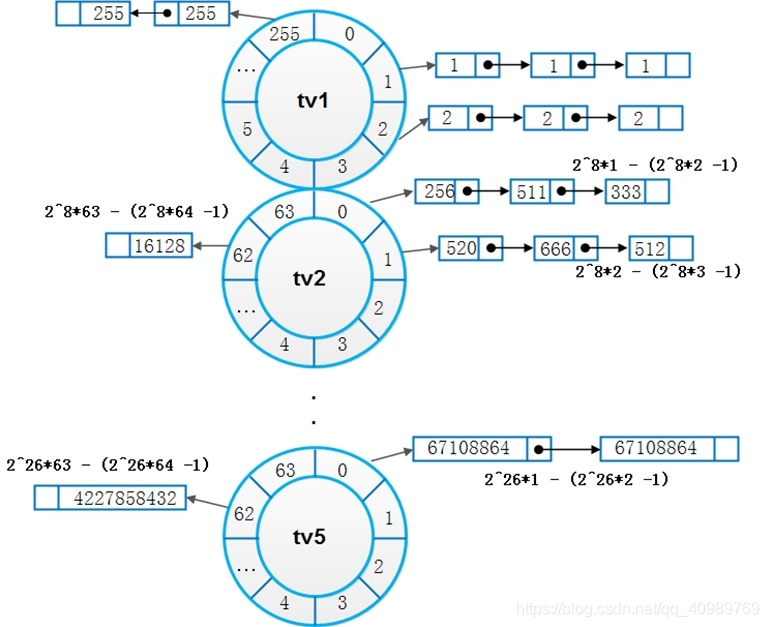
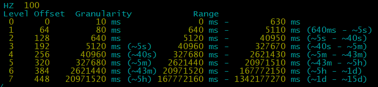
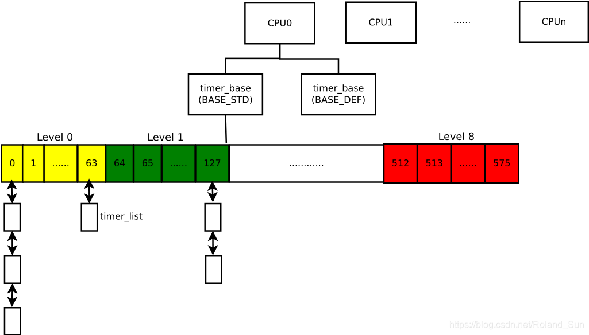

# 时间子系统之低分辨率定时器

内核版本：Linux 5.8版本

**一、概述**

        低分辨率定时器是内核中长期一直存在的定时器实现方法，其低分辨率相对的则是后续内核引入的高精度定时器。低分辨率定时器采用时间轮的方式，在tick时钟中检查到期的定时器并驱动时间轮运转，执行该定时器的处理函数。因此低分辨定时器的最高精度也就是jiffies，例如如果HZ=250，那么一个tick则为4ms，那么定时器的精度最大为4ms，如果想要更高的定时器精度，则无法实现。

        早期的定时器采用级联的时间轮的方案，轮子的层级越高（tv1 \-\> tv5层级递增），所包含的时间范围越大，离当前时刻远的定时器在高层级的轮子上，离当前时刻近的定时器在低层级的轮子上，随着时间的流动，高层级轮子上的定时器不断的往低层级的轮子上移动。所以老方案中不论定时器的到期时间离当前时刻相差多少，其精度都是相同的。这种实现方案存在几个问题：

    A、实际使用中，大多数定时器用于超时场景，在到期之前就被取消，级联的时间轮为此做了太多无意义的操作。

    B、查找下一个到期的定时器时时间较慢，在NOHZ方案中需要快速的找到下一个到期的定时器并设置产生中断的时刻，而在这种方案中找到下一个到期的定时器跟expires的值线性相关。



        为了优化以上问题，在Linux 4.7版本的补丁\<timers: Switch to a non\-cascading wheel\> 500462a9de657f86edaa102f8ab6bff7f7e43fc2 对原有的时间轮方案进行优化，主要思想是考虑到如果定时器时刻离当前时刻相差很大的话，其对定时的精度要求其实并不高，因此可以降低离当前时刻远的定时器的精度，去掉时间轮级联，定时器不需要在轮子上一层层迁移，提高了新方案的性能以及查找下一个到期的定时器的速度。

**二、数据结构**

内核中用struct timer\_list描述一个定时器，该结构主要包含到期jiffies、定时器处理函数以及链表连接成员。

```
struct timer_list {
        struct hlist_node       entry;   //链表连接成员，定时器未到期时连接进timer_base中，定时器处理时可放入临时链表。
        unsigned long           expires; //定时器到期处理的jiffies时刻
        void                    (*function)(unsigned long); //定时器处理函数
        unsigned long           data;    //定时器处理函数入参数据
        u32                     flags;   //定时器状态标志
#ifdef CONFIG_TIMER_STATS
        int                     start_pid;
        void                    *start_site;
        char                    start_comm[16];
#endif
};

#define TIMER_CPUMASK           0x0003FFFF   //低18位表示该定时器绑定在哪一个CPU核上 总共可表示0-262144个核
#define TIMER_MIGRATING         0x00040000   //表示定时器正在从一个CPU核迁移到另外一个CPU核
#define TIMER_BASEMASK          (TIMER_CPUMASK | TIMER_MIGRATING)
#define TIMER_DEFERRABLE        0x00080000   //表示该定时器是可延迟的，当CPU进入休眠时，不会因为要特意服务这类定时器而专门的被唤醒
#define TIMER_PINNED            0x00100000   //表示定时器已经绑死了当前的CPU，无论如何都不会迁移到别的CPU上
#define TIMER_IRQSAFE           0x00200000   //定时器是中断安全的,置位该标志表示该定时器的处理函数可以和某个中断上下文处理产生竞争。不会出现定时器
                                         //处理时而被中断打断产生竞争异常，实现的原理就是设置该标志后执行定时器处理函数时会关中断，执行完成后再开中断。
                                            //详细见commit c5f66e99b7cb091e3d51ae8e8156892e8feb7fa3
#define TIMER_ARRAYSHIFT        22           //存放index的偏移
#define TIMER_ARRAYMASK         0xFFC00000   //高10表示该timer所在数组timer_base->vectors[index]的索引
```

系统中可能同时存在成千上万个定时器，如果处理不好效率会非常低下。Linux目前会将定时器按照绑定的CPU和种类（普通定时器还是可延迟定时器两种）进行区分，由timer\_base结构体组织起来：

```
struct timer_base {
        spinlock_t              lock;
        struct timer_list       *running_timer; //该字段指向当前CPU正在处理的定时器所对应的timer_list结构
        unsigned long           clk;  //当前timer_base所经过的 jiffies, clk的值会一直紧跟jiffies，但不一定会一直跟的很紧，更新clk也有时机，用于判断当前timer_base下哪些定时器到期未处理
        unsigned long           next_expiry; //该字段指向该CPU下一个即将到期的定时器。最早 (距离超时最近的 timer) 的超时时间
        unsigned int            cpu;  //所属的CPU号
        bool                    migration_enabled;
        bool                    nohz_active;
        bool                    is_idle;  //指示是否处于空闲模式下，在NO_HZ模式下会用到。
        bool                    must_forward_clk;  //指示是否需要更新当前clk的值，在NO_HZ模式下会用到。
        DECLARE_BITMAP(pending_map, WHEEL_SIZE);   //位图，表明该桶（bucket）中是否有定时器
        struct hlist_head       vectors[WHEEL_SIZE];  //时间轮所有桶头链表数组
} ____cacheline_aligned;
```

不同HZ的情况下，下面的宏的值是不同的，以HZ=100计算以下的宏具体值

```
/* Clock divisor for the next level */
#define LVL_CLK_SHIFT   3                            //3
#define LVL_CLK_DIV     (1UL << LVL_CLK_SHIFT)       //0x8  往上一个层级时，时间的粒度乘8，做计算时多除8
#define LVL_CLK_MASK    (LVL_CLK_DIV - 1)            //0x7, 111b
#define LVL_SHIFT(n)    ((n) * LVL_CLK_SHIFT)        //n*3
#define LVL_GRAN(n)     (1UL << LVL_SHIFT(n))        //1 << (n*3)  第n个层级中的定时器时间粒度倍数，单位：单位jiffies

/*
* The time start value for each level to select the bucket at enqueue
* time.
*/
#define LVL_START(n)    ((LVL_SIZE - 1) << (((n) - 1) * LVL_CLK_SHIFT))  //第n层的起始jiffies个数，此处n大于大于1，n=0时起始是0。
            //利用该宏计算timer处于那一层级

/* Size of each clock level */
#define LVL_BITS        6                    //6
#define LVL_SIZE        (1UL << LVL_BITS)    //64   一个层级的大小，即bucket的数量为64
#define LVL_MASK        (LVL_SIZE - 1)       //63, 0x3f
#define LVL_OFFS(n)     ((n) * LVL_SIZE)     //n*64  第n个层级在所有512个桶中的偏移值

/* Level depth */
#if HZ > 100
# define LVL_DEPTH      9
# else
# define LVL_DEPTH      8   //HZ=100 取 8，层级的数量
#endif

/* The cutoff (max. capacity of the wheel) */
#define WHEEL_TIMEOUT_CUTOFF    (LVL_START(LVL_DEPTH))  //定时器的expires和当前时刻jiffies的差值，大于等于该值时，那么这个时间太大需要截断
#define WHEEL_TIMEOUT_MAX       (WHEEL_TIMEOUT_CUTOFF - LVL_GRAN(LVL_DEPTH - 1))   //定时器的expires和当前时刻jiffies的差值的最大值，减去一个桶的位置，正好落位于最后的桶bucket处

#define WHEEL_SIZE      (LVL_SIZE * LVL_DEPTH) //64*8=512
```

**2.1 定时器层级**

HZ=100  单个jiffies则为10ms，第n层的粒度则为 \(1 \<\< \(n\*3\)\) \* 10ms



**2.2 可延迟定时器**

```

//如果使能NO_HZ的话，则每个CPU有2个timer_bases，否则就只有一个
#ifdef CONFIG_NO_HZ_COMMON  
# define NR_BASES       2
# define BASE_STD       0
# define BASE_DEF       1
#else
# define NR_BASES       1
# define BASE_STD       0
# define BASE_DEF       0
#endif
```

如果是支持NOHZ的话，为何需要为每个CPU定义两个timer\_base呢？

如果是不支持NOHZ，那么CPU驱动定时器是通过定时的tick中断来驱动timer，整个的定时器系统能够正常的运转；但是如果是NOHZ场景，如果CPU上无任务时会进入休眠，并将下一个最近到期的定时器设定为CPU唤醒的时间，但是有些定时器对时间的精度要求不高并且可延迟，会用TIMER\_DEFERRABLE标志进行标记，为了提升系统的性能，这类的定时器不会用于设定下一次的定时中断时间，所以将这类的定时器放进BASE\_DEF对应的timer\_base中。

**2.3 数据组织结构**

静态定义全局的定时器管理数据

```
static DEFINE_PER_CPU(struct timer_base, timer_bases[NR_BASES]);
```

整体结构如下图，每个timer\_base下有一个数组链表vectors，数组大小为512或者576，分布着8\-9个层级，每个层级的时间粒度不一样。



**三、实现原理**

**3.1 定时器的添�**�

**3.1.1 核心添加函数****\_\_mod\_timer**

```
void add_timer(struct timer_list *timer)
{
        __mod_timer(timer, timer->expires, MOD_TIMER_NOTPENDING);
}

__mod_timer(struct timer_list *timer, unsigned long expires, unsigned int options)
{
        //如果timer已经加入了
        if (!(options & MOD_TIMER_NOTPENDING) && timer_pending(timer)) {
                long diff = timer->expires - expires; //计算定时器的到期时间和参数到期时间之间的差值

                if (!diff)
                        return 1;  //如果两个差值为0即相同则直接返回成功什么都不用做,在某些情况下有所优化

                if (options & MOD_TIMER_REDUCE && diff <= 0)
                        return 1;

                base = lock_timer_base(timer, &flags); //找到定时器对应的timer_base结构体并对其上锁
                forward_timer_base(base);  //nohz场景下，更新base->clk使得timer_base前进

                if (timer_pending(timer) && (options & MOD_TIMER_REDUCE) &&
                    time_before_eq(timer->expires, expires)) {
                        ret = 1;
                        goto out_unlock;
                }

                clk = base->clk;
                idx = calc_wheel_index(expires, clk);  //计算欲修改的expires处于桶向量中索引值
                if (idx == timer_get_idx(timer)) {     //如果修改修改的expires与之前的index相同，则只是修改下expires
                        if (!(options & MOD_TIMER_REDUCE))
                                timer->expires = expires;
                        else if (time_after(timer->expires, expires))
                                timer->expires = expires;
                        ret = 1;
                        goto out_unlock;
                }
        } else {
                base = lock_timer_base(timer, &flags); //根据timer->flag中的cpu值获取对应的base，对于新创建的timer cpu为0
                forward_timer_base(base);
        }

        ret = detach_if_pending(timer, base, false);  //如果定时器已加入链表，则将定时器从链表中摘除
        if (!ret && (options & MOD_TIMER_PENDING_ONLY))
                goto out_unlock;

        new_base = get_target_base(base, timer->flags);  //获取当前CPU核或者NOHZ下的busy核的base。
                                                     //由此可看出新的timer加入之后较大概率是会加入当前代码执行的cpu核上

        if (base != new_base) {    //如果base不一样则进行迁移，将timer移至其它核
                if (likely(base->running_timer != timer)) {
                        /* See the comment in lock_timer_base() */
                        timer->flags |= TIMER_MIGRATING;

                        raw_spin_unlock(&base->lock);
                        base = new_base;
                        raw_spin_lock(&base->lock);
                        WRITE_ONCE(timer->flags,
                                   (timer->flags & ~TIMER_BASEMASK) | base->cpu);
                        forward_timer_base(base);
                }
        }

        debug_timer_activate(timer);
        timer->expires = expires;
        if (idx != UINT_MAX && clk == base->clk) {  //如果idx已经设置并且timer_base 的clk未变化即时钟未前进，则直接将timer加入timer_base
                enqueue_timer(base, timer, idx);
                trigger_dyntick_cpu(base, timer);
        } else {
                internal_add_timer(base, timer);  //需要极限下timer的bucket的index再加入timer_base中
        }
out_unlock:
        raw_spin_unlock_irqrestore(&base->lock, flags);
        return ret;
}
```

**3.1.2 定时器加入的链表index的计算**

index的计算方法是通过函数calc\_wheel\_index\(\)实现的，通过计算expires与当前的base\-\>clk的差值，判断该delta时间落在哪一个层级，再计算详细的index值。

层级的起始jiffies用LVL\_START\(n\)宏表示，该值与层级n成指数关系（8^n）倍数增长

```
static int calc_wheel_index(unsigned long expires, unsigned long clk)
{
        unsigned long delta = expires - clk;
        unsigned int idx;

        if (delta < LVL_START(1)) {        //LVL_START(1)为层级1开始处的jiffies的个数，所以小于这个数量的都在层级0中
                idx = calc_index(expires, 0);
        } else if (delta < LVL_START(2)) {
                idx = calc_index(expires, 1);
        } else if (delta < LVL_START(3)) {
                idx = calc_index(expires, 2);
        } else if (delta < LVL_START(4)) {
                idx = calc_index(expires, 3);
        } else if (delta < LVL_START(5)) {
                idx = calc_index(expires, 4);
        } else if (delta < LVL_START(6)) {
                idx = calc_index(expires, 5);
        } else if (delta < LVL_START(7)) {
                idx = calc_index(expires, 6);
        } else if (LVL_DEPTH > 8 && delta < LVL_START(8)) {
                idx = calc_index(expires, 7);
        } else if ((long) delta < 0) {
                idx = clk & LVL_MASK;
        } else {
                if (delta >= WHEEL_TIMEOUT_CUTOFF)
                        expires = clk + WHEEL_TIMEOUT_MAX;
                idx = calc_index(expires, LVL_DEPTH - 1);
        }
        return idx;
}
```

**3.1.3 定时器加入timer\_base**

```
static void enqueue_timer(struct timer_base *base, struct timer_list *timer,
                          unsigned int idx)
{
        hlist_add_head(&timer->entry, base->vectors + idx);  //加入链表
        __set_bit(idx, base->pending_map);  //设置对应的bitmap，方便快速找到最近到期的定时器
        timer_set_idx(timer, idx); //设置timer->flag中的bucket index值

        trace_timer_start(timer, timer->expires, timer->flags);
}
```

**3.2 定时器的修改**

定时器的修改类似于定时器的增加，也是通过\_\_mod\_timer设置，mod\_timer如果修改的是一个active timer则返回1，否则返回0。

```
int mod_timer(struct timer_list *timer, unsigned long expires)
{
        return __mod_timer(timer, expires, 0);
}
```

**3.3 定时器的删除**

定时器的删除从timer\_base的链表中移除即可

```
int del_timer(struct timer_list *timer)
{
        struct timer_base *base;
        unsigned long flags;
        int ret = 0;

        if (timer_pending(timer)) {  //timer已经加入timer_base则继续删除动作
                base = lock_timer_base(timer, &flags);
                ret = detach_if_pending(timer, base, true);  //从timer_base中detach掉。
                raw_spin_unlock_irqrestore(&base->lock, flags);
        }

        return ret;
}

static int detach_if_pending(struct timer_list *timer, struct timer_base *base,
                             bool clear_pending)
{
        unsigned idx = timer_get_idx(timer);

        if (hlist_is_singular_node(&timer->entry, base->vectors + idx))
                __clear_bit(idx, base->pending_map); //清除bitmap中的标志位

        detach_timer(timer, clear_pending);  //从链表中移除timer
        return 1;
}
```

**3.4 定时器的驱动**

**3.4.1 定时器的处理时机**

定时器模块初始化时，会注册一个软中断，在软中断中进行timer的处理，所以timer处理的上下文是软中断

```
void __init init_timers(void)
{
        init_timer_cpus();
        open_softirq(TIMER_SOFTIRQ, run_timer_softirq);  //注册timer软中断
}

//软中断中驱动timer的详细处理
static __latent_entropy void run_timer_softirq(struct softirq_action *h)
{
        struct timer_base *base = this_cpu_ptr(&timer_bases[BASE_STD]);

        __run_timers(base);       //处理当前cpu的BASE_STD 基础timer_base中的timer
        if (IS_ENABLED(CONFIG_NO_HZ_COMMON))
                __run_timers(this_cpu_ptr(&timer_bases[BASE_DEF]));  //如果支持nohz，继续处理可延迟的timer_base
}
```

**3.4.2 定时器的触发时间**

```
void update_process_times(int user_tick)
{
    ...
    run_local_timers();  //运行当前CPU本地的timer
     ...      
}

void run_local_timers(void)
{
        struct timer_base *base = this_cpu_ptr(&timer_bases[BASE_STD]);

        hrtimer_run_queues();
        /* Raise the softirq only if required. */
        if (time_before(jiffies, base->clk)) {
                if (!IS_ENABLED(CONFIG_NO_HZ_COMMON))
                        return;
                /* CPU is awake, so check the deferrable base. */
                base++;
                if (time_before(jiffies, base->clk))
                        return;
        }
        raise_softirq(TIMER_SOFTIRQ);  //触发timer软中断，进行timer的详细处理
}
```

3.5 定时器与CPU核的关系

**四、参考资料：**

[https://blog.csdn.net/roland\_sun/article/details/105775145](https://blog.csdn.net/roland_sun/article/details/105775145)
