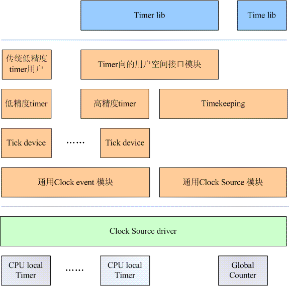

# 时间子系统之整体框架

**一、老时钟子系统框架**

**二、新时钟子系统框架**

**2.1 为何引入新的时钟子系统框架**

针对老时钟系统存在的如下问题，引入新的框架：

（1）嵌入式设备需要较好的电源管理策略。传统的linux会有一个周期性的时钟，即便是系统无事可做的时候也要醒来，这样导致系统不断的从低功耗（idle）状态进入高功耗的状态。这样的设计不符合电源管理的需求，会造成更大的电源消耗。

（2）多媒体的应用程序需要更高时钟精确的timer，例如为了避免视频的跳帧、音频回放中的跳动，这些需要系统提供足够精度的timer。

高精度timer使用了人类的最直观的时间单位ns纳秒。本质上linux kernel提供了高精度timer之后，其实不必提供低精度timer了，不过由于低精度timer存在了很长的历史，并且在渗入到内核各个部分，如果去掉低精度timer很容易引起linux kernel稳定性和健壮性的问题，因此目前的linux kernel保持了低精度timer和高精度timer并存。

**2.2 新时钟子系统总体框架**

