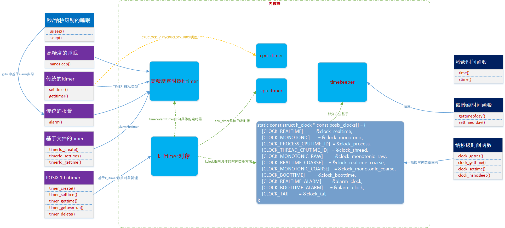

# 时间子系统之用户接口

**一、用户态时钟接口分类**

|类型                                                                               |API                   |精度                                                                                                             |说明                                                                                                                                                                  |
|-----------------------------------------------------------------------------------|----------------------|-----------------------------------------------------------------------------------------------------------------|----------------------------------------------------------------------------------------------------------------------------------------------------------------------|
|时间                                                                               |stime
time             |精度为秒级
time\_t                                                                                                |设定时间的进程需具备CAP\_SYS\_TIME权限。
逐渐要被淘汰。需要定义\_\_ARCH\_WANT\_SYS\_TIME才能支持。                                                                     |
|settimeofday
gettimerofday                                                          |精度为微秒级别
timeval |设定时间的进程需具备CAP\_SYS\_TIME权限。                                                                         |                                                                                                                                                                      |
|clock
tims                                                                          |                      |clock进程使用的总的CPU时间\(用户和系统\)。
tims进程创建后使用的CPU时间数量。                                      |                                                                                                                                                                      |
|clock\_settime

clock\_getres

clock\_getcpuclockid

pthread\_getcpuclockid
clock\_gettime|精度为纳秒级别
timespec|设定时间的进程需具备CAP\_SYS\_TIME权限。
提供多种类型的是种类型\(参照下面描述\)。                                 |                                                                                                                                                                      |
|adjtimex

clock\_adjtime
adjtime                                                      |                      |settimeofday\(\)调用造成的系统时间突然变化，可能会对依赖于系统时钟单调递增用用造成有害影响。推荐使用adjtime\(\)。|                                                                                                                                                                      |
|睡眠                                                                               |sleep                 |秒                                                                                                               |这两个函数需要，查看libc/unistd/sleep.c和usleep.c的实现。有的是基于nanosleep实现，有的是基于alarm\(sleep\)或者select\(usleep\)实现的。
基于nanosleep实现，基于hrtimer。|
|usleep                                                                             |微秒                  |                                                                                                                 |                                                                                                                                                                      |
|nanosleep                                                                          |纳秒                  |hrtimer.c中调用hrtimer\_nanosleep。                                                                              |                                                                                                                                                                      |
|clock\_nanosleep                                                                   |纳秒
timespec          |posix\-timers.c调用k\_clock\-\>nsleep\(\)。                                                                      |                                                                                                                                                                      |
|定时器                                                                             |alarm                 |秒                                                                                                               |精度低，容易被覆盖。                                                                                                                                                  |
|getitimer
setitimer                                                                 |微妙
itimerval         |同样是基于信号。最多三个。                                                                                       |                                                                                                                                                                      |
|timer\_settime

timer\_gettime

timer\_delete

timer\_getoverrun
timer\_create            |纳秒                  |多timer共存，多种时钟类型。                                                                                      |                                                                                                                                                                      |
|timerfd\_settime

timerfd\_gettime
 timerfd\_create                                   | 纳秒                 | 基于select或poll等待。                                                                                          |                                                                                                                                                                      |

**二、用户态时钟实现基础框图**



**三、获取时间刻度类型**

**3.1 和系统时间相关的服务，获取当前系统的某个衡量标准下的时间刻度**

**（1）获取和设置秒级别的时间函数：time和stime。**

其依赖如下系统调用，在kernel中，只有定义了\_\_ARCH\_WANT\_SYS\_TIME这个宏，系统才会提供下面这两个系统调用。

```
sys_time()
sys_stime()
```

**（2）微秒级别的时间函数：gettimeofday和settimeofday。**

只不过时间精度可以达到微秒级别，其系统调用如下，这些系统调用在新的POSIX标准中 gettimeofday和settimeofday接口函数被标注为obsolescent，取而代之的是clock\_gettime和clock\_settime接口函数

```
sys_gettimeofday()
sys_settimeofday()
```

**（3）纳秒级别的时间函数：clock\_gettime和clock\_settime。**

clockid\_t定义了获取得当时钟ID，即衡量时钟刻度的类型，用户进程通过特殊的vsdo快速系统调用陷入内核态来设置和获取时间信息。

```
int clock_getres(clockid_t clk_id, struct timespec *res);
int clock_gettime(clockid_t clk_id, struct timespec *tp);
int clock_settime(clockid_t clk_id, const struct timespec *tp);
```

clockid\_t的类型：

```
CLOCK_REALTIME
CLOCK_MONOTONIC
CLOCK_MONOTONIC_RAW
CLOCK_PROCESS_CPUTIME_ID
CLOCK_THREAD_CPUTIME_ID
```

在实现该系统调用时，考虑到接口应该快速的完成系统调用，的有的平台通过vsdo快速系统调用，有的平台通过系统调用

```
__vdso_clock_gettime
__vdso_clock_getres
__vdso_clock_gettime64    
    
notrace int __vdso_clock_gettime(clockid_t clkid, struct timespec *ts)
{
    struct vdso_data *vdata;
    int ret = -1;

    vdata = __get_datapage();

    switch (clkid) {
    case CLOCK_REALTIME_COARSE:
        ret = do_realtime_coarse(ts, vdata);
        break;
    case CLOCK_MONOTONIC_COARSE:
        ret = do_monotonic_coarse(ts, vdata);
        break;
    case CLOCK_REALTIME:
        ret = do_realtime(ts, vdata);
        break;
    case CLOCK_MONOTONIC:
        ret = do_monotonic(ts, vdata);
        break;
    default:
        break;
    }
        
    if (ret)
        ret = clock_gettime_fallback(clkid, ts);

    return ret;
}   
```

**3.2 让进程睡眠一段时间**

**（1）秒/纳秒级别的睡眠：sleep/usleep 。**

linux中并未实现这类休眠函数的系统调用，是libc封装了一层，它是通过调用alarm\(\)来设定报警时间，调用sigsuspend\(\)将进程挂起在信号SIGALARM上，sleep\(\)只能精确到秒级上。

**（2）纳秒级别的sleep函数：nanosleep。**

其底层基于hrtimer实现，hrtimer数据结构在内核栈中，系统调用如下。

```
SYSCALL_DEFINE2(nanosleep, struct __kernel_timespec __user *, rqtp,
        struct __kernel_timespec __user *, rmtp)
{
    struct timespec64 tu;

    if (get_timespec64(&tu, rqtp))
        return -EFAULT;

    if (!timespec64_valid(&tu))
        return -EINVAL;

    current->restart_block.nanosleep.type = rmtp ? TT_NATIVE : TT_NONE;
    current->restart_block.nanosleep.rmtp = rmtp;
    return hrtimer_nanosleep(&tu, HRTIMER_MODE_REL, CLOCK_MONOTONIC);
}
```

**（3）高级的sleep函数：clock\_nanosleep**

clock\_id说明该接口函数不仅能基于real time clock睡眠，还可以基于其他的系统时钟睡眠。flag等于0或者1，分别指明request参数设定的时间值是相对时间还是绝对时间。

```
clock_nanosleep()

hrtimer_nanosleep(rqtp, flags & TIMER_ABSTIME ? HRTIMER_MODE_ABS : HRTIMER_MODE_REL, which_clock);
```

**3.3 timer相关的服务。在一段指定的时间过去后，kernel要alert用户进程**

**（1）alarm函数**

本质上还是利用do\_setitimer实现一个单次定时，传入参数中it\_interval设置为0，表明定时器不会重复。

由于alarm在内核中也是使用ITIMER\_REAL类型的itimer实现，对于同一个进程使用的是同一个hrtimer，所以在内核中进程的alarm\(\)和seitimer\(ITIMER\_REALI\)会相互覆盖。

```
SYSCALL_DEFINE1(alarm, unsigned int, seconds)
{
    return alarm_setitimer(seconds);
}
static unsigned int alarm_setitimer(unsigned int seconds)
{
    struct itimerval it_new, it_old;

#if BITS_PER_LONG < 64
    if (seconds > INT_MAX)
        seconds = INT_MAX;
#endif
    it_new.it_value.tv_sec = seconds;
    it_new.it_value.tv_usec = 0;
    it_new.it_interval.tv_sec = it_new.it_interval.tv_usec = 0;

    do_setitimer(ITIMER_REAL, &it_new, &it_old); //ITIMER_REAL类型的定时器，那么会覆盖这种类型的itimer。

    /*
     * We can't return 0 if we have an alarm pending ...  And we'd
     * better return too much than too little anyway
     */
    if ((!it_old.it_value.tv_sec && it_old.it_value.tv_usec) ||
          it_old.it_value.tv_usec >= 500000)
        it_old.it_value.tv_sec++;

    return it_old.it_value.tv_sec;
}
```

**（2）traditional Interval timer\(posix itimr/classical UNIX APIs\)**

```
int getitimer(int which, struct itimerval *curr_value);
int setitimer(int which, const struct itimerval *new_value,
                     struct itimerval *old_value);

SYSCALL_DEFINE3(setitimer, int, which, struct itimerval __user *, value,
        struct itimerval __user *, ovalue)
        
SYSCALL_DEFINE2(getitimer, int, which, struct itimerval __user *, value)

struct itimerval {
    struct timeval it_interval; /* timer interval */
    struct timeval it_value;    /* current value */
};
```

settimer工作机制是，先对it\_value倒计时，当it\_value为零时触发信号。然后重置为it\_interval。继续对it\_value倒计时。一直这样循环下去。因此这两个值得组合可以决定timer是否为定时产生的timer还是单次产生。old\_value返回此前设置的值。对于一个进程，这三种类型的timer都只能有一个，再设置了就会覆盖原先的timer

timer = &tsk\-\>signal\-\>real\_timer

如果是ITIMER\_REAL类型，则itimer基于hrtimer实现，每个进程指向一个hrtimer

```
struct signal_struct {
    /* ITIMER_REAL timer for the process */
    struct hrtimer real_timer;
    ktime_t it_real_incr;
}

int do_setitimer(int which, struct itimerval *value, struct itimerval *ovalue)
{
    struct task_struct *tsk = current;
    struct hrtimer *timer;
    ktime_t expires;
    
    /*
     * Validate the timevals in value.
     */
    if (!timeval_valid(&value->it_value) ||
        !timeval_valid(&value->it_interval))
        return -EINVAL;
    
    switch (which) {
    case ITIMER_REAL:
again:  
        spin_lock_irq(&tsk->sighand->siglock);
        timer = &tsk->signal->real_timer;
        if (ovalue) {
            ovalue->it_value = itimer_get_remtime(timer);
            ovalue->it_interval
                = ktime_to_timeval(tsk->signal->it_real_incr);
        }
        /* We are sharing ->siglock with it_real_fn() */
        if (hrtimer_try_to_cancel(timer) < 0) {
            spin_unlock_irq(&tsk->sighand->siglock);
            hrtimer_cancel_wait_running(timer);
            goto again;
        }
        expires = timeval_to_ktime(value->it_value);
        if (expires != 0) {
            tsk->signal->it_real_incr =
                timeval_to_ktime(value->it_interval);
            hrtimer_start(timer, expires, HRTIMER_MODE_REL);
        } else
            tsk->signal->it_real_incr = 0;
        
        trace_itimer_state(ITIMER_REAL, value, 0);
        spin_unlock_irq(&tsk->sighand->siglock);
        break;
    case ITIMER_VIRTUAL:
        set_cpu_itimer(tsk, CPUCLOCK_VIRT, value, ovalue);
        break;
    case ITIMER_PROF:
        set_cpu_itimer(tsk, CPUCLOCK_PROF, value, ovalue);
        break;
    default:
        return -EINVAL;
    }   
    return 0;
}
```

进程创建时初始化ITIMER\_REAL部分

```
static int copy_signal(unsigned long clone_flags, struct task_struct *tsk)
{
#ifdef CONFIG_POSIX_TIMERS
    INIT_LIST_HEAD(&sig->posix_timers);
    hrtimer_init(&sig->real_timer, CLOCK_MONOTONIC, HRTIMER_MODE_REL);
    sig->real_timer.function = it_real_fn;
#endif
}

enum hrtimer_restart it_real_fn(struct hrtimer *timer)
{
    struct signal_struct *sig =
        container_of(timer, struct signal_struct, real_timer);
    struct pid *leader_pid = sig->pids[PIDTYPE_TGID];
    
    trace_itimer_expire(ITIMER_REAL, leader_pid, 0);
    kill_pid_info(SIGALRM, SEND_SIG_PRIV, leader_pid);  //产生SIGALRM信号

    return HRTIMER_NORESTART;
}   
```

**（3）POSIX 1.b Interval timer**

```
struct k_itimer {
    struct list_head    list;     //链接进进程的链表
    struct hlist_node   t_hash;  //链接进全局的hash链表
    spinlock_t      it_lock;     //保护k_itimer本身
    const struct k_clock    *kclock;
    clockid_t       it_clock;
    timer_t         it_id;
    int         it_active;
    s64         it_overrun;
    s64         it_overrun_last;
    int         it_requeue_pending;
    int         it_sigev_notify;
    ktime_t         it_interval;
    struct signal_struct    *it_signal; //k_itimer所属的信号
    union {
        struct pid      *it_pid;
        struct task_struct  *it_process;
    };
    struct sigqueue     *sigq;
    union {
        struct {
            struct hrtimer  timer;
        } real;
        struct cpu_timer    cpu;
        struct {
            struct alarm    alarmtimer;
        } alarm;
    } it;
    struct rcu_head     rcu;
};

struct k_clock {
    int (*clock_getres)(const clockid_t which_clock,
                struct timespec64 *tp);
    int (*clock_set)(const clockid_t which_clock,
                 const struct timespec64 *tp);
    int (*clock_get)(const clockid_t which_clock,
                 struct timespec64 *tp);
    int (*clock_adj)(const clockid_t which_clock, struct __kernel_timex *tx);
    int (*timer_create)(struct k_itimer *timer);
    int (*nsleep)(const clockid_t which_clock, int flags,
              const struct timespec64 *);
    int (*timer_set)(struct k_itimer *timr, int flags,
                 struct itimerspec64 *new_setting,
                 struct itimerspec64 *old_setting);
    int (*timer_del)(struct k_itimer *timr);
    void    (*timer_get)(struct k_itimer *timr,
                 struct itimerspec64 *cur_setting);
    void    (*timer_rearm)(struct k_itimer *timr);
    s64 (*timer_forward)(struct k_itimer *timr, ktime_t now);
    ktime_t (*timer_remaining)(struct k_itimer *timr, ktime_t now);
    int (*timer_try_to_cancel)(struct k_itimer *timr);
    void    (*timer_arm)(struct k_itimer *timr, ktime_t expires,
                 bool absolute, bool sigev_none);
    void    (*timer_wait_running)(struct k_itimer *timr);
};
```

（4）timerfd

参考资料

[https://www.cnblogs.com/arnoldlu/p/7078187.html](https://www.cnblogs.com/arnoldlu/p/7078187.html)

[http://www.wowotech.net/timer\_subsystem/timer\_subsystem\_userspace.html](http://www.wowotech.net/timer_subsystem/timer_subsystem_userspace.html)

%\!\(EXTRA markdown.ResourceType=, string=, string=\)
