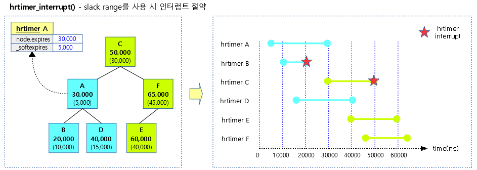

# 时间子系统之高精度定时器

**一、为何需要高精度定时器**

- 现有的内核定时器是使用基于jiffies的lowres定时器实现的，基于HZ的tick只能管理几毫秒到几十毫秒的低分辨率，定时器的时间粒度为tick，基本在毫秒级别。
- 当需要使用分辨率更高的定时器时，原有的低精度定时器无法满足要求。

高精度定时器的高精度来源于tick\_device的时钟源的精度，原有的低分辨率定时器由滴答中断驱动所以它的精度取决于HZ，高精度定时器由于采用单次触发，中断产生的时间取决于具体下一个到期的定时器的时间点，这个时间的单位可以是ns，由于中断产生的精度使得高精度定时器拥有高精度。

**二、高精度定时器框架**

内核从2.6.16开始加入了高精度定时器架构。在实现方式上，内核的高分辨率定时器的实现代码几乎没有借用低分辨率定时器的数据结构和代码，内核文档给出的解释主要有以下几点：

- 低分辨率定时器的代码和jiffies的关系太过紧密，并且默认按32位进行设计，并且它的代码已经经过长时间的优化，目前的使用也是没有任何错误，如果硬要基于它来实现高分辨率定时器，势必会打破原有的时间轮概念，并且会引入一大堆\#if\-\-\#else判断；
- 虽然大部分时间里，时间轮可以实现O\(1\)时间复杂度，但是当有进位发生时，不可预测的O\(N\)定时器级联迁移时间，这对于低分辨率定时器来说问题不大，可是它大大地影响了定时器的精度；
- 低分辨率定时器几乎是为“超时”而设计的，并为此对它进行了大量的优化，对于这些以“超时”未目的而使用定时器，它们大多数期望在超时到来之前获得正确的结果，然后删除定时器，精确时间并不是它们主要的目的，例如网络通信、设备IO等等。

内核为高精度定时器重新设计了一套软件架构，它可以为我们提供纳秒级的定时精度，以满足对精确时间有迫切需求的应用程序或内核驱动，例如多媒体应用，音频设备的驱动程序等等。

**三、数据结构**

```
struct hrtimer {
    struct timerqueue_node      node;
    ktime_t             _softexpires; //软到期时间
    enum hrtimer_restart        (*function)(struct hrtimer *);
    struct hrtimer_clock_base   *base;
    u8              state;
    u8              is_rel;
    u8              is_soft;
    u8              is_hard;
};

struct timerqueue_node {
    struct rb_node node;  //红黑树节点，用于将hrtimer链接进红黑树中
    ktime_t expires;  //到期时间
};

struct hrtimer_cpu_base {
    raw_spinlock_t          lock;
    unsigned int            cpu;
    unsigned int            active_bases; //用位表示clock_base中是否有timer，一个clock_base占用一个bit位
    unsigned int            clock_was_set_seq;
    unsigned int            hres_active     : 1, //高精度模式是否激活
                    in_hrtirq       : 1,
                    hang_detected       : 1,
                    softirq_activated       : 1;
#ifdef CONFIG_HIGH_RES_TIMERS
    unsigned int            nr_events;
    unsigned short          nr_retries;
    unsigned short          nr_hangs;
    unsigned int            max_hang_time;
#endif
#ifdef CONFIG_PREEMPT_RT
    spinlock_t          softirq_expiry_lock;
    atomic_t            timer_waiters;
#endif
    ktime_t             expires_next;
    struct hrtimer          *next_timer;
    ktime_t             softirq_expires_next;
    struct hrtimer          *softirq_next_timer;
    struct hrtimer_clock_base   clock_base[HRTIMER_MAX_CLOCK_BASES];
} ____cacheline_aligned;

struct hrtimer_clock_base {
    struct hrtimer_cpu_base *cpu_base;
    unsigned int        index;
    clockid_t       clockid;
    seqcount_t      seq;  //
    struct hrtimer      *running;
    struct timerqueue_head  active;  //红黑树root
    ktime_t         (*get_time)(void); //不同时间基准的获取时间函数
    ktime_t         offset;//不同时间基准的偏移量
} __hrtimer_clock_base_align;

enum  hrtimer_base_type {
    HRTIMER_BASE_MONOTONIC,
    HRTIMER_BASE_REALTIME,
    HRTIMER_BASE_BOOTTIME,
    HRTIMER_BASE_TAI,
    HRTIMER_BASE_MONOTONIC_SOFT,
    HRTIMER_BASE_REALTIME_SOFT,
    HRTIMER_BASE_BOOTTIME_SOFT,
    HRTIMER_BASE_TAI_SOFT,
    HRTIMER_MAX_CLOCK_BASES,
};

enum hrtimer_restart {
    HRTIMER_NORESTART,  /* Timer is not restarted */
    HRTIMER_RESTART,    /* Timer must be restarted */
};
```

**hrtimer\-\>\_softexpires和hrtimmer\-\>node\-\>expires的区别 ？**

expires和softexpires字段一起，设定了hrtimer的到期时间的一个范围，hrtimer可以在hrtimer.\_softexpires至hrtimmer\-\>node\-\>expires之间的任何时刻到期，我们也称timerqueue\_node.expires为硬过期时间\(hard\)，意思很明显：到了此时刻，定时器一定会到期，有了这个范围可以选择，定时器系统可以让范围接近的多个定时器在同一时刻同时到期，这种设计可以降低进程频繁地被hrtimer进行唤醒。到期区间：\[hrtimer.\_softexpires, hrtimmer\-\>node\-\>expires\]

```
//通常情况下这两者的值是相等的，但是如果hrtimer_set_expires_range*函数后可以设定一段到期范围
static inline void hrtimer_set_expires_range_ns(struct hrtimer *timer, ktime_t time, u64 delta)
{
    timer->_softexpires = time;
    timer->node.expires = ktime_add_safe(time, ns_to_ktime(delta));
}

static inline void hrtimer_set_expires_tv64(struct hrtimer *timer, s64 tv64)
{
    timer->node.expires = tv64;
    timer->_softexpires = tv64;
}

//hrtimer加入红黑树时，是以expires来排序的,因此当获取最左侧的快到期hrtimer时是expires最小的
bool timerqueue_add(struct timerqueue_head *head, struct timerqueue_node *node)
{
    struct rb_node **p = &head->rb_root.rb_root.rb_node;
    struct rb_node *parent = NULL;
    struct timerqueue_node *ptr;
    bool leftmost = true;

    /* Make sure we don't add nodes that are already added */
    WARN_ON_ONCE(!RB_EMPTY_NODE(&node->node));

    while (*p) {
        parent = *p;
        ptr = rb_entry(parent, struct timerqueue_node, node);
        if (node->expires < ptr->expires) {
            p = &(*p)->rb_left;
        } else {
            p = &(*p)->rb_right;
            leftmost = false;
        }
    }
    rb_link_node(&node->node, parent, p);
    rb_insert_color_cached(&node->node, &head->rb_root, leftmost);

    return leftmost;
}

//通常_softexpires是小于expires的，内核在轮询检查定时器到期的时候，通常是某个定时器expires到期，通过以下代码顺便处理掉那些软到期的定时器。
static void __hrtimer_run_queues(struct hrtimer_cpu_base *cpu_base, ktime_t now,
                 unsigned long flags, unsigned int active_mask)
{
    ···    
            if (basenow < hrtimer_get_softexpires_tv64(timer))
                break;

            __run_hrtimer(cpu_base, base, timer, &basenow, flags);
    ···
}
```

hrtimer通过slack range来减少中断次数，如下图所示场景的定时器最好的情况是可以在标星的两个点一次性处理掉所有的6个定时器。



**softirq与hardirq的区别？**

高精度定时器注册时会带有hard和soft标记，表明是在软中断上下文还是硬件中断上下文调用定时器处理函数。

```
#define HRTIMER_ACTIVE_HARD ((1U << MASK_SHIFT) - 1)
#define HRTIMER_ACTIVE_SOFT (HRTIMER_ACTIVE_HARD << MASK_SHIFT)
```

**四、增加删除高精度定时器**

**五、高精度定时器的驱动**

**5.1 未激活高精度模式时**

利用tick来驱动高精度定时器，此时的时间精度等于jiffies

```
void run_local_timers(void)
{
    struct timer_base *base = this_cpu_ptr(&timer_bases[BASE_STD]);

    hrtimer_run_queues();  //在tick中驱动高精度定时器，如果未激活高精度定时器时，高精度定时器精度为jiffies
    /* Raise the softirq only if required. */
    if (time_before(jiffies, base->clk)) {
        if (!IS_ENABLED(CONFIG_NO_HZ_COMMON))
            return;
        /* CPU is awake, so check the deferrable base. */
        base++;
        if (time_before(jiffies, base->clk))
            return;
    }
    raise_softirq(TIMER_SOFTIRQ);
}
void hrtimer_run_queues(void)
{
    struct hrtimer_cpu_base *cpu_base = this_cpu_ptr(&hrtimer_bases);
    unsigned long flags;
    ktime_t now;
    
    if (__hrtimer_hres_active(cpu_base)) //此时此处判断为false
        return;
    
    /*
     * This _is_ ugly: We have to check periodically, whether we
     * can switch to highres and / or nohz mode. The clocksource
     * switch happens with xtime_lock held. Notification from
     * there only sets the check bit in the tick_oneshot code,
     * otherwise we might deadlock vs. xtime_lock.
     */
    if (tick_check_oneshot_change(!hrtimer_is_hres_enabled())) {
        hrtimer_switch_to_hres();
        return;
    }
    
    raw_spin_lock_irqsave(&cpu_base->lock, flags);
    now = hrtimer_update_base(cpu_base);
    
    if (!ktime_before(now, cpu_base->softirq_expires_next)) {
        cpu_base->softirq_expires_next = KTIME_MAX;
        cpu_base->softirq_activated = 1;
        raise_softirq_irqoff(HRTIMER_SOFTIRQ);
    }
    
    __hrtimer_run_queues(cpu_base, now, flags, HRTIMER_ACTIVE_HARD);
    raw_spin_unlock_irqrestore(&cpu_base->lock, flags);
}
```

**5.2 激活高精度模式**

如果内核选项CONFIG\_HIGH\_RES\_TIMERS选择了，那么系统启动后默认开启高精度模式。如果启动参数highres=0则可以在系统启动后不启用高精度模式。

```
void hrtimer_run_queues(void)
{
    ···
    if (__hrtimer_hres_active(cpu_base)) //高精度定时器激活后，此处直接返回，因此不会再tick处理中驱动高精度定时器
        return;

    /*
     * This _is_ ugly: We have to check periodically, whether we
     * can switch to highres and / or nohz mode. The clocksource
     * switch happens with xtime_lock held. Notification from
     * there only sets the check bit in the tick_oneshot code,
     * otherwise we might deadlock vs. xtime_lock.
     */
    if (tick_check_oneshot_change(!hrtimer_is_hres_enabled())) {  
        hrtimer_switch_to_hres(); //如果内核选项CONFIG_HIGH_RES_TIMERS选择了，那么内核启动tick后立即就会进入此处开启高精度模式
        return;
    }
    ···
}

static void hrtimer_switch_to_hres(void)
{
    struct hrtimer_cpu_base *base = this_cpu_ptr(&hrtimer_bases);

    if (tick_init_highres()) {
        pr_warn("Could not switch to high resolution mode on CPU %u\n",
            base->cpu);
        return;
    }
    base->hres_active = 1;
    hrtimer_resolution = HIGH_RES_NSEC;

    tick_setup_sched_timer();
    /* "Retrigger" the interrupt to get things going */
    retrigger_next_event(NULL);
}

int tick_init_highres(void)
{
    return tick_switch_to_oneshot(hrtimer_interrupt);
}

int tick_switch_to_oneshot(void (*handler)(struct clock_event_device *))
{
    struct tick_device *td = this_cpu_ptr(&tick_cpu_device);
    struct clock_event_device *dev = td->evtdev;

    if (!dev || !(dev->features & CLOCK_EVT_FEAT_ONESHOT) ||
            !tick_device_is_functional(dev)) {

        pr_info("Clockevents: could not switch to one-shot mode:");
        if (!dev) {
            pr_cont(" no tick device\n");
        } else {
            if (!tick_device_is_functional(dev))
                pr_cont(" %s is not functional.\n", dev->name);
            else
                pr_cont(" %s does not support one-shot mode.\n",
                    dev->name);
        }
        return -EINVAL;
    }
    
    //修改tick device的参数和处理函数，让高精度定时器接管tick device，tick模块中断产生时调用高精度定时器的处理函数
    td->mode = TICKDEV_MODE_ONESHOT;
    dev->event_handler = handler; 
    clockevents_switch_state(dev, CLOCK_EVT_STATE_ONESHOT);
    tick_broadcast_switch_to_oneshot();
    return 0;
}
```

**5.3 内核不支持高精度定时器时场景**

如果内核未定义高精度定时器，则使用如下的代码实现。此时hrtimer在内核中还是存在的，只是hrtimer的驱动源只有tick时钟了，精度也只有tick的精度。

```
static inline int __hrtimer_hres_active(struct hrtimer_cpu_base *cpu_base)
{
    return IS_ENABLED(CONFIG_HIGH_RES_TIMERS) ?
        cpu_base->hres_active : 0;
}

static inline int hrtimer_is_hres_enabled(void) { return 0; }
static inline void hrtimer_switch_to_hres(void) { }
static inline void retrigger_next_event(void *arg) { }

void hrtimer_run_queues(void)
{
    struct hrtimer_cpu_base *cpu_base = this_cpu_ptr(&hrtimer_bases);
    unsigned long flags;
    ktime_t now;
    
    if (__hrtimer_hres_active(cpu_base)) //固定返回false
        return;
    /*
     * This _is_ ugly: We have to check periodically, whether we
     * can switch to highres and / or nohz mode. The clocksource
     * switch happens with xtime_lock held. Notification from
     * there only sets the check bit in the tick_oneshot code,
     * otherwise we might deadlock vs. xtime_lock.
     */
    if (tick_check_oneshot_change(!hrtimer_is_hres_enabled())) { //固定返回false
        hrtimer_switch_to_hres();
        return;
    }

    raw_spin_lock_irqsave(&cpu_base->lock, flags);
    now = hrtimer_update_base(cpu_base);

    if (!ktime_before(now, cpu_base->softirq_expires_next)) {
        cpu_base->softirq_expires_next = KTIME_MAX;
        cpu_base->softirq_activated = 1;
        raise_softirq_irqoff(HRTIMER_SOFTIRQ); //触发软中断上下文处理高精度定时器
    }

    __hrtimer_run_queues(cpu_base, now, flags, HRTIMER_ACTIVE_HARD); //在当前硬件中断中处理高精度定时器
    raw_spin_unlock_irqrestore(&cpu_base->lock, flags);
}
```

**5.4 高精度切换流程图**


**六、高精度定时器模拟tick事件**

当系统切换到高精度模式后，tick\_device被高精度定时器系统接管，不再定期地产生tick事件，内核的jiffies机制还是依赖定期到来的tick事件，供进程调度系统和时间更新等操作，大量存在的低精度定时器也仍然依赖于jiffies的计数，所以，尽管tick\_device被接管，高精度定时器系统还是要想办法继续提供定期的tick事件。

```
void tick_setup_sched_timer(void)
{
    struct tick_sched *ts = this_cpu_ptr(&tick_cpu_sched);
    ktime_t now = ktime_get();

    /*
     * Emulate tick processing via per-CPU hrtimers:
     */
    //仿真tick_device的中断，因此标记为HRTIMER_MODE_ABS_HARD硬件中断中调用定时器函数
    hrtimer_init(&ts->sched_timer, CLOCK_MONOTONIC, HRTIMER_MODE_ABS_HARD);
    ts->sched_timer.function = tick_sched_timer;

    /* Get the next period (per-CPU) */
    hrtimer_set_expires(&ts->sched_timer, tick_init_jiffy_update());

    /* Offset the tick to avert jiffies_lock contention. */
    if (sched_skew_tick) {
        u64 offset = ktime_to_ns(tick_period) >> 1;
        do_div(offset, num_possible_cpus());
        offset *= smp_processor_id();
        hrtimer_add_expires_ns(&ts->sched_timer, offset);
    }

    hrtimer_forward(&ts->sched_timer, now, tick_period);
    hrtimer_start_expires(&ts->sched_timer, HRTIMER_MODE_ABS_PINNED_HARD);
    tick_nohz_activate(ts, NOHZ_MODE_HIGHRES);
}
static enum hrtimer_restart tick_sched_timer(struct hrtimer *timer)
{
    struct tick_sched *ts =
        container_of(timer, struct tick_sched, sched_timer);
    struct pt_regs *regs = get_irq_regs();
    ktime_t now = ktime_get();

    tick_sched_do_timer(ts, now);

    /*
     * Do not call, when we are not in irq context and have
     * no valid regs pointer
     */
    if (regs)
        tick_sched_handle(ts, regs);
    else
        ts->next_tick = 0;

    /* No need to reprogram if we are in idle or full dynticks mode */
    if (unlikely(ts->tick_stopped))
        return HRTIMER_NORESTART;

    hrtimer_forward(timer, now, tick_period);

    return HRTIMER_RESTART;
}

static void tick_sched_handle(struct tick_sched *ts, struct pt_regs *regs)
{
#ifdef CONFIG_NO_HZ_COMMON
    /*
     * When we are idle and the tick is stopped, we have to touch
     * the watchdog as we might not schedule for a really long
     * time. This happens on complete idle SMP systems while
     * waiting on the login prompt. We also increment the "start of
     * idle" jiffy stamp so the idle accounting adjustment we do
     * when we go busy again does not account too much ticks.
     */
    if (ts->tick_stopped) {
        touch_softlockup_watchdog_sched();
        if (is_idle_task(current))
            ts->idle_jiffies++;
        /*
         * In case the current tick fired too early past its expected
         * expiration, make sure we don't bypass the next clock reprogramming
         * to the same deadline.
         */
        ts->next_tick = 0;
    }
#endif
    update_process_times(user_mode(regs));
    profile_tick(CPU_PROFILING);
}
```

**七、内核使用高精度定时器的场景**

内核有以下几个场景下使用高精度定时器：

- nanosleep
- itimers（interval timer/间隔定时器）
- posix\-timers
- alarm
- timerfd

参数不同，使用的时间计算方式不同，在某些参数情况下，以上的接口会使用到高精度定时器。


**八、高精度定时器与性能**

开启高精度定时器后系统性能会下降，一个因素是tick中断变多了，还有其他因素吗？

参考资料：

[https://blog.csdn.net/droidphone/article/details/8074892](https://blog.csdn.net/droidphone/article/details/8074892)
