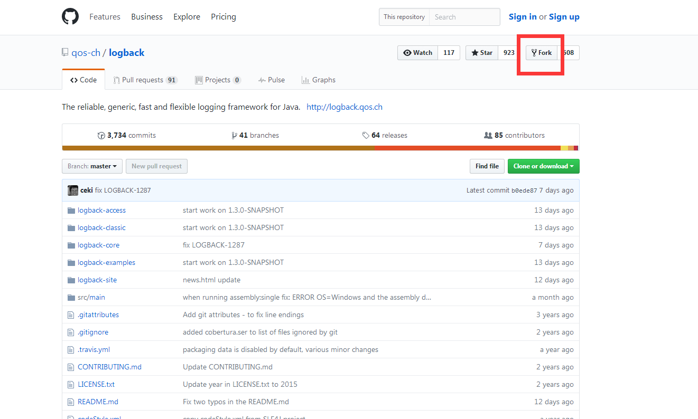
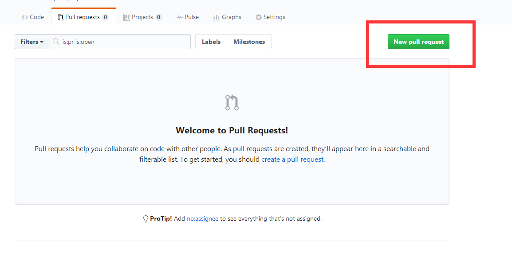
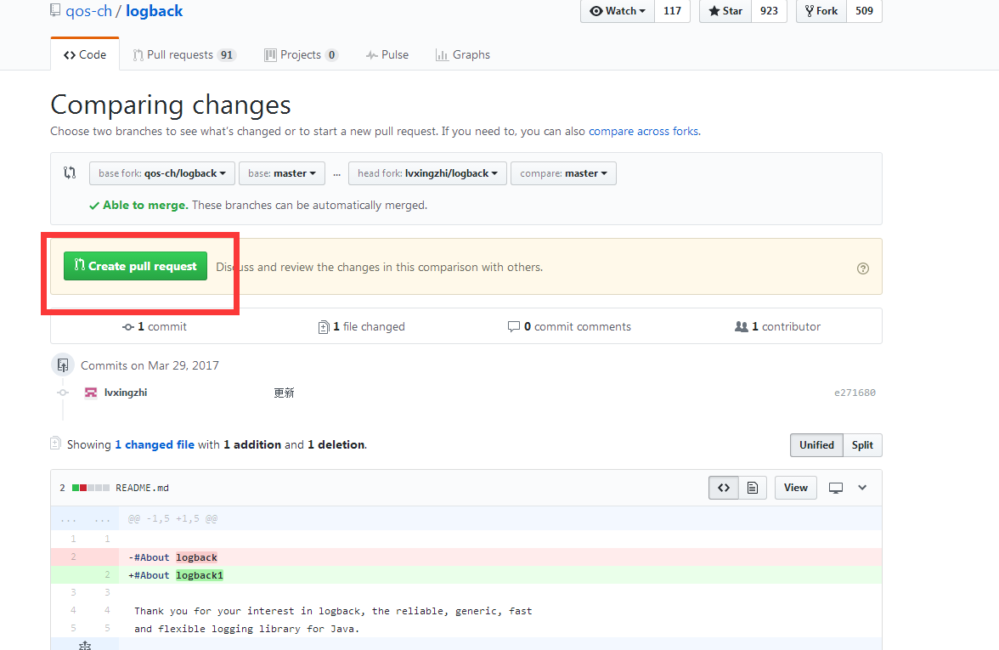

# 环境工具之github上为开源代码提交commit

**一、提交代码步骤**

**1, fork一份logback代码到自己的仓库**

进入github要修改项目的主页,点击fork按钮,fork一份代码到自己的仓库



**2, clone出fork后的项目**

git clone [https://github.com/xxxx/logback.git](https://github.com/xxxx/logback.git)

**3,使本地代码与原始项目关联**

git remote add upstream [https://github.com/qos\-ch/logback.git](https://github.com/qos-ch/logback.git)

**4,关联后,拉取原始项目代码到本地**

**git fetch upstream**

**5,本地进行修改**

**6, 提交代码到自己fork的github仓库**

git commit \-a \-m '修改备注' 

git push

```
Username for 'https://github.com': 输入的是github上的邮箱账号, 而不是github中设置的username
Password for 'https://你的github邮箱@github.com': 输入github的登录密码,点击enter键即可.
```

**7, 进入github上自己fork的项目,创建提交请求到原始代码**






**二、更新fork分支**

merge前的设定

**step 1、**进入到本地仓库的目录。

下面所有操作，如无特别说明，都是在你的本地仓库的目录下操作。比如我的本地仓库为/from\-liujuanjuan\-the\-craft\-of\-selfteaching

**step 2、**执行命令 git remote \-v 查看你的远程仓库的路径：

如果只有上面2行，说明你未设置 upstream （中文叫：上游代码库）。一般情况下，设置好一次 upstream 后就无需重复设置。

**step 3、**执行命令 git remote add upstream https://github.com/selfteaching/the\-craft\-of\-selfteaching.git 把 xiaolai 的仓库设置为你的 upstream 。这个命令执行后，没有任何返回信息；所以再次执行命令 git remote \-v 检查是否成功。

**step 4、**执行命令 git status 检查本地是否有未提交的修改。如果有，则把你本地的有效修改，先从本地仓库推送到你的github仓库。最后再执行一次 git status 检查本地已无未提交的修改。

git add \-A 或者 git add filename git commit \-m "your note" git push origin master git status

注1：这一步作为新手，建议严格执行，是为了避免大量无效修改或文本冲突带来的更复杂局面。

注2：如果你已经在fork后的仓库提交了大量对 xiaolai 的仓库并没有价值的修改，那么想要pull request，还是重新回到本文最初的“最省事办法”吧。

merge 的关键命令

以下操作紧接着上面的步骤。

**step 5、**执行命令 git fetch upstream 抓取 xiaolai 原仓库的更新：

**step 6、**执行命令 git checkout master 切换到 master 分支：

**step 7、**执行命令 git merge upstream/master 合并远程的master分支：

**step 8、**执行命令 git push 把本地仓库向github仓库（你fork到自己名下的仓库）推送修改

参考资料：

[https://www.cnblogs.com/qinggege/p/6641923.html](https://www.cnblogs.com/qinggege/p/6641923.html)
