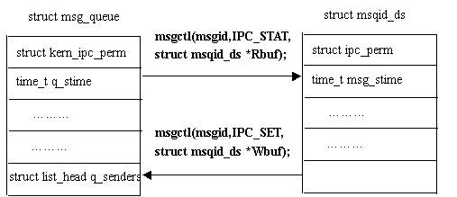
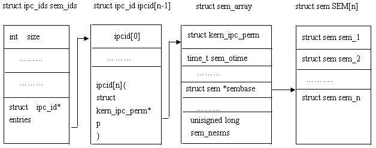
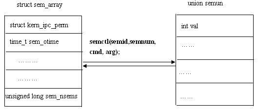
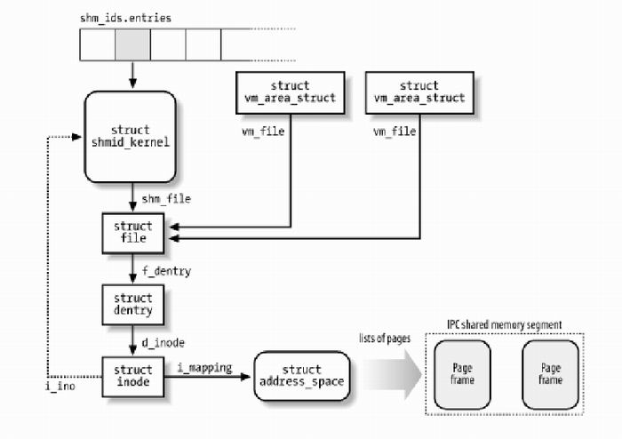

# 用户编程之进程通信

`IPC` `信号灯` `消息队列` `共享内存` `管道`

**一、管道**

1、本质:  内核缓冲区，伪文件 \- 不占用磁盘空间

特点:1、读端，写端，对应两个文件描述符 2、数据写端流入， 读端流出

操作管道的进程被销毁之后，管道自动被释放了，管道默认是阻塞的，读写两端都是。

2.管道的原理 

内部实现方式：环形队列

特点：先进先出

缓冲区大小：默认4k，根据命令ulimit \-a查看，大小会根据实际情况做适当调整

3. 管道的局限性

队列：数据只能读取一次，不能重复读取

半双工：单向数据流

匿名管道：适用于有血缘关系的进程

4.创建匿名管道

int pipe\(int fd\[2\]\);

fd\- 传出参数：fd\[0\] \- 读端   fd\[1\] \- 写端

5.管道的读写行为

读操作：

（1）有数据，read（fd） \- 正常读，返回读出的字节数

（2）无数据，写端全部关闭，read解除阻塞，返回0，相当于读文件读到了尾部；

          写端没有全部关闭，read阻塞。

写操作：

（1）读端全部关闭，管道破裂，进程被终止，内核给当前进程发信号SIGPIPE

（2）读端没全部关闭，缓冲区写满了，write 阻塞，缓冲区没有满，write继续写

**二、命令管道（FIFO）**

管道没有名字，因此它们的最大劣势是只能用于有一个共同祖先进程的各个进程之间。我们无法在无亲缘关系的两个进程之间创建一个管道并将它用作IPC管道。

FIFO类似于管道，也叫做有名管道。是一个单向（半双工）数据流。不同于管道的是，每个FIFO有一个路径名与之关联，从而允许无亲缘关系的进程访问同一个FIFO。

1.特点

在磁盘上有这样一个文件，通过ls \-l能够查看，但在磁盘大小永远为0，在内核中有一个对应的缓冲区，半双工的通信方式

2.创建方式

一种是通过命令创建：mkdido 管道名；另一种是通过函数进行创建；

**三、消息队列**

**1、消息队列基本概念**

- 系统V消息队列是随内核持续的，只有在内核重起或者显示删除一个消息队列时，该消息队列才会真正被删除。因此系统中记录消息队列的数据结构（struct ipc\_ids msg\_ids）位于内核中，系统中的所有消息队列都可以在结构msg\_ids中找到访问入口。
- 消息队列就是一个消息的链表。每个消息队列都有一个队列头，用结构struct msg\_queue来描述

结构msg\_queue用来描述消息队列头，存在于系统空间：

|2

3

4

5

6

7

8

9

10

11

12

13

14
1|    struct kern\_ipc\_perm q\_perm;

    time\_t q\_stime;         /\* last msgsnd time \*/

    time\_t q\_rtime;         /\* last msgrcv time \*/

    time\_t q\_ctime;         /\* last change time \*/

    unsigned long q\_cbytes;     /\* current number of bytes on queue \*/

    unsigned long q\_qnum;       /\* number of messages in queue \*/

    unsigned long q\_qbytes;     /\* max number of bytes on queue \*/

    pid\_t q\_lspid;          /\* pid of last msgsnd \*/

    pid\_t q\_lrpid;          /\* last receive pid \*/

    struct list\_head q\_messages;

    struct list\_head q\_receivers;

    struct list\_head q\_senders;

};
struct msg\_queue {||
|-------------------|----------------------------------------------------------------------------------------------------------------------------------------------------------------------------------------------------------------------------------------------------------------------------------------------------------------------------------------------------------------------------------------------------------------------------------------------------------------------------------------------------------------------------------------------------------------------------------------------------------------------------------------------------------------||

- 下图说明了内核与消息队列是怎样建立起联系的：

##### 

从上图可以看出，全局数据结构 struct ipc\_ids msg\_ids 可以访问到每个消息队列头的第一个成员：struct kern\_ipc\_perm；而每个struct kern\_ipc\_perm能够与具体的消息队列对应起来是因为在该结构中，有一个key\_t类型成员key，而key则唯一确定一个消息队列。kern\_ipc\_perm结构如下：

|2

3

4

5

6

7

8

9
1|key\_t   key;    //该键值则唯一对应一个消息队列

uid\_t   uid;

gid\_t   gid;

uid\_t   cuid;

gid\_t   cgid;

mode\_t  mode;

unsigned long seq;

}
struct kern\_ipc\_perm{   //内核中记录消息队列的全局数据结构msg\_ids能够访问到该结构；|
|---------|----------------------------------------------------------------------------------------------------------------------------------------------------------------------------------------------------------------------------|

**2、操作消息队列**

### 对消息队列的操作无非有下面三种类型：

1、 打开或创建消息队列

消息队列的内核持续性要求每个消息队列都在系统范围内对应唯一的键值，所以，要获得一个消息队列的描述字，只需提供该消息队列的键值即可；

注：消息队列描述字是由在系统范围内唯一的键值生成的，而键值可以看作对应系统内的一条路经。

2、 读写操作

消息读写操作非常简单，对开发人员来说，每个消息都类似如下的数据结构：

```

2
3
4
1
long mtype;
char mtext[1];
};
struct msgbuf{

```

3、 获得或设置消息队列属性：mtype成员代表消息类型，从消息队列中读取消息的一个重要依据就是消息的类型；mtext是消息内容，当然长度不一定为1。因此，对于发送消息来说，首先预置一个msgbuf缓冲区并写入消息类型和内容，调用相应的发送函数即可；对读取消息来说，首先分配这样一个msgbuf缓冲区，然后把消息读入该缓冲区即可。

消息队列的信息基本上都保存在消息队列头中，因此，可以分配一个类似于消息队列头的结构\(struct msqid\_ds，见 [附录 2](https://www.ibm.com/developerworks/cn/linux/l-ipc/part3/#listing2)\)，来返回消息队列的属性；同样可以设置该数据结构。

##### 

### 消息队列API

**1、文件名到键值**

|2

3
1|\#include \<sys/ipc.h\>

key\_t ftok \(char\*pathname, char proj\)；
\#include \<sys/types.h\>|
|---|-------------------------------------------------------------------------------------------|

它返回与路径pathname相对应的一个键值。该函数不直接对消息队列操作，但在调用ipc\(MSGGET,…\)或msgget\(\)来获得消息队列描述字前，往往要调用该函数。典型的调用代码是：

|2

3
1|    ipc\_id=ipc\(MSGGET, \(int\)key, flags,0,NULL,0\);

    …
key=ftok\(path\_ptr, 'a'\);|
|---|---------------------------------------------------------------------------------------|

**2、linux为操作系统V进程间通信的三种方式（消息队列、信号灯、共享内存区）提供了一个统一的用户界面：**

**int ipc**\(unsigned int **call**, int **first**, int **second**, int **third**, void \* **ptr**, long **fifth**\);

第一个参数指明对IPC对象的操作方式，对消息队列而言共有四种操作：MSGSND、MSGRCV、MSGGET以及MSGCTL，分别代表向消息队列发送消息、从消息队列读取消息、打开或创建消息队列、控制消息队列；first参数代表唯一的IPC对象；下面将介绍四种操作。

- 与该操作对应的系统V调用为：int msgget\( \(key\_t\)first，second\)。
    **int ipc**
- 与该操作对应的系统V调用为：int msgctl\( first，second, \(struct msqid\_ds\*\) ptr\)。
    **int ipc**
- 与该操作对应的系统V调用为：int msgsnd\( first, \(struct msgbuf\*\)ptr, second, third\)。
    **int ipc**
- 与该操作对应的系统V调用为：int msgrcv\( first，\(struct msgbuf\*\)ptr, second, fifth,third\)，
    **int ipc**

注：本人不主张采用系统调用ipc\(\)，而更倾向于采用系统V或者POSIX进程间通信API。原因如下：

- 虽然该系统调用提供了统一的用户界面，但正是由于这个特性，它的参数几乎不能给出特定的实际意义（如以first、second来命名参数），在一定程度上造成开发不便。
- 正如ipc手册所说的：ipc\(\)是linux所特有的，编写程序时应注意程序的移植性问题；
- 该系统调用的实现不过是把系统V IPC函数进行了封装，没有任何效率上的优势；
- 系统V在IPC方面的API数量不多，形式也较简洁。

**3.系统V消息队列API**

系统V消息队列API共有四个，使用时需要包括几个头文件：

|2

3
1|\#include \<sys/ipc.h\>

\#include \<sys/msg.h\>
\#include \<sys/types.h\>|
|---|-----------------------------------------------------------------------|

**1）int msgget\(key\_t key, int msgflg\)**

参数key是一个键值，由ftok获得；msgflg参数是一些标志位。该调用返回与健值key相对应的消息队列描述字。

在以下两种情况下，该调用将创建一个新的消息队列：

- 如果没有消息队列与健值key相对应，并且msgflg中包含了IPC\_CREAT标志位；
- key参数为IPC\_PRIVATE；

参数msgflg可以为以下：IPC\_CREAT、IPC\_EXCL、IPC\_NOWAIT或三者的或结果。

**调用返回：**成功返回消息队列描述字，否则返回\-1。

注：参数key设置成常数IPC\_PRIVATE并不意味着其他进程不能访问该消息队列，只意味着即将创建新的消息队列。

**2）int msgrcv\(int msqid, struct msgbuf \*msgp, int msgsz, long msgtyp, int msgflg\);**

该系统调用从msgid代表的消息队列中读取一个消息，并把消息存储在msgp指向的msgbuf结构中。

msqid为消息队列描述字；消息返回后存储在msgp指向的地址，msgsz指定msgbuf的mtext成员的长度（即消息内容的长度），msgtyp为请求读取的消息类型；读消息标志msgflg可以为以下几个常值的或：

- IPC\_NOWAIT 如果没有满足条件的消息，调用立即返回，此时，errno=ENOMSG
- IPC\_EXCEPT 与msgtyp\>0配合使用，返回队列中第一个类型不为msgtyp的消息
- IPC\_NOERROR 如果队列中满足条件的消息内容大于所请求的msgsz字节，则把该消息截断，截断部分将丢失。

msgrcv手册中详细给出了消息类型取不同值时\(\>0; \<0; =0\)，调用将返回消息队列中的哪个消息。

msgrcv\(\)解除阻塞的条件有三个：

1. 消息队列中有了满足条件的消息；
2. msqid代表的消息队列被删除；
3. 调用msgrcv（）的进程被信号中断；

**调用返回：**成功返回读出消息的实际字节数，否则返回\-1。

**3）int msgsnd\(int msqid, struct msgbuf \*msgp, int msgsz, int msgflg\);**

向msgid代表的消息队列发送一个消息，即将发送的消息存储在msgp指向的msgbuf结构中，消息的大小由msgze指定。

对发送消息来说，有意义的msgflg标志为IPC\_NOWAIT，指明在消息队列没有足够空间容纳要发送的消息时，msgsnd是否等待。造成msgsnd\(\)等待的条件有两种：

- 当前消息的大小与当前消息队列中的字节数之和超过了消息队列的总容量；
- 当前消息队列的消息数（单位"个"）不小于消息队列的总容量（单位"字节数"），此时，虽然消息队列中的消息数目很多，但基本上都只有一个字节。

msgsnd\(\)解除阻塞的条件有三个：

1. 不满足上述两个条件，即消息队列中有容纳该消息的空间；
2. msqid代表的消息队列被删除；
3. 调用msgsnd（）的进程被信号中断；

**调用返回：**成功返回0，否则返回\-1。

**4）int msgctl\(int msqid, int cmd, struct msqid\_ds \*buf\);**

该系统调用对由msqid标识的消息队列执行cmd操作，共有三种cmd操作：IPC\_STAT、IPC\_SET 、IPC\_RMID。

1. IPC\_STAT：该命令用来获取消息队列信息，返回的信息存贮在buf指向的msqid结构中；
2. IPC\_SET：该命令用来设置消息队列的属性，要设置的属性存储在buf指向的msqid结构中；可设置属性包括：msg\_perm.uid、msg\_perm.gid、msg\_perm.mode以及msg\_qbytes，同时，也影响msg\_ctime成员。
3. IPC\_RMID：删除msqid标识的消息队列；

**调用返回：**成功返回0，否则返回\-1。

## 消息队列小结：

消息队列与管道以及有名管道相比，具有更大的灵活性，首先，它提供有格式字节流，有利于减少开发人员的工作量；其次，消息具有类型，在实际应用中，可作为优先级使用。这两点是管道以及有名管道所不能比的。同样，消息队列可以在几个进程间复用，而不管这几个进程是否具有亲缘关系，这一点与有名管道很相似；但消息队列是随内核持续的，与有名管道（随进程持续）相比，生命力更强，应用空间更大。

**四、信号量**

## 1、信号灯概述

信号灯与其他进程间通信方式不大相同，它主要提供对进程间共享资源访问控制机制。相当于内存中的标志，进程可以根据它判定是否能够访问某些共享资源，同时，进程也可以修改该标志。除了用于访问控制外，还可用于进程同步。信号灯有以下两种类型：

- 注：二值信号灯能够实现互斥锁的功能，但两者的关注内容不同。信号灯强调共享资源，只要共享资源可用，其他进程同样可以修改信号灯的值；互斥锁更强调进程，占用资源的进程使用完资源后，必须由进程本身来解锁。
    二值信号灯：最简单的信号灯形式，信号灯的值只能取0或1，类似于互斥锁。
- 计算信号灯：信号灯的值可以取任意非负值（当然受内核本身的约束）。

（具体使用哪种，取决于实际资源数）

## 2、Linux信号灯

linux对信号灯的支持状况与消息队列一样，在red had 8.0发行版本中支持的是系统V的信号灯。因此，本文将主要介绍系统V信号灯及其相应API。在没有声明的情况下，以下讨论中指的都是系统V信号灯。

注意，通常所说的系统V信号灯指的是计数信号灯集。

## 3、信号灯与内核

1、系统V信号灯是随内核持续的，只有在内核重起或者显示删除一个信号灯集时，该信号灯集才会真正被删除。因此系统中记录信号灯的数据结构（struct ipc\_ids sem\_ids）位于内核中，系统中的所有信号灯都可以在结构sem\_ids中找到访问入口。

2、下图说明了内核与信号灯是怎样建立起联系的：

其中：struct ipc\_ids sem\_ids是内核中记录信号灯的全局数据结构；描述一个具体的信号灯及其相关信息。

##### 

其中，struct sem结构如下：

|2

3

4
1|int semval;     // current value

int sempid      // pid of last operation

}
struct sem{|
|----|------------------------------------------------------------------------------------|

从上图可以看出，全局数据结构struct ipc\_ids sem\_ids可以访问到struct kern\_ipc\_perm的第一个成员：struct kern\_ipc\_perm；而每个struct kern\_ipc\_perm能够与具体的信号灯对应起来是因为在该结构中，有一个key\_t类型成员key，而key则唯一确定一个信号灯集；同时，结构struct kern\_ipc\_perm的最后一个成员sem\_nsems确定了该信号灯在信号灯集中的顺序，这样内核就能够记录每个信号灯的信息了。kern\_ipc\_perm结构参见《Linux环境进程间通信（三）：消息队列》。struct sem\_array见附录1。

## 4、操作信号灯

### 对消息队列的操作无非有下面三种类型：

1、 打开或创建信号灯

与消息队列的创建及打开基本相同，不再详述。

2、 信号灯值操作

linux可以增加或减小信号灯的值，相应于对共享资源的释放和占有。具体参见后面的semop系统调用。

3、 获得或设置信号灯属性：

系统中的每一个信号灯集都对应一个struct sem\_array结构（一个信号集sem\_array包含一个或多个信号灯，信号灯是用于资源同步的最小单元，对应于消息队列中的一个消息），该结构记录了信号灯集的各种信息，存在于系统空间。为了设置、获得该信号灯集的各种信息及属性，在用户空间有一个重要的联合结构与之对应，即union semun。

##### 

联合semun数据结构各成员意义参见附录2

### 信号灯API

1、文件名到键值

|2

3
1|\#include \<sys/ipc.h\>

key\_t ftok \(char\*pathname, char proj\)；
\#include \<sys/types.h\>|
|---|-------------------------------------------------------------------------------------------|

它返回与路径pathname相对应的一个键值，具体用法请参考《Linux环境进程间通信（三）：消息队列》。

2、 linux特有的ipc\(\)调用：

int ipc\(unsigned int call, int first, int second, int third, void \*ptr, long fifth\);

参数call取不同值时，对应信号灯的三个系统调用：

当call为SEMOP时，对应int semop\(int semid, struct sembuf \*sops, unsigned nsops\)调用；

当call为SEMGET时，对应int semget\(key\_t key, int nsems, int semflg\)调用；

当call为SEMCTL时，对应int semctl\(int semid，int semnum，int cmd，union semun arg\)调用；

这些调用将在后面阐述。

注：本人不主张采用系统调用ipc\(\)，而更倾向于采用系统V或者POSIX进程间通信API。原因已在Linux环境进程间通信（三）：消息队列中给出。

3、系统V信号灯API

系统V消息队列API只有三个，使用时需要包括几个头文件：

|2

3
1|\#include \<sys/ipc.h\>

\#include \<sys/sem.h\>
\#include \<sys/types.h\>|
|---|-----------------------------------------------------------------------|

1）int semget\(key\_t key, int nsems, int semflg\)

参数key是一个键值，由ftok获得，唯一标识一个信号灯集（注意该函数一次创建的是一个信号集，而非单个信号灯），用法与msgget\(\)中的key相同；参数nsems指定打开或者新创建的信号灯集中将包含信号灯的数目；semflg参数是一些标志位。参数key和semflg的取值，以及何时打开已有信号灯集或者创建一个新的信号灯集与msgget\(\)中的对应部分相同，不再祥述。

该调用返回与健值key相对应的信号灯集描述字。

调用返回：成功返回信号灯集描述字，否则返回\-1。

注：如果key所代表的信号灯已经存在，且semget指定了IPC\_CREAT|IPC\_EXCL标志，那么即使参数nsems与原来信号灯的数目不等，返回的也是EEXIST错误；如果semget只指定了IPC\_CREAT标志，那么参数nsems必须与原来的值一致，在后面程序实例中还要进一步说明。

2）int semop\(int semid, struct sembuf \*sops, unsigned nsops\);

semid是信号灯集ID，sops指向数组的每一个sembuf结构都刻画一个在特定信号灯上的操作。nsops为sops指向数组的大小。

sembuf结构如下：

|2

3

4

5
1|    unsigned short      sem\_num;        /\* semaphore index in array \*/

    short           sem\_op;     /\* semaphore operation \*/

    short           sem\_flg;        /\* operation flags \*/

};
struct sembuf {|
|-----|------------------------------------------------------------------------------------------------------------------------------------------------------------------------------------------------------------------|

sem\_num对应信号集中的信号灯（对应信号集中的信号灯索引值），0对应第一个信号灯。sem\_flg可取IPC\_NOWAIT以及SEM\_UNDO两个标志。如果设置了SEM\_UNDO标志，那么在进程结束时，相应的操作将被取消，这是比较重要的一个标志位。如果设置了该标志位，那么在进程没有释放共享资源就退出时，内核将代为释放。如果为一个信号灯设置了该标志，内核都要分配一个sem\_undo结构来记录它，为的是确保以后资源能够安全释放。事实上，如果进程退出了，那么它所占用就释放了，但信号灯值却没有改变，此时，信号灯值反映的已经不是资源占有的实际情况，在这种情况下，问题的解决就靠内核来完成。这有点像僵尸进程，进程虽然退出了，资源也都释放了，但内核进程表中仍然有它的记录，此时就需要父进程调用waitpid来解决问题了。

sem\_op的值大于0，等于0以及小于0确定了对sem\_num指定的信号灯进行的三种操作。具体请参考linux相应手册页。

这里需要强调的是semop同时操作多个信号灯，在实际应用中，对应多种资源的申请或释放。semop保证操作的原子性，这一点尤为重要。尤其对于多种资源的申请来说，要么一次性获得所有资源，要么放弃申请，要么在不占有任何资源情况下继续等待，这样，一方面避免了资源的浪费；另一方面，避免了进程之间由于申请共享资源造成死锁。

也许从实际含义上更好理解这些操作：信号灯的当前值记录相应资源目前可用数目；sem\_op\>0对应相应进程要释放sem\_op数目的共享资源；sem\_op=0可以用于对共享资源是否已用完的测试；sem\_op\<0相当于进程要申请\-sem\_op个共享资源。（通过设置sem\_op来实现释放、申请、测试信号量）再联想操作的原子性，更不难理解该系统调用何时正常返回，何时睡眠等待。

调用返回：成功返回0，否则返回\-1。

3\) int semctl\(int semid，int semnum，int cmd，union semun arg\)

该系统调用实现对信号灯的各种控制操作，参数semid指定信号灯集，参数cmd指定具体的操作类型；参数semnum指定对哪个信号灯操作，只对几个特殊的cmd操作有意义；arg用于设置或返回信号灯信息。

该系统调用详细信息请参见其手册页，这里只给出参数cmd所能指定的操作。

**五、共享内存**

进程间共享内存的两种方式：

1、系统调用mmap\(\)通过映射一个普通文件实现共享内存。

2、系统V则是通过映射特殊文件系统shm中的文件实现进程间的共享内存通信。也就是说，每个共享内存区域对应特殊文件系统shm中的一个文件（这是通过shmid\_kernel结构联系起来的）。

通过对试验结果分析，对比系统V与mmap\(\)映射普通文件实现共享内存通信，可以得出如下结论：

1、 系统V共享内存中的数据，从来不写入到实际磁盘文件中去；而通过mmap\(\)映射普通文件实现的共享内存通信可以指定何时将数据写入磁盘文件中。 注：前面讲到，系统V共享内存机制实际是通过映射特殊文件系统shm中的文件实现的，文件系统shm的安装点在交换分区上，系统重新引导后，所有的内容都丢失。

2、 系统V共享内存是随内核持续的，即使所有访问共享内存的进程都已经正常终止，共享内存区仍然存在（除非显式删除共享内存），在内核重新引导之前，对该共享内存区域的任何改写操作都将一直保留。

3、 通过调用mmap\(\)映射普通文件进行进程间通信时，一定要注意考虑进程何时终止对通信的影响。而通过系统V共享内存实现通信的进程则不然。 注：这里没有给出shmctl的使用范例，原理与消息队列大同小异。

**（一）mmap共享内存**

mmap\(\)系统调用使得进程之间通过映射同一个普通文件实现共享内存。普通文件被映射到进程地址空间后，进程可以向访问普通内存一样对文件进行访问，不必再调用read\(\)，write（）等操作。

注：实际上，mmap\(\)系统调用并不是完全为了用于共享内存而设计的。它本身提供了不同于一般对普通文件的访问方式，进程可以像读写内存一样对普通文件的操作。而Posix或系统V的共享内存IPC则纯粹用于共享目的，当然mmap\(\)实现共享内存也是其主要应用之一。

### 1、mmap\(\)系统调用形式如下：

void\* mmap \( void \* addr , size\_t len , int prot , int flags , int fd , off\_t offset \)

参数fd为即将映射到进程空间的文件描述字，一般由open\(\)返回，同时，fd可以指定为\-1，此时须指定flags参数中的MAP\_ANON，表明进行的是匿名映射（不涉及具体的文件名，避免了文件的创建及打开，很显然只能用于具有亲缘关系的进程间通信）。len是映射到调用进程地址空间的字节数，它从被映射文件开头offset个字节开始算起。prot 参数指定共享内存的访问权限。可取如下几个值的或：PROT\_READ（可读） , PROT\_WRITE （可写）, PROT\_EXEC （可执行）, PROT\_NONE（不可访问）。flags由以下几个常值指定：MAP\_SHARED , MAP\_PRIVATE , MAP\_FIXED，其中，MAP\_SHARED , MAP\_PRIVATE必选其一，而MAP\_FIXED则不推荐使用。offset参数一般设为0，表示从文件头开始映射。参数addr指定文件应被映射到进程空间的起始地址，一般被指定一个空指针，此时选择起始地址的任务留给内核来完成。函数的返回值为最后文件映射到进程空间的地址，进程可直接操作起始地址为该值的有效地址。这里不再详细介绍mmap\(\)的参数，读者可参考mmap\(\)手册页获得进一步的信息。

### 2、系统调用mmap\(\)用于共享内存的两种方式：

（1）使用普通文件提供的内存映射：适用于任何进程之间； 此时，需要打开或创建一个文件，然后再调用mmap\(\)；典型调用代码如下：

|2

3
1|if\(fd\<0\)

    ...
    fd=open\(name, flag, mode\);|
|---|--------------------------------------------------|

ptr=mmap\(NULL, len , PROT\_READ|PROT\_WRITE, MAP\_SHARED , fd , 0\); 通过mmap\(\)实现共享内存的通信方式有许多特点和要注意的地方，我们将在范例中进行具体说明。

（2）使用特殊文件提供匿名内存映射：适用于具有亲缘关系的进程之间； 由于父子进程特殊的亲缘关系，在父进程中先调用mmap\(\)，然后调用fork\(\)。那么在调用fork\(\)之后，子进程继承父进程匿名映射后的地址空间，同样也继承mmap\(\)返回的地址，这样，父子进程就可以通过映射区域进行通信了。注意，这里不是一般的继承关系。一般来说，子进程单独维护从父进程继承下来的一些变量。而mmap\(\)返回的地址，却由父子进程共同维护。

对于具有亲缘关系的进程实现共享内存最好的方式应该是采用匿名内存映射的方式。此时，不必指定具体的文件，只要设置相应的标志即可，参见范例2。

### 3、系统调用munmap\(\)

int munmap\( void \* addr, size\_t len \)

该调用在进程地址空间中解除一个映射关系，addr是调用mmap\(\)时返回的地址，len是映射区的大小。当映射关系解除后，对原来映射地址的访问将导致段错误发生。

### 4、系统调用msync\(\)

int msync \( void \* addr , size\_t len, int flags\)

一般说来，进程在映射空间的对共享内容的改变并不直接写回到磁盘文件中，往往在调用munmap（）后才执行该操作。可以通过调用msync\(\)实现磁盘上文件内容与共享内存区的内容一致。

**（二）系统V共享内存**

## 1、系统V共享内存原理

进程间需要共享的数据被放在一个叫做IPC共享内存区域的地方，所有需要访问该共享区域的进程都要把该共享区域映射到本进程的地址空间中去。系统V共享内存通过shmget获得或创建一个IPC共享内存区域，并返回相应的标识符。内核在保证shmget获得或创建一个共享内存区，初始化该共享内存区相应的shmid\_kernel结构注同时，还将在特殊文件系统shm中，创建并打开一个同名文件，并在内存中建立起该文件的相应dentry及inode结构，新打开的文件不属于任何一个进程（任何进程都可以访问该共享内存区）。所有这一切都是系统调用shmget完成的。

注：每一个共享内存区都有一个控制结构struct shmid\_kernel，shmid\_kernel是共享内存区域中非常重要的一个数据结构，它是存储管理和文件系统结合起来的桥梁，定义如下：

|2

3

4

5

6

7

8

9

10

11

12

13
1|{  

    struct kern\_ipc\_perm    shm\_perm;

    struct file \*       shm\_file;

    int         id;

    unsigned long       shm\_nattch;

    unsigned long       shm\_segsz;

    time\_t          shm\_atim;

    time\_t          shm\_dtim;

    time\_t          shm\_ctim;

    pid\_t           shm\_cprid;

    pid\_t           shm\_lprid;

};
struct shmid\_kernel /\* private to the kernel \*/|
|-----------------|-----------------------------------------------------------------------------------------------------------------------------------------------------------------------------------------------------------------------------------------------------------------------------------------------------------------------------------------------------------------------------------------|

该结构中最重要的一个域应该是shm\_file，它存储了将被映射文件的地址。每个共享内存区对象都对应特殊文件系统shm中的一个文件，一般情况下，特殊文件系统shm中的文件是不能用read\(\)、write\(\)等方法访问的，当采取共享内存的方式把其中的文件映射到进程地址空间后，可直接采用访问内存的方式对其访问。

这里我们采用\[1\]中的图表给出与系统V共享内存相关数据结构：

##### 

正如消息队列和信号灯一样，内核通过数据结构struct ipc\_ids shm\_ids维护系统中的所有共享内存区域。上图中的shm\_ids.entries变量指向一个ipc\_id结构数组，而每个ipc\_id结构数组中有个指向kern\_ipc\_perm结构的指针。到这里读者应该很熟悉了，对于系统V共享内存区来说，kern\_ipc\_perm的宿主是shmid\_kernel结构，shmid\_kernel是用来描述一个共享内存区域的，这样内核就能够控制系统中所有的共享区域。同时，在shmid\_kernel结构的file类型指针shm\_file指向文件系统shm中相应的文件，这样，共享内存区域就与shm文件系统中的文件对应起来。

在创建了一个共享内存区域后，还要将它映射到进程地址空间，系统调用shmat\(\)完成此项功能。由于在调用shmget\(\)时，已经创建了文件系统shm中的一个同名文件与共享内存区域相对应，因此，调用shmat\(\)的过程相当于映射文件系统shm中的同名文件过程，原理与mmap\(\)大同小异。

## 2、系统V共享内存API

对于系统V共享内存，主要有以下几个API：shmget\(\)、shmat\(\)、shmdt\(\)及shmctl\(\)。

|2
1|\#include \<sys/shm.h\>
\#include \<sys/ipc.h\>|
|--|----------------------------------------------|

shmget（）用来获得共享内存区域的ID，如果不存在指定的共享区域就创建相应的区域。shmat\(\)把共享内存区域映射到调用进程的地址空间中去，这样，进程就可以方便地对共享区域进行访问操作。shmdt\(\)调用用来解除进程对共享内存区域的映射。shmctl实现对共享内存区域的控制操作。这里我们不对这些系统调用作具体的介绍，读者可参考相应的手册页面，后面的范例中将给出它们的调用方法。

注：shmget的内部实现包含了许多重要的系统V共享内存机制；shmat在把共享内存区域映射到进程空间时，并不真正改变进程的页表。当进程第一次访问内存映射区域访问时，会因为没有物理页表的分配而导致一个缺页异常，然后内核再根据相应的存储管理机制为共享内存映射区域分配相应的页表。

**附录** 

**【1】：** 在参考文献\[1\]中，给出了IPC随进程持续、随内核持续以及随文件系统持续的定义：

1. 随进程持续：IPC一直存在到打开IPC对象的最后一个进程关闭该对象为止。如管道和有名管道；
2. 随内核持续：IPC一直持续到内核重新自举或者显示删除该对象为止。如消息队列、信号灯以及共享内存等；
3. 随文件系统持续：IPC一直持续到显示删除该对象为止。

**参考：**

消息队列说明：

[https://www.ibm.com/developerworks/cn/linux/l\-ipc/part3/\#listing2](https://www.ibm.com/developerworks/cn/linux/l-ipc/part3/#listing2)

信号量说明：

[https://www.ibm.com/developerworks/cn/linux/l\-ipc/part4/index.html?mhq=%E4%BF%A1%E5%8F%B7%E7%81%AF&mhsrc=ibmsearch\_d](https://www.ibm.com/developerworks/cn/linux/l-ipc/part4/index.html?mhq=%E4%BF%A1%E5%8F%B7%E7%81%AF&mhsrc=ibmsearch_d)

共享内存（上）：

[https://www.ibm.com/developerworks/cn/linux/l\-ipc/part5/index1.html?mhq=Linux%E7%8E%AF%E5%A2%83%E8%BF%9B%E7%A8%8B%E9%97%B4%E9%80%9A%E4%BF%A1&mhsrc=ibmsearch\_d](https://www.ibm.com/developerworks/cn/linux/l-ipc/part5/index1.html?mhq=Linux%E7%8E%AF%E5%A2%83%E8%BF%9B%E7%A8%8B%E9%97%B4%E9%80%9A%E4%BF%A1&mhsrc=ibmsearch_d)

共享内存（下）：

[https://www.ibm.com/developerworks/cn/linux/l\-ipc/part5/index2.html?ca=drs\-](https://www.ibm.com/developerworks/cn/linux/l-ipc/part5/index2.html?ca=drs-)
