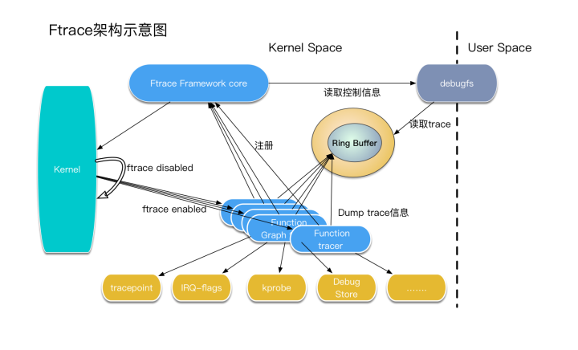
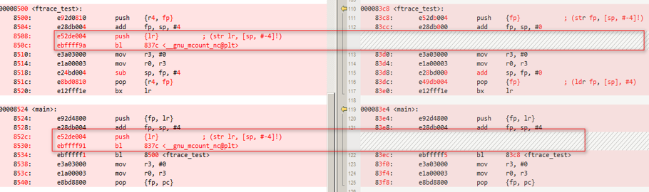
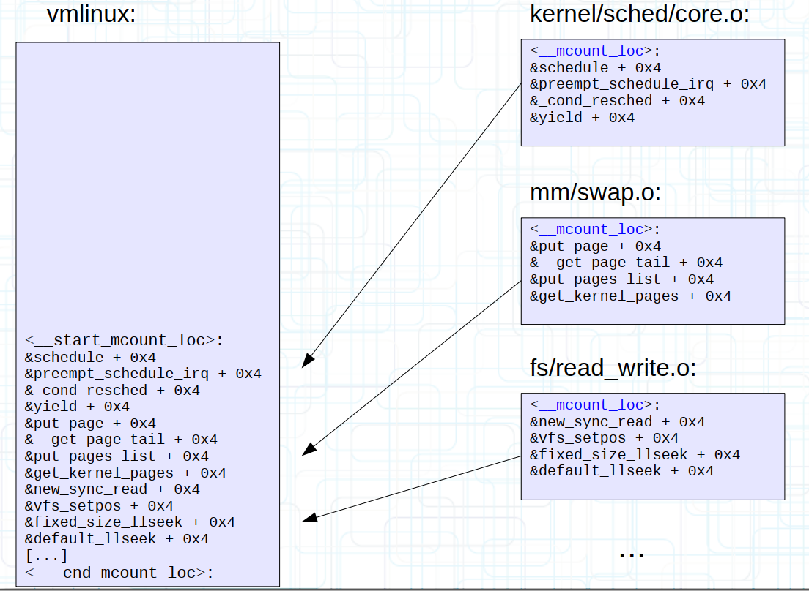
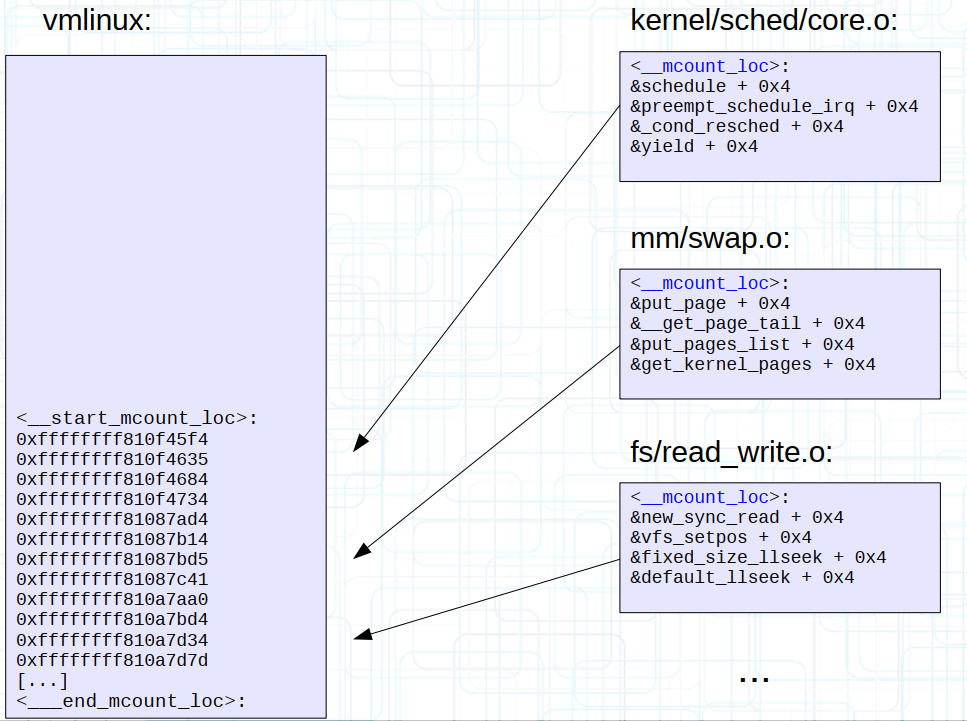
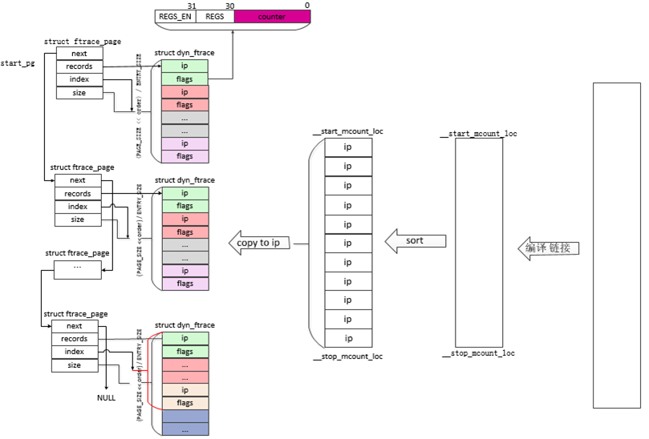
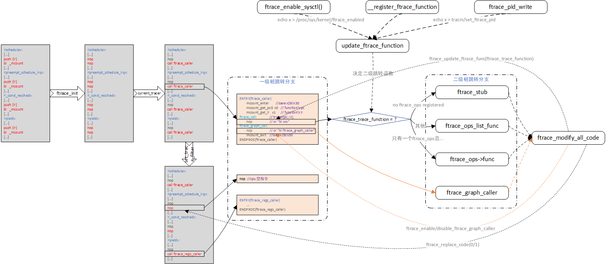
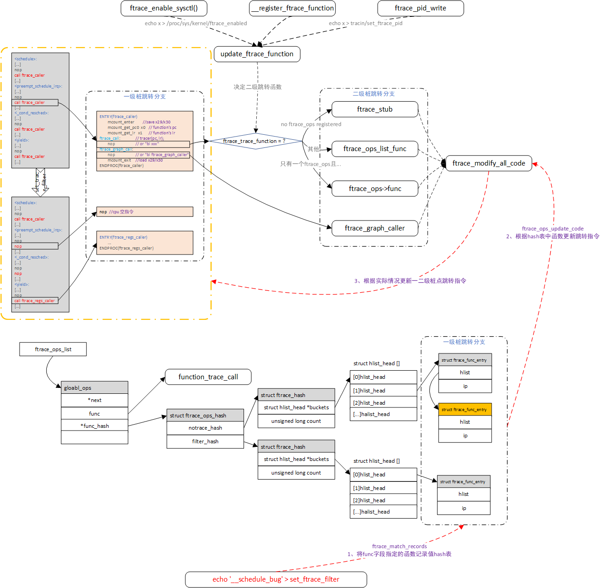
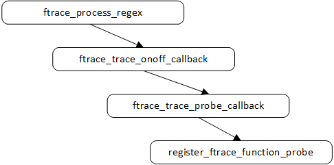
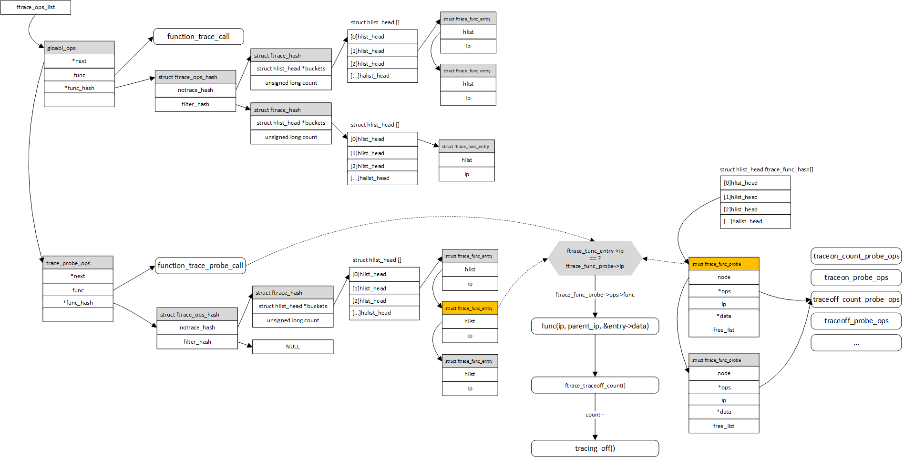

# 调试技术之fracerc桩点�函数转移路径

**一�背景**

ftrace/kprobe等等跟踪工具的��无�是进行函数�桩，本文将梳�ftrace framework的桩点�化�管��其函数跳转路径。



**二�trace �桩**

**2.1 编译时�桩**

使用gcc的\-pg选项让内核中的�个函数\(除部分notrace修饰的函数外\)在执行�都调用一个特殊的�桩函数\_mcount\(\)。



如��个函数都调用这个函数，势必会影�性能，所以内核支�动�开�函数跟踪。�置选项为CONFIG\_DYNAMIC\_FTRACE。在编译期间，使用了一个脚本recordmcount.pl将所有的mcount调用�置点记录在一个表里�。在内核�动阶段会把mcount的替�为NOP指令。当用户通过proc开�函数跟踪功能�，�把NOP替�为对应函数调用。

**2.2 桩点地�规整**

具体\_\_gnu\_mcount\_nc桩点函数的地�最终会�存在在\_\_start\_mcount\_loc和\_\_stop\_mcount\_loc之间，注��存的是被�桩函数的首地�\+桩点相对函数首地�的�移，�存数�的�置��内核的.init.data段，在�始化完�之�会被释放�。�始化收集过程如下：

1�把对应的.o文件的mcount记录到一个\_\_mcount\_loc seciton中。

2�把\_\_mcount\_loc seciton编译�.o文件链�到�object文件中。

3�把所有的object中的\_\_mcount\_loc section链�到vmlinx中的\_\_start\_mcount\_loc和 \_\_stop\_mcount\_loc区间内，存放在.init.data段中。

4�把vmlinux的符�替�为�际的地�。





**2.3 桩点的管�**

内核函数众多，如ubuntu 18.04�行版的4.15版本内核的大致为4.7W个左�的函数存在桩点，为了更好的管�桩点，如知�桩点是�需�被跟踪，具体被跟踪的方�等等，�能需�一些�外的内存�标记这些信�，\_start\_mcount\_loc和\_\_stop\_mcount\_loc之间的这点空间是远远�够的，因此内核�个�桩点都有一个struct dyn\_ftrace�管�，内核在�始化的时候会根��桩点的个数�分��适的物�page，用这些物�page�存放struct dyn\_ftrace结�体，�时会把\_start\_mcount\_loc和\_\_stop\_mcount\_loc之间的ip拷�到struct dyn\_ftrace结�体中的ip中，之�被struct dyn\_ftrace�管。�时会把\_\_start\_mcount\_loc和\_\_stop\_mcount\_loc之间的物�内存释放�。

```
struct dyn_ftrace {
        unsigned long           ip; /* address of mcount call-site */
        unsigned long           flags;
        struct dyn_arch_ftrace  arch;  //大部分为空
};
```

**ip**:�桩点对应的虚拟地�。

**flags**:分为两部分，�bit部分表示引用计数。如�有ftrace\_ops会�作到该ip，引用计数会加1。如�ref\_cnt大�0，�桩点就需�使能了。高bit部分表示��的flag。

strcut dyn\_ftrace的出�方便了桩点信�的管�，但是dyn\_ftrace本身也需�妥善管�，一方�是需��续考虑存储的内存空间，解决�法是专门申请物�页��存储dyn\_ftrace，第二方�需�根�ip地�信�快速查找dyn\_ftrace数�结�，那么给ip�个���以方便查找。管�dyn\_ftrace和物�页�的数�结�为struct ftrace\_page。

```
struct ftrace_page {
        struct ftrace_page      *next;
        struct dyn_ftrace       *records;
        int                     index;
        int                     size;
};
```

**next:**指�下一个strct ftrace\_page结�体，所有的�桩点是由多个struct ftrace\_page共�管�的。

**records**:管��桩点物�page对应的起始地�，�alloc\_page的返�值。records指�的是2^order \(order�0开始为\)大�的物�页�。

**index:**所管��际�桩点的个数。

**size:**所管�的最大的�桩点的个数，最大�桩点个数为records指�的物�页�大�决定的。



桩点的整体管�模�如上图，数�的�始化主�有两个时机，一是内核�动时调用ftrace\_init\(\)�始所有内核镜�中的桩点，二是驱动�入时调用ftrace\_module\_init�始化驱动中的桩点。

```
void __init ftrace_init(void)
{
        count = __stop_mcount_loc - __start_mcount_loc;
        pr_info("ftrace: allocating %ld entries in %ld pages\n",
                count, count / ENTRIES_PER_PAGE + 1);
        ret = ftrace_process_locs(NULL,
                                  __start_mcount_loc,
                                  __stop_mcount_loc);
}

void ftrace_module_init(struct module *mod)
{
        ftrace_process_locs(mod, mod->ftrace_callsites,
                            mod->ftrace_callsites + mod->num_ftrace_callsites);
}
```

通过ftrace\_process\_locs�试化start\-\>end地��存的桩点数�。

```
static int ftrace_process_locs(struct module *mod,
                               unsigned long *start,
                               unsigned long *end)
{
        count = end - start;
        //对桩点按地�进行��，方便�续�索，模�的桩点地�比内核镜�的�？所以两者之间�用�了？
        sort(start, count, sizeof(*start), ftrace_cmp_ips, NULL);  

        //根�桩点个数，分�ftrace_page管�数�结�和物�页�，并返�头部的ftrace_page
        start_pg = ftrace_allocate_pages(count); 
        mutex_lock(&ftrace_lock);

        if (!mod) {
                //如�当�是内核�动时镜�，�始化全局指针ftrace_pages/ftrace_pages_start
                //ftrace_pages指�链表尾
                //ftrace_pages_start指�链表头
                ftrace_pages = ftrace_pages_start = start_pg;
        } else {
                //如�是模��入时，将模�的strct ftrace_page挂在链表尾（ftrace_pages）��
                //那如�是多个模����拔乱�，ftrace_page链表中的地�是�会��是�会乱�？
                ftrace_pages->next = start_pg;
        }

        p = start;
        pg = start_pg;
        while (p < end) {
                addr = ftrace_call_adjust(*p++); //�桩点地�

                if (pg->index == pg->size) {
                        //在��ftrace_page分�时，pg->size中已�存�该ftrace_page的容�
                        pg = pg->next;
                }

                //利用当���的机会，�时计算出当�ftrace_page中有效的dyn_trace的数�放在pg->index中
                rec = &pg->records[pg->index++];  
                rec->ip = addr;  
        }

        ftrace_pages = pg;  //更新ftrace_pages为链表尾
        ftrace_update_code(mod, start_pg); //==》将所有的桩点置为nop，关闭对一级桩跳转分支的调用
        mutex_unlock(&ftrace_lock);
}
```

通过ftrace\_allocate\_pages\(\)为num\_to\_init个dyn\_trace分�物�页�和管�数�结�。

```
static struct ftrace_page * ftrace_allocate_pages(unsigned long num_to_init)
{
        struct ftrace_page *start_pg;
        struct ftrace_page *pg;
        int order;
        int cnt;

        //循�为num_to_init个dyn_trace分�物�内存，�能需�多个ftrace_page结��能放的下，将这些ftrace_page用链表串�
        start_pg = pg = kzalloc(sizeof(*pg), GFP_KERNEL);
        for (;;) {
                //�试为num_to_init个dyn_trace分�物�内存，但�际考虑内存浪费和申请难度，�能申请到的��num_to_init
                cnt = ftrace_allocate_records(pg, num_to_init);
                if (cnt < 0)
                        goto free_pages;

                num_to_init -= cnt;  
                if (!num_to_init)
                        break;

                pg->next = kzalloc(sizeof(*pg), GFP_KERNEL);
                if (!pg->next)
                        goto free_pages;
                pg = pg->next;  //加入链表
        }

        return start_pg;
}

static int ftrace_allocate_records(struct ftrace_page *pg, int count)
{
        int order;
        int cnt;

        //先根�struct dyn_trace的count数，计算出需�物�页�order
        order = get_count_order(DIV_ROUND_UP(count, ENTRIES_PER_PAGE));

        //如�申请的物�页�数�过多，最�有物�页�并未�际使用到，则��物�页�的order分�更�的，防止浪费物�内存
        while ((PAGE_SIZE << order) / ENTRY_SIZE >= count + ENTRIES_PER_PAGE)
                order--;
again:
        pg->records = (void *)__get_free_pages(GFP_KERNEL | __GFP_ZERO, order);

        //如��续的大的物�页�分�失败，则�试��页�粒度，�试分�
        if (!pg->records) {
                if (!order)
                        return -ENOMEM;
                order >>= 1;
                goto again;
        }

        cnt = (PAGE_SIZE << order) / ENTRY_SIZE;
        pg->size = cnt;

        if (cnt > count)
                cnt = count;  //将返�值cnt更新为�际的数�

        return cnt;
}
```

**2.4 tracer设置并�始化**

对�用户，�想使用tracer功能，首先是改�当�的tracer的指�，如"echo function \>  current\_tracer "通过文件设置当�为function tracer，�际是调用tracing\_set\_tracer\(\)函数进行设置。设置的过程中首先是���有的tracer，其次调用tracer\-\>init对当�新加载的tracer进行�始化，以function tracer为例，其调用function\_trace\_init\(\)进行�始化。

```
static int function_trace_init(struct trace_array *tr)
{
        ftrace_func_t func;
        //func为�存trace信�到ringbuffer中的�调函数
        if (tr->flags & TRACE_ARRAY_FL_GLOBAL &&
            func_flags.val & TRACE_FUNC_OPT_STACK)
                func = function_stack_trace_call; 
        else
                func = function_trace_call;

        ftrace_init_array_ops(tr, func); //主�是tr->ops->func = func;

        tr->trace_buffer.cpu = get_cpu();
        put_cpu();

        tracing_start_cmdline_record();
        tracing_start_function_trace(tr);
        return 0;
}

static void tracing_start_function_trace(struct trace_array *tr)
{
        tr->function_enabled = 0;
        register_ftrace_function(tr->ops);  //
        tr->function_enabled = 1;
}

int register_ftrace_function(struct ftrace_ops *ops)
{
        ftrace_ops_init(ops);
        mutex_lock(&ftrace_lock);
        ret = ftrace_startup(ops, 0);
        mutex_unlock(&ftrace_lock);
        return ret;
}

static int ftrace_startup(struct ftrace_ops *ops, int command)
{
        int ret;
         __register_ftrace_function(ops); //主�目的是注册ops

        ftrace_start_up++;

        ops->flags |= FTRACE_OPS_FL_ENABLED | FTRACE_OPS_FL_ADDING;

        ret = ftrace_hash_ipmodify_enable(ops);
        if (ret < 0) {
                /* Rollback registration process */
                __unregister_ftrace_function(ops);
                ftrace_start_up--;
                ops->flags &= ~FTRACE_OPS_FL_ENABLED;
                return ret;
        }
        if (ftrace_hash_rec_enable(ops, 1))
                command |= FTRACE_UPDATE_CALLS;
        ftrace_startup_enable(command);  //根�command中的标志更新一级/二级桩跳转点的跳转指令（函数）
        ops->flags &= ~FTRACE_OPS_FL_ADDING;
        return 0;
}

static int __register_ftrace_function(struct ftrace_ops *ops)
{
#ifndef CONFIG_DYNAMIC_FTRACE_WITH_REGS
        if (ops->flags & FTRACE_OPS_FL_SAVE_REGS &&
            !(ops->flags & FTRACE_OPS_FL_SAVE_REGS_IF_SUPPORTED))
                return -EINVAL;
        if (ops->flags & FTRACE_OPS_FL_SAVE_REGS_IF_SUPPORTED)
                ops->flags |= FTRACE_OPS_FL_SAVE_REGS;
#endif

        if (!core_kernel_data((unsigned long)ops))
                ops->flags |= FTRACE_OPS_FL_DYNAMIC;

        if (ops->flags & FTRACE_OPS_FL_PER_CPU) {
                if (per_cpu_ops_alloc(ops))
                        return -ENOMEM;
        }
        //将ops加入到全局的ftrace_ops_list链表中
        add_ftrace_ops(&ftrace_ops_list, ops);

        //将�始的ops->func�存至ops->saved_func，如�用户设置了通过pid筛选trace输出
        //则将ops->func改为ftrace_pid_func，ftrace_pid_func本质上�是将�始的ops->func（�ops->saved_func）
        //包裹了下，根�pid进行调用ops->saved_func。
        ops->saved_func = ops->func;
        if (ftrace_pids_enabled(ops))
                ops->func = ftrace_pid_func;

        ftrace_update_trampoline(ops);

        if (ftrace_enabled) //判断/proc/sys/kernel/ftrace_enabled�置是�使能
                update_ftrace_function(); //根��际情况更新二级桩分支跳转函数

        return 0;
}
```

ftrace\_startup\_enable对所有的一级/二级桩点指令�能会进行修改，一旦修改，在ring\_bufer开�的情况下，则会真正往ring\_buffer中写入trace信�。

```
static void ftrace_startup_enable(int command)
{
        //ftrace_trace_function�存�更新�的二级桩跳转分支函数，saved_ftrace_func�存�之�的二级桩跳转分支函数
        //如�两者�一样，则需�附加上FTRACE_UPDATE_TRACE_FUNC标志，以让�续能按照正确的顺�修改指令。
        if (saved_ftrace_func != ftrace_trace_function) {
                saved_ftrace_func = ftrace_trace_function;
                command |= FTRACE_UPDATE_TRACE_FUNC;
        }
        ftrace_run_update_code(command);
}

static void ftrace_run_update_code(int command)
{
        //代�段指令修改�的准备工作，如有些平�会将代�段置为�写
        ftrace_arch_code_modify_prepare();

        arch_ftrace_update_code(command);

        //代�段指令修改�的收尾工作，如有些平�会将代�段���读
        ftrace_arch_code_modify_post_process();
}

void arch_ftrace_update_code(int command)
{  
        //由�是�定是�function tracer调下�的，所以��能会有
        //FTRACE_UPDATE_CALLS，FTRACE_UPDATE_TRACE_FUNC两个标志            
        ftrace_modify_all_code(command);
}     
```



**2.5 桩点指令修改策略**

桩点具体的更新由ftrace\_modify\_all\_code\(\)函数�完�，其在整个ftrace指令跳转框�中的�置如上图�边，�数command中的标志决定了桩点具体的指令情况。

```
enum {
        FTRACE_UPDATE_CALLS             = (1 << 0),   //��所有函数桩点，使能桩点函数调用
        FTRACE_DISABLE_CALLS            = (1 << 1),   //��所有函数桩点，失能桩点函数调用
        FTRACE_UPDATE_TRACE_FUNC        = (1 << 2),   //function trace�置（地�&ftrace_call）处�指令有修改
        //下�两�指令分别为function graph trace的使能和失能
        FTRACE_START_FUNC_RET           = (1 << 3),   //function graph trace�置（地�&ftrace_graph_call）处�设置为"bl ftrace_graph_caller"
        FTRACE_STOP_FUNC_RET            = (1 << 4),   //function graph trace�置（地�&ftrace_graph_call）处�设置为nop
};

void ftrace_modify_all_code(int command)
{
        int update = command & FTRACE_UPDATE_TRACE_FUNC;
        int err = 0;

                //如�function trace处�指令有修改，先将指令设置为"bl ftrace_ops_list_func"
        //ftrace_ops_list_func函数会检查hash链表确�。。。。？
        if (update) {  
                
                err = ftrace_update_ftrace_func(ftrace_ops_list_func);
                if (FTRACE_WARN_ON(err))
                        return;
        }

        if (command & FTRACE_UPDATE_CALLS)
                ftrace_replace_code(1);
        else if (command & FTRACE_DISABLE_CALLS)
                ftrace_replace_code(0);

        //全局��ftrace_trace_function�存了function trace�置（地�&ftrace_call）处将�设置的跳转函数
        if (update && ftrace_trace_function != ftrace_ops_list_func) {
                function_trace_op = set_function_trace_op;
                smp_wmb();
                /* If irqs are disabled, we are in stop machine */
                if (!irqs_disabled())
                        smp_call_function(ftrace_sync_ipi, NULL, 1);
                err = ftrace_update_ftrace_func(ftrace_trace_function);  //设置&ftrace_call处的指令值
                if (FTRACE_WARN_ON(err))
                        return;
        }

        if (command & FTRACE_START_FUNC_RET)
                err = ftrace_enable_ftrace_graph_caller(); //function graph trace的跳转使能
        else if (command & FTRACE_STOP_FUNC_RET)
                err = ftrace_disable_ftrace_graph_caller(); //function graph trace的跳转失能
        FTRACE_WARN_ON(err);
}
```

**三�用户动�修改跟踪函数和命令**

**3.1 动�跟踪函数命令设置**

在支�动�trace的情况下，�以动�管�桩点，决定哪些函数的一级桩点跳转使能，�通过设置文件set\_ftrace\_filter/set\_ftrace\_notrace设置函数桩点。

设置方法为：echo "xxxx:xxx:xxx" \> set\_ftrace\_filter，其中echo写入的字段组织如下：

```
<function>:<command>:<parameter>
```

**function**：该字段是表�当�echo命令所作用的函数范围

**command**：该字段表�当�echo命令所�进行的动作，�选�数

        \- **modÂ** å…�许用户通过驱动模å�—æ�¥è¿‡æ»¤è·Ÿè¸ªå‡½æ•°

        \- **traceon**/**traceoffÂ** å…�许用户跟踪æŸ�些函数到达一定计数å��å¼€å�¯/关闭跟踪。ä¸�带å�‚数则是命中å�³æ‰§è¡Œå¼€å�¯æˆ–关闭跟踪。（？看代ç �逻辑如æ�œå¸¦å�‚数是命中å‰�n次时都开å�¯æˆ–关闭跟踪，æ¯�次命中执行开å�¯æˆ–关闭，n次å��结æ�Ÿè¿™ç§�行为）

        \- **snapshotÂ**  触å�‘一个快照

        \- **enable\_event**/**disable\_eventÂ**  å�¯ä»¥ä½¿èƒ½å’Œå¤±èƒ½å‡½æ•°çš„trace event

        \- **dumpÂ** dump the contents of the ftrace ring buffer to the console

        \- **cpudump Â** dump the contents of the ftrace ring buffer for the current CPU to the console

**paramter**：该字段作为command的�数传入，供其使用，�选�数。

例如：echo '\_\_schedule\_bug:traceoff:5' \> set\_ftrace\_filter

具体�以�考Documentation/trace/ftrace.txt文件�述

**3.2 �设置跟踪函数场景分�**

echo '\_\_schedule\_bug' \> set\_ftrace\_filter

echo '\!\_\_schedule\_bug' \> set\_ftrace\_filter

echo '\_\_schedule\*' \> set\_ftrace\_filter

echo '\_\_schedule\_bug' \> set\_ftrace\_notrace

echo '\!\_\_schedule\_bug' \> set\_ftrace\_notrace

echo '\_\_schedule\*' \> set\_ftrace\_notrace

相关文件file\_operations 为ftrace\_filter\_fops以�ftrace\_notrace\_fops

**3.2.1 文件open�作**

```
static int
ftrace_filter_open(struct inode *inode, struct file *file)
{
        //将文件关�到的ftrace_ops作为�续�作的基础，在tracing顶层目录下就是global_ops
        struct ftrace_ops *ops = inode->i_private; 
        return ftrace_regex_open(ops,
                        FTRACE_ITER_FILTER | FTRACE_ITER_DO_HASH,
                        inode, file);
}  
int ftrace_regex_open(struct ftrace_ops *ops, int flag,
                  struct inode *inode, struct file *file)
{
        if (file->f_mode & FMODE_WRITE) {
                const int size_bits = FTRACE_HASH_DEFAULT_BITS;
                //创建一份新的临时hash表�体，暂存至iter->hash，供�续写�作使用
                if (file->f_flags & O_TRUNC)
                        iter->hash = alloc_ftrace_hash(size_bits);
                else
                        iter->hash = alloc_and_copy_ftrace_hash(size_bits, hash);
        }
}
```

**3.2.2 文件write�作**

ftrace\_filter\_write\-\>ftrace\_regex\_write\-\>ftrace\_process\_regex

```
static int ftrace_process_regex(struct ftrace_hash *hash,
                                char *buff, int len, int enable)
{
        char *func, *command, *next = buff;
        struct ftrace_func_command *p;

        func = strsep(&next, ":");  //解�指定函数字段放入func中，剩余字段放入next中

        if (!next) {
                //如�next为空，则表�用户echo的�数中没有命令
                ret = ftrace_match_records(hash, func, len);
                return 0;
        }

                //�行到这说�用户echo的�数中有cmd，进一步解�将命令放入到command中，剩余命令�数放入next中
        command = strsep(&next, ":");
        list_for_each_entry(p, &ftrace_commands, list) {
                if (strcmp(p->name, command) == 0) {
                        ret = p->func(hash, func, command, next, enable);
                        goto out_unlock;
                }
        }

        return ret;
}
```

对\<function\>字段匹�并记录

```
//hash中表示文件对应的是用户所设置文件指�的ftrace_ops的filter或者是notrace链表，buff中存的是func字段
ftrace_match_records(struct ftrace_hash *hash, char *buff, int len)
{
        return match_records(hash, buff, len, NULL);
}
//mod是command的字段，此时mod入�为null，代�中mod相关的��考虑
static int match_records(struct ftrace_hash *hash, char *func, int len, char *mod)
{
        struct ftrace_page *pg;
        struct dyn_ftrace *rec;
        struct ftrace_glob func_g = { .type = MATCH_FULL };
        int found = 0;
        int ret;
        int clear_filter = 0;

        if (func) {
                //filter_parse_regex对func字符进行正则方�解�，�解��和*两�字符
                // * 符�决定匹�类�，并存在func_g.type中
                //1）MATCH_FULL  字符串全匹�
                //2）MATCH_END_ONLY 字符串尾部匹�
                //3）MATCH_FRONT_ONLY 字符串�端匹�
                //4）MATCH_MIDDLE_ONLY 组�中间匹�
                // �决定过滤类�，存在clear_filter，�表示清除hash链表中的func表示的函数
                func_g.type = filter_parse_regex(func, len, &func_g.search, &clear_filter);
                func_g.len = strlen(func_g.search);
        }

        //��所有的dyn_ftrace
        do_for_each_ftrace_rec(pg, rec) { 

                if (rec->flags & FTRACE_FL_DISABLED)
                        continue;
                //先将地�通过kallsyms_lookup()转�函数�，在ftrace_match()函数中按类�进行匹�
                if (ftrace_match_record(rec, &func_g, NULL, { .type = MATCH_FULL })) {
                        //如�匹�到了，使用enter_record修改hash表
                        ret = enter_record(hash, rec, clear_filter);
                        found = 1;
                }
        } while_for_each_ftrace_rec();
out_unlock:
        return found;
}

static int enter_record(struct ftrace_hash *hash, struct dyn_ftrace *rec, int clear_filter)
{
        struct ftrace_func_entry *entry;
        int ret = 0;

        entry = ftrace_lookup_ip(hash, rec->ip);
        if (clear_filter) {
                /* Do nothing if it doesn't exist */
                if (!entry)
                        return 0;
                free_hash_entry(hash, entry);  //�hash链表中摘除并释放entry
        } else {
                /* Do nothing if it exists */
                if (entry)
                        return 0;
                ret = add_hash_entry(hash, rec->ip); //创建一个entry并加入hash链表
        }
        return ret;
}
```

**3.2.3 文件release�作**

```
int ftrace_regex_release(struct inode *inode, struct file *file)
{
        if (file->f_mode & FMODE_WRITE) {
                filter_hash = !!(iter->flags & FTRACE_ITER_FILTER);

                if (filter_hash)
                        orig_hash = &iter->ops->func_hash->filter_hash;
                else
                        orig_hash = &iter->ops->func_hash->notrace_hash;

                mutex_lock(&ftrace_lock);
                old_hash = *orig_hash;
                old_hash_ops.filter_hash = iter->ops->func_hash->filter_hash;
                old_hash_ops.notrace_hash = iter->ops->func_hash->notrace_hash;

                //将��根�用户新echo的�数所创建的hash，更新到iter->ops->func_hash中，由�是使用rcu进行�护，相当�用副本替�
                ret =(iter->ops, filter_hash, orig_hash, iter->hash);
                if (!ret) {
                        //主�作用是更新一级桩点
                        ftrace_ops_update_code(iter->ops, &old_hash_ops);
                        free_ftrace_hash_rcu(old_hash);
                }
                mutex_unlock(&ftrace_lock);
        }
        free_ftrace_hash(iter->hash); //在ftrace_hash_move中已�使用完iter->hash，此处释放�。
        kfree(iter);
}
```

**3.2.4 仅设置func字段总结**

对��设置function这�场景，�质上�是更新文件指�的ops的filter\_hash/notrace\_hash链表，并根�链表修改一级桩点的指令值，以��动�对�些函数的跟踪或�跟踪，达到动�跟踪的目的。

主�步骤：

1�将“func�字段表示的函数记录到hash链表中

2�根�hash链表更新一二级桩点指令

3�函数跟踪时��调用trace\_ops的func方法跟踪用户想跟踪的具体函数



**3.2 存在cmd的场景分�**

以traceoff为例分�：echo '\_\_schedule\_bug:traceoff:5' \> set\_ftrace\_filter

其函数调用路径：



```
//入�glob是function字段，入�cmd是用户设置的command字段，param是用户设置的�数字段
static int ftrace_trace_onoff_callback(struct ftrace_hash *hash,
                            char *glob, char *cmd, char *param, int enable)
{
        struct ftrace_probe_ops *ops;
        //判断param�数是�存在，决定是�根�跟踪次数执行command
        if (strcmp(cmd, "traceon") == 0)
                ops = param ? &traceon_count_probe_ops : &traceon_probe_ops;
        else
                ops = param ? &traceoff_count_probe_ops : &traceoff_probe_ops;
        return ftrace_trace_probe_callback(ops, hash, glob, cmd,
                                           param, enable);
}

static int ftrace_trace_probe_callback(struct ftrace_probe_ops *ops,
                            struct ftrace_hash *hash, char *glob,
                            char *cmd, char *param, int enable)
{
        void *count = (void *)-1;
        char *number;
        int ret;

        if (glob[0] == '!') {
                unregister_ftrace_function_probe_func(glob+1, ops);
                return 0;
        }

        //�数param是一个数字，表示执行
        number = strsep(&param, ":"); 
        //将字符串形�的数字转��unsigned long形�的数字，并存在count中。此处count为指针类�，�际上存的是数字。
        ret = kstrtoul(number, 0, (unsigned long *)&count); 

out_reg:
        ret = register_ftrace_function_probe(glob, ops, count);

        return ret < 0 ? ret : 0;
}
```

```
int register_ftrace_function_probe(char *glob, struct ftrace_probe_ops *ops, void *data)
{
    struct ftrace_hash **orig_hash = &trace_probe_ops.func_hash->filter_hash;
    struct ftrace_hash *old_hash = *orig_hash;
    

    //先将�先�的trace_probe_ops.func_hash->filter_hash表拷�一份
    hash = alloc_and_copy_ftrace_hash(FTRACE_HASH_DEFAULT_BITS, old_hash);

    //��所有的函数桩点
    do_for_each_ftrace_rec(pg, rec) {

                //如�函数桩点�当�设置的func字段的函数�匹�，则进入下一个
                if (!ftrace_match_record(rec, &func_g, NULL, 0))
                        continue;
                
                //到这里，表�匹�到当�设置的func函数
                //申请一个struct ftrace_func_probe类�的entry
                entry = kmalloc(sizeof(*entry), GFP_KERNEL);
                count++;
                entry->data = data;

                if (ops->init) {
                        ops->init(ops, rec->ip, &entry->data)；
                }

                //将匹�到的桩点，记录到��临时申请的hash链表中
                ret = enter_record(hash, rec, 0);

                            //在entry中记录ops函数和桩点地�，这两个值很��
                entry->ops = ops;  
                entry->ip = rec->ip;

                key = hash_long(entry->ip, FTRACE_HASH_BITS);
                //将entry加入到全局的ftrace_func_hash链表中
                hlist_add_head_rcu(&entry->node, &ftrace_func_hash[key]);

        } while_for_each_ftrace_rec();

        //将��记录了所有�始�新�桩点的hash链表，移到trace_probe_ops->func_hash->filter_hash中�
        ret = ftrace_hash_move(&trace_probe_ops, 1, orig_hash, hash);

        __enable_ftrace_function_probe(&old_hash_ops);
}

```

设置完��的数�结�如下图所示，相比没有command字段的情况下多了一个trace\_probe\_ops，新�的trace\_probe\_ops主�用��制commad关�函数执行。

1�系统�行时二级桩点函数ftrace\_ops\_list\_func\(\)会��ftrce\_ops\_list，根�ftrace\_ops中hash表中是�记录有当�函数，�判断是�执行ftrace\_ops\-\>func。因此需�在trace\_probe\_ops\-\>func\_hash中建立一个完整的桩点引用链表

2�在�外的ftrace\_func\_hash链表中，为附带有命令的函数申请一个struct ftrace\_func\_probe entry，用�记录具体函数所关�的命令�其�作方法

3�跟踪时，执行ftrace\_ops的func （function\_trace\_probe\_call），会最终调用到struct ftrace\_func\_probe\-\>ops



**四�二级桩函数执行**

如�ftrace\_ops\_list中注册有多个ops，那么二级桩函数会设置为ftrace\_ops\_list\_func（）

```
#define ftrace_ops_list_func ((ftrace_func_t)ftrace_ops_no_ops)
static void ftrace_ops_no_ops(unsigned long ip, unsigned long parent_ip)
{
        __ftrace_ops_list_func(ip, parent_ip, NULL, NULL);
}

static inline void
__ftrace_ops_list_func(unsigned long ip, unsigned long parent_ip,
                       struct ftrace_ops *ignored, struct pt_regs *regs)
{
        struct ftrace_ops *op;

        //��ftrace_ops_list链表中所有的ops
        do_for_each_ftrace_op(op, ftrace_ops_list) {
                if ((!(op->flags & FTRACE_OPS_FL_RCU) || rcu_is_watching()) &&
                    (!(op->flags & FTRACE_OPS_FL_PER_CPU) ||
                     !ftrace_function_local_disabled(op)) &&
                    ftrace_ops_test(op, ip, regs)) {  
            //ftrace_ops_test(op, ip, regs)测试ftrace_ops的hash表中是�有entry引用了函数桩点，引用了�能继续往下执行
                        op->func(ip, parent_ip, op, regs);
                }
        } while_for_each_ftrace_op(op);
        trace_clear_recursion(bit);
}
```

**五��考资料**

1�https://www.cnblogs.com/hellokitty2/p/15624976.html

2�https://blog.csdn.net/pwl999/article/details/80702365/
