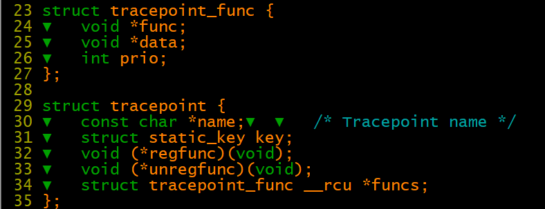
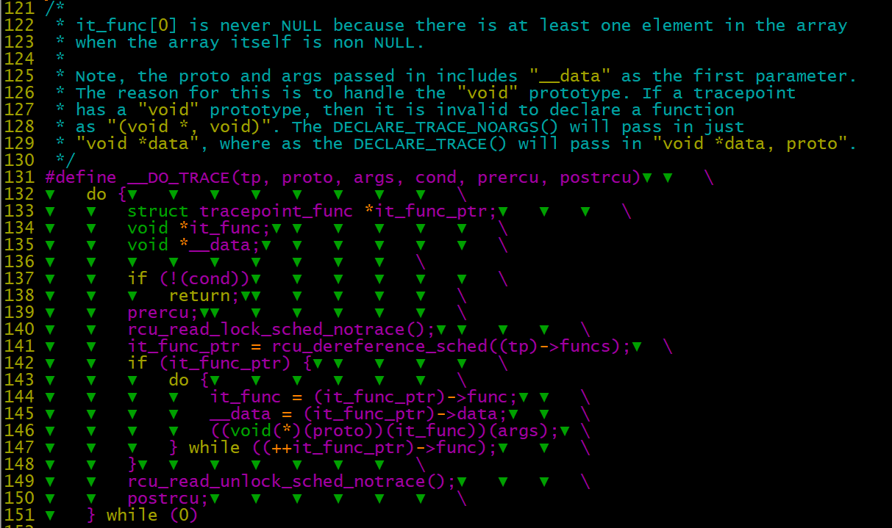
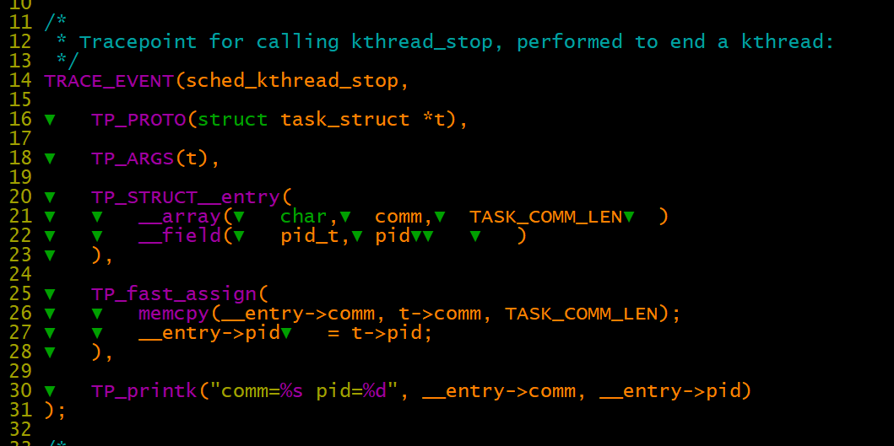
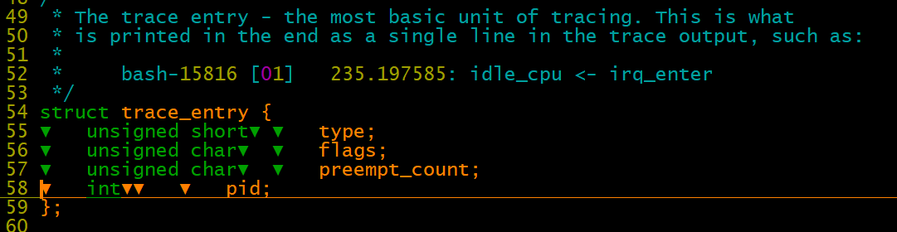
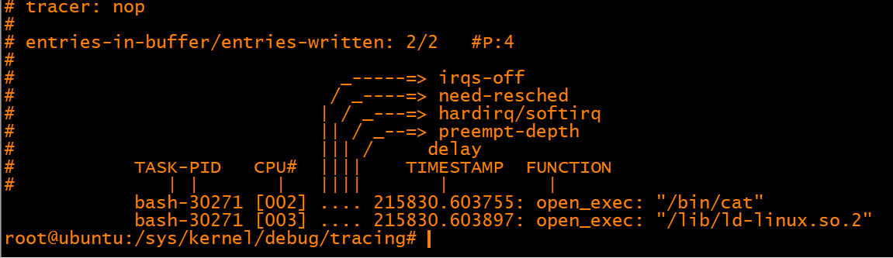

# 调试技术之tracepoint分析

tracepoint 机制实现了在代码中注册、管理及插入trace probe函数和实现porbe函数的机制。其位于下图中A 、B两个位置点。

event traceing 作为ftrace其中的一个tracer类型。其将tracepoint 和 ringbuffer（C）\+debugfs（D）结合起来形成一套标转化且易用的tarcepoint使用机制。

实现了在用户态可以简单的使能/失能，友好的统一的格式化的trace结果数据，标准化的trace操作。




tracepoint.h 文件中定义

\_\_DECLARE\_TRACE ：通过宏定义\#\#name 系列trace相关的注册/注销等函数

\_\_DECLARE\_TRACE  \-》 trace\_\#\#name\(proto\)  \-》 \_\_DO\_TRACE   \-》  it\_func = \(it\_func\_ptr\)\-\>func





```
#define TP_PROTO(args...)▼  args
#define TP_ARGS(args...)▼   args
#define TP_CONDITION(args...)▼  args

#define TP_STRUCT__entry(args...) args
#define TP_fast_assign(args...) args
#define TP_printk(fmt, args...) fmt "\n", args  
```

trace\_sched\_kthread\_stop\(k\);

trace\_sched\_kthread\_stop\_ret\(ret\);




echo 1 \> events/sched/sched\_switch/enable   使能trace probe 函数

echo sched\_switch \>\> set\_event 设置trace event

echo \> trace  清空trace缓存


