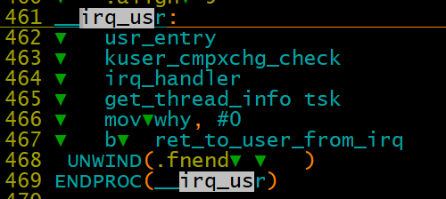
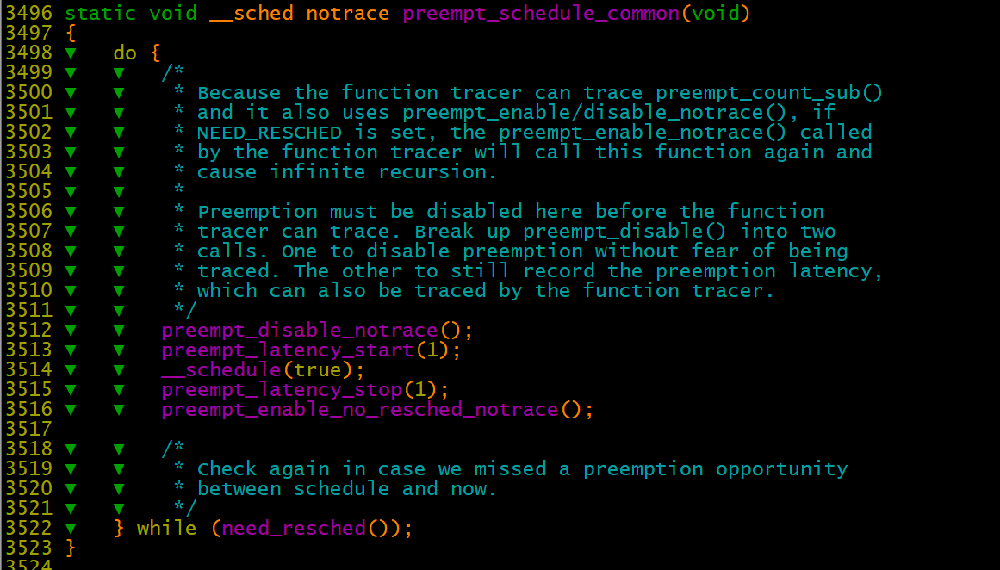
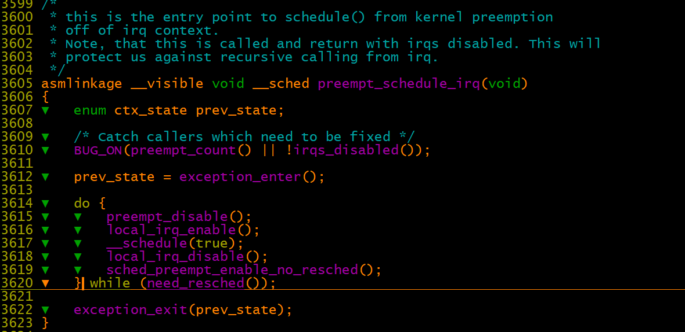

# 进程管�之用户抢�和内核抢�

`preempt`

[https://blog.csdn.net/gatieme/article/details/51872618](https://blog.csdn.net/gatieme/article/details/51872618)

[http://linuxperf.com/?p=211](http://linuxperf.com/?p=211)

**一� 进程状�**

一般�说，CPU在任何时刻都处�以下三�情况之一：

-     �行�用户空间，执行用户进程
-     �行�内核空间，处�进程上下文
-     �行�内核空间，处�中断上下文

**二ã€�用户抢å�** 

一般�说, 当进程�系统调用或者�中断\(异常\)处�程�返�用户空间时会触�主调度器进行用户抢�

-     �系统调用返�用户空间
-     �中断\(异常\)处�程�返�用户空间

为了对一个进程需�被调度进行标记, 内核在thread\_info的flag中设置了一个标识�标志进程是�需��新调度, ��新调度need\_resched标识TIF\_NEED\_RESCHED, 内核在�将返�用户空间时会检查标识TIF\_NEED\_RESCHED标志进程是�需��新调度，如�设置了，就会�生调度, 这被称为用户抢�。（TIF\_NEED\_RESCHED标识表示进程是��被抢�，如�置�了，则在相应的抢�时间点抢�）

    通过thread\_info中的flags字段标识是�用户抢�。

```
3466 static __always_inline bool need_resched(void)
3467 {
3468 ▼   return unlikely(tif_need_resched());                                                                                          
3469 }

#define tif_need_resched() test_thread_flag(TIF_NEED_RESCHED)

107 #define test_thread_flag(flag) \                                                                                                   
108 ▼   test_ti_thread_flag(current_thread_info(), flag)

94 static inline int test_ti_thread_flag(struct thread_info *ti, int flag)
95 {
96 ▼   return test_bit(flag, (unsigned long *)&ti->flags);
97 }
```

arm32 用户��生中断时，进行进程抢�的执行过程。

irq\_usr \-》 ret\_to\_user\_from\_irq \-》 slow\_work\_pending \-》 do\_work\_pending \-》 schedule




**三ã€� 内核抢å�** 

如�内核处�相对耗时的�作中, 比如文件系统或者内存管�相关的任务, 这�行为�能会带�问题. 这�情况下, 内核代替特定的进程执行相当长的时间, 而其他进程无法执行, 无法调度, 这就造�了系统的延迟�加, 用户体验到�缓慢�的�应. 因此linux内核引入了内核抢�.

linux内核通过在thread\_info结�中添加了一个自旋�标识preempt\_count, 称为抢�计数器\(preemption counter\)�作为内核抢�的标记,（这个抢�标记标记当�进程是��以被抢�，相当�是�开�内核抢�）

```
12 /*
13  * We put the hardirq and softirq counter into the preemption
14  * counter. The bitmask has the following meaning:
15  *
16  * - bits 0-7 are the preemption count (max preemption depth: 256)
17  * - bits 8-15 are the softirq count (max # of softirqs: 256)
18  *
19  * The hardirq count could in theory be the same as the number of
20  * interrupts in the system, but we run all interrupt handlers with
21  * interrupts disabled, so we cannot have nesting interrupts. Though
22  * there are a few palaeontologic drivers which reenable interrupts in
23  * the handler, so we need more than one bit here.
24  *
25  *         PREEMPT_MASK:▼       0x000000ff
26  *         SOFTIRQ_MASK:▼       0x0000ff00
27  *         HARDIRQ_MASK:▼       0x000f0000
28  *             NMI_MASK:▼       0x00100000
29  * PREEMPT_NEED_RESCHED:▼       0x80000000
30  */
31 #define PREEMPT_BITS▼   8
32 #define SOFTIRQ_BITS▼   8
33 #define HARDIRQ_BITS▼   4
34 #define NMI_BITS▼       1
35
36 #define PREEMPT_SHIFT▼  0
37 #define SOFTIRQ_SHIFT▼  (PREEMPT_SHIFT + PREEMPT_BITS)
38 #define HARDIRQ_SHIFT▼  (SOFTIRQ_SHIFT + SOFTIRQ_BITS)
39 #define NMI_SHIFT▼      (HARDIRQ_SHIFT + HARDIRQ_BITS)

48 #define PREEMPT_OFFSETâ–¼ (1UL << PREEMPT_SHIFT)
49 #define SOFTIRQ_OFFSETâ–¼ (1UL << SOFTIRQ_SHIFT)
50 #define HARDIRQ_OFFSETâ–¼ (1UL << HARDIRQ_SHIFT)
51 #define NMI_OFFSET▼     (1UL << NMI_SHIFT)
```

内核抢�的触�大致也是两类, 内核抢�关闭��新开�时, 中断返�内核�时。

**   1ã€� 内核é‡�æ–°å¼€å�¯å†…核抢å� æ—¶ä½¿ç”¨preempt\_schedule检查内核抢å�** 

preempt\_enable\-》\_\_preempt\_schedule\-》preempt\_schedule \-》 preempt\_schedule\_common

进程�行preempt\_schedule，如�进程thread\_info 的flags字段中设置标识TIF\_NEED\_RESCHED，将�行调度程�，调度出�，该进程相应的栈应该�行到调度程�中，处�do，while循�中。待该进程�次被调度进�时，往下�行出while循�。

内核代�中这��新开�内核抢�并调度的场景应该�多，�在locktorture.c文件中存在几处。



**   2ã€� 中断之å��è¿”å›�内核æ€�时通过preempt\_schedule\_irq触å�‘内核抢å�** 

entry\-armv.S /share/linux\-4.9.94\_debug/arch/arm/kernel

�代�看，在中断退出函数中，如�此�被中断的是内核�，并且定义了CONFIG\_PREEMPT内核抢��，此处会进入内核抢�调度

```
__irq_svc:

blne▼   svc_preempt

239 1:▼ bl▼ preempt_schedule_irq▼   ▼   @ irq en/disable is done inside

```


