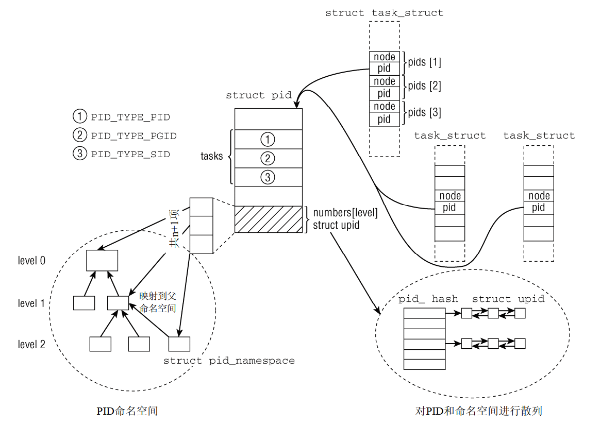
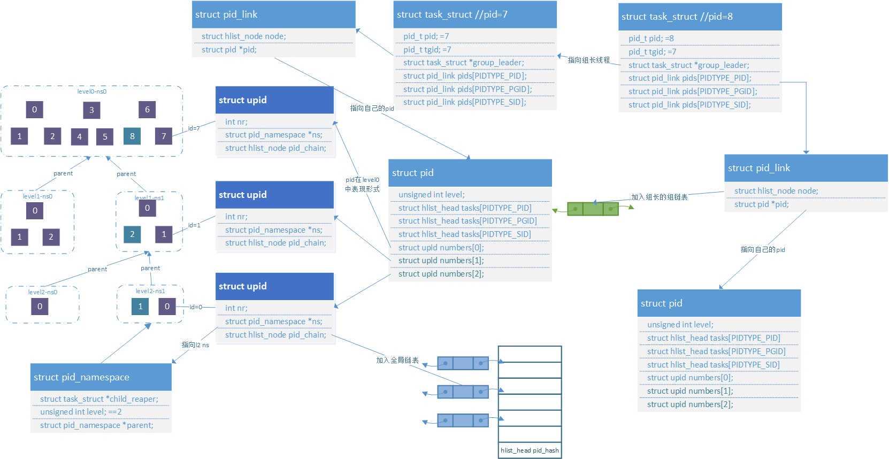
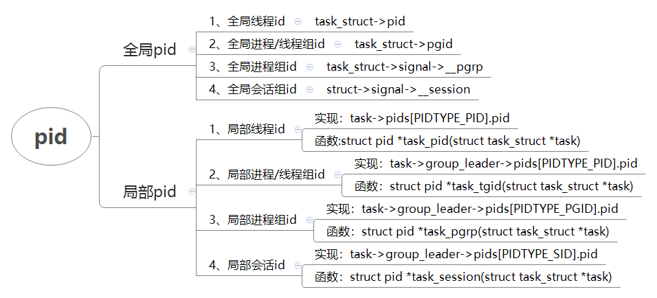
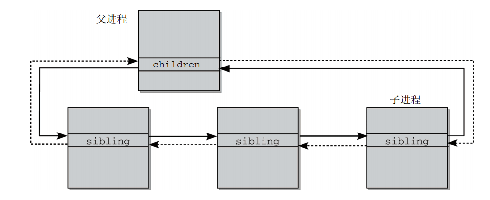

# 进程管理之进程ID

`pid_namespace`

基于Linux\-4.9.37内核版本

**一、数据结构**

```
struct task_struct {
        pid_t pid;      //全局线程号
        pid_t tgid;     //全局用户线程的进程号；全局内核线程的线程号(等于pid)
        struct list_head children;      /* list of my children */
        struct list_head sibling;       /* linkage in my parent's children list */
        struct task_struct *group_leader;       /* threadgroup leader */  
                               //指向用户态线程组组长线程，相当于线程所属进程的主线程；内核线程指向自身；
        /* PID/PID hash table linkage. */
        struct pid_link pids[PIDTYPE_MAX];  //用于建立线程组/进程组/会话组之间的关系
        struct list_head thread_group;
        struct list_head thread_node;
}

struct upid {
        /* Try to keep pid_chain in the same cacheline as nr for find_vpid */
        int nr;  //进程在该namespace中的id号
        struct pid_namespace *ns;  //当前upid所属的namespace
        struct hlist_node pid_chain;   //该id加入全局的hash链表中，便于通过nr+namespace定位到具体链表，遍历链表找到该节点
};      
        
struct pid
{       
        atomic_t count;  //使用该数据结构的引用计数
        unsigned int level;  //当前pid拥有的namespace的层级数，默认最高层级为0
        /* lists of tasks that use this pid */
        struct hlist_head tasks[PIDTYPE_MAX]; //该pid 作为进程主线程/进程组长/会话组长时，其成员加入该链表
        struct rcu_head rcu;
        struct upid numbers[1];  //不同namespace层级中的id表示数据结构，默认数组大小为1，根据实际的level在后面扩展level个upid；
};
        
struct pid_link
{
        struct hlist_node node; //加入pid->tasks[PIDTYPE_MAX]链表中，作为线程组/进程组/会话组的成员
        struct pid *pid;  //指向该线程的线程id/进程组长id/会话组长id
};

enum pid_type
{
        PIDTYPE_PID,
        PIDTYPE_PGID,
        PIDTYPE_SID,
        PIDTYPE_MAX,
        /* only valid to __task_pid_nr_ns() */
        __PIDTYPE_TGID
};

struct pid_namespace {
        struct kref kref;
        struct pidmap pidmap[PIDMAP_ENTRIES];
        struct rcu_head rcu;
        int last_pid;
        unsigned int nr_hashed;
        struct task_struct *child_reaper;
        struct kmem_cache *pid_cachep;
        unsigned int level;
        struct pid_namespace *parent;
#ifdef CONFIG_PROC_FS
        struct vfsmount *proc_mnt;
        struct dentry *proc_self;
        struct dentry *proc_thread_self;
#endif
#ifdef CONFIG_BSD_PROCESS_ACCT
        struct fs_pin *bacct;
#endif
        struct user_namespace *user_ns;
        struct ucounts *ucounts;
        struct work_struct proc_work;
        kgid_t pid_gid;
        int hide_pid;
        int reboot;     /* group exit code if this pidns was rebooted */
        struct ns_common ns;
};
```

**二、pid组织框架**

1、默认情况下namespace level为0，每个线程都有唯一的pid。level0的pid也和全局pid相等。

2、如果在使用例如docker场景下，同一个线程在不同层级的namespace中有不同的pid。在level这层的namespace中，这个pid值为task\-\>pids\[PIDTYPE\_PID\]\-\>numers\[level\]\-\>nr。

3、struct pid表示的是一个操作系统中的一个唯一pid，但是其中特殊的是该pid在不同的namespace中id值是不同的，同时通过tasks链表将任务task连接在一块。





**三、全局pid和局部pid**

PID命名空间按层次组织。在建立一个新的命名空间时，该命名空间中的所有PID对父命名空间都是可见的，但子命名空间无法看到父命名空间的PID。

但这意味着某些进程具有多个PID，凡可以看到该进程的命名空间，都会为其分配一个PID。 这必须反映在数据结构中。我们必须区分局部ID和全局ID。

 全局ID是在内核本身和初始命名空间中的唯一ID号，在系统启动期间开始的init进程即属于初始命名空间。对每个ID类型，都有一个给定的全局ID，保证在整个系统中是唯一的。

 局部ID属于某个特定的命名空间，不具备全局有效性。对每个ID类型，它们在所属的命名空间内部有效，但类型相同、值也相同的ID可能出现在不同的命名空间中。



**四、pid/namespace/nr/task之间的转换**

1、 在获得pid实例之后，从struct pid的numbers数组中的uid信息，即可获得数字ID。

```
pid_t pid_nr_ns(struct pid *pid, struct pid_namespace *ns)
{
        struct upid *upid;
        pid_t nr = 0;

        if (pid && ns->level <= pid->level) {
                upid = &pid->numbers[ns->level];
                if (upid->ns == ns)
                        nr = upid->nr;
        }
        return nr;
}

pid_t task_pid_nr_ns(struct task_struct *tsk, struct pid_namespace *ns)
pid_t task_tgid_nr_ns(struct task_struct *tsk, struct pid_namespace *ns)
pid_t task_pgrp_nr_ns(struct task_struct *tsk, struct pid_namespace *ns)
pid_t task_session_nr_ns(struct task_struct *tsk, struct pid_namespace *ns)
```

2、ID值\+namespace查找struct pid

内核采用标准的散列方案。首先，根据PID和命名空间指针计算在pid\_hash数组中的索引， 然后遍历散列表直至找到所要的元素。这是通过辅助函数find\_pid\_ns处理的：

```
//根据hash值确定具体链表，然后遍历链表，如果nr和ns都相等的话则找到对应的pid
struct pid *find_pid_ns(int nr, struct pid_namespace *ns)
{
        struct upid *pnr;

        hlist_for_each_entry_rcu(pnr,
                        &pid_hash[pid_hashfn(nr, ns)], pid_chain)
                if (pnr->nr == nr && pnr->ns == ns) 
                        return container_of(pnr, struct pid,
                                        numbers[ns->level]);

        return NULL;
}
```

**五、生成唯一的PID**

由于在每个namespace中，ID值是顺序分配的并唯一；但是在整个系统中，不同namespace中的ID值是可以相同的。因此同一进程需要在其所属的每一层级为其分配一个ID值，因此分配模块需要为每一个namespace建立一个位图以表示分配情况。

```
struct pid *alloc_pid(struct pid_namespace *ns)
{

        tmp = ns;
        pid->level = ns->level;
        for (i = ns->level; i >= 0; i--) {  //遍历当前namesapce以及其父系namespace
                nr = alloc_pidmap(tmp);     //分配一个ID值
                if (nr < 0) {
                        retval = nr;
                        goto out_free;
                }

                pid->numbers[i].nr = nr;    //将分配的ID值放入该PID中
                pid->numbers[i].ns = tmp;
                tmp = tmp->parent;
        }

        for ( ; upid >= pid->numbers; --upid) {  //遍历一层的ID值，将该ID所在的upid加入到全局hash链表中，以供方便查询
                hlist_add_head_rcu(&upid->pid_chain,
                                &pid_hash[pid_hashfn(upid->nr, upid->ns)]);
                upid->ns->nr_hashed++;
        }
}
```

**六、获取PID系统调用**

```
//获取当前线程的进程号，相当于获取task->group_leader->pids[PIDTYPE_PID].pid->numbers[ns->level]->nr
SYSCALL_DEFINE0(getpid)
{
        return task_tgid_vnr(current);
}

static inline pid_t task_tgid_vnr(struct task_struct *tsk)
{
        return __task_pid_nr_ns(tsk, __PIDTYPE_TGID, NULL);
}

pid_t __task_pid_nr_ns(struct task_struct *task, enum pid_type type,
                        struct pid_namespace *ns)
{
        pid_t nr = 0;

        rcu_read_lock();
        if (!ns)  //ns为NULL，此处不执行
                ns = task_active_pid_ns(current);
        if (likely(pid_alive(task))) {
                if (type != PIDTYPE_PID) {
                        if (type == __PIDTYPE_TGID)
                                type = PIDTYPE_PID;
                        task = task->group_leader; //将task指向组长线程,线程的进程ID等于组长线程的线程ID
                }
                //相当于： task->group_leader->pids[PIDTYPE_PID].pid->numbers[ns->level]->nr
                nr = pid_nr_ns(rcu_dereference(task->pids[type].pid), ns);
        }
        rcu_read_unlock();

        return nr;
}
//获取当前线程的线程号
SYSCALL_DEFINE0(gettid)
{
        return task_pid_vnr(current);
}
static inline pid_t task_pid_vnr(struct task_struct *tsk)
{
        return __task_pid_nr_ns(tsk, PIDTYPE_PID, NULL);
}
pid_t __task_pid_nr_ns(struct task_struct *task, enum pid_type type,
                        struct pid_namespace *ns)
{
        pid_t nr = 0;

        rcu_read_lock();
        if (!ns)
                ns = task_active_pid_ns(current);
        if (likely(pid_alive(task))) {
                if (type != PIDTYPE_PID) {
                        if (type == __PIDTYPE_TGID)
                                type = PIDTYPE_PID;
                        task = task->group_leader;
                }       
                //相当于： task->pids[PIDTYPE_PID].pid->numbers[ns->level]->nr                
                nr = pid_nr_ns(rcu_dereference(task->pids[type].pid), ns);
        }
        rcu_read_unlock();
        
        return nr;
}    

//获取当前线程的进程组好
SYSCALL_DEFINE0(getppid)
{
        int pid;

        rcu_read_lock();
        pid = task_tgid_vnr(rcu_dereference(current->real_parent));
        rcu_read_unlock();

        return pid;
}
```

**七、读取/proc下所有的进程**

ls 查看proc目录时，可以显示当前shell所属的namespace下所有的进程（线程组）的ID值

```
int proc_pid_readdir(struct file *file, struct dir_context *ctx)
{
        struct tgid_iter iter;
        struct pid_namespace *ns = file_inode(file)->i_sb->s_fs_info;
        loff_t pos = ctx->pos;

        iter.tgid = pos - TGID_OFFSET;
        iter.task = NULL;
        for (iter = next_tgid(ns, iter);  //遍历所有的tgid
             iter.task;
             iter.tgid += 1, iter = next_tgid(ns, iter)) {
                char name[PROC_NUMBUF];
                int len;

                cond_resched();
                if (!has_pid_permissions(ns, iter.task, 2))
                        continue;

                len = snprintf(name, sizeof(name), "%d", iter.tgid);
                ctx->pos = iter.tgid + TGID_OFFSET;
                if (!proc_fill_cache(file, ctx, name, len,
                                     proc_pid_instantiate, iter.task, NULL)) {
                        put_task_struct(iter.task);
                        return 0;
                }
        }
        ctx->pos = PID_MAX_LIMIT + TGID_OFFSET;
        return 0;
}

static struct tgid_iter next_tgid(struct pid_namespace *ns, struct tgid_iter iter)
{
        struct pid *pid;

        if (iter.task)
                put_task_struct(iter.task);
        rcu_read_lock();
retry:
        iter.task = NULL;
        pid = find_ge_pid(iter.tgid, ns);  
        if (pid) {
                iter.tgid = pid_nr_ns(pid, ns); 
                iter.task = pid_task(pid, PIDTYPE_PID);
                if (!iter.task || !has_group_leader_pid(iter.task)) {
                        iter.tgid += 1;
                        goto retry;
                }
                get_task_struct(iter.task);
        }
        rcu_read_unlock();
        return iter;
}
```

**八、父子进程间链表关系**



参考资料：

1、《深入linux内核架构》 2.3.3节

2、[https://www.wowotech.net/process\_management/process\_identification.html](https://www.wowotech.net/process_management/process_identification.html)
