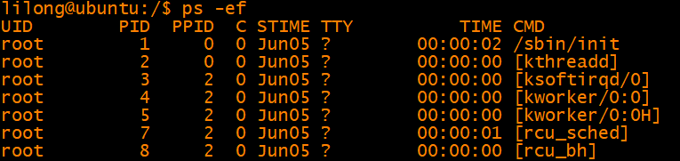

# 进程调度之0号进程

# 一、linux的 0号进程 和 1 号进程

Linux下有3个特殊的进程，idle进程\(PID = 0\), init进程\(PID = 1\)和kthreadd\(PID = 2\)

1、idle进程由系统自动创建, 运行在内核态。idle进程其pid=0，其前身是系统创建的第一个进程，也是唯一一个没有通过fork或者kernel\_thread产生的进程。完成加载系统后，演变为进程调度、交换

2、init进程由idle通过kernel\_thread创建，在内核空间完成初始化后, 加载init程序, 并最终用户空间。由0进程创建，完成系统的初始化. 是系统中所有其它用户进程的祖先进程。Linux中的所有进程都是有init进程创建并运行的。首先Linux内核启动，然后在用户空间中启动init进程，再启动其他系统进程。在系统启动完成完成后，init将变为守护进程监视系统其他进程。

3、kthreadd进程由idle通过kernel\_thread创建，并始终运行在内核空间, 负责所有内核线程的调度和管理。它的任务就是管理和调度其他内核线程kernel\_thread, 会循环执行一个kthread的函数，该函数的作用就是运行kthread\_create\_list全局链表中维护的kthread, 当我们调用kernel\_thread创建的内核线程会被加入到此链表中，因此所有的内核线程都是直接或者间接的以kthreadd为父进程



1、0号进程为swapper进程，即idle进程，此处未显示。每个cpu核都有一个0号 swapper进程。

2、1号进程为init进程，所有的用户态进程都是init进程的子进程或孙子进程

3、2号进程为kthreadd进程，用于创建管理内核线程，所有内核线程的父进程都是kthreadd进程

# 二、idle的创建

        在smp系统中，每个处理器单元有独立的一个运行队列，而每个运行队列上又有一个idle进程，即有多少处理器单元，就有多少idle进程。idle进程其pid=0，其前身是系统创建的第一个进程，也是唯一一个没有通过fork\(\)产生的进程。

**        init\_task**是内核中所有进程、线程的task\_struct雏形，在内核初始化过程中，通过静态定义构造出了一个task\_struct接口，取名为init\_task，然后在内核初始化的后期，通过rest\_init（）函数新建了**内核init线程，kthreadd内核线程。****i****nit\_t****ask不是init进程。**

- 开始的init是有kthread\_thread创建的内核线程, 他在完成初始化工作后, 转向用户空间, 并且生成所有用户进程的祖先
    **内核init线程**
- 它的任务就是管理和调度其他内核线程kernel\_thread, 会循环执行一个kthread的函数，该函数的作用就是运行kthread\_create\_list全局链表中维护的kthread, 当我们调用kernel\_thread创建的内核线程会被加入到此链表中，因此所有的内核线程都是直接或者间接的以kthreadd为父进程
    **内核kthreadd内核线程**

所以**init\_task决定了系统所有进程、线程的基因, 它完成初始化后, 最终演变为0号进程idle, 并且运行在内核态**

简言之, **内核中init\_task变量就是是进程0使用的进程描述符**，也是Linux系统中第一个进程描述符，init\_task并不是系统通过kernel\_thread的方式（当然更不可能是fork）创建的, 而是由内核静态创建的.

```
/* Initial task structure */
struct task_struct init_task = INIT_TASK(init_task);
```

init\_task描述符使用宏INIT\_TASK对init\_task的进程描述符进行初始化。

在init\_task进程执行后期，它会调用kernel\_thread\(\)函数创建第一个核心进程kernel\_init，同时init\_task进程继续对Linux系统初始化。在完成初始化后，init\_task会退化为cpu\_idle进程，当Core 0的就绪队列中没有其它进程时，该进程将会获得CPU运行。新创建的1号进程kernel\_init将会逐个启动次CPU,并最终创建用户进程！

备注：core0上的idle进程由init\_task进程退化而来，而AP的idle进程则是BSP在后面调用fork\(\)函数逐个创建的

### 进程堆栈init\_thread\_union

```
#define INIT_THREAD_INFO(tsk)                       \
{                                   \
    .task       = &tsk,                     \
    .flags      = 0,                        \
    .preempt_count  = INIT_PREEMPT_COUNT,               \
    .addr_limit = KERNEL_DS,                    \
}
```

# 三、0号进程的演化

Linux在无进程概念的情况下将一直从初始化部分的代码执行到start\_kernel，然后再到其最后一个函数调用rest\_init

```
static noinline void __ref rest_init(void)
{
    int pid;

    rcu_scheduler_starting();
    /*
     * We need to spawn init first so that it obtains pid 1, however
     * the init task will end up wanting to create kthreads, which, if
     * we schedule it before we create kthreadd, will OOPS.
     */
    kernel_thread(kernel_init, NULL, CLONE_FS);    //创建kernel_init内核线程 pid=1 。smp_init在此函数中调用，拉起其他cpu。
    numa_default_policy();
    pid = kernel_thread(kthreadd, NULL, CLONE_FS | CLONE_FILES);  //创建kthreadd内核线程 pid=2
    rcu_read_lock();
    kthreadd_task = find_task_by_pid_ns(pid, &init_pid_ns);
    rcu_read_unlock();
    complete(&kthreadd_done);

    /*
     * The boot idle thread must execute schedule()
     * at least once to get things moving:
     */
    init_idle_bootup_task(current);
    schedule_preempt_disabled();
    /* Call into cpu_idle with preempt disabled */
    cpu_startup_entry(CPUHP_ONLINE);
}
```

1、调用kernel\_thread\(\)创建1号内核线程, 该线程随后转向用户空间, 演变为init进程

2、调用kernel\_thread\(\)创建kthreadd内核线程。

3、init\_idle\_bootup\_task\(\)：当前0号进程init\_task最终会退化成idle进程，所以这里调用init\_idle\_bootup\_task\(\)函数，让init\_task进程隶属到idle调度类中。即选择idle的调度相关函数。

4、调用schedule\(\)函数切换当前进程，在调用该函数之前，Linux系统中只有两个进程，即0号进程init\_task和1号进程kernel\_init，其中kernel\_init进程也是刚刚被创建的。调用该函数后，1号进程kernel\_init将会运行！

5、调用cpu\_idle\(\)，0号线程进入idle函数的循环，在该循环中会周期性地检查。

### 1、kernel\_init内核线程

这个进程就是着名的pid为1的init进程，它会继续完成剩下的初始化工作，然后execve\(/sbin/init\), 成为系统中的其他所有用户进程的祖先。但是这里我们发现一个问题, init进程应该是一个用户空间的进程, 但是这里却是通过kernel\_thread的方式创建的, 哪岂不是式一个永远运行在内核态的内核线程么, 它是怎么演变为真正意义上用户空间的init进程的？

1号kernel\_init进程完成linux的各项配置\(包括启动AP\)后，就会在/sbin,/etc,/bin寻找init程序来运行。该init程序会替换kernel\_init进程（注意：并不是创建一个新的进程来运行init程序，而是一次变身，使用sys\_execve函数改变核心进程的正文段，将核心进程kernel\_init转换成用户进程init），此时处于内核态的1号kernel\_init进程将会转换为用户空间内的1号进程init。户进程init将根据/etc/inittab中提供的信息完成应用程序的初始化调用。然后init进程会执行/bin/sh产生shell界面提供给用户来与Linux系统进行交互。

```
static int __ref kernel_init(void *unused)
{
    int ret;

    kernel_init_freeable();    //smp_init在此函数中调用，拉起其他cpu及其idle进程
    async_synchronize_full();
    free_initmem();
    mark_readonly();
    system_state = SYSTEM_RUNNING;
    numa_default_policy();

    rcu_end_inkernel_boot();

    /*下面尝试运行用户态init进程*/
    if (ramdisk_execute_command) {
        ret = run_init_process(ramdisk_execute_command);
        if (!ret)
            return 0;
        pr_err("Failed to execute %s (error %d)\n",
               ramdisk_execute_command, ret);
    }

    if (execute_command) {
        ret = run_init_process(execute_command);
        if (!ret)
            return 0;
        panic("Requested init %s failed (error %d).",
              execute_command, ret);
    }
    if (!try_to_run_init_process("/sbin/init") ||
        !try_to_run_init_process("/etc/init") ||
        !try_to_run_init_process("/bin/init") ||
        !try_to_run_init_process("/bin/sh"))
        return 0;
}
```

### 2、kthreadd内核线程

```
pid = kernel_thread(kthreadd, NULL, CLONE_FS | CLONE_FILES);

int kthreadd(void *unused)
{
    struct task_struct *tsk = current;

    /* Setup a clean context for our children to inherit. */
    set_task_comm(tsk, "kthreadd");
    ignore_signals(tsk);
    set_cpus_allowed_ptr(tsk, cpu_all_mask);
    set_mems_allowed(node_states[N_MEMORY]);

    current->flags |= PF_NOFREEZE;
    cgroup_init_kthreadd();

    for (;;) {
        set_current_state(TASK_INTERRUPTIBLE);
        if (list_empty(&kthread_create_list))
            schedule();
        __set_current_state(TASK_RUNNING);

        spin_lock(&kthread_create_lock);
        while (!list_empty(&kthread_create_list)) {  //循环检查kthread_create_list列表创建内核线程
            struct kthread_create_info *create;
            create = list_entry(kthread_create_list.next,
                        struct kthread_create_info, list);
            list_del_init(&create->list);
            spin_unlock(&kthread_create_lock);
            create_kthread(create);
            spin_lock(&kthread_create_lock);
        }
        spin_unlock(&kthread_create_lock);
    }

    return 0;
}
```

它的任务就是管理和调度其他内核线程kernel\_thread, 会循环执行一个kthread的函数，该函数的作用就是运行kthread\_create\_list全局链表中维护的kthread, 当我们调用kernel\_thread创建的内核线程会被加入到此链表中，因此所有的内核线程都是直接或者间接的以kthreadd为父进程。

## 3、0号进程演变为idle

0号进程init\_task到此阶段，转变为cpu0的idle内核线程

1、修改调度类为idle调度类

2、运行idle loop函数

```
void init_idle_bootup_task(struct task_struct *idle)
{
    idle->sched_class = &idle_sched_class;
}

void cpu_startup_entry(enum cpuhp_state state)
{
    arch_cpu_idle_prepare();
    cpuhp_online_idle(state);
    cpu_idle_loop();  //进入idle循环
}
//为其他核创建idle进程时，调用init_idle为这些进程初始化，
struct task_struct *fork_idle(int cpu)   
    void init_idle(struct task_struct *idle, int cpu)
//初始化线程名称为swapper/0
sprintf(idle->comm, "%s/%d", INIT_TASK_COMM, cpu);

void __init idle_threads_init(void)
{
        unsigned int cpu, boot_cpu;

        boot_cpu = smp_processor_id();

        for_each_possible_cpu(cpu) {
                if (cpu != boot_cpu)
                        idle_init(cpu);
        }
}
static inline void idle_init(unsigned int cpu)
{
        struct task_struct *tsk = per_cpu(idle_threads, cpu);

        if (!tsk) {
                tsk = fork_idle(cpu);
                if (IS_ERR(tsk))
                        pr_err("SMP: fork_idle() failed for CPU %u\n", cpu);
                else
                        per_cpu(idle_threads, cpu) = tsk;
        }
}  
struct task_struct *fork_idle(int cpu)
{
        struct task_struct *task;
        task = copy_process(CLONE_VM, 0, 0, NULL, &init_struct_pid, 0, 0,
                            cpu_to_node(cpu));
        if (!IS_ERR(task)) {
                init_idle_pids(task->pids);
                init_idle(task, cpu);
        }

        return task;
}
```

# 四、idle进程总结

系统允许一个进程创建新进程，新进程即为子进程，子进程还可以创建新的子进程，形成进程树结构模型。整个linux系统的所有进程也是一个树形结构。**树根是系统自动构造的\(或者说是由内核黑客手动创建的\)**，即在内核态下执行的0号进程，它是所有进程的远古先祖。

在smp系统中，每个处理器单元有独立的一个运行队列，而每个运行队列上又有一个idle进程，即有多少处理器单元，就有多少idle进程。

1、idle进程其pid=0，其前身是系统创建的第一个进程\(我们称之为init\_task\)，也是唯一一个没有通过fork或者kernel\_thread产生的进程。（每个CPU都有一个idle线程，线程名为swapper/n  n为cpu号，这些idle线程pid均为0，通过sysrq以及ps 均不能打印出来，通过vmcore可以查找到这些线程。这些idle线程通过idle\_threads\_init函数创建的，线程的创建方式非常特殊，直接通过copy\_process函数创建，可能是创建的方式比较特殊，可以使得其他核的idle线程pid也为0）

所以，判断一个线程是否为idle线程非常简单，判断其pid是否为0即可

```
static inline bool is_idle_task(const struct task_struct *p)
{
        return p->pid == 0;
}
```

**2、init\_task**是内核中所有进程、线程的task\_struct雏形，它是在内核初始化过程中，通过静态定义构造出了一个task\_struct接口，取名为init\_task，然后在内核初始化的后期，在rest\_init\(\)函数中通过kernel\_thread创建了两个内核线程**内核init线程，kthreadd内核线程**, 前者后来通过演变，进入用户空间，成为所有用户进程的先祖, 而后者则成为所有内核态其他守护线程的父线程, 负责接手内核线程的创建工作

3、然后init\_task通过变更调度类为sched\_idle等操作演变成为**idle进程**, 此时系统中只有0\(idle\), 1\(init\), 2\(kthreadd\)3个进程, 然后执行一次进程调度, 必然切换当前进程到到init

# 
