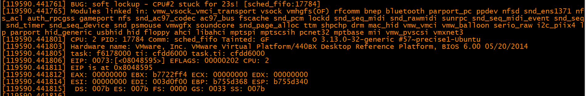
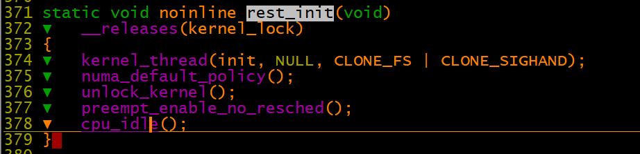
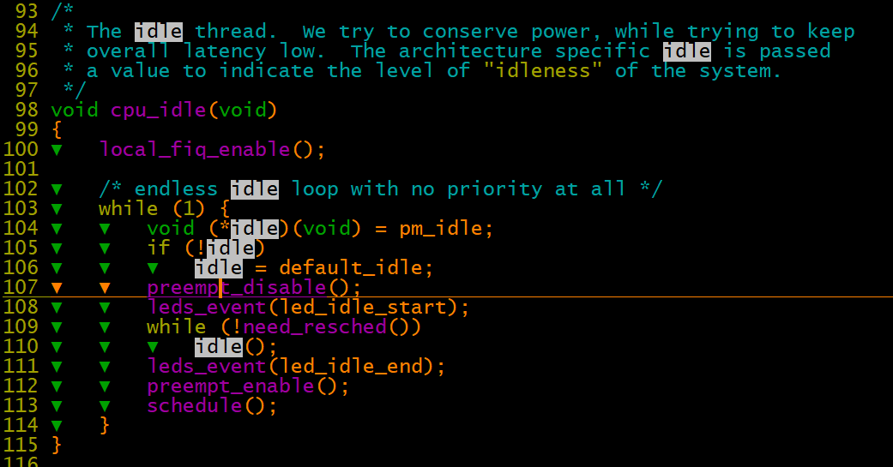
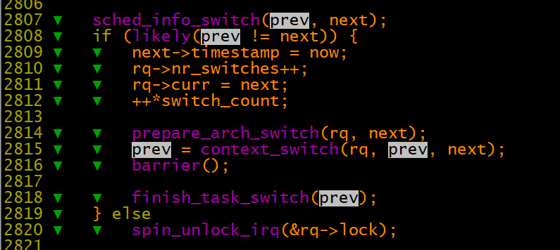
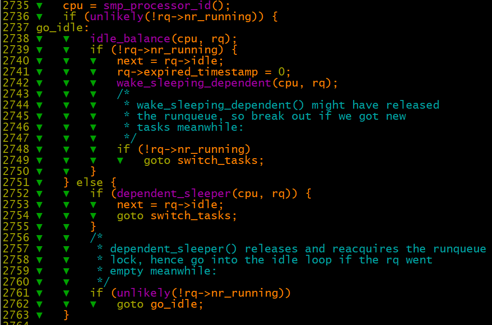
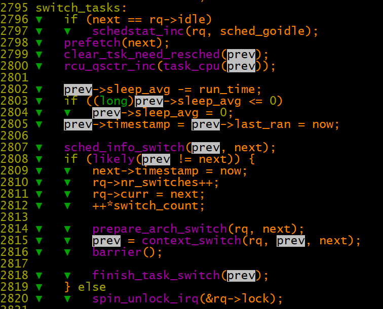

# 进程调度之O(1)调度器分析

进程分类一：

1、I/O受限

2、cpu受限

进程分类二：

1、交互式进程

2、批处理进程

3、实时进程                  

进程调度类型：

1、SCHED\_FIFO   \-\-\-实时进程，调度程序把该进程描述符放在运行队列当前位置（最前面？），这样在没有更高优先级进程运行的情况下，可长时间运行，且不会分时退出。

                            除非有高优先级实时进程或者自己主动放弃CPU，否则会一直占用CPU，可以通过以下方式进行验证：

                            （1）起两个不同优先级的实时线程thread1（prio 12）和thread2（prio 11），thread1运行过程中不调用不会调用引起调度的接口。（2）将这两个线程绑定到同一个核上，通过命令    （3）thread2会出现得不到调度的情况，main主线程还能运行（4）从这个验证也可以说明进程内的不同线程可以在不同核上运行，线程是调度的最小单位。

2、SCHED\_RR \-\-\- 实时进程，调度程序把该进程放在运行队列的队尾，这样保证相同优先级进程公平分配cpu时间。时间片轮转的实时进程时间片计算是基于static\_prio静态优先级计算的，（而实时进程的静态优先级继承于父进程并且可以被nice（）和 setpriority（）修改）。

3、SCHED\_NORMAL  \-\-\-普通的分时进程

疑问1：实时进程多了是否会影响到普通线程的cpu时间？

疑问2：时间片轮转，这个最小轮转时间是多少？

swapper进程：pid为0 ，在cpu不执行其他进程时运行，在smp多处理器系统上每个核都有其swapper进程

0\-99 实时进程

100\-139 （nice 【\-20， 19】）普通进程

|宏                                |值  |描述                                                       |
|----------------------------------|----|-----------------------------------------------------------|
|MIN\_NICE                         |\-20|对应于优先级100, 可以使用NICE\_TO\_PRIO和PRIO\_TO\_NICE转换|
|NICE\_WIDTH                       |40  |nice值得范围宽度, 即\[\-20, 19\]共40个数字的宽度           |
|MAX\_RT\_PRIO, MAX\_USER\_RT\_PRIO|100 |实时进程的最大优先级                                       |
|MAX\_PRIO                         |140 |普通进程的最大优先级                                       |
|DEFAULT\_PRIO                     |120 |进程的默认优先级, 对应于nice=0                             |
|MAX\_DL\_PRIO                     |0   |使用EDF最早截止时间优先调度算法的实时进程最大的优先级      |

进程优先级：

静态优先级：继承自父进程，可用nice或者setpriority系统调用修改优先级。

动态优先级：动态优先级是调度程序选择新进程运行的时候使用的参数。其作用相当于相应的提高休眠时间较多，占用CPU时间较少的的进程的优先级。

                        调度程序通过增加或减少进程静态优先级得出动态优先级来奖励IO消耗型进程或惩罚CPU消耗进程,调整后的优先级为动态优先级\(prio\)

                        为何要奖励IO消耗型进程或惩罚CPU消耗进程？？？

实时优先级：0\-99，用户通过sched\_param或者sched\_setscheduler改变实时进程

    动态优先级=max（100， min（静态优先级\-bonus\+5， 139））

  4 \#define MAX\_NICE▼   19

  5 \#define MIN\_NICE▼   \-20                                                                                                            

  6 \#define NICE\_WIDTH▼ \(MAX\_NICE \- MIN\_NICE \+ 1\)

【watchdog rt线程优先级】

内核softlockup  watchdog内核线程，使用的是99优先级的SCHED\_RR线程，使用这个优先级的目的是不论是在该核上不论有什么样的线程，watchdog都有其时间片运转，且不会一直占用CPU。

如果在一核CPU2上运行一个SCHED\_FIFO 99优先级的的线程，会出现如下softlockup。




【IDLE/swapper线程优先级】

swapper的进程号是0，在系统初始化时创建init进程，之后它就成了一个最低优先级的空闲任务。

start\_kernel\-》rest\_init\(\) \-》cpu\_idle 

进入idle循环之前为何要关闭抢占？个人理解是此时运行idle程序，说明运行队列中无其他就绪态进程，也不会发生抢占，感觉关不关都一样。





```
typedef struct prio_array prio_array_t;
185 struct prio_array {                                                                                                               
186 ▼   unsigned int nr_active;
187 ▼   unsigned long bitmap[BITMAP_SIZE];
188 ▼   struct list_head queue[MAX_PRIO];
189 };
```

【触发抢占/调度程序进行调度的几个时间点】

一、只是触发调度，但未进行进程切换的时间点，进程切换发生在抢占点。

1、周期性时间定时器

    scheduler\_tick函数中处理，该函数通过检查当前进程的调度类型和时间片，来决定是否触发抢占。

2、唤醒睡眠进程

3、更新进程的动态优先级

4、进行负载均衡

二、触发调度并发生进程切换    

5、调用schedule函数放弃CPU（这个时间点既是触发调度，也是发生进程切换的时间点）

【context\_switch分析】

[http://www.wowotech.net/process\_management/context\-switch\-arch.html](http://www.wowotech.net/process_management/context-switch-arch.html)

内核调度核心代码



注意进程切换的时候是涉及3个进程的

A \-》 B  。。。。X \-》 A  首先A切换到B，将CPU交给B运行，A自己停在switch\_to中，待到过了n个切换之后，CPUx 上X进程切换至A进程，A进程又接着上次切换代码switch\_to继续运行。

 

【schedule函数主要功能】

1、选择下一个运行的进程，如果队列中没有runing状态的进程，则运行idle进程



2、如果有runing状态的进程，则从活动队列中获取一个进程运行。如果活动队列中是空，则将所有的过期进程转为活动进程。

3、执行核心的switch\_tasks动作



 

linux 2.6.23之前使用的是O（1）调度算法，之后使用的是CFS完全公平调度算法

CFS调度器追求的公平是CPU资源分配的公平，即CPU的运算资源被精准的平均分配给在其上运行的task。 CPU资源是根据其静态优先级来具体分配。CFS调度器是有一个时间粒度的定义，我们称之调度周期。也就是说，在一个调度周期内，CFS调度器可以保证所有的可运行状态的进程平均分配CPU时间。

因此CFS主要保证每一个进程获得执行的虚拟时间一致即可。
