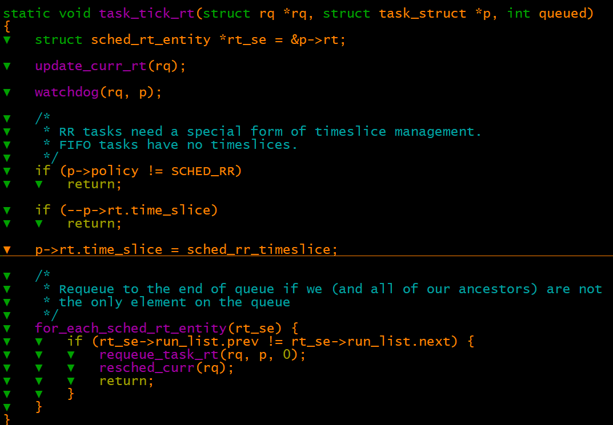
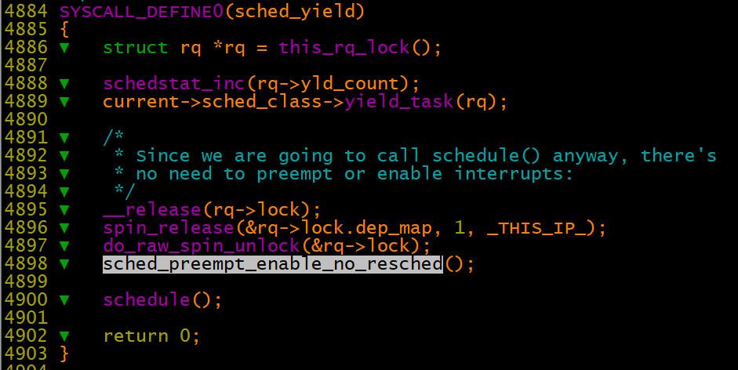
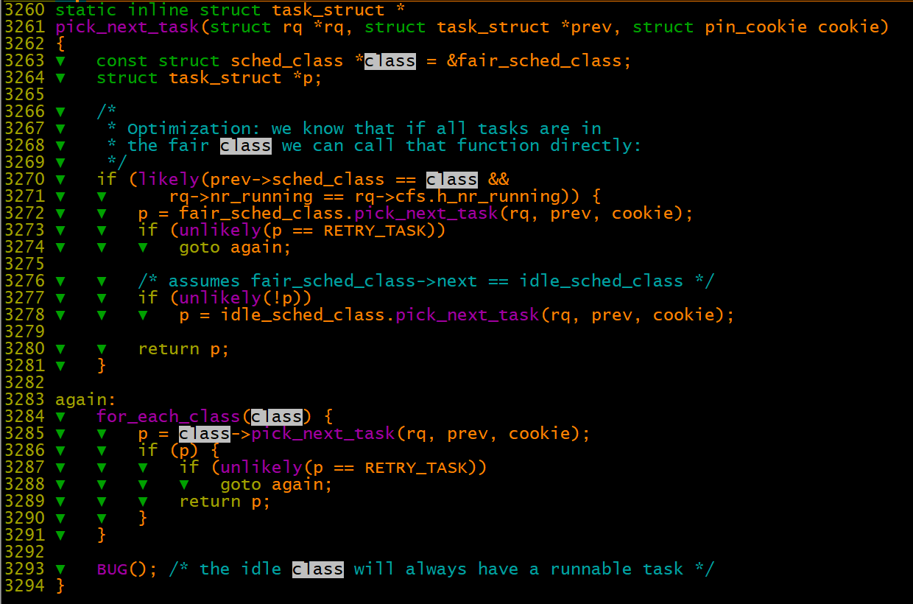
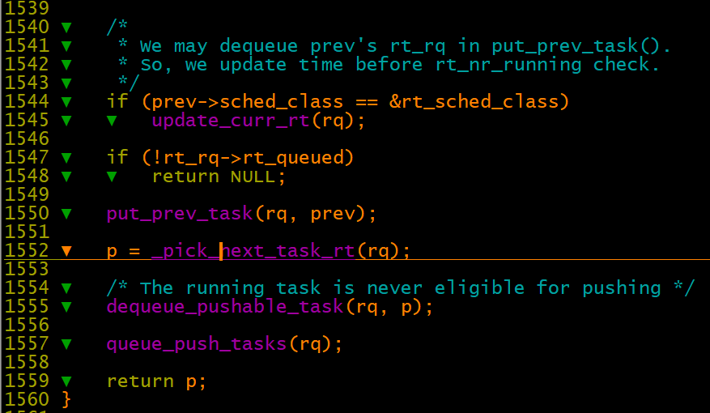
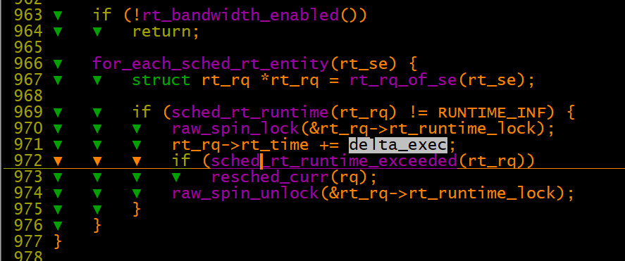
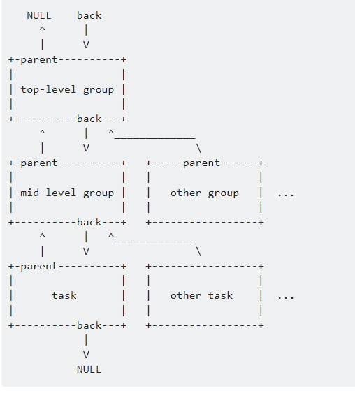
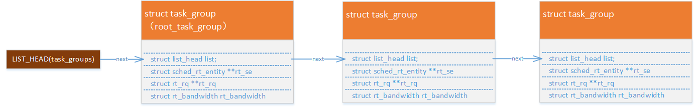
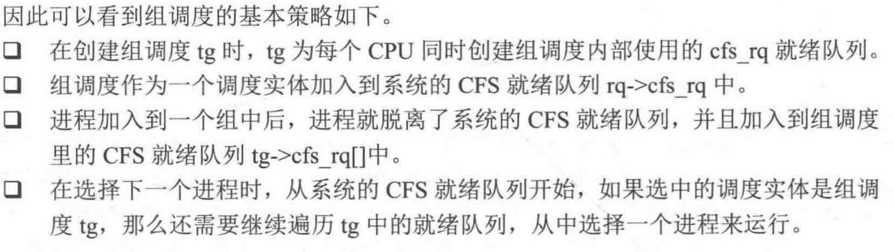

# 进程调度之rt调度类分�

`4.9.37`

（一）

scheduler\_tick\-》curr\-\>sched\_class\-\>task\_tick\(rq, curr, 0\)\-》task\_tick\_rt

1�SCHED\_FIFO进程直�返�，�味�该类�进程会继续�用CPU而��生调度

2�SCHED\_RR进程类�，�代� if \(rt\_se\-\>run\_list.prev \!= rt\_se\-\>run\_list.next\)，如�该进程优先级对应的�行队列中，�有该进程一个进程，那么直�返�，这�味�如�该进程会继续�用CPU而��生调度。

     如�该进程优先级对应的�行队列中还有其他进程，那么就交替�行。如�该进程优先级对应的队列中有SCHED\_FIFO进程，那么CPU�能由SCHED\_FIFO进程�行。 

3��以上两点�以看出，如�RT进程�是主动放弃CPU的�，其他�优先级的RT进程或普通进程无法得到�行。通过在ubuntu 12.04上验��以得出，如�将几个测试进程绑定CPU核，高优先级的RT进程会霸�CPU。

（二）

sched\_yield \-》 current\-\>sched\_class\-\>yield\_task  \-》 yield\_task\_rt \-》 requeue\_task\_rt

如�是rt线程的sched\_yield系统调用，其先将自身放置到�行队列的尾部，然��调用schedule让出CPU

（三）

\_\_schedule \-》 pick\_next\_task \-》pick\_next\_task\_rt,

1�pick\_next\_task函数中先判断是�进程中都是cfs调度类的进程，如�是的�则调用fair\_sched\_class.pick\_next\_task选择下一个进程；如�没有�适的cfs调度类进程则选择idle进程。

2�����调度类，�高优先级调度类往�优先级调度类��查找��行进程，所以此处表�rt调度类类进程比cfs调度类进程先�行。

3�\_pick\_next\_task\_rt\-》 pick\_next\_rt\_entity  找到优先级最高的rt进程

4�put\_prev\_task和dequeue\_pushable\_task的作用是什么？

四（rt throttled ）

update\_curr\_rt \-》 sched\_rt\_runtime\_exceeded

[https://blog.csdn.net/wennuanddianbo/article/details/70037415       Â](https://blog.csdn.net/wennuanddianbo/article/details/70037415) 

dequeue\_rt\_stack函数中临时��back的作用，形���的指针链表：

%\!\(EXTRA markdown.ResourceType=, string=, string=\)

task\_group的组织形�：

rt组调度类似�cfs组调度策略：

