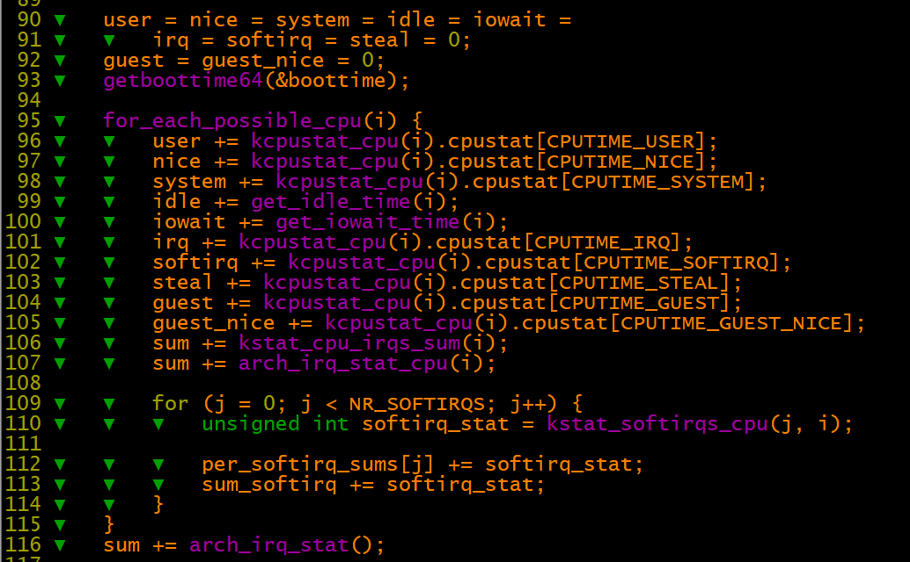
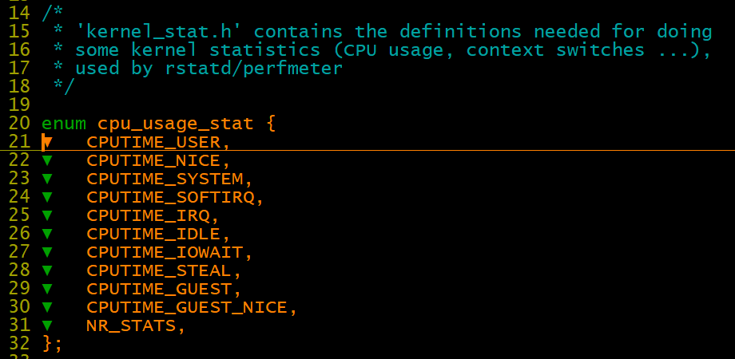
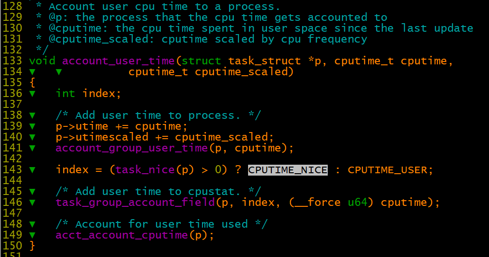
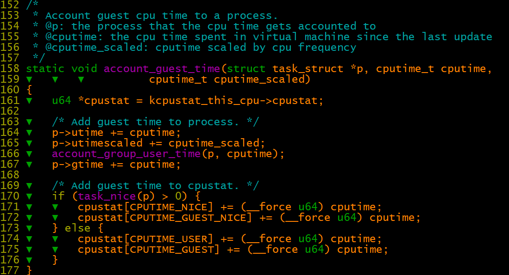
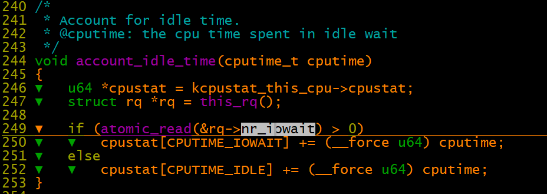
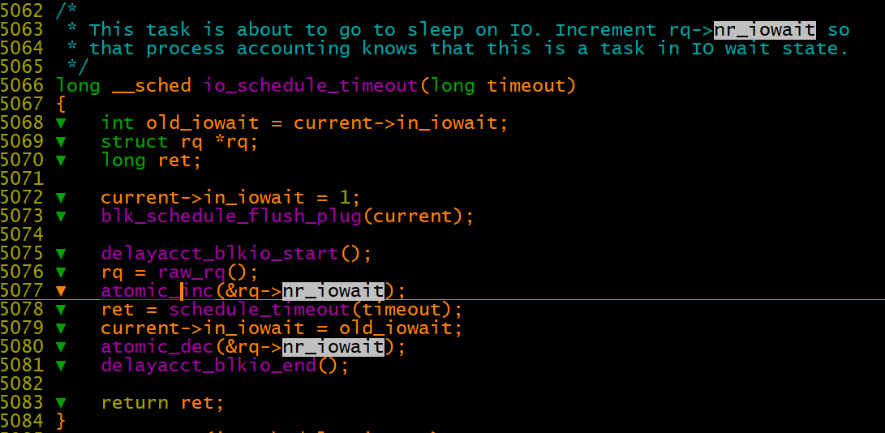
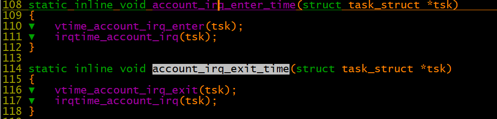
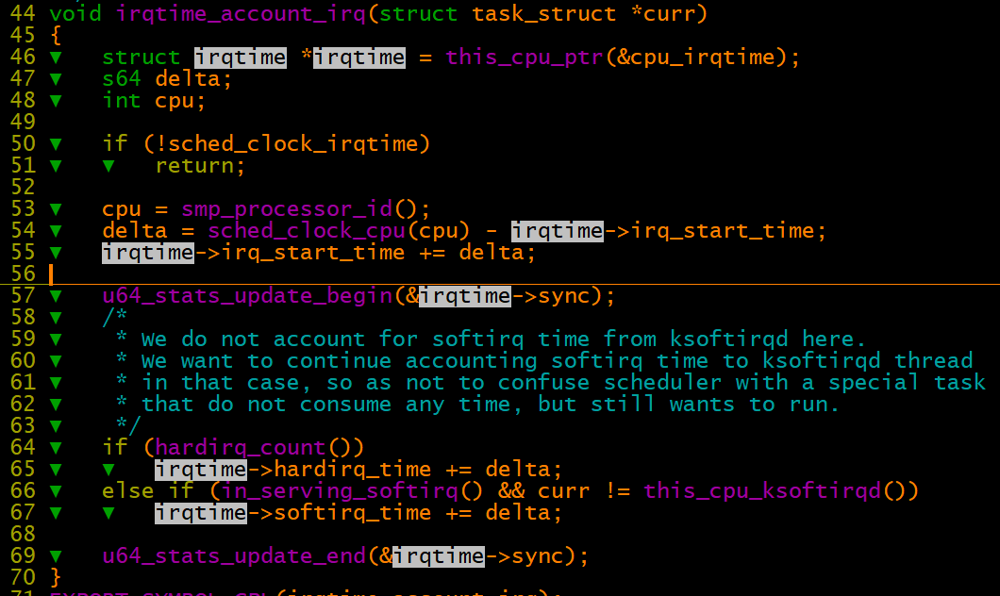
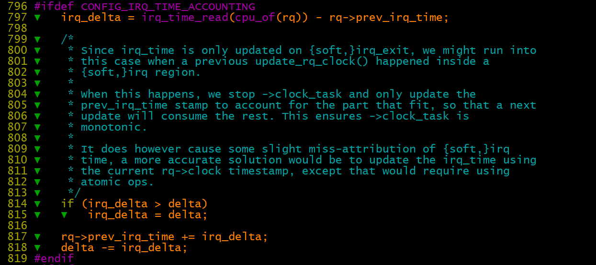
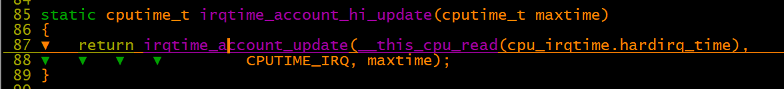

# 进程调度之stat/top统计信息分析

top命令的统计信息来源于/proc/stat文件导出

cat /proc/stat  \-》 show\_stat     

timer\_tick \-\>update\_process\_times \-》account\_process\_tick 

在系统滴答时钟中断中处理更新统计信息，user\_tick表明被滴答时钟中断的是内核态还是用户态。

如果定义了CONFIG\_IRQ\_TIME\_ACCOUNTING，则在函数irqtime\_account\_process\_tick中更新cpustat时间

如果没有定义CONFIG\_IRQ\_TIME\_ACCOUNTING，则在account\_process\_tick函数的末尾更新cpustat时间

【一】user/nice

account\_guest\_time    

nice: 静态优先级大于120，nice大于0的用户进程用户态所占用的时间（linux 4.9.94内核版本）。 在ubuntu 12.04上验证过（linux 3.10内核版本），网上有些文章说是优先级小于120的进程统计，是错误的。

【二】idle/iowait

1、当cpu处于idle状态时，有可能是有task处于等待io的状态，也有可能无任何task在等待io。此时可用rq\-\>nr\_iowait来记录处于io等待的task数量。

2、当cpu处于idle状态且，且存在rq\-\>nr\_iowait大于0则将这段时间作为CPU IO等待时间

3、cpu状态中的iowait高，是否表示系统压力较大？

【三】CONFIG\_IRQ\_TIME\_ACCOUNTING

在硬件中断和软件中断，入口调用account\_irq\_enter\_time函数，出口调用account\_irq\_exit\_time函数

**    i****rqtime\_account\_irq 函数统计**

只有定义了CONFIG\_IRQ\_TIME\_ACCOUNTING：

1、irqtime\_account\_irq才是非空。这样才能在中断和软中断入口出口记录准确的时间耗时。

2、ccount\_process\_tick函数中调用rqtime\_account\_process\_tick函数，用准确的中断时间耗时去更新各项统计计数

如果没有定义CONFIG\_IRQ\_TIME\_ACCOUNTING：

1、耗时用cputime = cputime\_one\_jiffy; 将一次周期调度固定的时间算入各项统计计数。

2、这个时间是较为粗略的，没有上面通过出入口记录时间值精确。还会如果周期调度频率低，则采样间隔大，中断处理一般较快，会出现采样不到的可能。表现出来top中看到的中断耗时为0或者较低。

update\_rq\_clock\_task

irqtime\_account\_process\_tick\-》account\_other\_time \-》irqtime\_account\_hi\_update \-》irqtime\_account\_update\-》cpustat\[idx\] \+= irq\_cputime;

