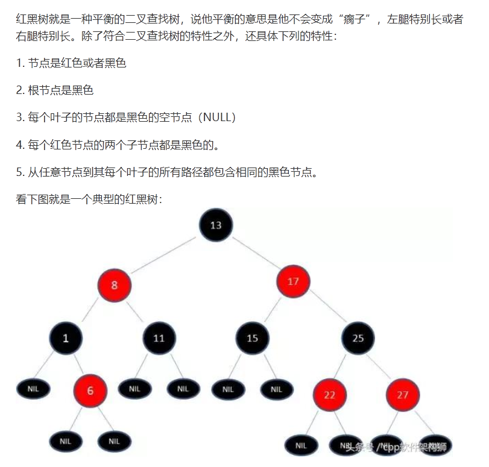
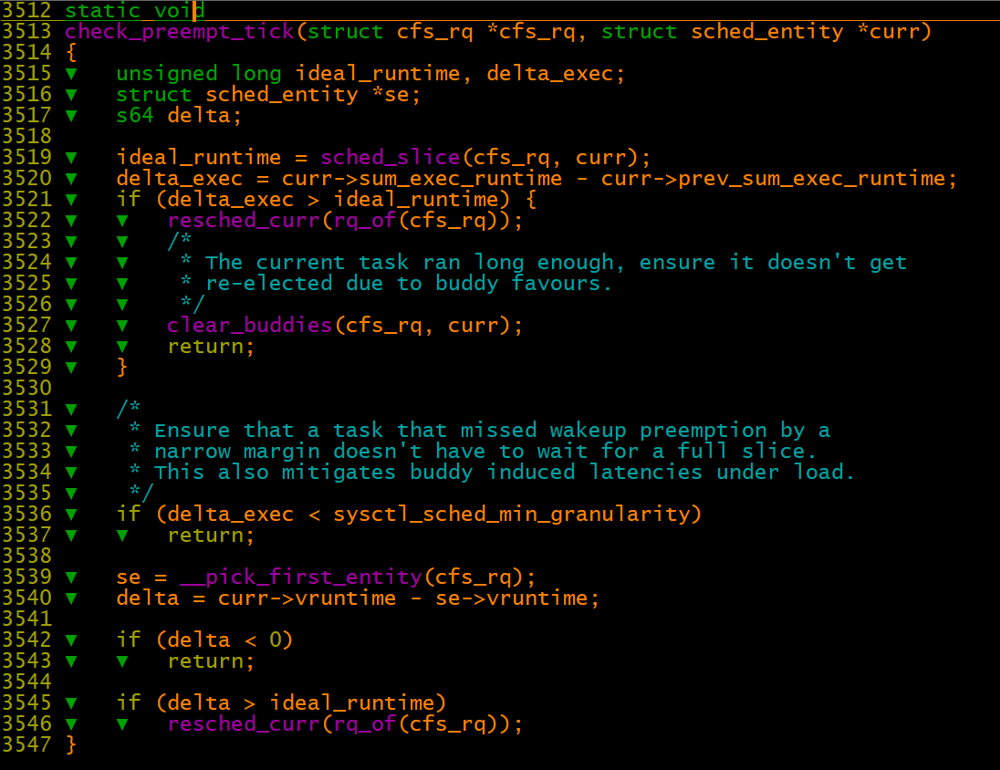

# 进程调度之红黑树rbtree

【一】红黑树

1、 对于给定的黑色高度为n的红黑树，从根到叶结点的简单路径的最短长度为n\-1，最大长度为2\(n\-1\)。

2、 插入和删除操作中，结点可能被旋转以保持树的平衡。红黑树的平均和最差搜索时间都是O\(log2 n\)

3、 红黑树能够以O\(log2 n\)的时间复杂度进行搜索、插入、删除操作。此外，由于它的设计，任何不平衡都会在三次旋转之内解决。

【二】task\_tick\_fair \-》 entity\_tick  \-》 check\_preempt\_tick 

1、本周期内current进程运行时间大于一个预期实分配运行实际时间，让出CPU

2、本周期内current进程运行时间小于进程一次调度最小运行时间，直接返回继续运行

3、本周期内current进程虚拟运行时间\-红黑树中最左进程虚拟运行时间大于预期实际时间，让出CPU。（此处将虚拟时间和实际时间进行比较？？？？）

