# 进程调度之进程深入学习

1、内核态进程如何进入D状态TASK\_UNINTERRUPTIBLE，该状态的进程不能被其他进程的信号唤醒wake\_up，只能由内核本身唤醒。

==》1、将进程状态设置为TASK\_UNINTERRUPTIBLE状态 2、将进程加入等待队列   3、调用schedule（）

```
#define TASK_UNINTERRUPTIBLE▼   2

set_current_state(TASK_UNINTERRUPTIBLE);
add_wait_queue(&waitq, &wait);
schedule();
```

2、进程的资源限制rlimit

```
struct task_struct {
    struct signal_struct *signal;
}

struct signal_struct {
    struct rlimit rlim[RLIM_NLIMITS];
}

42 struct rlimit {
43 ▼       __kernel_ulong_t▼       rlim_cur;
44 ▼       __kernel_ulong_t▼       rlim_max;
45 };
```

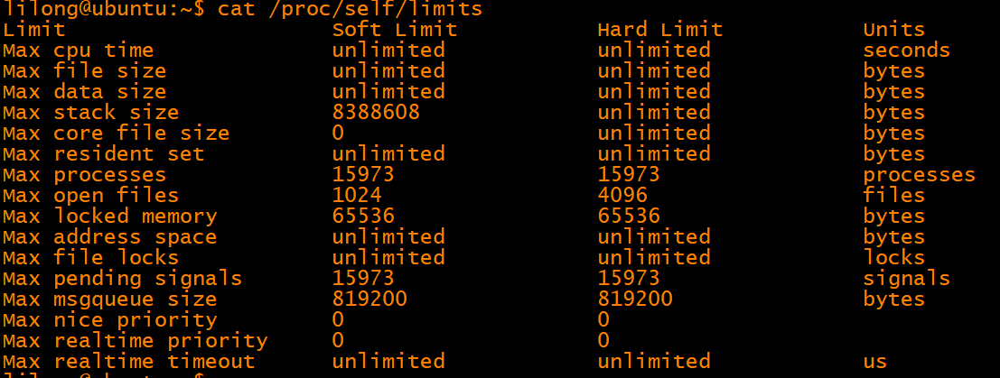

3、fork

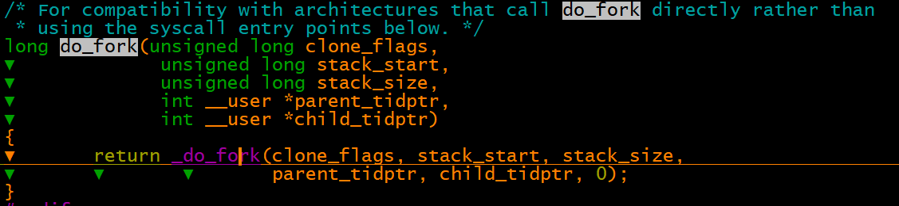

task\-\>thread\_info\-\>flag 

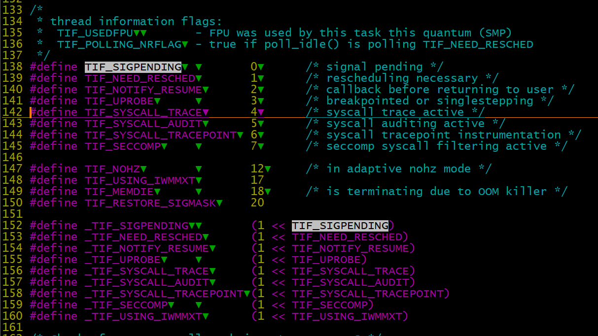

上下文切换：

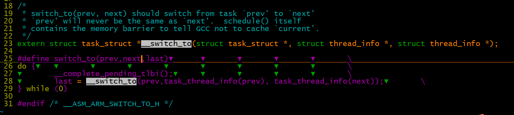

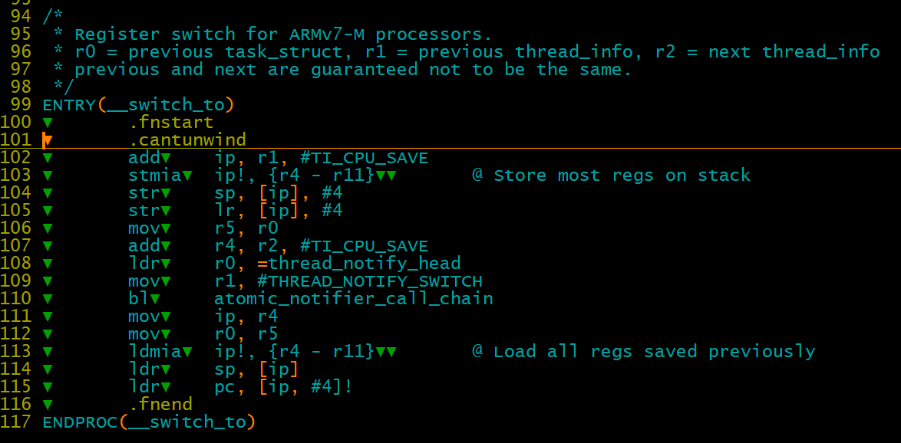

此处ip是r12寄存器，暂存数据用

r0 = previous task\_struct \-》 r0  作为参数传入，其值暂存在r5中，实际上没变，当运行到next进程时，r0是作为prev返回

DEFINE\(TI\_CPU\_SAVE,▼  ▼       offsetof\(struct thread\_info, cpu\_context\)\);

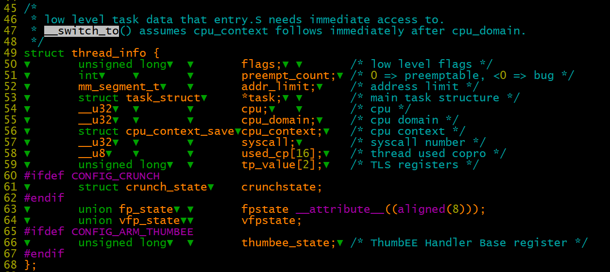

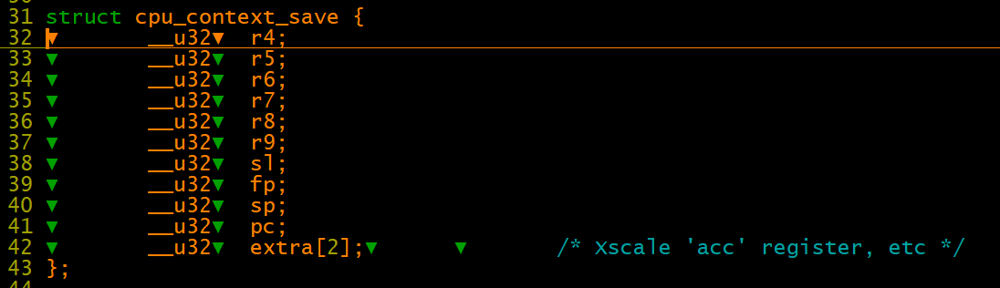

fork后的进程调用：

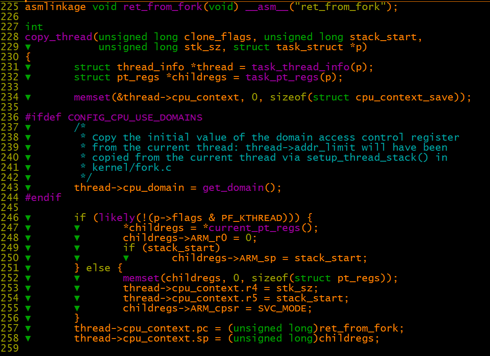

内核线程和普通用户态进程为何要不一样的处理？？

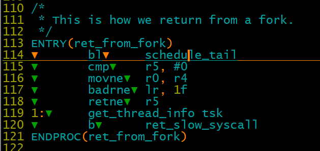

新fork的进程，首先会调入进schedule\_tail函数

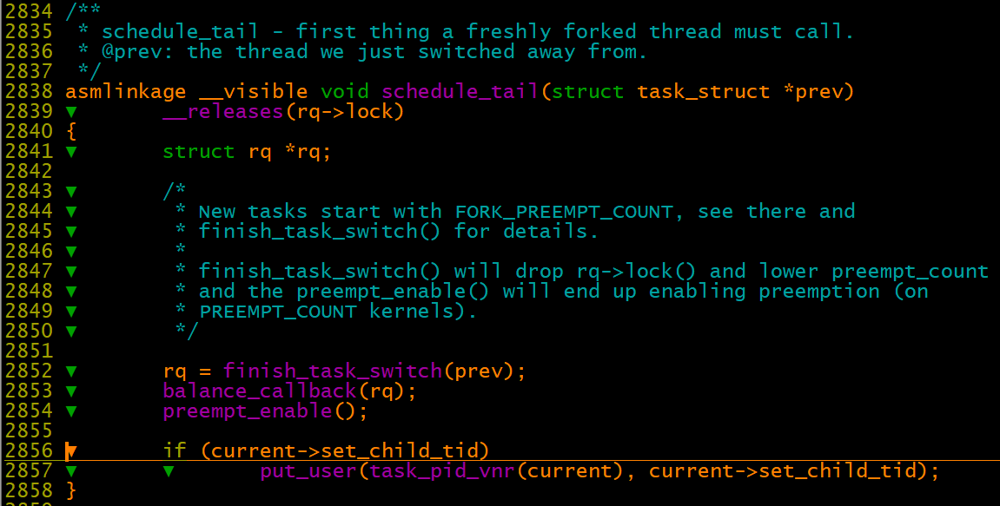

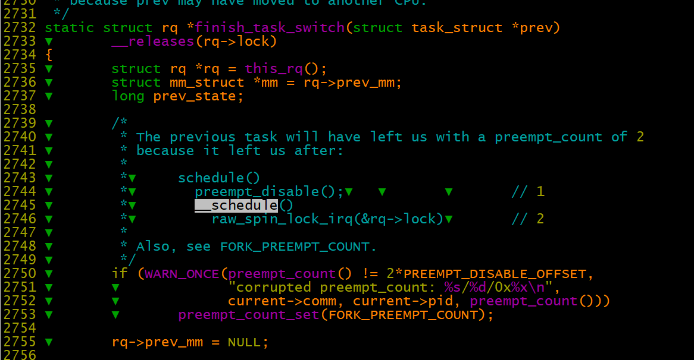

copy\_mm \-》 mm\_init \-》 mm\_alloc\_pgd \-》 pgd\_alloc

1、如果有CLONE\_VM标志，则使用父进程的mm，否则创建mm结构体

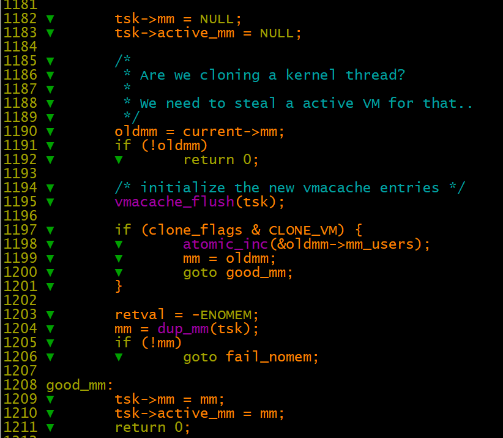

函数：pgd\_t \*pgd\_alloc\(struct mm\_struct \*mm\)

1、new\_pgd = \_\_pgd\_alloc\(\);

    申请4\*4k的地址用于存放pgd    

2、从init进程拷贝3G\-4G的页pgd过来，进行初始化

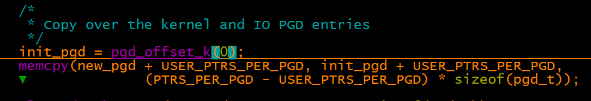

3、设置地址0\-1两个页，这两个页可能会存放向量

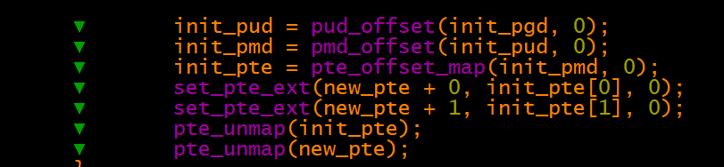

1、内核地址空间拷贝

2、vm映射的虚拟地址空间拷贝

```
for (mpnt = oldmm->mmap; mpnt; mpnt = mpnt->vm_next) {

    tmp = kmem_cache_alloc(vm_area_cachep, GFP_KERNEL);
    tmp->vm_mm = mm;

    //设置链表
    *pprev = tmp;
    pprev = &tmp->vm_next;
    tmp->vm_prev = prev;
    prev = tmp;

    //拷贝父进程vm中的映射页表项到子进程中
    mm->map_count++;
    retval = copy_page_range(mm, oldmm, mpnt);
}
```

sched\_fork：初始化新进程调度相关的数据，包括cfs、rt调度实体等

\#define MAX\_DL\_PRIO▼    ▼       0  =》dl调度类的优先级小于0

主要操作

```
__sched_fork(clone_flags, p);
p->state = TASK_NEW;
p->prio = current->normal_prio;
p->sched_class->task_fork(p);
```
