# 高速缓存之Cache基本原理

**一、Cache基本介绍**

**1.1 cache速度差异**

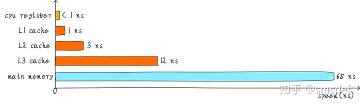

**1.2 三级cache基本结构**

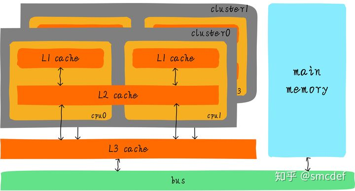

**二、cache结构**

**2.1 cache结构种类**

cache的缓存结构取决于way的大小（1\-n）、set的大小（1\-m）、cacheline本身的大小（offeet），这三者最终决定了cache的总大小。way和set的不同组合大小构成不同的缓存结构。

|单路组相联高速缓存|1\-way   n\-set|
|------------------|---------------|
|双路组相联高速缓存|2\-way   n\-set|
|多路组相联高速缓存|n\-way  n\-set |
|全相联高速缓存    |n\-way 1\-set  |

路\(way\)：路的数量等于每组中cacheline的数量，对于给定地址取index字段计算出的组，可选择该组中任一路的cacheline缓存数据。

组\(set\)：组的数量等于每路中cacheline的数量，即index可以索引的cacheline行数。

**2.2 cache索引计算**

cache的大小必然是小于内存的，因此内存地址通过散列关联到cache，基本上是一对多的关系，具体如何关联，则取决于tag、index、offset三个字段的计算。

tag：存放当前cacheline所关联的地址信息和有效信息，当一个地址通过index确定组后，还需要根据cacheline中的tag信息进行比较确认关联具体的cacheline

index：计算给定地址关联的具体组（cache set）

offset：计算给定地址关联的cacheline内具体的位置

**2.3 单路组相联高速缓存**

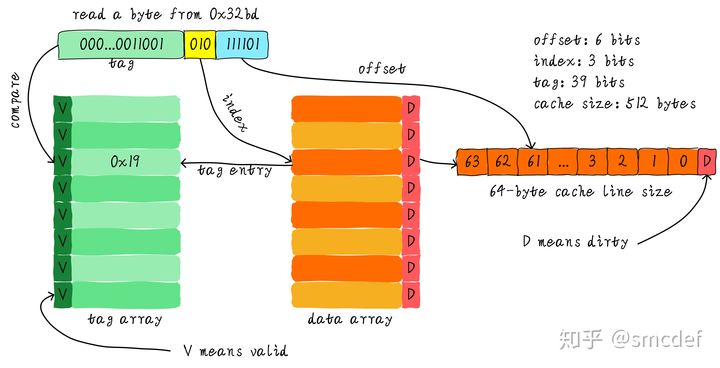

**2.4 全相联高速缓存**

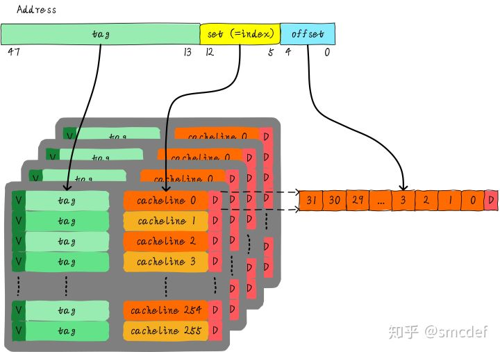

**2.5 全相联高速缓存**

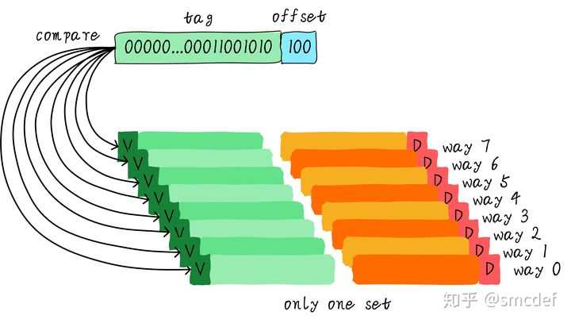

**三、高速缓存地址关联方式**

我们都知道cache控制器根据地址查找判断是否命中，这里的地址究竟是虚拟地址\(virtual address，VA\)还是物理地址\(physical address，PA\)？我们应该清楚CPU发出对某个地址的数据访问，这个地址其实是虚拟地址，虚拟地址经过MMU转换成物理地址，最终从这个物理地址读取数据。因此cache的硬件设计既可以采用虚拟地址也可以采用物理地址甚至是取两者地址部分组合作为查找cache的依据。同时不同的方式也导致了MMU与Cache在CPU框架内的位置关系不同。

**3.1 虚拟高速缓存VIVT\(Virtually Indexed Virtually Tagged\)**

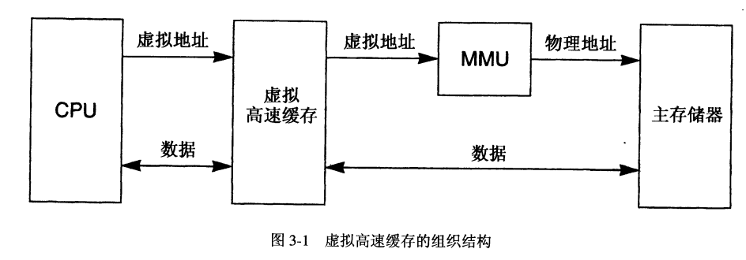

**3.2 物理高速缓存PIPT\(Physically Indexed Physically Tagged\)**

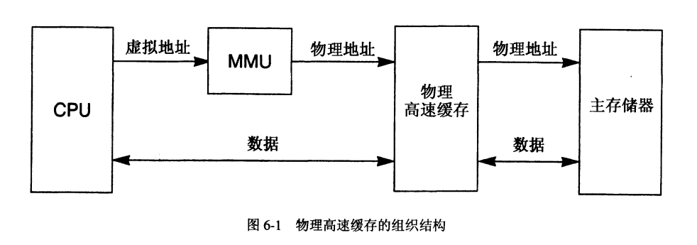

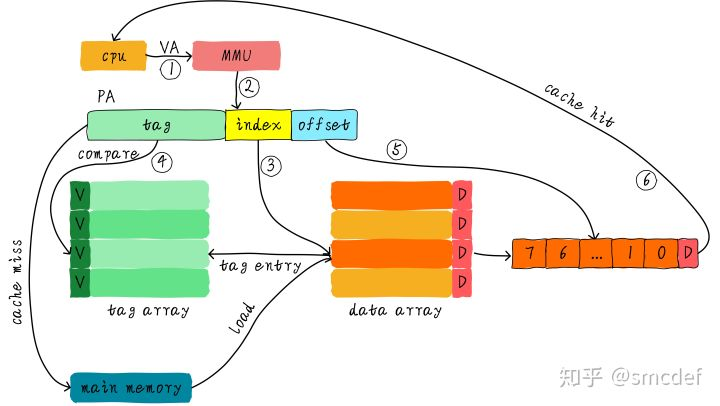

**3.3 带物理标记的虚拟高速缓存VIPT\(Virtually Indexed Physically Tagged\)**

为了提升cache查找性能，我们不想等到虚拟地址转换物理地址完成后才能查找cache。因此，我们可以使用虚拟地址对应的index位查找cache，与此同时\(硬件上同时进行\)将虚拟地址发到MMU转换成物理地址。当MMU转换完成，同时cache控制器也查找完成，此时比较cacheline对应的tag和物理地址tag域，以此判断是否命中cache。我们称这种高速缓存为VIPT\(Virtually Indexed Physically Tagged\)。

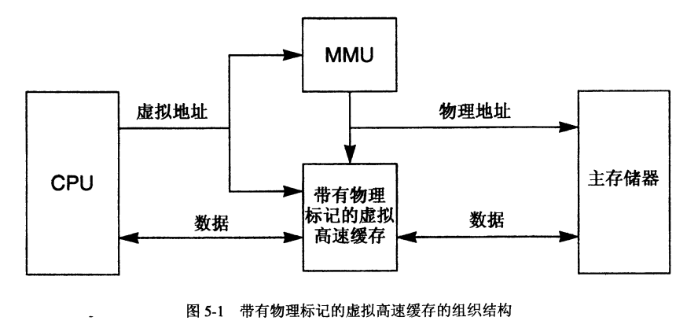

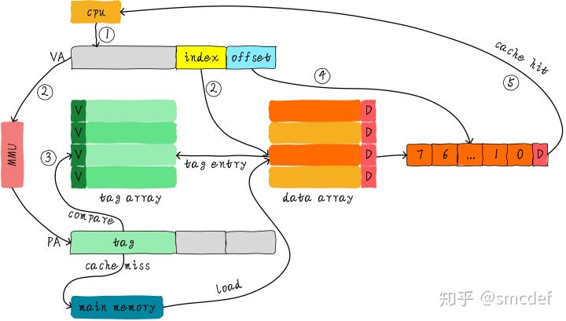

**四、CPU架构实际cache结构配置**

**4.1 ARM32**

**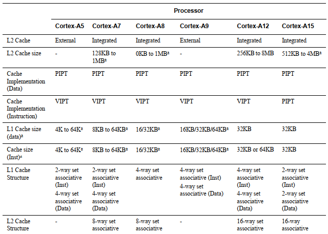**

**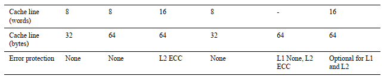**

**4.2 ARM64**

|                                       |**cortex\-a57**                                             |**cortex\-a76**                                             |
|---------------------------------------|------------------------------------------------------------|------------------------------------------------------------|
|**Cache Implementation（Data）**       |PIPT                                                        |VIPT\(behaves as PIPT\)                                     |
|**Cache Implementation（Instruction）**|VIPT\(behaves as PIPT\)                                     |VIPT\(behaves as PIPT\)                                     |
|**L1 Cache size（data）**              |48KB\(每路16KB\)                                            |64KB\(每路16KB\)                                            |
|**L1 Cache size（inst）**              |32KB\(每路16KB\)                                            |64KB\(每路16KB\)                                            |
|**L1 Cache Structure**                 |2\-way set associative（data）
3\-way set associative（Inst）|4\-way set associative（data）
4\-way set associative（Inst）|
|**L1  Replacement Policy.**            |LRU（Data）
LRU（Inst）                                      |Pseudo\-LRU（Data
Pseudo\-LRU（Inst）                        |
|**L2 Cache size**                      |512KB/1MB/2MB                                               |512KB/1MB/2MB                                               |
|**L2 Cache Sturucture**                |16\-way set associative                                     |8\-way set associative                                      |
|**L2  Replacement Policy.**            |Random cache\-replacement                                   |Dynamic biased                                              |
|**Cache line（bytes）**                |64                                                          |64                                                          |

注：从手册看VIPT\(behaves as PIPT\)的原因是“aliases are handled in hardware and from the programmer's point of view”别名问题由硬件解决。

**4.3 龙芯**

|                                       |**龙芯3A2000/3A3000**                                       |
|---------------------------------------|------------------------------------------------------------|
|**Cache Implementation（Data）**       |VIPT                                                        |
|**Cache Implementation（Instruction）**|VIPT（采用硬件染色法解决别名问题）                          |
|**L1 Cache size（data）**              |64KB\(每路16KB\)                                            |
|**L1 Cache size（inst）**              |64KB\(每路16KB\)                                            |
|**L1 Cache Structure**                 |4\-way set associative（data）
4\-way set associative（Inst）|

**五、CPU架构实际TLB结构配置**

TLB\(Translation Lookaside Buffer\) 也是一种高速缓存，其缓存的是虚拟页地址到物理页地址的转换关系，这种转换关系是由MMU构建。由于TLB接收的地址是虚拟地址，因此其相当于VIVT，存在歧义和别名。由于其cacheline中其缓存的是虚拟页地址到物理页地址的转换关系，为只读数据，因此TLB的别名并不会造成实质性的问，因此只需考虑TLB的歧义问题。本节以ARM64为例介绍其TLB属性（其实cortex\-a57核也可以设计成ARM32）

**5.1 TLB整体结构**

如下是ARM64的TLB结构框图，TLB分成L1、L2两级，L1还进一步分为指令TLB和数据TLB。

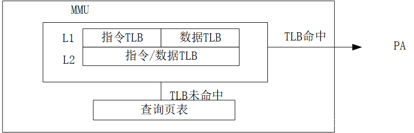

**5.2 TLB实际配置**

|                                           |**cortex\-a57**                                                         |**cortex\-a76**                                                         |
|-------------------------------------------|------------------------------------------------------------------------|------------------------------------------------------------------------|
|**TLB Implementation**                     |VIVT                                                                    |VIVT                                                                    |
|**L1 TLB Entry Support Page Size（inst）** |4KB/64KB/1MB                                                            |4KB/16KB/64KB..32MB                                                     |
|**L1 TLB Entry Support Page Size（data）** |4KB/64KB/1MB                                                            |4KB/16KB/64KB..512MB                                                    |
|**L1 TLB Structure**                       |32\-entry fully\-associative（data）
48\-entry fully\-associative（Inst）|48\-entry fully\-associative（data）
48\-entry fully\-associative（Inst）|
|**L1  Replacement Policy**                 |不需要                                                                  |不需要                                                                  |
|**L2 TLB Entry Support Page Size**         |4K/64K/1MB/16MB or bigger                                               |4KB/16KB/64KB..512MB                                                    |
|**L2 Cache Sturucture**                    |way set\-associative
1024\-entry 4\-                                     |way set\-associative
1280\-entry 5\-                                     |
|**L2  Replacement Policy.**                |unknown                                                                 |unknown                                                                 |
|**Entry Size（bytes）**                    |unknown                                                                 |unknown                                                                 |
|**Address Space Identifier**               |unknown                                                                 |8 bits or 16 bits depending on the value of TCR\_ELx.AS                 |
|**Virtual Machine Identifier\(VMID\) Size**|unknown                                                                 |8 bits or 16 bits depending on the value of VTCR\_EL2.VS                |

**5.4 TLB Entry组成**

一条TLB Entry包括以下部分

1、VA 虚拟地址 （CPU发出的虚拟地址）

2、PA 物理地址  （TLB缓存的虚拟地址对应的物理地址）

3、ASID Address Space Identifier

4、Virtual Machine Identifier

5、global标记

6、type and access permissions属性

**六、总结**

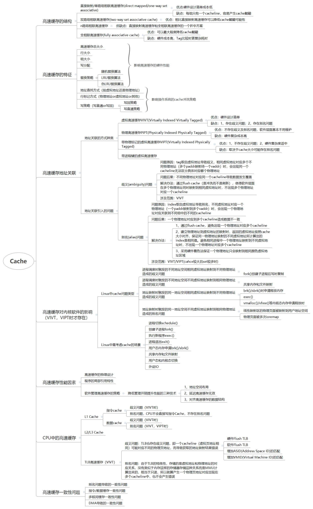

**七、参考资料：**

1、《cache的组织方式》[https://zhuanlan.zhihu.com/p/107096130](https://zhuanlan.zhihu.com/p/107096130)

2、《TLB原理》[https://zhuanlan.zhihu.com/p/108425561](https://zhuanlan.zhihu.com/p/108425561)

3、《Cache和DMA一致性》[https://zhuanlan.zhihu.com/p/109919756](https://zhuanlan.zhihu.com/p/109919756)

4、《icache和dcache一致性》[https://zhuanlan.zhihu.com/p/112704770](https://zhuanlan.zhihu.com/p/112704770)

5、《多核cache一致性》 [https://zhuanlan.zhihu.com/p/115114220](https://zhuanlan.zhihu.com/p/115114220)

6、《伪共享问题》[https://zhuanlan.zhihu.com/p/124974025](https://zhuanlan.zhihu.com/p/124974025)

7、《cache的基本原理》[https://zhuanlan.zhihu.com/p/102293437](https://zhuanlan.zhihu.com/p/102293437)
