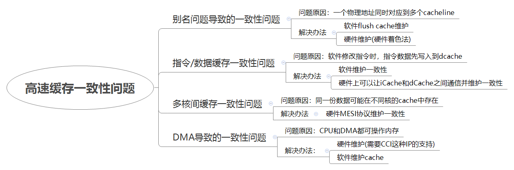
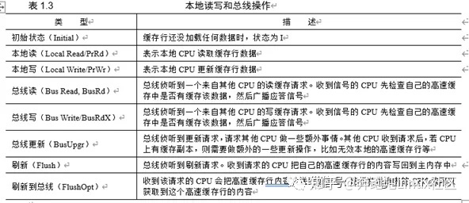

# 高速缓存之高速缓存一致性问题

**一、高速缓存一致性问题**

**二、别名导致的一致性问题**

略

**三、指令/数据缓存一致性问题**

当操作系统发现修改的数据可能是代码时，可以采取下面的步骤维护一致性：

1、将需要修改的指令数据加载到dCache中。

2、修改成新指令，写回dCache。

3、clean dCache中修改的指令对应的cacheline，保证dCache中新指令写回主存。

4、invalid iCache中修改的指令对应的cacheline，保证从主存中读取新指令。

**四、多核间缓存一致性问题**

**4.1 MESI协议**

目前，ARM或x86等处理器广泛使用MESI协议来维护高速缓存一致性。MESI协议的名字源于该协议使用的修改（Modified，M）、独占（Exclusive，E）、共享（Shared，S）和失效（Invalid，I）这4个状态。高速缓存行中的状态必须是上述4个状态中的1个。MESI协议还有一些变种，如MOESI协议等，部分ARMv7\-A和ARMv8\-A处理器使用该变种协议。

高速缓存行中有两个标志——脏（dirty）和干净（valid）。它们很好地描述了高速缓存和内存之间的数据关系，如数据是否有效、数据是否被修改过。在MESI协议中，每个高速缓存行有4个状态，可以使用高速缓存行中的2位来表示这些状态每个状态可用两位来表示。

M：这行数据有效，数据已被修改，和内存中的数据不一致，数据只存在于该高速缓存中

E：这行数据有效，数据和内存中数据一致，数据只存在于该高速缓存中

S：这行数据有效，数据和内存中数据一致，多个高速缓存有这行数据的副本

I：这行数据无效

**4.2 总线读写操作**

1. 本地读写，指的是local cpu的读写，本地读，在有的文献里也称为process read，简称PrRd，就是指的本地cpu访问本地CPU读取本地的cache line数据。本地写，process write，简称PrWr，就是本地CPU写入本地的cache line。

2. 我们先来看总线读（Bus Read, BusRd），总线监听到一个来自其他CPU的读cache的请求。收到信号的CPU先检查自己的cache中是否缓存了该数据，然后广播应答信号。

3. 我们来看总线写（Bus Write/BusRdX），总线监听到一个来自其他CPU的写cache的请求。收到信号的CPU先检查自己的cache中是否缓存了该数据，然后广播应答信号。

4. 我们来看总线更新（BusUpgr），总线监听到更新请求，请求其他CPU做一些额外事情。其他CPU收到请求后，若CPU上有缓存副本，则需要做额外的一些更新操作，如使本地的高速缓存行无效等。

5. 我们来看一下刷新（Flush），总线监听到刷新请求。收到请求的CPU把自己的高速缓存行的内容写回主内存中。

6. 我们看一下刷新到总线（FlushOpt），收到该请求的CPU会把高速缓存行内容发送到总线上，这样发送请求的CPU就可以获取到这个高速缓存行的内容。

**4.3 MESI状态转移图**

下图中主要关注/左侧的动作

**五、DMA导致的一致性问题**

略

**六、参考资料**

1、《Cache和DMA一致性》[https://zhuanlan.zhihu.com/p/109919756](https://zhuanlan.zhihu.com/p/109919756)

2、《icache和dcache一致性》[https://zhuanlan.zhihu.com/p/112704770](https://zhuanlan.zhihu.com/p/112704770)

3、《多核cache一致性》 [https://zhuanlan.zhihu.com/p/115114220](https://zhuanlan.zhihu.com/p/115114220)
